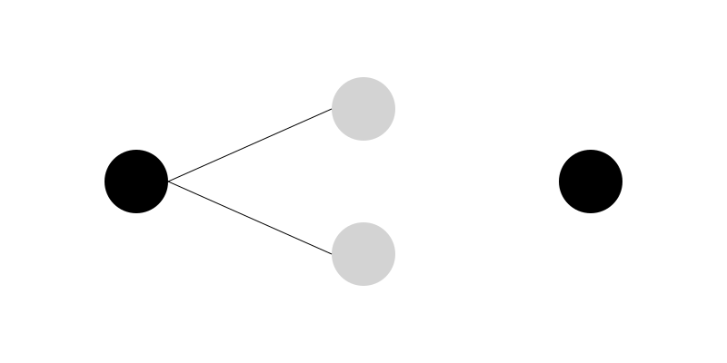

# Chapter 6: The Perceptron

## Section 1: A Machine That Could Learn

In the summer of 1956, the researchers at Dartmouth believed they were standing at the beginning of a new era.

They imagined machines that could reason, solve problems, understand language, and perhaps one day rival human intelligence itself.

But there was one problem.

Nobody really knew how to build such a machine.

The ideas were exciting. The vision was bold. Yet most of the early AI programs still depended on human-written instructions. A programmer had to tell the machine exactly what to do, step by step.

Human beings do not learn that way.

A child does not receive thousands of pages of instructions explaining how to recognize a dog. Instead, the child sees dogs again and again. Over time, the brain notices patterns. Eventually, recognition becomes automatic.

Many AI researchers began asking an important question:

Could a machine learn from experience instead of relying entirely on programmed rules?

One scientist in particular believed the answer was yes.

His name was Frank Rosenblatt.

Rosenblatt was a psychologist and computer researcher who became fascinated by the way the human brain learns. He wondered whether a machine could imitate this process. Rather than giving a computer every rule in advance, perhaps the machine could gradually improve its own decisions by studying examples.

This idea was revolutionary.

At the time, computers were generally viewed as giant calculators. They followed instructions perfectly, but they did not adapt. They did not learn. They did not improve through experience.

Rosenblatt wanted to change that.

Drawing inspiration from the artificial neuron proposed by Warren McCulloch and Walter Pitts more than a decade earlier, he designed a new kind of system that could adjust itself based on what it observed.

He called it the *Perceptron*.

The Perceptron would become one of the most influential inventions in the history of artificial intelligence. Although simple by modern standards, it introduced a powerful concept that remains at the heart of AI today:

A machine can learn from examples.

That idea may sound obvious now, but in the late 1950s it felt almost magical.

For the first time, researchers believed they might have found a path toward creating machines that could improve themselves rather than simply obey instructions.

The age of machine learning was beginning.

## Section 2: Meet Frank Rosenblatt

In the late 1950s, one of the most exciting figures in artificial intelligence was a young scientist named Frank Rosenblatt.

Unlike many computer researchers of his era, Rosenblatt was not focused solely on mathematics or engineering. He had studied psychology and was deeply interested in how living brains learn from experience.

This background led him to ask a question that would shape the future of AI:

How does a brain learn to recognize patterns?

A child can quickly learn to distinguish a cat from a dog, a friend from a stranger, or a tree from a building. Nobody programs these abilities into the child step by step. Learning happens through observation and experience.

Rosenblatt wondered whether a machine could do something similar.

At the time, most computers operated like obedient clerks. They followed instructions exactly as written. If a programmer forgot to include a rule, the computer would not magically discover it on its own.

Human learning seemed very different.

People make mistakes, adjust their understanding, and gradually improve. A child learning to read does not become perfect after seeing a few words. Progress comes through repetition, correction, and experience.

Rosenblatt believed machines might be able to learn in the same way.

Inspired by earlier work on artificial neurons, he developed a system designed to imitate a tiny part of the brain's learning process. His goal was not to recreate the entire human brain. Instead, he wanted to explore whether a simple network of artificial neurons could learn to recognize patterns.

In 1957, he introduced the Perceptron.

The Perceptron was one of the first AI systems specifically designed to learn from examples. Rather than relying entirely on rules written by programmers, it could adjust its own behavior based on the information it received.

This was a major shift in thinking.

Instead of telling a machine exactly how to solve a problem, researchers could provide examples and allow the machine to discover useful patterns for itself.

Today, this approach forms the foundation of modern machine learning.

From image recognition to language models such as ChatGPT, many of today's AI systems are built on the same basic idea that fascinated Rosenblatt nearly seventy years ago:

Learning is often more powerful than programming.

The Perceptron was simple, but it introduced a concept that would eventually transform artificial intelligence and change the way humans interact with computers.

## Section 3: How the Perceptron Worked

At first glance, the Perceptron looks almost too simple to be important.

It was not a brain. It was not even close to a brain. It was a mathematical system built to take inputs, process them, and produce a single output.

But inside that simplicity was a powerful idea: learning through adjustment.

The Perceptron can be thought of as a decision-making machine.

Imagine you are trying to decide whether to go outside for a walk. You might consider a few factors:

Is it raining?
Is it cold?
Do I feel energetic?

Each of these factors influences your final decision. Some matter more than others. For example, rain might strongly discourage you from going out, while temperature might matter less.

The Perceptron works in a similar way.

It takes several inputs, each representing a piece of information. But not all inputs are treated equally. Each input is assigned a *weight*, which represents its importance.

A high weight means the input strongly influences the decision. A low weight means it has little effect.

The Perceptron then combines all the inputs, multiplies them by their weights, and adds them together. This produces a single number.

If that number is above a certain threshold, the Perceptron outputs one answer (for example, “yes”). If it is below the threshold, it outputs another answer (for example, “no”).

In simple terms:

Inputs → Weighted Sum → Decision

At this stage, the system does not “know” anything. It is just making guesses based on its current weights.

The real magic happens next.

When the Perceptron makes a mistake, it does not panic or stop working. Instead, it adjusts its weights slightly to improve future decisions.

If it predicts correctly, the weights are reinforced. If it predicts incorrectly, the weights are modified in the opposite direction.

Over time, this process allows the system to gradually improve.

It is similar to learning to throw a basketball into a hoop. You try, you miss, you adjust your aim, and you try again. With enough practice, your throws become more accurate.

The Perceptron follows the same cycle:

Make a prediction → Check the result → Adjust → Repeat

This simple loop is what allows a machine to learn from experience.

There is an important limitation, however. The Perceptron can only learn patterns that are *linearly separable*, meaning problems where a straight line can separate the answers.

This limitation would later become one of its biggest weaknesses, and it played a key role in the first major setback in early AI research.

But despite its simplicity, the Perceptron introduced a revolutionary idea:

A machine does not need to be explicitly programmed to behave intelligently. It can learn by adjusting itself based on feedback.

That idea would eventually become the foundation of modern artificial intelligence.

## Section 4: Learning from Examples

## Section 4: Learning from Examples

A Perceptron does not learn from theory. It learns from examples.

But examples are not abstract ideas. They are data points—simple pairs of information:

A situation, and the correct answer.

### Training Data: What Learning Actually Looks Like

At the most basic level, training data looks like this:

Email text → Label
“win money now” → Spam
“meeting tomorrow” → Not spam
“urgent click link” → Spam
“lunch at 1?” → Not spam

At the beginning of training, the Perceptron does not understand any of this. Its internal settings are random. It is essentially guessing.

---

### The Learning Loop

The entire learning process can be reduced to a repeating cycle.

Input → Prediction → Check Answer → Adjust → Repeat

Each step is simple on its own. The power comes from repetition.

The Perceptron makes a prediction, compares it to the correct answer, and then adjusts itself slightly when it is wrong. This adjustment is not dramatic. It is small, controlled, and continuous.

Over time, these small corrections accumulate.

---

### How Learning Actually Happens

To understand what is changing inside the system, imagine a set of “dials” or “sliders” controlling how strongly each input influences the decision.

When the Perceptron makes a mistake, it slightly shifts these internal values:

* Inputs that contributed to a correct decision are strengthened
* Inputs that contributed to a wrong decision are weakened

Nothing about this process is intelligent in the human sense. There is no understanding, no reasoning, and no awareness.

And yet, behavior improves.

---

### Why This Works

This is the key insight behind early machine learning:

The intelligence is not in the instructions. The intelligence is in the data.

The Perceptron does not need rules like “spam emails often contain suspicious phrases.” Instead, it gradually discovers patterns by adjusting itself across many examples.

But this only works because of repetition.

A single example teaches almost nothing. Hundreds teach a little. Thousands begin to shape behavior. Millions create reliable performance.

This is why modern AI systems depend so heavily on large datasets.

---

### A Quiet Shift in Thinking

In the 1950s, this idea was not universally accepted.

Some researchers believed intelligence had to be explicitly programmed through rules. Others, like Rosenblatt, argued that learning from examples was enough.

The Perceptron did not settle the debate.

But it changed the direction of the conversation.

For the first time, machines were not just following instructions.

They were beginning to adjust themselves.

## Section 5: Why the World Got Excited

When the Perceptron was introduced, it did not quietly enter academic circles.

It made headlines.

For the first time, researchers were not just talking about machines that could calculate. They were talking about machines that could *learn*.

That single word changed everything.

### A Machine That “Sees”

Rosenblatt demonstrated the Perceptron using simple pattern recognition tasks, such as distinguishing shapes.

To the public—and even to some scientists—it felt like a breakthrough moment.

A system that once seemed like theory was now making correct choices on real inputs. Even if the tasks were simple, the implication was enormous.

If a machine could recognize patterns, what else could it learn to recognize?

Faces? Speech? Language? Thought itself?

No one had clear answers yet—but the questions were powerful enough to drive excitement across research labs.

---

### The Media Effect

Newspapers and magazines quickly picked up the story.

The Perceptron was described in bold terms, sometimes far beyond what it could actually do.

Some reports suggested that machines capable of seeing and thinking were just around the corner.

The tone was not cautious. It was confident. Sometimes even exaggerated.

In hindsight, this was the beginning of a pattern that would repeat throughout AI history:

A real technical breakthrough… followed by public imagination running ahead of reality.

---

### The Dream Expands

Researchers began to imagine systems that could:

* Translate languages automatically
* Recognize handwritten text
* Understand spoken speech
* Make decisions like humans

At this stage, the Perceptron was no longer just a technical experiment.

It had become a symbol.

A symbol of a future where machines might learn, adapt, and eventually think.

---

### What Was Really Happening

Behind the excitement, the actual technology was still very simple.

The Perceptron could only solve limited types of problems. It worked well for clean, separable patterns—but struggled with anything more complex.

But in the early excitement, that limitation was easy to overlook.

The world saw potential.

Not boundaries.

And that gap between possibility and reality would soon become very important.

