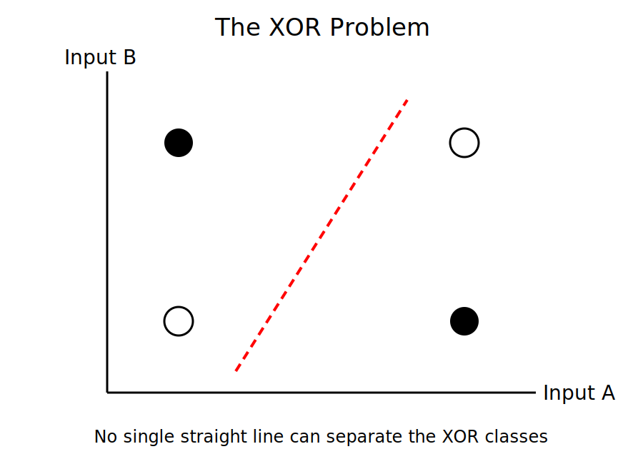

# Chapter 7: The First AI Winter (1969–1974)

## Opening Story: The Machine That Could Not Learn

By the late 1950s, artificial intelligence seemed unstoppable.

The field was young, exciting, and full of promise. Researchers spoke confidently about machines that could see, learn, reason, and perhaps one day rival human intelligence itself. Newspapers carried enthusiastic stories about intelligent computers. Governments funded ambitious research projects. Universities rushed to establish new laboratories devoted to the emerging science of artificial intelligence.

At the center of this excitement was a machine called the perceptron.

Frank Rosenblatt's invention appeared to demonstrate something remarkable: a computer that could learn from experience. Unlike traditional programs, which followed fixed instructions, the perceptron could adjust itself based on examples. To many observers, it looked like the first step toward an electronic brain.

Predictions grew increasingly bold. Some researchers suggested that machines would soon be able to walk, talk, translate languages, and solve complex problems that challenged human experts. The future seemed close at hand.

But beneath the excitement, a problem was beginning to emerge.

The perceptron could perform impressive demonstrations, yet it struggled with certain tasks that appeared surprisingly simple. As researchers explored its capabilities more carefully, they discovered limits that had been overlooked during the early enthusiasm.

In 1969, two respected AI researchers, Marvin Minsky and Seymour Papert, published a detailed analysis of perceptrons. Their work revealed important weaknesses in the technology and challenged many of the optimistic assumptions that had taken hold throughout the field.

The impact was profound.

Funding agencies became cautious. Research projects slowed. Public excitement faded. The dream of intelligent machines suddenly seemed much farther away than anyone had imagined.

For the first time, artificial intelligence faced a harsh reality: progress was not guaranteed.

The field was about to enter a period that would later become known as the first AI Winter.

---

## Section 1: Perceptron Fever

To understand the AI Winter, we must first understand the extraordinary optimism that preceded it.

When Frank Rosenblatt introduced the perceptron in the late 1950s, it represented something genuinely new. Earlier computers simply followed instructions written by programmers. The perceptron, however, could modify its behavior based on examples. This ability to learn made it appear fundamentally different from previous machines.

The idea captured the imagination of both scientists and the public.

Rosenblatt demonstrated systems that could recognize simple patterns and distinguish between different inputs. Although these demonstrations were modest by modern standards, they were impressive for their time. For many observers, they suggested that machines were beginning to acquire abilities once thought to belong exclusively to living brains.

News reports often amplified these achievements. Headlines described machines that could learn, think, and adapt. Some articles implied that human-level intelligence might be only a few years away.

Government agencies were equally enthusiastic. During the Cold War, technological leadership was considered a matter of national importance. Funding flowed into research programs that promised revolutionary advances in computing and automation.

Universities established new AI laboratories. Researchers entered the field with high expectations. Ambitious predictions became common. Some scientists believed that major problems in artificial intelligence would be solved within a generation.

In hindsight, many of these predictions were unrealistic. Researchers were attempting to understand one of the most complex systems in the known universe—the human mind—using computers that were vastly less powerful than even a modern smartphone.

Yet the optimism was understandable.

For the first time, machines were showing signs of learning from experience. Each breakthrough seemed to suggest that larger breakthroughs were just around the corner.

Unfortunately, expectations were rising much faster than the technology itself.

The gap between what AI could actually do and what people hoped it would do was growing wider every year. Eventually, that gap would become impossible to ignore.

## Section 2: The XOR Problem

The perceptron was an important breakthrough, but it had a hidden weakness.

At first, researchers focused on the problems it could solve. A perceptron could learn to recognize simple patterns, classify inputs into categories, and make basic decisions based on examples. These abilities were impressive for the technology of the late 1950s.

The real test, however, was not whether the perceptron could solve some problems. It was whether it could solve all the problems that intelligent systems would eventually need to handle.

As researchers investigated more carefully, they discovered that the answer was no.

One of the most famous examples involved a logical operation called XOR, short for "exclusive OR."

To understand XOR, imagine two switches. The output should be "on" if exactly one switch is on. If both switches are off, the output should be off. If both switches are on, the output should also be off.

The pattern looks like this:

*Figure 7.1 – The XOR problem. The black and white points represent different output classes. No single straight line can separate them, which is why a single-layer perceptron cannot learn the XOR function.*

For a human, this rule seems simple. Yet a single-layer perceptron could not learn it.

The reason lies in how a perceptron makes decisions.

A perceptron draws a boundary that separates one category of inputs from another. If the data can be divided by a single straight line, the perceptron can learn the pattern. Problems such as AND and OR fit this requirement.

XOR does not.

When the possible inputs are plotted on a graph, no single straight line can separate the correct outputs from the incorrect ones. The problem requires a more complex structure than a single-layer perceptron can provide.

This discovery was significant.

Researchers had hoped that perceptrons represented the beginning of a path toward increasingly intelligent machines. Instead, they found that even a relatively simple logical operation was beyond the capabilities of the technology.

The limitation did not mean neural networks were fundamentally flawed. It simply meant that the existing designs were too simple.

Unfortunately, that distinction was not always understood.

As news of these limitations spread, some observers began to question whether neural networks had been oversold. Others wondered whether the entire field of artificial intelligence was advancing more slowly than its supporters claimed.

The XOR problem became a symbol of a larger issue. The challenge facing AI was not merely building machines that could learn. The challenge was building machines that could learn complex patterns in a complex world.

That would require ideas that had not yet been discovered.

For the moment, however, the limitations of the perceptron cast a growing shadow over the future of artificial intelligence.

## Section 3: Minsky and Papert's Criticism

As the limitations of the perceptron became clearer, researchers faced an important question.

Were these merely temporary obstacles that would eventually be overcome, or were they signs of deeper problems within neural-network research itself?

In 1969, two influential researchers, Marvin Minsky and Seymour Papert, attempted to answer that question.

At the time, both men were highly respected figures in the growing field of artificial intelligence. They believed that progress in AI required a careful understanding of what existing systems could and could not do. Rather than accepting the excitement surrounding perceptrons at face value, they decided to analyze them mathematically.

The result was a book titled *Perceptrons*.

The book examined the capabilities and limitations of single-layer perceptrons in great detail. Minsky and Papert demonstrated that certain classes of problems, including the XOR problem, could not be solved by these networks. More importantly, they showed that many tasks researchers hoped perceptrons would eventually master were far beyond the reach of the architectures then available.

Their analysis was rigorous, thoughtful, and scientifically valuable.

Yet the book would become one of the most controversial publications in the history of artificial intelligence.

Part of the controversy arose from how its conclusions were interpreted.

Minsky and Papert did not argue that all neural networks were useless. In fact, they acknowledged that more complex, multi-layer networks might overcome some of the limitations they identified. The difficulty was that researchers at the time did not know how to train such networks effectively.

As a result, many readers focused on the limitations while overlooking the possibilities.

The distinction was subtle but important.

The book showed that existing perceptrons were limited. It did not prove that future neural networks would fail.

Unfortunately, that nuance was often lost.

Funding agencies, policymakers, and even some researchers concluded that neural networks had reached a dead end. Interest in the field began to decline. Projects that had once attracted enthusiasm now faced increasing skepticism.

Looking back, historians of AI often view *Perceptrons* as both a warning and a misunderstanding.

The warning was legitimate. Early researchers had underestimated the complexity of intelligence and overestimated what simple neural networks could accomplish.

The misunderstanding was believing that the limitations of one generation of neural networks applied to all future generations.

Decades later, advances in computing power, larger datasets, and new training techniques would demonstrate that multi-layer neural networks could solve problems far beyond the reach of Rosenblatt's original perceptron.

But in 1969, that future was invisible.

To many observers, the promise of neural networks appeared to be fading, and confidence in artificial intelligence was beginning to crack.

## Section 4: Funding Dries Up

Scientific research depends on more than ideas.

It requires people, equipment, laboratories, and time. All of these depend on funding. When money flows into a field, researchers can explore new directions, build larger projects, and take risks. When funding disappears, progress often slows dramatically.

By the early 1970s, artificial intelligence was beginning to experience this reality.

The excitement that had surrounded AI during the previous decade was fading. Researchers had promised rapid advances in machine intelligence, but many of those promises remained unfulfilled. Computers still struggled with tasks that humans found easy. Machine translation had not revolutionized communication. Robots were far less capable than expected. Neural networks faced serious limitations.

Government agencies and funding organizations began asking difficult questions.

Where were the breakthroughs they had been promised?

For years, AI researchers had spoken confidently about machines that would soon reason, understand language, and solve complex problems. Yet progress proved slower and more difficult than anticipated. The gap between expectations and reality was becoming increasingly difficult to ignore.

As skepticism grew, funding decisions changed.

Projects that once received enthusiastic support faced greater scrutiny. Research proposals were examined more carefully. Some programs were reduced, while others were cancelled entirely. Organizations that had viewed AI as a near-term technological revolution began treating it as a long-term scientific challenge.

One of the most influential developments occurred in the United Kingdom.

In 1973, mathematician Sir James Lighthill produced a report evaluating the state of artificial intelligence research. His conclusions were highly critical. The report argued that AI had failed to achieve many of its ambitious goals and questioned whether existing approaches were likely to succeed.

The report had a significant impact on funding decisions in Britain.

Although researchers disagreed with many of Lighthill's conclusions, the report reinforced a growing belief among policymakers that AI had been oversold. Similar concerns were emerging elsewhere as governments and institutions reassessed their investments.

The consequences extended beyond budgets.

Young researchers became more cautious about entering the field. Universities shifted priorities. Some scientists moved into other areas of computer science where funding opportunities appeared more secure. The atmosphere of excitement that had characterized the late 1950s and early 1960s was gradually being replaced by uncertainty.

This did not mean that AI research stopped.

Important work continued in laboratories around the world. Dedicated researchers remained convinced that intelligent machines were possible. However, they now faced a more challenging environment. Every project had to justify itself. Every claim was examined more critically. Every setback attracted attention.

In many ways, this period reflected a normal process in science.

New ideas often generate enthusiasm before their limitations are fully understood. As evidence accumulates, expectations become more realistic. The problem for artificial intelligence was that the adjustment was unusually severe.

The field had promised a revolution.

What it delivered, at least in the short term, was a lesson in patience.

## Section 5: The First AI Winter

By the mid-1970s, artificial intelligence had entered a period of decline.

The excitement of the previous two decades had largely disappeared. Research funding was shrinking. Public enthusiasm was fading. Many of the bold predictions that had once filled newspapers and research proposals now seemed unrealistic.

This period would later become known as the first AI Winter.

The name is an apt one.

Just as winter brings colder temperatures and slower growth, the AI Winter brought a cooling of interest in artificial intelligence. Projects that had once attracted attention struggled to secure funding. Research groups were reduced in size or shut down entirely. Some scientists left the field in search of more promising opportunities.

The change was dramatic because the expectations had been so high.

During the 1950s and 1960s, many researchers believed that human-level machine intelligence might be achieved within a few decades. Some thought it could arrive even sooner. As these predictions failed to materialize, confidence in the field weakened.

To outsiders, AI began to look like a technology that promised much more than it delivered.

The reality was more complicated.

Artificial intelligence had not failed. Researchers had made genuine progress in areas such as search algorithms, logical reasoning, pattern recognition, and machine learning. The problem was that these achievements were often less visible than the ambitious claims that surrounded them.

A machine that solves a narrow problem rarely captures public attention. A promise that machines will soon think like humans attracts far greater notice.

As a result, disappointment grew not because AI had achieved nothing, but because it had not achieved everything people hoped for.

The AI Winter exposed a recurring pattern that would appear several times throughout the history of artificial intelligence.

First comes a breakthrough.

The breakthrough generates excitement.

Excitement creates ambitious predictions.

Predictions attract funding and attention.

Progress then proves slower than expected.

Disappointment follows.

Funding declines.

The cycle begins again.

This pattern is now so familiar that it has become one of the defining characteristics of AI history.

Yet even during the coldest winters, the field never completely froze.

Small groups of researchers continued working. New ideas continued to emerge. Important advances were still being made, often far from public attention. While the spotlight moved elsewhere, the foundations for future breakthroughs were quietly being laid.

In hindsight, the first AI Winter was not the end of artificial intelligence.

It was a period of correction.

The field was being forced to separate realistic goals from unrealistic expectations. Researchers were learning that intelligence was far more complex than they had imagined. Building machines that could truly learn, reason, and understand the world would require decades of effort rather than a few years.

The dream of intelligent machines survived.

It simply had to endure a long and difficult winter before spring could arrive again.

### Insight Box: The Most Expensive Mistake

The greatest mistake of the early AI pioneers was not a technical one.

It was a prediction.

Many researchers believed that creating intelligent machines would be far easier and far faster than it actually proved to be. Early successes created the impression that human-level intelligence was just a few breakthroughs away.

In reality, intelligence turned out to be one of the most difficult scientific challenges ever attempted.

The lesson extends far beyond artificial intelligence. Throughout history, people have consistently overestimated what new technologies can achieve in the short term while underestimating what they can accomplish in the long term.

The pioneers of AI were wrong about the timeline.

They were not necessarily wrong about the destination.

The machines they imagined did not arrive in the 1960s or the 1970s. Some of their predictions would take decades longer than expected. Others remain unsolved even today.

Yet many ideas that once seemed impossible eventually became reality.

The AI Winter reminds us that failure and delay are not the same thing. A technology can disappoint expectations and still succeed in the end.

Sometimes the most expensive mistake is not believing in something impossible.

It is believing that something difficult will be easy.

