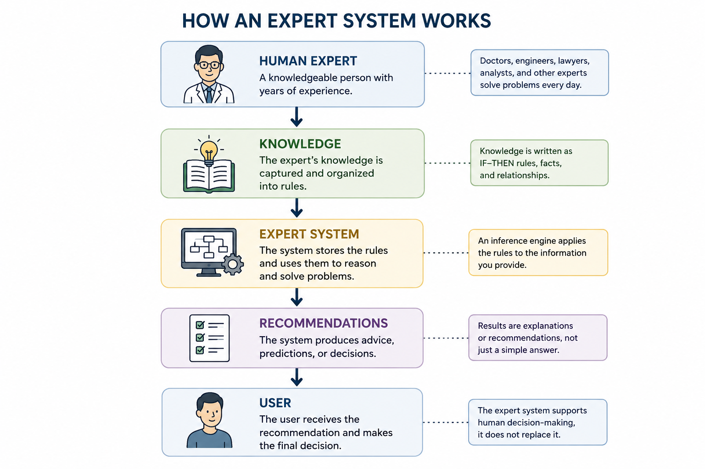
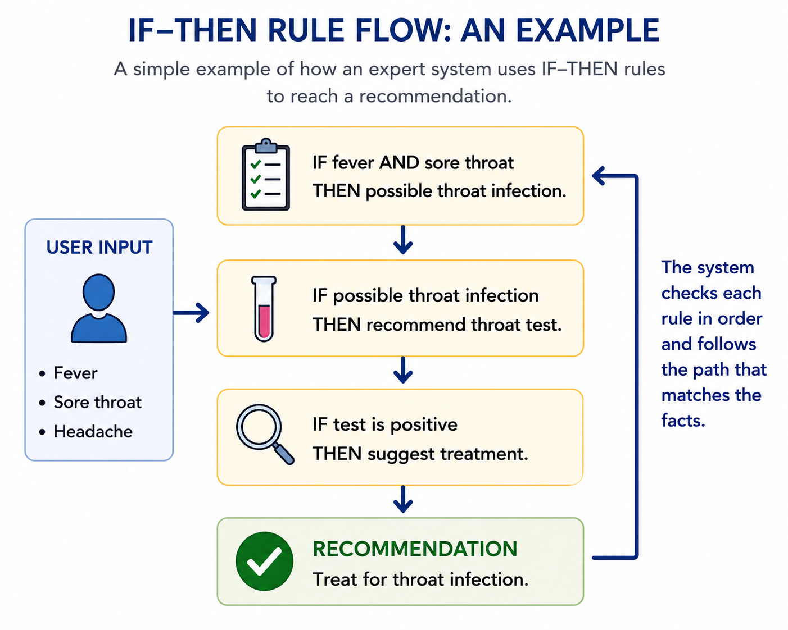
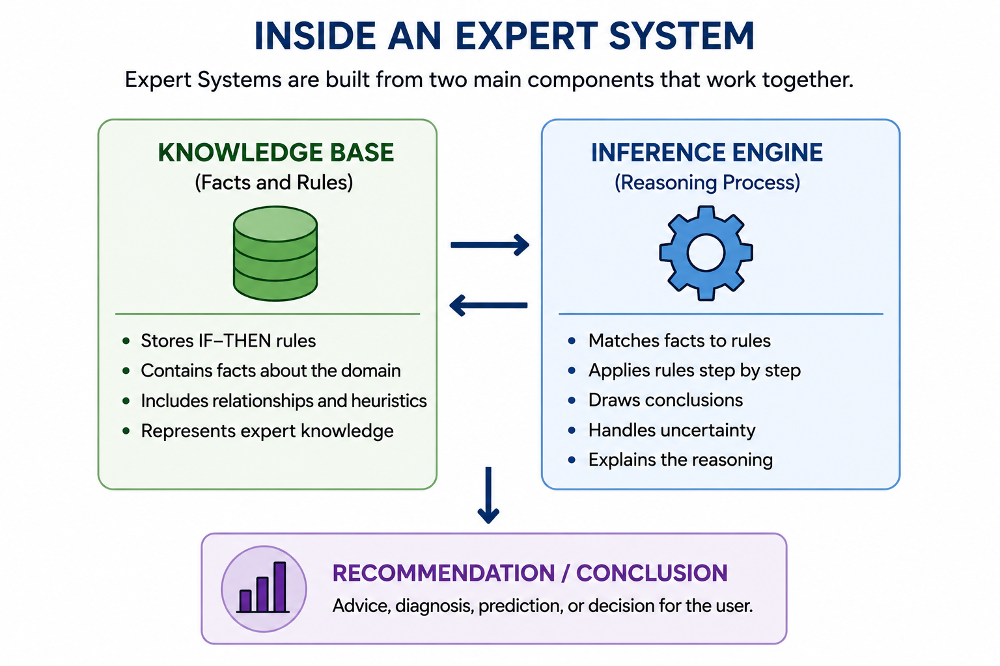

# Chapter 8: Expert Systems

## Section 1 - When AI Became Useful

Imagine walking into a doctor's office in the early 1980s.

The doctor listens to your symptoms, asks a few questions, and then turns to a computer terminal sitting on a desk nearby. After entering information about your condition, the computer suggests several possible diagnoses and recommends additional tests.

Today this may not sound surprising. We are used to computers helping doctors, lawyers, engineers, and business professionals. But forty years ago, the idea seemed almost magical.

Just a few years earlier, many researchers had become discouraged about artificial intelligence. The bold promises made during the 1950s and 1960s had not come true. Computers were not thinking like humans. Robots were not taking over household chores. Funding was disappearing, and many people believed AI had reached a dead end.

Then something unexpected happened.

Instead of trying to build machines that could do everything, researchers began focusing on machines that could do one thing very well.

This change in thinking led to one of the most important developments in the history of AI: the Expert System.

An Expert System was designed to imitate the decision-making process of a human expert. Rather than learning from huge amounts of data, these systems relied on knowledge carefully collected from specialists in a particular field.

If a skilled doctor could explain how they diagnosed diseases, those rules could be entered into a computer.

If an experienced engineer could explain how they solved technical problems, those rules could also be entered into a computer.

The computer would not truly understand medicine or engineering. It would not reason like a human being. But it could follow thousands of expert rules with incredible speed and consistency.

Human Expert
      ↓
Knowledge
      ↓
Expert System
      ↓
Recommendations
      ↓
User

For the first time, businesses began to see practical value in AI.

Banks used Expert Systems to evaluate financial decisions.

Factories used them to diagnose equipment failures.

Medical researchers used them to help identify diseases.

Large corporations invested millions of dollars in these systems because they worked.

Expert Systems did not create human-like intelligence. They were not the futuristic thinking machines imagined by early AI pioneers.

But they accomplished something just as important.

They proved that AI could solve real-world problems.

And for a while, Expert Systems became the most successful form of artificial intelligence the world had ever seen.

## Section 2 - The Power of IF–THEN Rules

At the heart of every Expert System was a surprisingly simple idea.

The system did not learn from experience. It did not understand the world. It did not have intuition or common sense.

Instead, it followed rules.

Thousands of them.

Most of these rules were written in a format called an IF–THEN rule.

For example:

* IF a patient has a fever and a sore throat, THEN consider a throat infection.
* IF a machine is making a grinding noise, THEN inspect the bearings.
* IF a loan applicant has a poor credit history, THEN increase the risk rating.

Human experts often make decisions by unconsciously applying rules they have learned over many years. An experienced doctor may instantly recognize a pattern of symptoms. An experienced lawyer may quickly identify a legal issue. An experienced mechanic may hear a strange sound and know exactly where to look.

The challenge was getting those experts to explain their reasoning.

AI researchers would interview specialists and ask questions such as:

"How did you reach that conclusion?"

"What clues were most important?"

"What would make you change your mind?"

Over time, hundreds or even thousands of expert rules were collected and stored inside the system.

When a user entered information, the Expert System compared the facts against its rules.

Imagine a doctor using an Expert System.

The doctor enters:

* Fever
* Cough
* Chest pain

The system begins checking its rule library.

IF fever and cough → possible respiratory infection.

IF respiratory infection and chest pain → recommend chest examination.

IF symptoms persist for more than one week → suggest additional testing.

Step by step, the system follows chains of reasoning until it reaches a recommendation.

This process may sound simple, but it was remarkably powerful.

A human expert might forget a detail, become tired, or overlook a rare possibility. A computer could examine thousands of rules without becoming distracted.

For the first time, organizations could capture the knowledge of their best experts and make it available to everyone.

In a sense, Expert Systems were not trying to create artificial intelligence from scratch.

They were trying to capture human expertise and place it inside a machine.

That idea made Expert Systems one of the most successful AI technologies of their time.

## Section 3 — Inside an Expert System

By now, you might be wondering how thousands of rules could be organized inside a computer.

The answer is that most Expert Systems were built from two major components:

1. A Knowledge Base
2. An Inference Engine

Think of the Knowledge Base as a giant library.

It contained all of the facts, rules, and expertise collected from human specialists. Every IF–THEN rule that researchers had gathered was stored there.

For example, a medical Expert System might contain rules about symptoms, diseases, medications, and treatments. An engineering Expert System might contain rules about machines, components, and failure conditions.

The Knowledge Base held the knowledge.

But knowledge alone is not enough.

A library full of books does not solve problems by itself.

Something has to search through the information and decide which facts are relevant.

That job belonged to the Inference Engine.

The Inference Engine was the reasoning part of the system.

When a user entered information, the Inference Engine searched the Knowledge Base for matching rules. It examined the available facts, selected the appropriate rules, and followed them step by step until it reached a conclusion.

You can think of it as a detective working through a case.

A detective gathers clues.

Each clue suggests new possibilities.

Some possibilities are eliminated.

Others become stronger.

Eventually, enough evidence is collected to reach a conclusion.

The Inference Engine worked in much the same way.

Suppose a doctor enters the following symptoms:

* Fever
* Persistent cough
* Shortness of breath

The Inference Engine searches the Knowledge Base and finds rules that match those symptoms.

One rule may suggest a respiratory infection.

Another may recommend checking for pneumonia.

A third may suggest ordering additional tests.

By following chains of connected rules, the system gradually narrows the possibilities and produces a recommendation.

This process often appeared surprisingly intelligent to users.

Yet there was an important limitation.

The system was not creating new knowledge.

It was not learning.

It was simply applying existing rules that had been provided by human experts.

An Expert System could only be as knowledgeable as the people who built it.

If an important rule was missing, the system could not compensate.

If the knowledge became outdated, the system's recommendations could become outdated as well.

Nevertheless, for many well-defined problems, this approach worked remarkably well.

By combining a large Knowledge Base with an efficient Inference Engine, Expert Systems became capable of solving problems that once required years of professional experience.

For businesses and researchers in the 1980s, this felt like a glimpse of the future.

## Section 4 — Where Expert Systems Succeeded—and Why They Eventually Failed

By the mid-1980s, Expert Systems had become one of the most successful forms of artificial intelligence ever created.

Companies invested billions of dollars in developing and deploying these systems. Universities taught courses on Expert Systems. Businesses rushed to capture the knowledge of their most experienced employees before they retired or moved on.

For a time, Expert Systems seemed to be the future of AI.

One reason for their success was that they worked best in areas where decisions followed clear rules.

In medicine, Expert Systems helped doctors identify diseases and recommend tests.

In manufacturing, they helped engineers diagnose equipment failures.

In finance, they assisted with risk assessments and loan decisions.

In business, they helped managers make complex operational decisions.

These systems could process thousands of rules in seconds and apply them consistently every time.

Unlike humans, they never became tired, distracted, or forgetful.

For organizations that relied on specialized expertise, this was an enormous advantage.

Yet despite their success, Expert Systems had a serious weakness.

They could not learn.

Every piece of knowledge had to be entered manually by human experts.

If a new disease appeared, new rules had to be added.

If regulations changed, the system had to be updated.

If a machine behaved in an unexpected way, someone had to create additional rules to handle the situation.

As the systems grew larger, maintaining them became increasingly difficult.

A system containing a few hundred rules was manageable.

A system containing tens of thousands of rules could become a nightmare.

Changing one rule sometimes created unintended consequences elsewhere. Over time, the rule sets became more complex, harder to understand, and more expensive to maintain.

There was another problem.

The real world does not always follow neat IF–THEN rules.

Humans are remarkably good at dealing with uncertainty, incomplete information, and situations they have never seen before.

Expert Systems struggled with these challenges.

If a problem fell outside their predefined rules, they often failed completely.

Imagine teaching a child to recognize dogs.

You could write hundreds of rules:

* IF it has four legs, THEN it might be a dog.
* IF it barks, THEN it might be a dog.
* IF it has a tail, THEN it might be a dog.

But eventually you would encounter exceptions that break the rules.

A child, however, can learn from examples and gradually develop an intuitive understanding of what a dog looks like.

Expert Systems could not do that.

They depended entirely on rules that humans had written in advance.

By the late 1980s, researchers began searching for a different approach.

Instead of teaching computers thousands of rules, what if computers could learn patterns for themselves?

                 Expert Systems
                        │
         ┌──────────────┴──────────────┐
         │                             │
         ▼                             ▼
      Strengths                    Weaknesses
         │                             │
   Fast decisions               Cannot learn
   Consistent results           Needs manual updates
   Captures expertise           Struggles with novelty
         │                             │
         └──────────────┬──────────────┘
                        ▼
             Need for a New Approach

What if they could improve through experience, much like humans do?

That question would lead researchers back to an idea that had been largely overlooked for years: artificial neural networks.

And it would set the stage for one of the most important breakthroughs in the history of AI.

## Looking Ahead

Expert Systems proved that computers could perform tasks that once required human expertise.

For the first time, businesses, doctors, engineers, and researchers saw practical value in artificial intelligence. AI was no longer just a fascinating idea discussed in laboratories. It was solving real-world problems.

Yet Expert Systems revealed an important limitation.

Human experts had to provide every rule. Every piece of knowledge had to be entered manually. The systems could not adapt, learn, or discover new patterns on their own.

Researchers began asking a new question:

What if we could build machines that learn from experience instead of following rules written by humans?

The answer would come from a renewed interest in artificial neural networks and a powerful training method called backpropagation.

That breakthrough would eventually lay the foundation for modern AI, from image recognition to ChatGPT.

In the next chapter, we will explore how computers learned to improve by learning from their mistakes.
