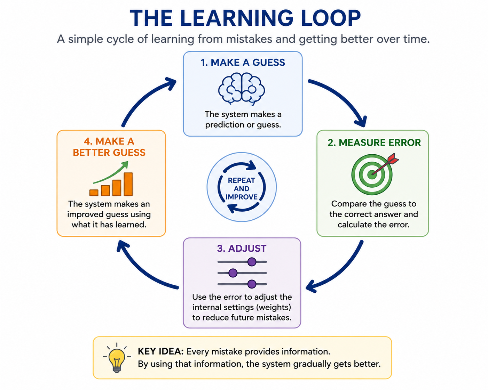
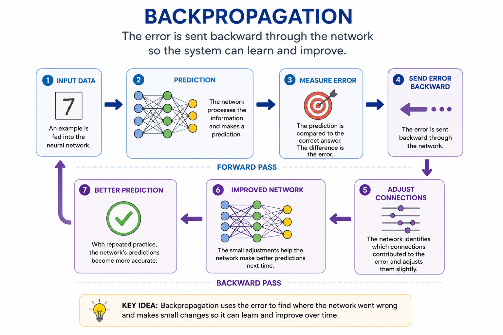

# Chapter 9: Backpropagation

## Learning from Mistakes

Imagine a child learning to throw a basketball into a hoop.

The first attempt misses badly.

The second attempt is closer.

The third attempt bounces off the rim.

After dozens of tries, the child begins to understand what works and what does not.

No one provides a detailed instruction manual explaining the exact angle, force, and trajectory required for every shot.

Instead, the child learns through feedback.

Each mistake contains information.

Every miss teaches the brain how to make the next attempt slightly better.

Humans learn this way throughout their lives.

We learn to walk by falling.

We learn to ride bicycles by wobbling.

We learn new skills by making mistakes, adjusting our actions, and trying again.

For decades, computers could not do this.

Early AI systems depended almost entirely on rules created by humans. If a computer made a mistake, it could not automatically improve. A programmer had to step in and change the rules.

Researchers dreamed of something different.

They wanted machines that could learn from experience.

Machines that could recognize their own errors.

Machines that could gradually improve without being explicitly told what to do in every situation.

The challenge was figuring out how.

How could a computer determine what caused a mistake?

How could it know which internal decisions needed to change?

For years, researchers struggled to answer these questions.

Then a breakthrough arrived.

A technique called backpropagation gave neural networks a practical way to learn from their errors. It was not flashy. It did not attract headlines.

But it would eventually become one of the most important ideas in the history of artificial intelligence.

Without backpropagation, many of today's AI systems—from image recognition to modern language models—would never have become possible.


## Section 1 — The Problem with Teaching Every Rule

By the late 1980s, Expert Systems had become one of the most successful forms of artificial intelligence in the world.

They helped doctors diagnose diseases, engineers troubleshoot equipment, and businesses make complex decisions. For many organizations, they proved that computers could apply expert knowledge quickly and consistently.

But beneath their success was a growing problem.

Every piece of knowledge had to be entered by hand.

Every rule had to be written by a human expert.

Every update required someone to modify the system.

As long as the problem remained simple and predictable, this approach worked well. But the real world is rarely simple or predictable.

Consider a challenge that most young children solve with ease: recognizing a dog.

How would you write enough rules to describe every possible dog?

You might start with obvious rules:

* IF it has four legs, it might be a dog.
* IF it has fur, it might be a dog.
* IF it barks, it might be a dog.

Soon you run into problems.

Some dogs are tiny. Others are enormous.

Some have long hair. Others have almost none.

Some bark loudly. Others barely bark at all.

The number of exceptions quickly becomes overwhelming.

Humans do not learn by memorizing thousands of rules. Instead, we learn from experience. We observe examples, make mistakes, receive feedback, and gradually improve our understanding.

Researchers began wondering whether computers could learn in a similar way.

What if, instead of programming every rule, we could build systems that learned patterns for themselves?

That question would lead to one of the most important breakthroughs in AI history: a learning method called backpropagation.

For the first time, computers would have a practical way to improve by learning from their mistakes.


## Section 2 — Learning from Mistakes

Learning is one of the most remarkable abilities humans possess.

We are not born knowing how to walk, read, drive a car, or play a musical instrument. We acquire these skills gradually through practice and experience.

At first, we make mistakes.

Many mistakes.

A child learning to walk falls over repeatedly.

A student learning mathematics gets answers wrong.

A new driver stalls the car, misses turns, and makes awkward parking attempts.

Yet with each mistake, something important happens.

The brain receives feedback.

It compares what was expected with what actually happened and makes small adjustments. Over time, those adjustments accumulate, and performance improves.

This process is so natural that we rarely think about it.

But for many years, computers had no equivalent ability.

Traditional software followed instructions exactly as written. If the instructions were wrong, the software remained wrong until a programmer corrected it.

Researchers wanted something different.

They wanted computers that could improve automatically.

Imagine teaching a computer to recognize handwritten numbers.

At first, the computer might make random guesses.

Shown the number 7, it might guess 3.

Shown the number 5, it might guess 8.

Its performance would be terrible.

But after each guess, the computer receives feedback.

The correct answer is revealed.

The computer now knows whether it was right or wrong.

The next challenge is determining how much it was wrong and how it should change its internal decision-making process.

This idea became the foundation of machine learning.

Instead of programming every rule, researchers could provide examples and feedback.

The computer would make a prediction.

The prediction would be compared to the correct answer.

The difference between the prediction and the correct answer is called the error.



That error became the teacher.

A small error meant the computer was close to the correct answer.

A large error meant significant adjustments were needed.

By repeatedly making predictions, measuring errors, and adjusting itself, the computer gradually improved.

This was a revolutionary idea.

Rather than filling computers with thousands of handcrafted rules, researchers could allow computers to learn patterns directly from data.

The more examples the system saw, the better it could become.

The question now was how to make this process work inside a neural network.

How could an error made at the output of a network influence the thousands—or eventually millions—of internal connections that contributed to that mistake?

The answer would come from a learning method known as backpropagation.


## Section 3 — What Is Backpropagation?

By the 1980s, researchers knew that neural networks had potential.

The idea of connecting artificial neurons together had existed for decades. In theory, these networks could learn complex patterns and solve problems that were difficult to describe using simple rules.

The challenge was teaching them how to learn efficiently.

Imagine a neural network trying to recognize handwritten numbers.

An image of a handwritten "7" is fed into the network.

The information passes through multiple layers of artificial neurons.

Eventually, the network produces an answer.

Perhaps it predicts that the image is a "3."

Unfortunately, the correct answer is "7."

The network has made a mistake.

Now comes the critical question:

How does the network know what to change?

A modern neural network may contain thousands, millions, or even billions of connections. Any one of those connections could have contributed to the error.

Researchers needed a way to trace the mistake backward through the network and determine which connections should be adjusted.

That solution became known as backpropagation.



The name comes from the idea of propagating, or sending, the error backward through the network.

First, the network makes a prediction.

Then the error is measured.

Next, the error is sent backward through the layers of the network.

As the error moves backward, the network identifies which connections contributed most to the mistake.

Those connections are adjusted slightly.

Connections that helped produce the correct answer may be strengthened.

Connections that contributed to the wrong answer may be weakened.

The adjustments are usually very small.

One correction rarely makes a dramatic difference.

But after thousands, millions, or even billions of examples, those small adjustments accumulate.

The network gradually becomes better at recognizing patterns and making accurate predictions.

You can think of backpropagation as a coach reviewing a game after it has ended.

The coach watches what happened, identifies mistakes, and provides feedback.

The players then make small improvements before the next game.

Over time, performance improves.

Backpropagation performs a similar role inside a neural network.

It analyzes mistakes, determines where improvements are needed, and guides the network toward better performance.

This may sound like a simple idea.

Yet it solved one of the biggest challenges in artificial intelligence.

For the first time, neural networks had a practical method for learning from experience.

Instead of relying on human-written rules, they could improve themselves through repeated cycles of prediction, error, and correction.

That breakthrough would help transform neural networks from an interesting research idea into one of the most powerful technologies ever created.


## Section 4 — Why Backpropagation Changed Everything

When backpropagation was introduced, it did not immediately transform the world.

There were no headlines announcing a revolution.

Most people outside the field of artificial intelligence had never heard of it.

Yet history would prove that backpropagation was one of the most important breakthroughs in AI.

For decades, researchers had dreamed of creating machines that could learn from experience. The idea of artificial neural networks had existed since the 1940s, but without an effective learning method, those networks remained limited.

Backpropagation changed that.

For the first time, neural networks had a practical way to improve themselves.

Instead of relying on human experts to write thousands of rules, networks could learn patterns directly from examples.

Show a network enough pictures of cats and dogs, and it could gradually learn the difference.

Show it enough examples of handwritten numbers, and it could learn to recognize them.

The more examples it saw, the better it became.

This represented a fundamental shift in the history of AI.

Earlier systems depended on human knowledge being carefully programmed into the machine.

Now the machine could discover knowledge for itself.

Researchers no longer had to anticipate every possible situation and write rules to handle it.

Instead, they could provide data and allow the network to learn.

The implications were enormous.

Neural networks began achieving results that rule-based systems struggled to match.

They became better at recognizing images.

Better at understanding speech.

Better at finding patterns hidden within large amounts of data.

Yet backpropagation did not solve every problem overnight.

The computers of the 1980s were still relatively slow.

Large neural networks required enormous amounts of processing power and data.

As a result, progress remained gradual for many years.

But the foundation had been laid.


```text
1940s–1980s
Expert Systems
      ↓
1980s
Backpropagation
      ↓
1990s–2000s
Neural Networks
      ↓
2010s
Deep Learning
      ↓
Today
Modern AI
```

As computers became faster and larger datasets became available, neural networks began to realize their potential.

The learning method that researchers had developed decades earlier suddenly became incredibly powerful.

Looking back today, it is difficult to imagine modern AI without backpropagation.

Image recognition systems depend on it.

Speech recognition systems depend on it.

Recommendation systems depend on it.

And many of the technologies that eventually led to today's AI revolution were built upon the same fundamental idea: learning from mistakes.

Backpropagation taught machines how to improve.

That simple idea would help unlock a new era of artificial intelligence and pave the way for the rise of deep learning.


## Looking Ahead

Backpropagation gave neural networks something they had never truly possessed before: the ability to learn from experience.

Instead of relying entirely on human-written rules, neural networks could improve by making predictions, measuring errors, and adjusting themselves over time. It was a simple idea, but it changed the course of artificial intelligence.

Yet the neural networks of the 1980s were still relatively small.

They could learn, but their capabilities were limited by the computers of the time. Processing power was expensive, data was scarce, and large networks were difficult to train.

Researchers knew that bigger networks might be capable of learning more complex patterns.

The question was whether computers would ever become powerful enough to make those larger networks practical.

Over the next few decades, advances in computing, data storage, and algorithms would provide the answer.

Neural networks would grow deeper.

Instead of a few layers of artificial neurons, they would contain many layers working together to discover increasingly sophisticated patterns.

These deeper networks would achieve breakthroughs in image recognition, speech recognition, language understanding, and countless other fields.

The world would eventually come to know this approach by a new name:

Deep Learning.

In the next chapter, we will explore how adding more layers transformed neural networks from promising research projects into the foundation of modern artificial intelligence.


