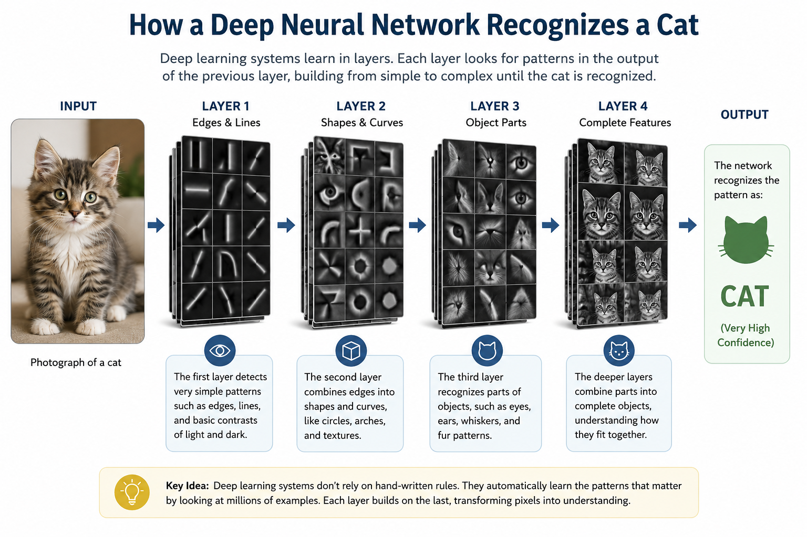
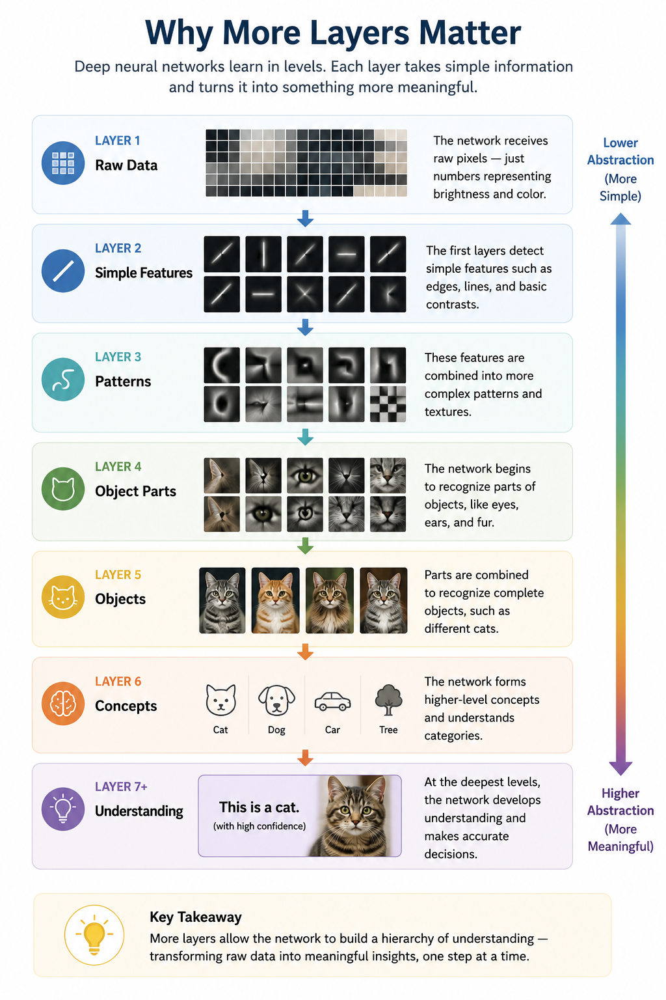
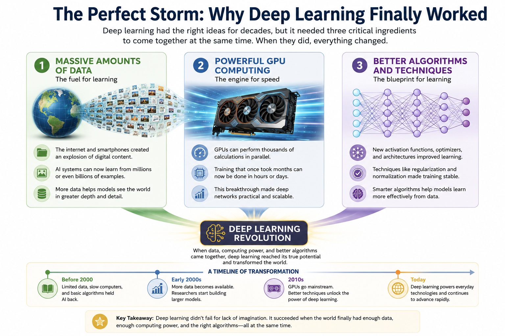
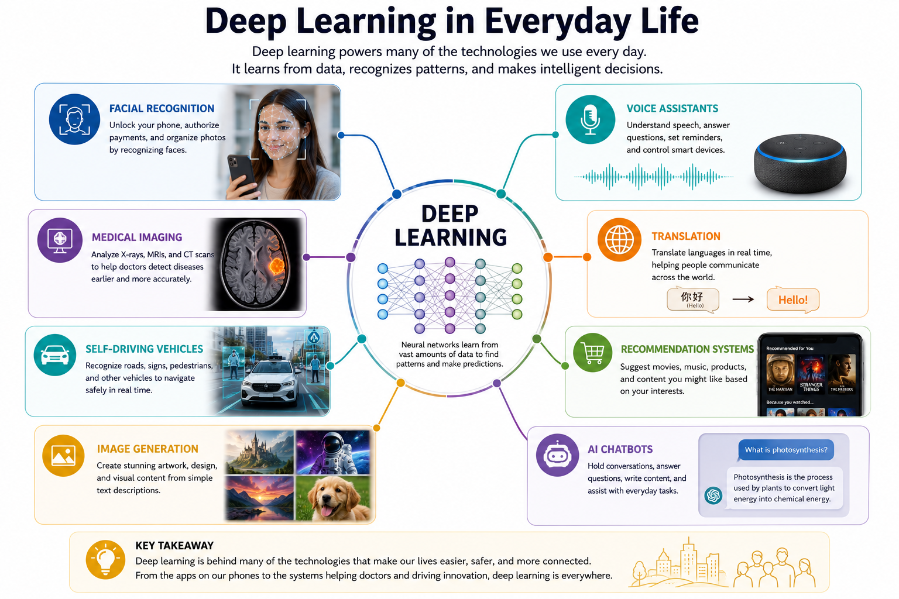
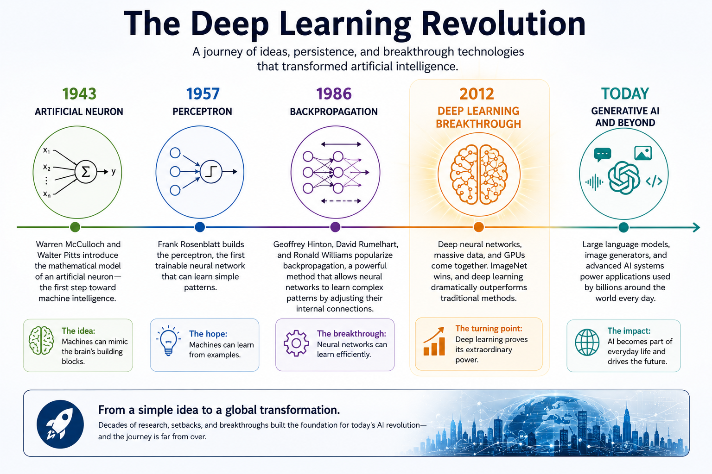

# Chapter 10: Deep Learning

## Opening Story

For most of the history of artificial intelligence, progress came in small steps.

Researchers would announce a new breakthrough. Newspapers would predict intelligent machines. Excitement would spread.

Then reality would arrive.

The systems worked well in laboratories but struggled in the real world. They could follow rules, play certain games, and solve carefully designed problems, yet they remained far from the flexible intelligence people imagined.

By the early 2000s, many researchers wondered whether AI had reached another plateau.

Then, in 2012, something extraordinary happened.

A team of researchers entered an image recognition competition known as ImageNet.

The challenge was deceptively simple: show a computer millions of photographs and ask it to identify what appeared in each image.

A dog.

A cat.

A bicycle.

A flower.

Humans perform this task almost effortlessly. Computers, however, had struggled with it for decades.

Most competing teams relied on systems built from carefully designed rules created by human experts.

The University of Toronto team took a different approach.

Instead of telling the computer what features to look for, they built a large neural network and allowed it to learn from the data itself.

When the results were announced, the AI community was stunned.

The system outperformed its competitors by a margin so large that researchers immediately realized something important had changed.

This was not simply a better image-recognition program.

It was evidence that neural networks could solve problems that had long resisted traditional approaches.

Within a few years, deep learning transformed field after field.

Computers learned to recognize speech, translate languages, identify diseases in medical images, recommend products, generate artwork, write software, and engage in conversations that often seemed remarkably human.

Today, whenever people talk about modern AI, they are usually talking about technologies built on the foundations of deep learning.

The revolution that changed artificial intelligence had begun.

# Section 1: When AI Suddenly Got Much Better

If you had asked an AI researcher in 1995 when intelligent machines would arrive, you probably would have received an optimistic answer.

If you had asked the same question in 2005, the answer might have been far more cautious.

Artificial intelligence had already experienced decades of excitement, disappointment, and renewed hope. Researchers had built systems that could play chess, diagnose certain medical conditions, and solve complex mathematical problems. Yet these systems often struggled when faced with the unpredictability of the real world.

Recognizing a cat in a photograph turned out to be much harder than defeating a chess champion.

Understanding spoken language was harder than solving equations.

Driving a car through a busy city was harder than almost anyone had imagined.

The problem was not a lack of intelligence among researchers. The problem was that many real-world tasks involve enormous amounts of information and countless subtle patterns.

Traditional computer programs depended on human experts telling the machine exactly what to do.

Suppose you wanted a computer to recognize a dog in a photograph.

You might create rules such as:

* Look for four legs.
* Look for fur.
* Look for a tail.
* Look for a certain shape of head.

But immediately problems appear.

What if the dog is sitting down?

What if part of its body is hidden?

What if the photograph is taken from an unusual angle?

What if the dog has very short fur?

What if the image is blurry?

The number of rules quickly becomes overwhelming.

The real world is simply too messy to be captured by thousands or even millions of hand-written instructions.

Researchers needed a different approach.

Instead of teaching computers every rule, what if computers could learn the rules themselves?

This idea was not new.

In previous chapters, we explored artificial neurons, perceptrons, and backpropagation. These inventions provided the foundations for machines that could learn from examples rather than follow fixed instructions.

For many years, however, neural networks remained relatively small and limited.

Researchers often lacked three critical ingredients:

* Enough data
* Enough computing power
* Efficient training methods

As the internet expanded, digital data exploded.

Millions of photographs became billions.

Thousands of documents became trillions of words.

At the same time, computers became dramatically faster.

Graphics Processing Units, or GPUs, originally designed for video games, proved exceptionally good at performing the vast number of calculations required by neural networks.

Researchers also improved the algorithms used to train these systems.

Suddenly, neural networks that once seemed impractical became powerful tools.

And something remarkable happened.

As researchers built larger networks with more layers, performance improved.

Not gradually.

Not slightly.

Often dramatically.

Neural networks began solving problems that had resisted decades of traditional programming.

They learned to recognize faces.

They learned to understand speech.

They learned to translate languages.

They learned to identify diseases in medical scans.

And eventually, they learned to generate text, images, music, and computer code.

This new generation of neural networks became known as **deep learning**.

The word *deep* simply refers to the number of layers inside the network.

Earlier neural networks often contained only a few layers.

Deep learning systems contain many layers, allowing them to discover increasingly sophisticated patterns hidden within data.

At first glance, adding more layers may seem like a small change.

In reality, it became one of the most important breakthroughs in the history of artificial intelligence.

Deep learning transformed neural networks from an interesting research idea into the foundation of the modern AI revolution.

To understand why, we need to look inside these layers and see what they actually learn.

# Section 2: Learning in Layers

Imagine that you show a photograph of a cat to a computer.

The image is clear.

The cat is sitting on a sofa.

Most people can identify it instantly.

In fact, you probably recognized it as a cat before consciously thinking about it.

Your brain performs this task so naturally that it feels effortless.

For a computer, however, the challenge is much greater.

A computer does not see whiskers, ears, fur, or a tail.

It does not see a cat at all.

At the most basic level, a computer sees only numbers.

Millions of numbers.

Every pixel in the image is represented by numerical values that describe color and brightness. To the machine, the photograph is simply a large collection of data.

The question is:

How can a machine turn all of those numbers into the idea of a cat?

This is where deep learning becomes powerful.

Instead of trying to recognize a cat all at once, a deep neural network breaks the problem into many smaller steps.

Each layer learns something slightly more complex than the layer before it.

The first layer might learn to detect very simple patterns.

It notices edges.

Lines.

Corners.

Areas of light and dark.

By themselves, these features mean very little.

A single edge does not tell us whether we are looking at a cat, a chair, or a bicycle.

The next layer combines those simple features into more meaningful shapes.

Curves.

Textures.

Small clusters of patterns.

The layer after that begins to recognize larger structures.

Perhaps an ear.

A paw.

An eye.

A patch of fur.

By the time information reaches the deeper layers, the network is combining all these smaller pieces into a complete object.

The system begins to recognize that certain combinations of ears, eyes, whiskers, fur, and body shape often appear together.

Eventually, the network reaches a conclusion:

"This is probably a cat."

Notice something important.

No human programmer explicitly taught the network what a cat's ear looks like.

No one wrote a rule saying:

"If you see two triangular shapes above two eyes, it might be a cat."

Instead, the network discovered these patterns for itself by analyzing enormous numbers of examples.

This ability to learn features automatically is one of the biggest reasons deep learning succeeded where earlier approaches struggled.

Traditional software depended on humans deciding which features mattered.

Deep learning allows the machine to discover useful features on its own.

Researchers often describe this process as building a hierarchy of understanding.

Each layer learns from the work of previous layers.

Simple patterns become complex patterns.

Complex patterns become objects.

Objects become meaning.

A useful way to visualize the process is:

Pixels

↓

Edges

↓

Shapes

↓

Object Parts

↓

Objects

↓

Understanding

This layered learning process is the reason deep neural networks can tackle tasks that once seemed impossible.

The network is not merely memorizing images.

It is gradually learning how the world is structured.

And the deeper the network becomes, the more sophisticated the patterns it can learn.

That simple idea—learning layer by layer—became one of the most important discoveries in the history of artificial intelligence.

*Figure 10.1: A deep neural network learns in stages. Early layers detect simple features such as edges and lines. Deeper layers combine those features into shapes, object parts, and eventually complete objects such as a cat.*

# Section 3: Why More Layers Matter

At first glance, deep learning sounds almost too simple.

Researchers took neural networks, added more layers, and suddenly achieved breakthroughs that transformed artificial intelligence.

Can adding layers really make such a big difference?

As it turns out, the answer is yes.

To understand why, imagine teaching someone to identify a face in a photograph.

You would not start by describing the entire face all at once.

Instead, you would begin with smaller details.

The shape of the eyes.

The curve of the nose.

The position of the mouth.

The outline of the head.

As these smaller pieces come together, recognition becomes easier.

Deep neural networks work in a similar way.

Each layer solves a small part of the problem.

The next layer builds on that work.

The process repeats again and again until the network develops a sophisticated understanding of the data.

Think of it like constructing a building.

One worker lays the foundation.

Another builds the walls.

Another installs the roof.

Another completes the interior.

No single worker creates the entire structure alone.

Each contributes one step toward the final result.

A deep neural network follows the same principle.

Each layer specializes in learning certain patterns and then passes its discoveries to the next layer.

The deeper the network becomes, the more complex those discoveries can be.

This ability becomes especially important when dealing with real-world information.

Consider spoken language.

The first layers of a network might recognize simple sounds.

The next layers might identify syllables.

Deeper layers could recognize words.

Still deeper layers could detect phrases, meanings, and relationships between ideas.

By combining many levels of understanding, the network can interpret language far more effectively than a shallow system.

The same principle applies to images.

Early layers may detect edges and colors.

Middle layers may identify shapes and textures.

Later layers may recognize eyes, wheels, doors, faces, animals, or buildings.

Eventually, the network can determine what the entire image represents.

This layered approach gives deep learning a remarkable advantage.

Instead of requiring human experts to define every important feature, the network discovers useful features on its own.

In a sense, the system creates its own internal understanding of the world.

Researchers sometimes refer to these learned patterns as **representations**.

A representation is simply the network's way of describing what it has learned.

As information moves through the layers, the representations become increasingly meaningful.

Raw pixels become edges.

Edges become shapes.

Shapes become objects.

Objects become concepts.

*Figure 10.2: Deep neural networks learn in stages. Early layers detect simple features, while deeper layers combine those features into patterns, objects, concepts, and ultimately meaningful understanding.*

This process allows deep learning systems to uncover patterns that humans might never think to program explicitly.

In some cases, the network discovers subtle relationships hidden within enormous amounts of data.

These relationships may be too complex for people to describe with rules, yet the network learns them automatically through experience.

That ability—to build increasingly sophisticated representations layer by layer—is one of the main reasons deep learning succeeded where earlier AI approaches struggled.

More layers do not magically create intelligence.

But they give a neural network the ability to learn richer and more powerful descriptions of the world.

And as researchers continued building deeper networks, they discovered that these systems could tackle challenges that once seemed far beyond the reach of computers.

The age of deep learning had truly begun.

# Section 4: Why Deep Learning Finally Worked

By now, you may be wondering something important.

If neural networks are such a powerful idea, why did the deep learning revolution wait until the 2010s?

After all, artificial neurons were introduced in the 1940s.

The perceptron appeared in the 1950s.

Backpropagation was developed in the 1980s.

The basic ideas behind deep learning had existed for decades.

So what changed?

The answer is surprisingly simple.

For most of its history, AI had the right ideas but lacked the necessary resources.

Imagine trying to build a modern skyscraper using the tools available in the Middle Ages.

The design might be brilliant.

The vision might be correct.

But without the right materials, equipment, and technology, the project would never succeed.

Deep learning faced a similar problem.

Researchers understood that larger neural networks could potentially learn complex patterns.

The challenge was that training those networks required enormous amounts of data and computing power.

For much of the twentieth century, neither was available.

First, there was a shortage of data.

Modern AI systems learn by studying examples.

Lots of examples.

A neural network trained to recognize cats may need millions of photographs.

A language model may learn from trillions of words.

Before the internet, collecting data on this scale was nearly impossible.

Most information existed only in books, paper records, photographs, or human memory.

There simply was not enough digital information available to train large neural networks effectively.

Second, computers were too slow.

Training a deep neural network involves performing countless mathematical calculations.

Each connection in the network must be adjusted repeatedly as the system learns.

For large networks, the number of calculations becomes enormous.

Computers of the 1980s and 1990s could perform these calculations, but doing so often required impractical amounts of time.

A task that might take hours today could have taken months—or even years—on earlier machines.

Then came an unexpected breakthrough.

The video game industry helped solve one of AI's biggest problems.

As computer graphics became more advanced, manufacturers developed specialized hardware called Graphics Processing Units, or GPUs.

GPUs were designed to perform many calculations simultaneously so they could render realistic images and video games.

Researchers soon realized that the same capability was ideal for training neural networks.

Instead of performing calculations one at a time, GPUs could process thousands of operations in parallel.

Training times that once seemed impossible suddenly became manageable.

A third factor also played a critical role.

Researchers developed better training techniques.

Over time, they learned how to design deeper networks, improve learning algorithms, and avoid many of the problems that had limited earlier systems.

The result was a perfect combination of three powerful forces:

*Figure 10.3: Deep learning succeeded when three critical ingredients became available at the same time: enormous amounts of digital data, powerful GPU computing, and improved learning algorithms. Together, they created the conditions that sparked the modern AI revolution.*

* Massive amounts of digital data
* Powerful GPU-based computing
* Improved learning algorithms

Each factor was important.

Together, they were transformative.

Many historians of AI describe this period as a "perfect storm" for deep learning.

The underlying ideas had been waiting for decades.

Once enough data became available, computers became fast enough, and training methods improved, neural networks finally had the opportunity to demonstrate their true potential.

The results exceeded almost everyone's expectations.

Problems that had resisted generations of researchers suddenly began to fall.

Image recognition improved dramatically.

Speech recognition became practical.

Machine translation became far more accurate.

And entirely new applications began to emerge.

Deep learning was not a sudden invention.

It was the moment when decades of research, combined with new technological capabilities, finally came together.

The revolution had been building for years.

The world was only beginning to notice.

# Section 5: Deep Learning Changes the World

For most people, the deep learning revolution did not arrive with a dramatic announcement.

It arrived quietly.

One application at a time.

One device at a time.

One seemingly magical feature at a time.

As deep learning systems became more capable, they began appearing in products and services used by millions—and eventually billions—of people around the world.

Many people interacted with deep learning long before they knew the term existed.

Consider what happens when you unlock your smartphone using facial recognition.

The device analyzes the image captured by its camera.

It compares patterns in your face to patterns it has learned previously.

Within moments, it decides whether you are the authorized user.

Behind that simple action is a deep learning system trained to recognize subtle facial features.

The same technology helps organize photographs automatically.

Modern photo applications can often identify people, pets, vehicles, landmarks, and other objects without being explicitly programmed to recognize each image.

Deep learning also transformed speech recognition.

For years, voice-controlled systems struggled to understand natural conversation.

Users often had to speak slowly and carefully.

Today, digital assistants can understand speech with remarkable accuracy.

They can recognize accents, adapt to different speaking styles, and interpret spoken commands in real time.

Machine translation experienced a similar transformation.

Earlier translation systems often produced awkward and confusing results because they relied heavily on predefined rules.

Deep learning enabled computers to learn patterns directly from enormous collections of translated text.

As a result, modern translation tools became dramatically more accurate and useful.

The impact extended far beyond consumer technology.

In medicine, deep learning systems began assisting doctors by analyzing medical images.

Researchers discovered that neural networks could identify patterns in X-rays, CT scans, and other diagnostic images that might otherwise be difficult to detect.

These systems do not replace medical professionals, but they can provide valuable support and help improve diagnostic accuracy.

Transportation also changed.

Deep learning became a critical component of self-driving vehicle research.

A vehicle must continuously recognize roads, traffic signs, pedestrians, bicycles, and countless other objects.

The layered pattern-recognition abilities of deep neural networks made this possible.

Businesses quickly adopted deep learning as well.

Recommendation systems learned to predict which movies people might enjoy.

Online stores learned to suggest products customers were likely to purchase.

Financial institutions used deep learning to detect unusual patterns that might indicate fraud.

In each case, the system was learning from vast amounts of data rather than relying solely on human-written rules.

Perhaps the most visible change arrived in the field of generative AI.

Researchers discovered that deep learning systems could do more than recognize patterns.

They could create new content.

They could generate images.

Compose music.

Write text.

Produce software code.

Answer questions.

Hold conversations.

The technology that powers modern image generators and large language models is built on the same fundamental principles we have explored throughout this chapter.

The details have become more sophisticated, but the core idea remains surprisingly familiar:

Artificial neurons organized into layers that learn from data.

What began as a research project inspired by the human brain had evolved into one of the most influential technologies of the modern era.

Deep learning was no longer confined to laboratories and universities.

It had become part of everyday life.

*Figure 10.4: Deep learning powers many technologies people use every day, including facial recognition, speech recognition, medical imaging, translation systems, recommendation engines, self-driving vehicle research, image generation, and conversational AI.*

And its influence was only beginning to grow.

# Section 6: The Modern AI Revolution

Looking back, the success of deep learning may seem inevitable.

Today, we live in a world filled with AI-powered technologies.

Our phones recognize our faces.

Our cars assist with navigation and safety.

Our apps recommend movies, music, and products.

Our computers can translate languages, generate images, and answer questions in natural conversation.

Because these capabilities are now part of everyday life, it is easy to forget how extraordinary they once seemed.

For much of AI's history, many of these achievements appeared far beyond the reach of computers.

Researchers dreamed of machines that could see, hear, understand language, and learn from experience.

Yet decade after decade, those goals remained frustratingly difficult.

The deep learning revolution changed that.

By combining artificial neurons into deep networks and training them on enormous amounts of data, researchers unlocked capabilities that earlier generations could scarcely imagine.

Machines began recognizing patterns hidden within vast collections of information.

They learned to identify objects, understand speech, translate languages, and generate entirely new forms of content.

Most importantly, deep learning demonstrated something that transformed the direction of AI research.

Instead of trying to program every rule by hand, computers could learn many of those rules for themselves.

That idea reshaped the field.

Researchers shifted from asking:

*"How do we tell the computer everything it needs to know?"*

to asking:

*"How can the computer learn from experience?"*

This change in perspective proved revolutionary.

It allowed AI systems to tackle problems that were too complex for traditional programming approaches.

As deep learning continued to improve, new breakthroughs appeared at an astonishing pace.

Systems became larger.

Training datasets grew bigger.

Computing power increased.

Each advance opened the door to new possibilities.

The technologies behind modern image generators, voice assistants, recommendation systems, and large language models all trace part of their heritage back to the deep learning revolution.

Even so, deep learning is not the final chapter in the story of artificial intelligence.

Researchers continue to explore new architectures, new learning methods, and new ways to make AI systems more capable, efficient, and trustworthy.

The field continues to evolve.

*Figure 10.5: Deep learning was not a single invention but the culmination of nearly seventy years of research. Advances in artificial neurons, perceptrons, backpropagation, computing power, and data eventually led to the modern AI revolution and today's generative AI systems.*

But deep learning marked the moment when AI moved from a promising research discipline to a transformative technology that affects billions of people.

Few breakthroughs in the history of computing have had such a profound impact in such a short period of time.

The revolution that began with layers of artificial neurons is still unfolding.

And its influence is likely to shape science, business, education, medicine, law, and daily life for decades to come.

Deep learning did not merely improve artificial intelligence.

It changed the world.

## Insight Box: Why Deep Learning Changed Everything

Throughout the history of artificial intelligence, researchers repeatedly encountered the same challenge: computers could follow rules, but the real world contains too many patterns, exceptions, and possibilities to describe with rules alone.

Deep learning offered a different approach.

Instead of telling a computer exactly what to look for, researchers built neural networks that could learn from experience.

By organizing artificial neurons into many layers, these systems learned to recognize increasingly complex patterns—from simple edges and shapes to objects, language, and meaning itself.

The idea was not new. Artificial neurons, perceptrons, and backpropagation had existed for decades.

What changed was the world around them.

The rise of the internet produced vast amounts of data. Powerful GPUs made large-scale training possible. Improved algorithms allowed deeper networks to learn effectively.

When these ingredients finally came together, deep learning unlocked capabilities that earlier generations of AI could only imagine.

Today, deep learning powers technologies used by billions of people—from facial recognition and medical imaging to language translation, image generation, and conversational AI.

The modern AI revolution did not begin because computers suddenly became intelligent.

It began because machines finally learned how to learn.

## Looking Ahead

Deep learning transformed artificial intelligence, but it could not have succeeded on its own.

Training a modern neural network requires an astonishing amount of computation. Millions, billions, and sometimes even trillions of calculations must be performed as a system learns from data.

For decades, computers simply were not powerful enough to handle this workload efficiently.

Then an unexpected hero appeared.

Not from an AI laboratory.

Not from a university research center.

But from the world of video games.

Graphics Processing Units, or GPUs, were originally designed to create realistic graphics for gamers. Yet researchers soon discovered that these chips possessed exactly the kind of processing power needed to train large neural networks.

What began as technology for rendering virtual worlds would become one of the most important engines behind the AI revolution.

In the next chapter, we will explore how GPUs changed artificial intelligence forever—and why a technology built for gaming became the foundation of modern AI.

