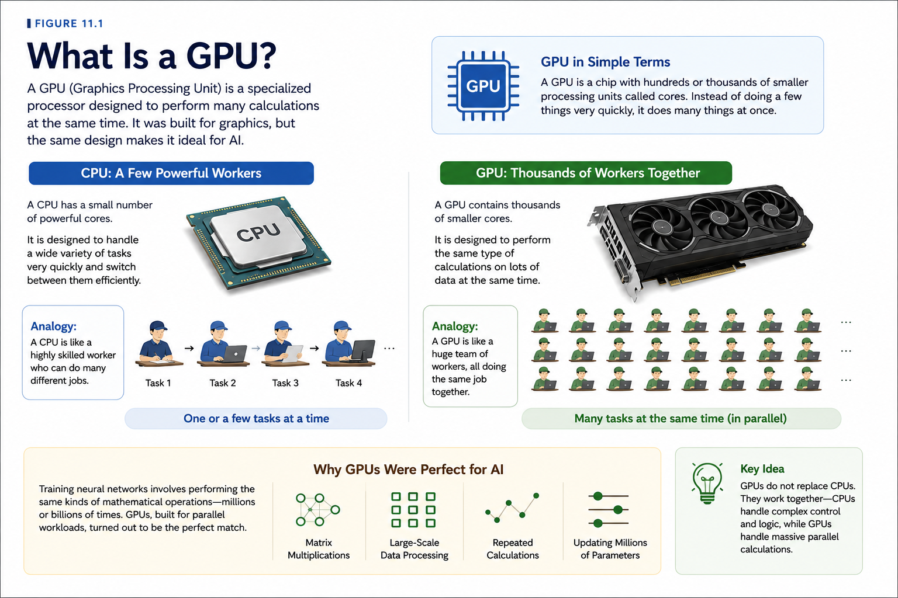
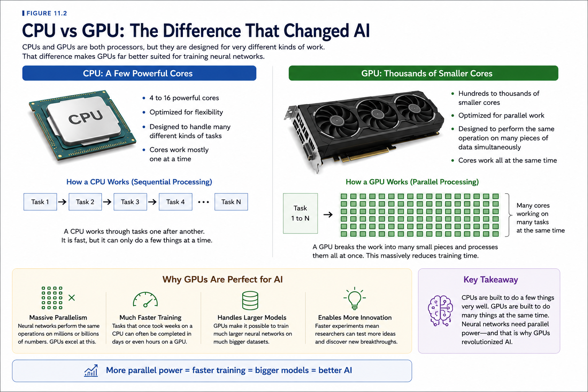
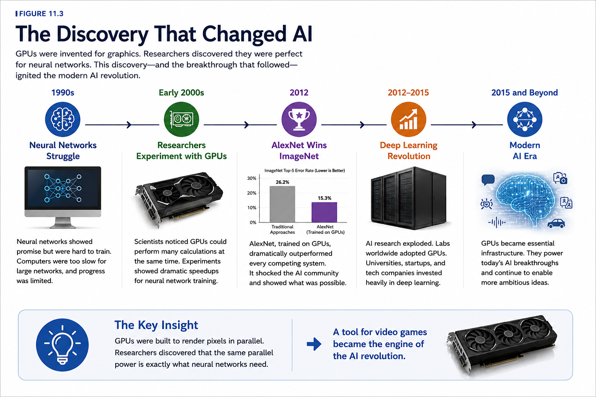

# Chapter 11: The GPU Revolution

## Opening Story

In the early 2000s, millions of people around the world were spending money on faster computers for a simple reason:

They wanted better video games.

Gamers wanted richer worlds, smoother animation, and increasingly realistic graphics. To meet that demand, technology companies competed to build ever more powerful graphics hardware.

Every year brought new advances.

Characters looked more lifelike.

Virtual worlds became larger and more detailed.

Games that once seemed impossible became commonplace.

Few people realized that this race to improve video game graphics was quietly laying the foundation for one of the most important technological revolutions of the twenty-first century.

At the same time, artificial intelligence researchers faced a frustrating problem.

They had promising ideas.

They had neural networks.

They had learning algorithms.

What they lacked was enough computing power.

Training a neural network requires enormous numbers of mathematical calculations. As networks became larger and more complex, the amount of computation grew dramatically.

Researchers often found themselves waiting days, weeks, or even months for experiments to finish.

Progress was limited not by imagination, but by hardware.

Then an unexpected discovery changed everything.

The same processors designed to draw millions of pixels on a computer screen turned out to be exceptionally good at performing the calculations required by neural networks.

These devices were called Graphics Processing Units, or GPUs.

What had been created for gaming suddenly became one of the most valuable tools in artificial intelligence.

Researchers began using GPUs to train neural networks faster than ever before.

Experiments that once took weeks could now be completed in days.

Some tasks that had been impractical became possible.

Others became routine.

As computing power increased, neural networks grew larger.

Datasets grew larger.

Ambitions grew larger.

The deep learning revolution that transformed artificial intelligence was no longer limited by the speed of ordinary computers.

A technology built to power virtual worlds had become the engine behind modern AI.

To understand how artificial intelligence changed the world, we must first understand the remarkable machine that made it possible.

# Section 1: The Problem with Ordinary Computers

To understand why GPUs changed artificial intelligence, we first need to understand the problem they were designed to solve.

At first glance, training a neural network may not sound particularly difficult.

After all, computers perform calculations every day.

They calculate bank balances.

They display websites.

They run spreadsheets.

They play music and videos.

Why should AI be any different?

The answer lies in scale.

Training a neural network requires an enormous number of calculations.

Imagine a neural network with millions of connections between its artificial neurons.

Every time the network sees an example, it must process information through all of those connections.

Then it must compare its answer to the correct answer.

Then it must adjust countless internal values to improve future predictions.

And it must repeat this process again.

And again.

And again.

A modern AI system may perform this learning process billions of times during training.

The amount of computation quickly becomes staggering.

To appreciate the challenge, imagine trying to count every grain of sand on a beach.

You could do it.

But it would take an extremely long time.

Now imagine counting every grain on every beach in the world.

The task has not changed.

Only the scale has changed.

Training large neural networks creates a similar problem.

The calculations themselves are not especially complicated.

There are simply an enormous number of them.

For decades, researchers relied primarily on Central Processing Units, or CPUs.

The CPU is often described as the brain of a computer.

It handles a wide variety of tasks and is designed to be flexible.

A CPU can run a web browser, manage files, play music, and perform calculations.

It is excellent at doing many different jobs.

However, flexibility comes with a trade-off.

Most CPUs are optimized to perform a relatively small number of tasks very quickly.

This works well for everyday computing.

It is less effective when faced with millions or billions of similar calculations that must be performed repeatedly.

Neural networks create exactly that kind of workload.

Consider a classroom filled with students solving the same math problem.

If only one student works at a time, progress will be slow.

If hundreds of students work simultaneously, the problem can be solved much faster.

For many years, AI researchers were effectively relying on the first approach.

Their computers were powerful, but they were not designed to perform massive numbers of calculations at the same time.

As neural networks grew larger, training times grew longer.

Experiments that researchers wanted to complete in hours often required days.

Projects expected to take days could stretch into weeks.

Some ambitious ideas were simply impractical because the required computing power did not exist.

The challenge was becoming increasingly clear.

If artificial intelligence was going to advance, researchers needed a way to perform far more calculations in far less time.

What they needed was not just a faster computer.

They needed a different kind of computer.

Fortunately, that technology already existed.

It had been built for an entirely different purpose.

And it was sitting inside the gaming computers of millions of people around the world.

# Section 2: What Is a GPU?

The solution to AI's computing problem came from an unexpected place.

Video games.

To understand why, we first need to understand what a GPU actually is.

GPU stands for **Graphics Processing Unit**.

As the name suggests, GPUs were originally designed to handle graphics.

Whenever you play a video game, watch a 3D animation, or view a complex visual scene on a computer, millions of tiny calculations must be performed to create the images displayed on the screen.

Every object must be drawn.

Every shadow must be calculated.

Every movement must be updated.

And all of this must happen many times every second.

A modern video game may display dozens of frames each second, with each frame containing millions of pixels.

Producing those images requires an enormous amount of computation.

Engineers quickly realized that ordinary CPUs were not ideal for this task.

Graphics workloads involve many similar calculations that can be performed at the same time.

Instead of relying on a small number of powerful processing units, GPU designers took a different approach.

They built processors containing large numbers of smaller processing units that could work simultaneously.

Imagine a construction project.

A CPU is like a highly skilled worker equipped with many tools. The worker can perform a wide variety of tasks efficiently and adapt to changing situations.

A GPU is more like a large team of workers performing many similar tasks at the same time.

Neither approach is inherently better.

They are simply designed for different kinds of work.

For graphics, the second approach proved extremely effective.

Thousands of calculations could be performed in parallel, allowing computers to generate increasingly realistic images and video games.

For years, GPUs were viewed primarily as gaming technology.

Gamers purchased them to improve performance.

Game developers used them to create more immersive experiences.

Few people outside the graphics industry paid much attention to them.

Then researchers working on artificial intelligence noticed something interesting.

Training a neural network also involves performing enormous numbers of similar calculations.

Artificial neurons continuously multiply numbers, add values together, and adjust internal connections.

The same operations are repeated again and again across millions—or even billions—of parameters.

In other words, neural networks create exactly the kind of workload that GPUs were designed to handle.

A processor built to calculate pixels could also calculate neurons.

The connection was not immediately obvious.

But once researchers recognized it, everything changed.

Tasks that overwhelmed traditional processors could suddenly be completed far more quickly.

Neural networks could become larger.

Experiments could run faster.

Researchers could test more ideas.

What began as a tool for rendering dragons, race cars, and virtual worlds was about to become one of the most important technologies in artificial intelligence.

*Figure 11.1: A Graphics Processing Unit (GPU) contains hundreds or thousands of processing cores designed to perform many calculations simultaneously. Originally built for video games and computer graphics, GPUs proved ideally suited for training neural networks and became a key technology behind the modern AI revolution.*

The next step was to compare these two kinds of processors directly.

Only then would researchers fully understand why GPUs were such a perfect match for deep learning.

# Section 3: CPUs vs GPUs

By the time researchers began experimenting with GPUs, they already knew that neural networks required enormous amounts of computation.

What they needed to understand was whether GPUs could perform that work better than traditional processors.

The answer turned out to be yes—and by a remarkable margin.

To see why, imagine a large warehouse filled with thousands of boxes that must be inspected.

One approach would be to assign the job to a small team of highly skilled workers.

Each worker could examine boxes quickly and efficiently.

They could adapt to unexpected situations and perform many different tasks.

This is similar to how a CPU operates.

A CPU contains a relatively small number of powerful processing cores designed to handle a wide variety of tasks.

Now imagine a different approach.

Instead of a small team, you hire thousands of workers.

Each worker performs a simple inspection on a different box at the same time.

No individual worker is as versatile as the highly skilled specialists, but together they can process enormous numbers of boxes simultaneously.

This is similar to how a GPU operates.

A GPU contains hundreds or even thousands of smaller processing cores designed to work in parallel.

The difference is not intelligence.

It is organization.

CPUs are designed to excel at many different tasks.

GPUs are designed to perform large numbers of similar tasks at the same time.

For everyday computing, CPUs are indispensable.

They manage operating systems, run applications, handle user input, and coordinate countless activities within a computer.

Without CPUs, modern computers would not function.

But neural networks create a very specific kind of workload.

Training a neural network involves repeating similar mathematical operations millions or billions of times.

Artificial neurons multiply numbers.

Add values together.

Adjust weights.

Then repeat the process.

Again.

And again.

And again.

Because so many of these calculations are independent of one another, they can be performed simultaneously.

This is exactly where GPUs shine.

Imagine asking a CPU to calculate one thousand problems.

It might assign a few powerful workers to solve them.

A GPU approaches the challenge differently.

It distributes the problems across hundreds or thousands of workers and solves many of them at the same time.

The result can be a dramatic increase in speed.

Tasks that once required weeks might take days.

Tasks that required days might take hours.

And experiments that were previously impractical suddenly become possible.

For AI researchers, this was a game changer.

Faster training meant more experiments.

More experiments meant faster discoveries.

Researchers could build larger neural networks, train them on bigger datasets, and explore ideas that had once been beyond reach.

The impact extended far beyond convenience.

Without GPUs, many of the deep learning breakthroughs of the 2010s would have been difficult, expensive, or simply impossible.

The modern AI revolution did not happen because researchers found a shortcut.

It happened because they found a way to perform an enormous number of calculations at unprecedented speed.

And GPUs turned out to be the perfect tool for the job.

Once researchers understood this advantage, adoption spread rapidly throughout the AI community.

The age of GPU-powered artificial intelligence had begun.

Figure 11.2 illustrates why GPUs proved so much more effective than traditional CPUs for deep learning workloads.

*Figure 11.2: CPUs and GPUs are both processors, but they are designed for different kinds of work. CPUs contain a small number of powerful cores optimized for flexibility, while GPUs contain hundreds or thousands of smaller cores optimized for parallel processing. This ability to perform many calculations simultaneously made GPUs ideal for training deep neural networks and helped spark the modern AI revolution.*

# Section 4: The Discovery That Changed AI

Sometimes the most important breakthroughs occur when a tool designed for one purpose is unexpectedly applied to another.

That is exactly what happened with GPUs.

When graphics processors were first developed, nobody was thinking about artificial intelligence.

Their purpose was simple: create better graphics.

They were built to render video games, display three-dimensional worlds, and process millions of pixels as quickly as possible.

For years, that was exactly how they were used.

Meanwhile, AI researchers continued struggling with a familiar problem.

Neural networks showed promise, but training them remained painfully slow.

Larger networks required more calculations.

More calculations required more time.

Progress often felt limited by hardware rather than ideas.

Researchers began searching for ways to accelerate their experiments.

Some noticed an intriguing similarity between computer graphics and neural networks.

Both involved performing vast numbers of mathematical operations repeatedly.

Both required large quantities of data to be processed.

And both benefited from performing many calculations simultaneously.

The question was obvious.

Could GPUs be used for AI?

At first, the idea seemed unconventional.

Graphics processors were designed for games, not machine learning.

Most researchers viewed them as specialized hardware with little relevance to artificial intelligence.

But a small number of scientists decided to experiment.

What they discovered was remarkable.

Tasks that had taken days on traditional processors could often be completed much faster using GPUs.

Larger neural networks became practical.

More ambitious experiments became affordable.

Researchers could test ideas at a pace that had previously been impossible.

The impact was immediate.

One of the researchers most closely associated with this shift was Geoffrey Hinton, whose work helped revive interest in neural networks during a period when many scientists had abandoned them.

Hinton and his collaborators believed that larger neural networks could solve problems that smaller systems could not.

The challenge was finding enough computing power to train them.

GPUs helped provide that power.

Then came a breakthrough that captured the attention of the entire AI community.

In 2012, a deep neural network known as AlexNet competed in the ImageNet competition, one of the world's most important image-recognition challenges.

The system was trained using GPUs and dramatically outperformed competing approaches.

Its results shocked many researchers.

For years, progress in computer vision had been gradual.

AlexNet produced a leap forward.

Suddenly, deep learning was no longer an interesting research topic.

It was the most exciting area in artificial intelligence.

The success of AlexNet demonstrated two important lessons.

First, deep neural networks could achieve extraordinary results when trained on large datasets.

Second, GPUs made training those networks practical.

Together, these discoveries helped launch the modern deep learning era.

Research laboratories around the world took notice.

Universities expanded their deep learning programs.

Technology companies invested billions of dollars in AI research.

The demand for GPUs exploded.

What had begun as an experiment became a movement.

The realization that GPUs could accelerate neural networks did more than speed up existing research.

It fundamentally changed what researchers believed was possible.

Ideas that once seemed unrealistic suddenly became achievable.

The age of deep learning had arrived.

And GPUs were one of the key reasons why.

*Figure 11.3: GPUs were originally developed for computer graphics, but researchers discovered they were ideally suited for training neural networks. The breakthrough reached a turning point in 2012 when AlexNet, trained on GPUs, dramatically outperformed competing systems in the ImageNet competition. This success helped launch the modern deep learning revolution.*

# Section 5: NVIDIA and the AI Boom

As researchers discovered the power of GPUs, a surprising company found itself at the center of the AI revolution.

That company was NVIDIA.

When NVIDIA was founded in 1993, artificial intelligence was not its primary focus.

The company's goal was to build graphics processors capable of producing increasingly realistic computer graphics.

Its customers were gamers, game developers, engineers, and designers.

For years, NVIDIA competed fiercely in the graphics hardware market.

Each new generation of GPUs delivered better performance and more realistic visual experiences.

The company became known for helping create the stunning graphics found in modern video games.

At the time, few people could have predicted that these same processors would one day help power artificial intelligence systems capable of recognizing images, understanding language, and generating content.

The shift began gradually.

As researchers experimented with GPUs for neural network training, they discovered that NVIDIA's hardware often delivered remarkable performance improvements.

Training tasks that had once taken weeks could sometimes be completed in days.

As word spread through the research community, demand for GPU computing grew rapidly.

NVIDIA recognized the opportunity.

The company invested heavily in tools and software that made it easier for researchers to use GPUs for scientific computing and machine learning.

One of the most important developments was a platform called CUDA.

CUDA allowed programmers to harness the parallel-processing power of GPUs for purposes beyond graphics.

Researchers could now write software that used GPUs to solve scientific and mathematical problems—including training neural networks.

This proved to be a turning point.

As deep learning gained momentum, universities, research laboratories, and technology companies increasingly relied on GPU-based computing.

The demand for AI hardware accelerated.

Then came the deep learning breakthroughs of the 2010s.

Systems such as AlexNet demonstrated what was possible when large neural networks were trained on powerful GPU hardware.

Soon, nearly every major AI research organization was using GPUs.

Technology companies built massive data centers filled with them.

Startups raced to acquire them.

Researchers competed for access to them.

GPUs became one of the most valuable resources in artificial intelligence.

As generative AI systems emerged, demand increased even further.

Training modern AI models requires enormous computational resources.

Large clusters containing thousands of GPUs may work together for weeks or months to train a single advanced model.

The scale would have seemed unimaginable just a few decades earlier.

NVIDIA's story illustrates an important lesson about technological innovation.

Sometimes a breakthrough occurs because someone invents a completely new technology.

Other times, a technology developed for one purpose unexpectedly becomes essential for another.

GPUs were created to render virtual worlds.

Instead, they helped make modern artificial intelligence possible.

Today, AI has become one of the largest drivers of demand for advanced computing hardware.

And NVIDIA, once known primarily as a graphics company, now occupies a central place in the story of artificial intelligence.

The rise of AI transformed NVIDIA.

But the rise of NVIDIA also helped transform AI.

1993
NVIDIA Founded
      ↓
Gaming Graphics
      ↓
GPU Innovation
      ↓
Researchers Discover GPUs
      ↓
Deep Learning Boom
      ↓
Generative AI Era

# Section 6: Why Computing Power Still Matters

The story of GPUs is not just a chapter in the history of artificial intelligence.

It is an ongoing story.

As impressive as modern AI systems may seem, they are the result of a simple principle that has shaped computing for decades:

More computing power makes more ambitious ideas possible.

Every major advance in AI requires enormous amounts of computation.

Neural networks must process vast datasets.

Large language models must analyze trillions of words.

Image-generation systems must learn patterns from millions of images.

Behind every breakthrough lies an extraordinary number of calculations.

As AI models have grown larger, the demand for computing power has grown alongside them.

Researchers now train some models using thousands of GPUs working together in massive data centers.

These facilities contain rows upon rows of specialized hardware, consuming significant amounts of electricity while performing countless calculations every second.

The scale is difficult to imagine.

A modern AI model may require more computation than entire scientific projects required just a few decades ago.

Yet researchers continue pushing forward.

Why?

Because increased computing power often unlocks new capabilities.

Larger models can learn more complex patterns.

More training data can improve performance.

More sophisticated architectures can tackle increasingly difficult problems.

Time and again, advances in hardware have enabled advances in AI.

This relationship has become one of the defining characteristics of the field.

Researchers improve algorithms.

Engineers build faster hardware.

The new hardware enables larger experiments.

The experiments inspire new ideas.

The cycle repeats.

Some experts describe this as a positive feedback loop between computing power and artificial intelligence.

Each advance helps drive the next.

The result has been decades of accelerating progress.

At the same time, this growth raises important questions.

How much computing power will future AI systems require?

Can hardware continue improving at the same pace?

How can society balance growing computational demands with concerns about energy consumption and cost?

Researchers are actively exploring these challenges.

New generations of AI chips are being developed.

More efficient algorithms are being created.

Engineers are designing systems that can perform more work while using less energy.

The search for better computing technology continues.

One lesson from history is already clear.

The future of AI will not be determined solely by clever algorithms.

It will also be shaped by the machines that run them.

The GPU revolution demonstrated that hardware can change the course of artificial intelligence.

And as researchers continue building more powerful systems, computing power will remain one of the most important ingredients in the story of AI.

The revolution that began with gaming graphics is far from over.

In many ways, it is only just beginning.

Better Hardware
       ↓
Larger Experiments
       ↓
Better AI Models
       ↓
New Applications
       ↓
Demand for More Computing
       ↓
Better Hardware

## Insight Box: The Hidden Engine of AI

When people think about artificial intelligence, they often focus on algorithms.

They imagine clever software, advanced mathematics, and breakthroughs in machine learning.

Those innovations are important.

But they are only part of the story.

Every AI system runs on physical hardware.

Without computers capable of performing enormous numbers of calculations, even the most brilliant algorithms would remain ideas on paper.

For decades, neural networks showed promise but were limited by available computing power.

Researchers understood many of the underlying concepts long before modern AI became practical.

What they lacked was a way to perform the required calculations quickly enough and cheaply enough.

GPUs changed that.

Originally developed to improve video game graphics, they provided the massive parallel processing needed to train large neural networks efficiently.

Suddenly, researchers could experiment with larger models, larger datasets, and more ambitious ideas.

The result was an explosion of progress.

This chapter highlights an important lesson that appears throughout the history of technology:

Innovation often occurs when different fields unexpectedly intersect.

The gaming industry did not set out to create the foundation for modern AI.

Yet the demand for better graphics helped drive the development of hardware that would later transform artificial intelligence.

Today, advances in AI continue to depend on advances in computing power.

New chips, faster processors, and more efficient hardware remain essential to the future of the field.

The story of AI is not only the story of intelligent software.

It is also the story of the machines that make that software possible.

Behind every impressive AI system is an invisible engine performing billions of calculations.

And for much of the modern AI revolution, that engine has been the GPU.

## Looking Ahead

By the early 2010s, artificial intelligence had something it had never possessed before.

Powerful hardware.

GPUs allowed researchers to train larger neural networks on larger datasets than ever before.

But a critical question remained.

Would these larger networks actually perform better?

Many researchers were optimistic.

Others remained skeptical.

Neural networks had experienced periods of excitement before, only to disappoint when faced with real-world challenges.

What the field needed was proof.

That proof arrived in the form of a competition.

Every year, researchers from around the world gathered to test their image-recognition systems on a massive dataset known as ImageNet.

The challenge was simple to describe but extraordinarily difficult to solve:

Could a computer correctly identify objects in millions of photographs?

For years, progress had been gradual.

Then, in 2012, a deep neural network called AlexNet entered the competition.

Powered by GPUs and trained using deep learning techniques, it achieved results that stunned the AI community.

The victory was more than a competition win.

It was a turning point.

Researchers suddenly realized that deep learning was not merely an interesting idea.

It was a powerful new approach capable of outperforming many traditional methods.

The success of AlexNet helped launch the modern era of artificial intelligence and convinced researchers, companies, and investors that deep learning represented the future.

In the next chapter, we will explore the story of ImageNet, AlexNet, and the competition that changed AI forever.

