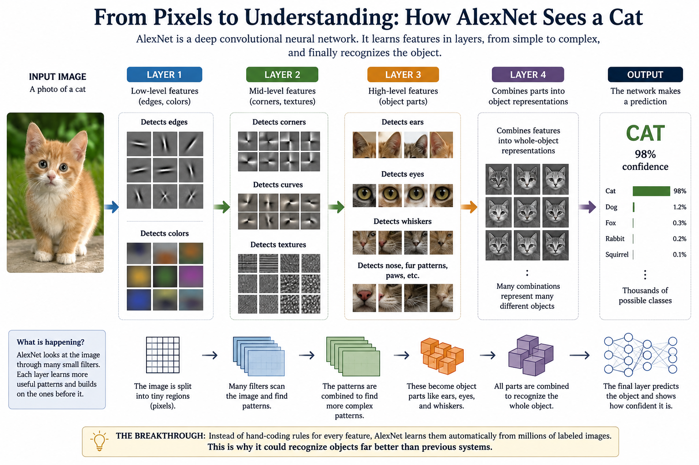
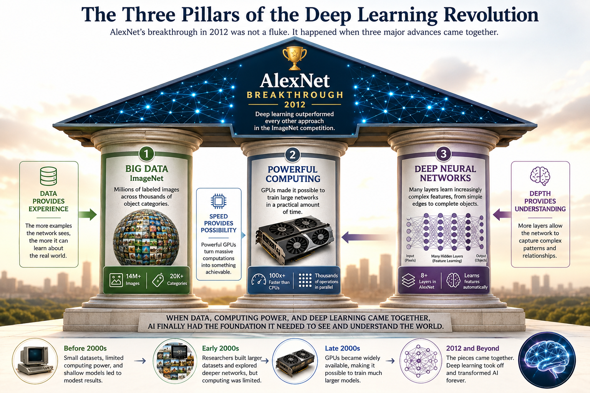

# Chapter 12 -- ImageNet: The Dataset That Changed Everything

# Opening Story

In the summer of 2012, a group of researchers gathered to watch the results of an annual computer vision competition.

To most people, the event seemed obscure.

There were no cheering crowds.

No television cameras.

No championship trophy held high above someone's head.

Yet what happened there would send shockwaves through the entire technology industry.

The competition challenged computers to do something that humans find almost effortless:

Look at a photograph and identify what was in it.

For years, researchers had entered increasingly sophisticated systems into the contest. Progress was steady but slow. Computers were improving, but they still made mistakes far too often.

Then a team of researchers unveiled a new system.

The model was called AlexNet.

When the results appeared, many experts were stunned.

AlexNet didn't just win.

It crushed the competition.

Its error rate was dramatically lower than every other entry.

The improvement was so large that it looked less like an incremental advance and more like a leap into the future.

Researchers immediately realized they were witnessing something important.

The methods behind AlexNet would soon spread throughout the AI community.

Within a few years, similar techniques would transform image recognition, speech recognition, language translation, medical imaging, self-driving cars, and eventually the AI systems that millions of people use today.

But AlexNet did not emerge from nowhere.

Its success depended on a remarkable project that had begun years earlier.

A project built on a deceptively simple idea:

If computers learn from examples, perhaps they need far more examples than anyone had ever imagined.

To test that idea, researchers created one of the largest collections of labeled images ever assembled.

They called it ImageNet.

And it would help ignite the deep learning revolution.

## Section 1: The Problem AI Could Not Solve

Imagine showing a photograph to a five-year-old child.

*Humans see objects, meaning, and context. Computers see millions of pixel values that must be transformed into understanding through learning.*

The child immediately points and says:

"That's a dog."

No calculations are visible. No rules are consulted. Recognition feels effortless.

Now imagine asking a computer to do the same thing.

For decades, this simple task proved surprisingly difficult.

Humans recognize objects almost instantly. We can identify faces, animals, cars, trees, and buildings even when they appear from different angles, in different lighting conditions, or partially hidden behind other objects.

Computers, however, do not see the world the way we do.

To a computer, a photograph is nothing more than a vast collection of numbers.

Every image is made up of tiny dots called pixels. Each pixel contains numerical values that describe color and brightness. A photograph that humans instantly recognize as a golden retriever running through a park appears to a computer as millions of numerical values arranged in a grid.

The challenge was obvious:

How could a machine learn that one particular arrangement of numbers represented a dog while another represented a bicycle?

Early researchers attempted to solve this problem by manually teaching computers what to look for.

Engineers wrote rules such as:

* Dogs often have four legs.
* Faces usually contain two eyes.
* Cars often have wheels.

This approach seemed reasonable at first, but reality quickly became messy.

What if the dog was sitting down?

What if part of the face was hidden?

What if the car was viewed from the side?

The number of possible situations became overwhelming.

Every new rule required additional rules to handle exceptions.

The problem wasn't that computers were too slow. The problem was that the world was far too complicated.

Researchers eventually realized something important:

Instead of programming every rule by hand, perhaps computers should learn from examples—just as humans do.

This idea would lead to one of the most influential projects in the history of artificial intelligence.

That project was called ImageNet.

And it would help trigger the deep learning revolution that transformed AI from a scientific curiosity into one of the most important technologies of the modern era.

## Section 2: Building a Library of the Visual World

If computers were going to learn from examples, they needed something to learn from.

That sounds obvious today.

But in the early 2000s, one of the biggest obstacles in artificial intelligence was not computing power. It was data.

Researchers had developed increasingly sophisticated learning algorithms, but they lacked the enormous collections of examples required to train them effectively.

Imagine trying to teach a child what a dog looks like.

You would not show only one photograph.

You might show hundreds.

Large dogs. Small dogs.

Dogs running, sleeping, barking, swimming, and playing.

Over time, the child would begin to understand the underlying concept of "dog."

Researchers realized that machines might need the same kind of education.

The challenge was scale.

Teaching a computer to recognize a few hundred objects was difficult enough. Teaching it to recognize thousands of different objects seemed almost impossible.

Someone would need to collect millions of images and accurately label what appeared in each one.

At the time, many experts considered the task unrealistic.

The internet contained vast numbers of photographs, but they were unorganized and unlabeled. A computer could not learn much from an image if it did not know what the image contained.

Building such a collection would require an enormous amount of human effort.

Yet a small group of researchers believed it could be done.

Their vision was ambitious:

Create a massive visual library containing photographs of nearly everything people encounter in everyday life.

Dogs.

Cats.

Cars.

Airplanes.

Trees.

Buildings.

Food.

Furniture.

Thousands upon thousands of categories, each represented by countless examples.

The goal was not merely to create a larger dataset.

The goal was to create a map of the visual world.

If successful, researchers would finally have enough examples to teach computers how to recognize objects the way humans do—through exposure, repetition, and experience.

The project became known as ImageNet.

Over the next several years, millions of images would be gathered, organized, and labeled.

The result would become one of the most important resources in the history of artificial intelligence.

ImageNet was more than a dataset.

It was the foundation upon which the modern era of computer vision would be built.

## Section 3: The Woman Who Changed AI

Every great breakthrough has a story.

And every great story has people behind it.

The story of ImageNet begins with a researcher who believed artificial intelligence was missing something essential.

Her name was Fei-Fei Li.

In the early 2000s, many AI researchers focused on developing better algorithms. They created increasingly sophisticated methods for teaching computers how to learn.

But Fei-Fei Li saw a different problem.

The algorithms were improving.

The computers were becoming faster.

Yet the machines still lacked experience.

Imagine trying to teach a child about the world while showing only a few dozen photographs.

The child would struggle to learn.

Not because the child's brain was inadequate, but because there were not enough examples.

Fei-Fei Li believed computers faced the same challenge.

Researchers were asking machines to recognize thousands of objects while providing only limited training data.

The machines simply had not seen enough of the world.

Many experts at the time focused on building smarter algorithms.

Fei-Fei Li focused on building better experiences.

Her idea was surprisingly simple:

Give computers access to millions of images.

Let them see dogs from every angle.

Cars in different colors.

Trees in different seasons.

Buildings in different countries.

Just as children learn through repeated exposure, perhaps machines could learn through massive amounts of visual experience.

The idea sounded straightforward.

The reality was anything but.

Collecting millions of photographs was difficult.

Organizing them was difficult.

Accurately labeling them was even harder.

Many researchers doubted the project could ever be completed.

The task seemed too large.

Too expensive.

Too time-consuming.

But Fei-Fei Li remained convinced that the effort was worthwhile.

For years, she and her team worked to gather, organize, and label images on an unprecedented scale.

Thousands of object categories were created.

Millions of photographs were reviewed.

Countless hours of human effort were invested.

Slowly, the dataset began to grow.

What emerged was unlike anything AI researchers had ever seen before.

ImageNet eventually contained millions of labeled images organized into thousands of categories.

For the first time, researchers had access to a visual training library large enough to teach machines about the real world.

At the time, few people realized how important this achievement would become.

ImageNet looked like a dataset.

In reality, it was laying the foundation for a revolution.

The breakthrough that would transform artificial intelligence was no longer limited by ideas.

It finally had the data it needed.

## Section 4: AlexNet Changes Everything

By 2012, ImageNet had grown into one of the largest visual datasets ever created.

Researchers now had millions of labeled images.

The question was no longer whether enough data existed.

The question was whether anyone could build a system capable of learning from it.

That year, researchers from the University of Toronto entered the annual ImageNet competition.

The competition challenged AI systems to identify objects in photographs.

Thousands of categories were involved.

The task was difficult.

Computers still made mistakes far more often than humans.

Most experts expected gradual progress, just as they had seen in previous years.

Instead, they witnessed a shock.

The Toronto team submitted a deep neural network called AlexNet.

The system was created by graduate student Alex Krizhevsky, working with researchers Ilya Sutskever and Geoffrey Hinton.

AlexNet was different from most previous computer vision systems.

Rather than relying heavily on hand-crafted rules designed by human engineers, it learned directly from enormous amounts of data.

The network contained multiple layers that gradually learned increasingly complex features.

At the lowest levels, it learned to recognize simple patterns such as edges and colors.

Higher layers learned shapes and textures.

Still higher layers learned more complex concepts such as faces, wheels, fur, and other recognizable object parts.

*AlexNet learned features automatically. Early layers detected simple patterns such as edges and colors. Later layers combined those patterns into object parts and eventually recognized entire objects. This ability to learn features from data was one of the key reasons for its success.*

For years, researchers had hoped deep neural networks could work this way.

AlexNet provided the proof.

When the competition results were announced, the AI community was stunned.

AlexNet did not win by a small margin.

It achieved a dramatically lower error rate than every competing system.

The improvement was so large that many researchers immediately recognized they were witnessing a turning point.

This was not merely a better entry.

It was evidence that deep learning could outperform traditional approaches when given enough data and enough computing power.

Suddenly, ideas that had existed for decades began to look practical.

Researchers around the world took notice.

Companies took notice.

Investors took notice.

The victory demonstrated something profound:

The combination of large datasets, powerful computers, and deep neural networks could solve problems that had seemed impossible only a few years earlier.

Within a short time, research labs across the world began adopting similar techniques.

Computer vision improved rapidly.

Speech recognition improved.

Language translation improved.

Many of the AI breakthroughs that followed can trace part of their success back to that moment in 2012.

The deep learning revolution had arrived.

And AlexNet was its announcement to the world.

## Section 5: Why Deep Learning Suddenly Worked

When people look back at the success of AlexNet, it is tempting to imagine a single breakthrough that changed everything overnight.

Reality was more complicated.

AlexNet succeeded because several important developments finally came together at the same time.

For decades, researchers had experimented with neural networks.

The basic ideas already existed.

Researchers understood artificial neurons.

They understood multilayer networks.

They even understood backpropagation, the technique that allows networks to learn from mistakes.

Yet those ideas had often produced disappointing results.

The problem was not that the ideas were wrong.

The problem was that the world was not ready for them.

Imagine trying to train an Olympic athlete without enough food, inadequate equipment, and only a few minutes of practice each day.

Even the most talented athlete would struggle.

Early neural networks faced a similar challenge.

They lacked three things that modern AI systems now take for granted:

Large amounts of data.

Powerful computing hardware.

Sufficiently large neural networks.

By 2012, all three pieces were finally available.

First, there was ImageNet.

For the first time, researchers had access to millions of labeled images covering thousands of categories.

Neural networks could finally learn from enough examples to recognize patterns that had previously remained hidden.

Second, there were graphics processing units, or GPUs.

Originally designed for video games, GPUs could perform many calculations simultaneously.

This made them dramatically faster than traditional processors for training neural networks.

Tasks that once required weeks or months could now be completed in days.

Third, researchers were building deeper networks.

*Deep learning succeeded when three factors aligned at the right time: large-scale data (ImageNet), powerful computing (GPUs), and deep neural networks. Together, they enabled systems like AlexNet to outperform all previous approaches.*

Instead of using only a few layers, systems such as AlexNet used many layers that could learn increasingly complex features.

Each layer built upon the knowledge learned by the layer before it.

The combination proved powerful.

Data provided experience.

GPUs provided speed.

Deep networks provided learning capacity.

Individually, none of these advances would have been enough.

Together, they created a breakthrough.

The success of AlexNet revealed an important lesson that continues to shape AI today:

Sometimes progress does not come from a single discovery.

Sometimes progress occurs when several technologies mature at the same moment and begin reinforcing one another.

The deep learning revolution was not the result of one invention.

It was the result of many pieces finally fitting together.

Once they did, artificial intelligence began advancing at a pace few people had anticipated.

The effects would soon spread far beyond image recognition.

They would transform nearly every area of AI.

## Section 6: The Legacy of ImageNet

Some moments in history are only recognized as important after they have already changed everything.

ImageNet was one of those moments.

At first, it looked like just another research dataset.

A large collection of labeled images.

A useful resource for computer vision experiments.

Nothing more.

But its true impact only became clear over time.

Before ImageNet, artificial intelligence was fragmented.

Researchers worked on separate problems with limited data, limited computing power, and limited results.

Progress existed, but it was slow and inconsistent.

After ImageNet, everything began to change.

Suddenly, researchers had a shared foundation.

A common benchmark.

A massive, structured source of visual experience that allowed models to be trained and compared fairly.

This shared resource transformed the entire field.

Ideas that once struggled in small experiments began to scale.

Neural networks grew deeper.

Training methods improved.

Performance on real-world tasks accelerated rapidly.

Image recognition systems became more accurate.

Speech systems became more reliable.

Language systems began to improve in ways that would have been difficult to imagine only a decade earlier.

The effect of ImageNet was not limited to academic research.

It spread into industry.

It shaped products used by millions of people every day.

Photo search.

Face recognition.

Medical imaging systems.

Autonomous driving.

The modern AI ecosystem quietly built itself on top of ideas that were validated through ImageNet.

Perhaps most importantly, ImageNet changed how researchers thought about artificial intelligence itself.

It shifted the field from asking:

“How do we manually design intelligence?”

to a new question:

“How do we build systems that learn from the world at scale?”

That shift in thinking is one of the most important transitions in the history of technology.

Today, large-scale datasets, deep neural networks, and powerful computing systems are the foundation of nearly all modern AI systems.

But that foundation did not appear suddenly.

It was built step by step.

And ImageNet was the moment those steps finally aligned.

A dataset became a turning point.

A benchmark became a revolution.

And artificial intelligence moved from possibility to reality.

## Insight Box — Chapter 12: The Edge of Intelligent Action

Intelligence reveals its deepest character not in thought, but in action under consequence. A system may model the world with precision, yet it is only when it must act—when outcomes become irreversible—that understanding is tested.

In this chapter, learning is no longer passive accumulation. It becomes engagement with uncertainty: a continual negotiation between intention and result. The system does not merely represent reality; it collides with it, adapts to it, and is reshaped by it.

From this interaction emerges a subtle philosophical shift. Intelligence is no longer a static property embedded in parameters or rules. It becomes a trajectory—something unfolding over time through repeated encounters with feedback. What matters is not what the system is at a moment, but what it is becoming through its history of choices.

Within this dynamic lies a quiet tension: freedom versus constraint. The system is free to explore, yet every freedom is bounded by consequence. It seeks novelty, yet must remain anchored to value. It experiments, yet is judged by accumulation of outcomes it cannot undo. Intelligence, in this sense, is not liberation from structure, but skillful movement within it.

As these systems mature, a further ambiguity appears. The line between designed behavior and emergent preference begins to blur. What looks like intention may simply be the geometry of reward shaped over time. Yet the results are indistinguishable from deliberation, raising a deeper question about authorship in adaptive systems.

Ultimately, the significance of intelligent action is not that machines begin to “decide,” but that decision itself is reframed as a process—distributed, evolving, and inseparable from environment. Meaning is no longer assigned in advance; it is negotiated step by step through interaction.

The frontier, then, is not merely smarter systems. It is systems whose behavior is continuously authored by the world they inhabit.

## Final Thoughts — Chapter 12

Intelligence, when stripped of abstraction, is not a monument of certainty but a process of continual adjustment. It exists less as a thing a system has, and more as something it is doing—moment by moment, in response to a world that never stays still.

Across this chapter, action becomes the defining lens. To act is to commit under uncertainty, to accept that understanding is always partial, and to allow outcomes to reshape the internal model of reality. In that sense, intelligence is not validated by correctness alone, but by resilience under consequence.

What emerges is a quieter, more unsettling idea: intelligent systems do not stand outside their environment as observers. They are embedded within it, entangled with it, and partially defined by it. Every decision is both expression and adaptation, both cause and effect.

This blurs the boundary between control and participation. A system that learns through interaction is never fully authored in advance. Its future behavior is co-written by structure, data, and experience. Even the notion of “optimality” becomes fluid—dependent on what the system has seen, and what it has been allowed to value.

Yet there is no contradiction here, only a reframing. Intelligence was never about final answers. It has always been about staying coherent while the ground shifts beneath it.

The real question moving forward is not whether such systems can act intelligently, but how far that intelligence can extend before it begins to reshape the very environments that define it.
