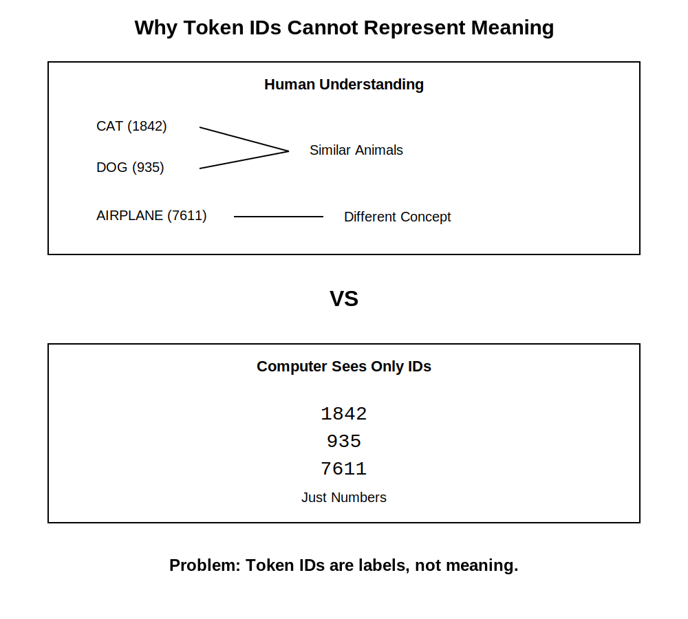
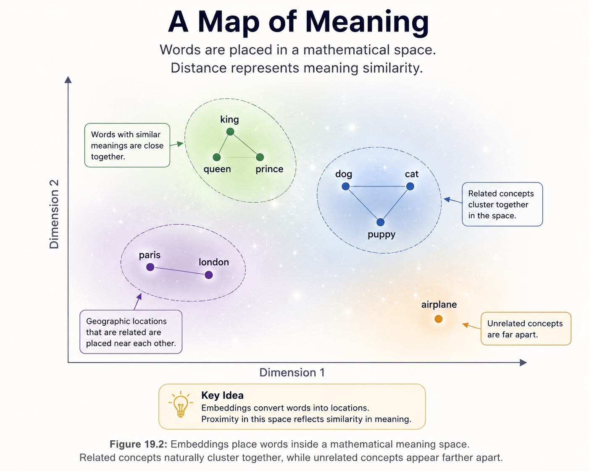
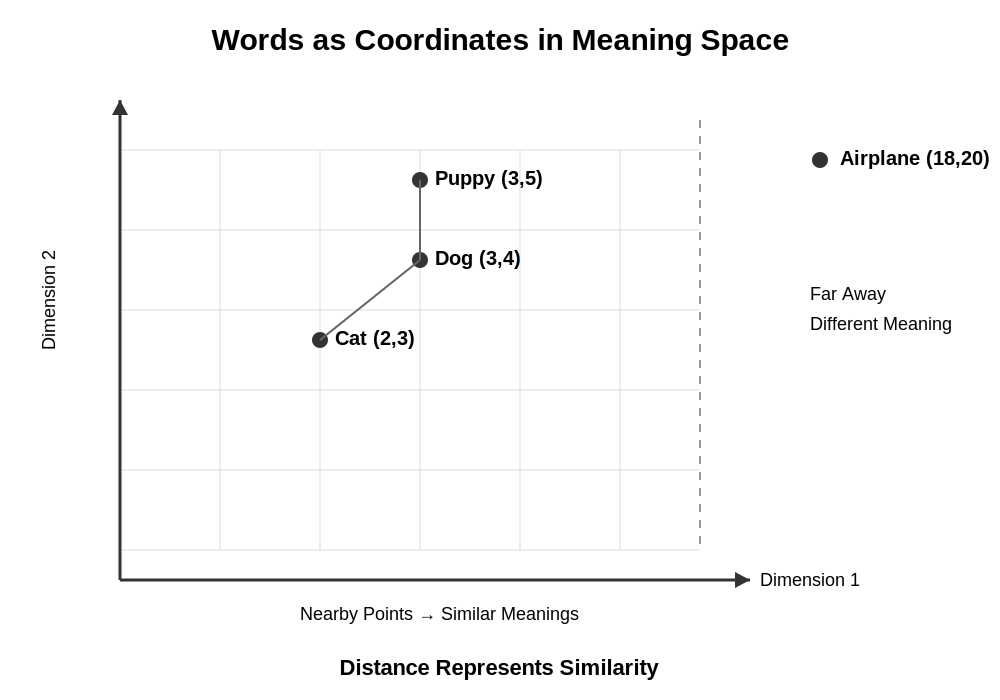
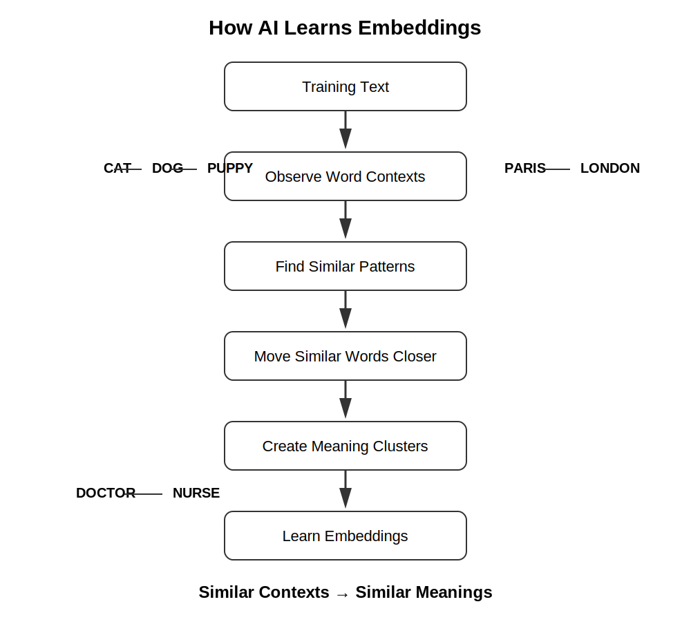
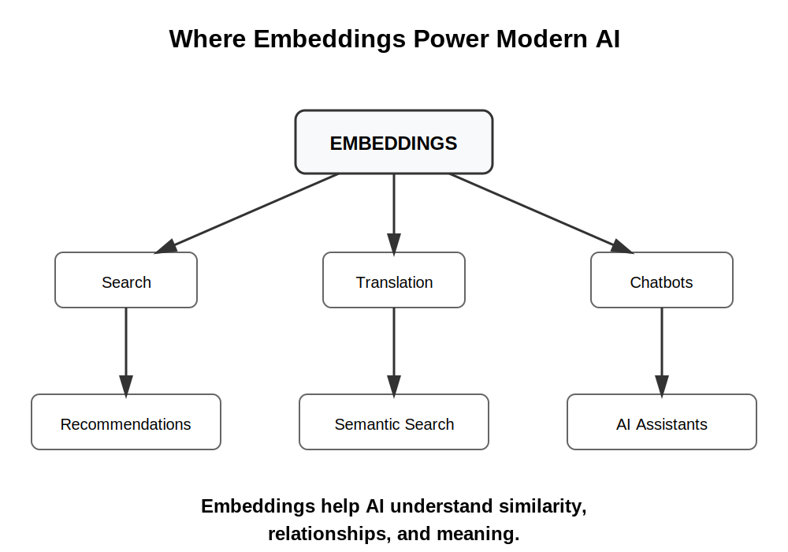

# Chapter 19 -- Embeddings


## Opening Story

Imagine you are visiting a country where you do not speak the language.

You walk into a grocery store looking for milk.

The word on the carton means nothing to you. The letters are unfamiliar. The sounds are unfamiliar. You cannot read a single label.

Yet somehow, after looking around for a few moments, you find what you need.

How?

You notice that the carton is sitting next to yogurt, cheese, and butter.

Nearby are refrigerators filled with other dairy products.

Even though you cannot understand the words, the surrounding context tells you what the item probably is.

Humans do this naturally.

We often understand the meaning of something not because of the word itself, but because of the things around it.

A child's toy belongs near other toys.

A doctor's office belongs near hospitals and clinics.

A fork belongs near spoons and knives.

Meaning emerges from relationships.

Now consider a challenge faced by artificial intelligence.

In the previous chapter, we learned that language is broken into tokens and converted into numerical IDs.

To a computer, the words "cat," "dog," and "airplane" might simply become numbers such as 1842, 935, and 7611.

But there is a problem.

Those numbers contain no meaning.

The number assigned to "cat" does not reveal that cats are animals.

It does not reveal that cats and dogs are related.

It does not reveal that cats are far more similar to dogs than they are to airplanes.

For AI to truly work with language, it needs a way to represent meaning, not just labels.

Researchers eventually discovered a remarkable solution.

Instead of assigning each word a meaningless ID, they could place words inside a mathematical space where similar concepts appear close together and different concepts appear farther apart.

In this space, cats naturally end up near dogs.

Paris ends up near London.

Lawyers end up near judges.

The relationships between ideas become visible.

These special representations are called **embeddings**, and they are one of the most important breakthroughs in modern artificial intelligence.

In this chapter, we will explore how AI transforms words into locations inside a vast mathematical landscape of meaning—and why this simple idea changed the future of language models forever.


## Section 1: The Problem with Token IDs

In the previous chapter, we learned that AI systems convert language into tokens.

A sentence such as:

> The cat sat on the mat.

might be broken into individual tokens and assigned numerical IDs such as:

| Token | ID   |
| ----- | ---- |
| The   | 125  |
| cat   | 1842 |
| sat   | 931  |
| on    | 54   |
| the   | 125  |
| mat   | 2764 |

To a computer, these IDs make language easier to process because computers work with numbers rather than words.

At first, this seems like a complete solution.

The AI now has a numerical representation of every word.

So what is the problem?

The problem is that the numbers themselves have no meaning.

Imagine assigning employee numbers inside a company.

Employee #1007 might be an accountant.

Employee #1008 might be a software engineer.

Employee #1009 might be the CEO.

Looking only at the numbers, you cannot tell anything about the people.

The numbers are simply labels.

Token IDs work the same way.

Suppose an AI vocabulary contains these IDs:

| Word     | Token ID |
| -------- | -------- |
| Cat      | 1842     |
| Dog      | 935      |
| Airplane | 7611     |

A human instantly recognizes that cats and dogs are similar.

Both are animals.

Both are pets.

Both share many characteristics.

An airplane, on the other hand, belongs to an entirely different category.

But the token IDs reveal none of that information.

To the computer:

* 1842 is just a number.
* 935 is just a number.
* 7611 is just a number.

Nothing in those values indicates that "cat" and "dog" are related.

Nothing suggests that "airplane" is different.

The numbers are arbitrary labels chosen by the tokenizer.



This creates a major challenge.

If AI only sees token IDs, how can it understand that:

* King and queen are related?
* Paris and London are both cities?
* Lawyer and judge often appear in similar contexts?
* Happy and joyful have similar meanings?

Clearly, AI needs something more powerful than token IDs.

It needs a way to represent meaning itself.

That challenge led researchers to one of the most important ideas in modern artificial intelligence: embeddings.

Embeddings transform words from simple labels into meaningful mathematical representations, allowing AI systems to recognize relationships between concepts.

Without embeddings, modern language models would never have achieved the remarkable capabilities we see today.


## Section 2: From Labels to Meaning

If token IDs are merely labels, how can an AI system understand relationships between words?

Researchers faced this exact problem for decades.

Computers could store words, look them up, and manipulate them according to rules, but they still lacked a way to represent meaning.

Then a powerful idea emerged.

What if words could be represented not as labels, but as locations?

Imagine a large map of a city.

Every building occupies a position.

Buildings that serve similar purposes often appear near one another.

Restaurants cluster with restaurants.

Schools cluster with schools.

Hospitals are usually found near other medical facilities.

The location itself carries information.

If you know where a building sits on the map, you can often infer something about its purpose.

Researchers realized that words could be represented in a similar way.

Instead of assigning each word a meaningless token ID, they could assign each word a location inside a mathematical space.

Words with similar meanings would be placed close together.

Words with very different meanings would be placed farther apart.



*Figure 19.2: Embeddings place words inside a mathematical meaning space. Related concepts naturally cluster together, while unrelated concepts appear farther apart.*

For example, a simplified meaning map might look something like this:

* Cat is close to dog.
* Dog is close to puppy.
* King is close to queen.
* Paris is close to London.
* Airplane is far from cat.

The exact positions are determined mathematically, but the principle is simple:

**similar meanings lead to nearby locations.**

This was a revolutionary breakthrough.

For the first time, computers could work with language in a way that reflected relationships between concepts.

Instead of seeing only isolated labels, AI systems could begin to recognize patterns of meaning.

A word was no longer just a number.

It became a point in a mathematical landscape.

This new representation is called an **embedding**.

An embedding is a collection of numbers that captures the meaning of a word, phrase, or concept by describing its location within a larger meaning space.

You can think of embeddings as the GPS coordinates of language.

Just as geographic coordinates tell us where a city exists on a map, embeddings tell AI where a concept exists within a map of meaning.

That simple idea became one of the foundations of modern artificial intelligence.

Without embeddings, systems such as ChatGPT would have no practical way to recognize that cats are more similar to dogs than to airplanes, or that lawyers and judges frequently appear in related contexts.

Embeddings transformed language from a collection of labels into a network of relationships—and that changed everything.


## Section 3: Embeddings as Coordinates

The idea of a meaning space sounds simple enough.

Words that are similar are placed near one another.

Words that are different are placed farther apart.

But how does a computer actually represent these locations?

The answer is surprisingly straightforward.

Every word is assigned a set of numbers that acts like coordinates.

If you have ever used a GPS, you have already encountered a similar concept.

A GPS location might be represented by a latitude and longitude:

```text
34.0522, -118.2437
```

Those numbers tell us where Los Angeles is located on Earth.

Embeddings work in much the same way.

Instead of describing a location on a physical map, they describe a location inside a mathematical meaning space.

For example, imagine a simplified embedding represented by just two numbers:

| Word     | Coordinate |
| -------- | ---------- |
| Cat      | (2, 3)     |
| Dog      | (3, 4)     |
| Puppy    | (3, 5)     |
| Airplane | (18, 20)   |

These numbers are not chosen by humans.

They are learned automatically during training.

The important observation is that related concepts receive coordinates that place them close together.



*Figure 19.3: Embeddings can be viewed as coordinates in a mathematical space. Concepts with similar meanings appear close together, while unrelated concepts are farther apart.*

In our example:

* Cat is near dog.
* Dog is near puppy.
* Airplane is much farther away.

As a result, an AI system can estimate similarity simply by measuring distance.

The closer two words are, the more related they are likely to be.

The farther apart they are, the less related they tend to be.

Of course, real embeddings are far more complex.

Instead of two numbers, modern AI systems often use hundreds or even thousands of numbers to represent a single word.

A word might be represented by a list such as:

```text
[0.12, -0.84, 0.33, 1.02, ...]
```

To a human, such a list appears meaningless.

But together, these numbers define a precise location within a high-dimensional mathematical space.

You can think of it like a hidden map that humans cannot easily visualize.

Even though we cannot see all of the dimensions, the AI can still calculate distances, identify clusters, and recognize relationships between concepts.

This idea is one of the most important breakthroughs in modern artificial intelligence.

Words are no longer treated as isolated symbols.

Instead, they become points inside a mathematical universe where meaning is represented by position.

That transformation allows AI systems to move beyond simple word matching and begin working with relationships, context, and similarity.

In many ways, embeddings are the first step toward giving machines a practical representation of meaning.


## Section 4: How AI Learns Embeddings

At this point, you might be wondering something important:

How does AI know where to place words in a meaning space?

After all, nobody manually tells the system that cats should be near dogs or that Paris should be near London.

The answer is that embeddings are learned automatically from data.

The process begins with a simple observation about language:



*Figure 19.4: AI learns embeddings by observing how words appear in context. Concepts that occur in similar situations gradually move closer together in the meaning space.*

Words that appear in similar contexts often have similar meanings.

Consider these two sentences:

> The cat chased the mouse.

> The dog chased the ball.

Although the words "cat" and "dog" are different, they appear in similar environments.

Both can be the subject of a sentence.

Both can perform actions.

Both are animals.

Over millions or billions of examples, patterns like these begin to emerge.

Researchers realized that if a computer analyzes enough text, it can discover these relationships on its own.

The system repeatedly observes which words tend to appear near one another and which words tend to appear in similar situations.

Gradually, it adjusts the embeddings so that related words move closer together in the meaning space.

You can imagine the process as a giant self-organizing map.

At the beginning of training, words are scattered randomly.

Nothing is in the correct place.

The word "cat" might be far away from "dog."

"Doctor" might be nowhere near "nurse."

"Paris" might have no connection to "London."

As the AI reads more and more text, it starts detecting patterns.

Words that frequently occur in similar contexts are gradually pulled together.

Words that rarely appear in related situations drift farther apart.

Over time, meaningful clusters begin to form.

Animals gather near other animals.

Cities gather near other cities.

Countries gather near other countries.

Professions gather near related professions.

Without being explicitly taught, the AI begins constructing a map of human knowledge.

This is one of the most remarkable aspects of modern machine learning.

The AI is not memorizing dictionary definitions.

Instead, it is discovering relationships by observing how language is used in the real world.

Researchers often summarize this idea with a simple phrase:

> You shall know a word by the company it keeps.

In other words, meaning can often be inferred from context.

The more often two concepts appear in similar surroundings, the more likely they are to have related meanings.

This principle lies at the heart of modern embeddings.

By learning from patterns in language, AI systems can build rich representations of meaning without anyone manually encoding every relationship.

The result is a mathematical map where concepts naturally organize themselves according to how humans use language.

That map becomes one of the key building blocks of modern language models.


## Section 5: Why Embeddings Changed Everything

At first glance, embeddings might seem like just another technical trick.

After all, we have simply replaced word labels with lists of numbers.

But this change is far more powerful than it appears.

Embeddings fundamentally changed how machines understand language.

Before embeddings, computers could only compare words as exact symbols.

If two words were not identical, the system treated them as completely unrelated.

For example:

* “car” and “automobile” would be treated as different words.
* “doctor” and “physician” would be unrelated.
* “happy” and “joyful” would not be connected.

This made language extremely rigid.

Computers were precise, but not flexible.

Embeddings changed this by introducing *similarity*.

Now words are no longer isolated symbols.

They are points in a meaning space, and distance between points matters.

This allows AI systems to do something remarkable:

They can generalize.

If the model learns something about “doctor,” it can apply that knowledge to “physician.”

If it understands “cat,” it can make reasonable inferences about “dog.”

If it sees “Paris,” it can relate it to “London” or “Rome.”

This ability to transfer meaning across similar concepts is one of the key reasons modern AI feels intelligent.

It is not because the model truly “understands” in a human sense.

It is because it can recognize patterns in the structure of meaning.

Embeddings also solve another critical problem: scale.

Human language contains hundreds of thousands of words, plus endless variations, slang, and new expressions.

It would be impossible to manually define relationships between all of them.

Embeddings solve this automatically by learning structure from data.

Instead of storing rigid rules, the model stores flexible relationships.

This makes language models far more adaptable and robust.

In modern AI systems, embeddings are used everywhere:



*Figure 19.5: Embeddings are a foundational technology used across modern AI systems, including search, recommendation engines, translation tools, and conversational assistants.*

* In search engines to match queries with relevant results
* In recommendation systems to suggest similar content
* In translation systems to align meanings across languages
* In chat models to understand context and intent

In many ways, embeddings are the invisible backbone of modern artificial intelligence.

They are what allow machines to move beyond words as labels and begin working with meaning as structure.

Without embeddings, systems like ChatGPT would be limited to shallow pattern matching.

With embeddings, they can operate in a rich landscape of relationships where meaning becomes measurable, comparable, and usable.

That is why embeddings are not just a technical detail.

They are one of the foundational ideas that made modern AI possible.


## Insight Box: The Hidden Map Inside AI

One of the most surprising discoveries in artificial intelligence is that meaning can emerge from patterns alone.

Nobody explicitly teaches an AI that cats are similar to dogs, that Paris and London are both cities, or that lawyers and judges often work in related domains.

Instead, the AI learns these relationships by observing how words appear in real language.

Over time, words that occur in similar contexts naturally move closer together in the embedding space.

The result is a hidden map of meaning.

On this map:

* Similar concepts cluster together.
* Related ideas appear nearby.
* Unrelated concepts drift farther apart.

This is why embeddings are often considered one of the most important breakthroughs in modern AI.

They transformed language from a collection of isolated symbols into a network of relationships.

When ChatGPT recognizes that a "physician" is similar to a "doctor," or that "automobile" is closely related to "car," it is relying on these learned relationships.

The AI is not consulting a dictionary.

It is navigating a mathematical landscape of meaning built from patterns in human language.

That hidden map exists behind nearly every modern AI system, quietly helping machines understand how ideas connect to one another.


## Final Thoughts

In the previous chapter, we learned that computers cannot work directly with words.

Language must first be converted into tokens and then into numbers.

But token IDs alone are not enough.

The number assigned to a word does not contain its meaning, its relationships, or its connection to other ideas.

That limitation led to one of the most important breakthroughs in modern artificial intelligence: embeddings.

In this chapter, we discovered that embeddings transform words from simple labels into locations within a mathematical meaning space.

Instead of treating every word as an isolated symbol, AI systems learn how concepts relate to one another.

Words that appear in similar contexts move closer together.

Words that are unrelated drift farther apart.

The result is a hidden map of meaning that allows machines to work with similarity, context, and relationships.

### The Journey from Words to Meaning

```text
Words
   ↓
Tokens
   ↓
Token IDs
   ↓
Embeddings
   ↓
Meaning Space
```

This transformation is what allows modern AI systems to recognize that:

* cats and dogs are related,
* doctors and nurses often appear in similar contexts,
* and Paris and London share many characteristics as major cities.

The AI does not learn these relationships from a dictionary.

It discovers them by analyzing vast amounts of language and identifying patterns that humans naturally create when they communicate.

### Why This Matters

Embeddings are one of the key technologies that make modern AI possible.

They power:

* search engines,
* recommendation systems,
* translation tools,
* virtual assistants,
* and large language models such as ChatGPT.

Whenever an AI system identifies similar ideas, finds related documents, or understands context, embeddings are often working behind the scenes.

Although users rarely see them, embeddings are among the most important building blocks in the entire AI ecosystem.

### Looking Ahead

Words now have meaning-rich representations.

But meaning alone is not enough.

Modern AI must also learn how to combine concepts, recognize patterns, make decisions, and generate new ideas.

To accomplish that, embeddings are fed into another remarkable invention: the neural network.

In the next chapter, we will explore how neural networks process information, learn patterns, and become the engines that power today's AI systems.

The journey is moving from representations of meaning to the machinery that learns from them.
