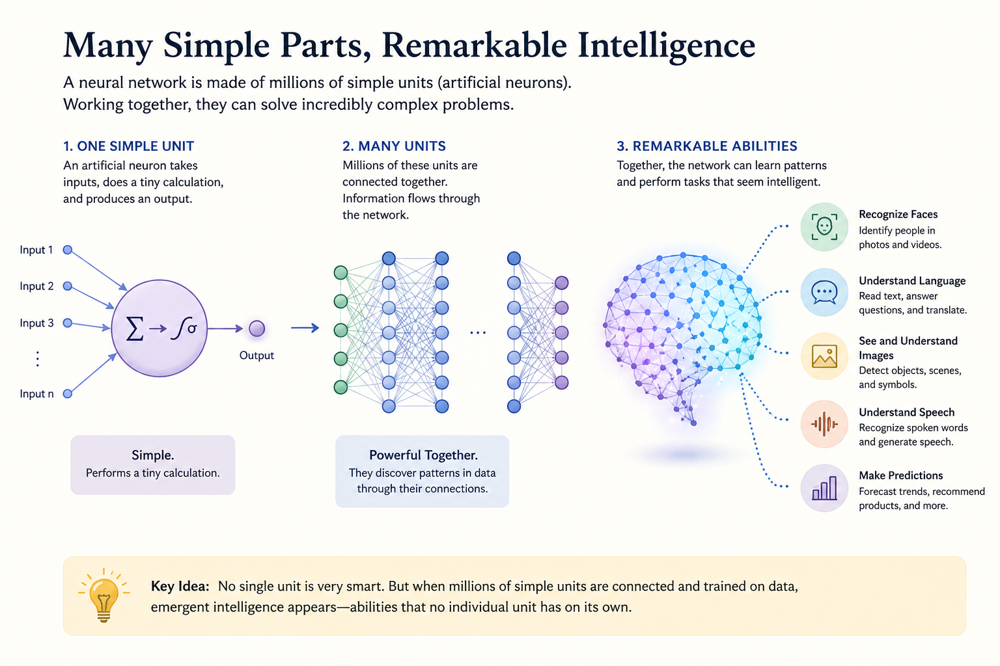
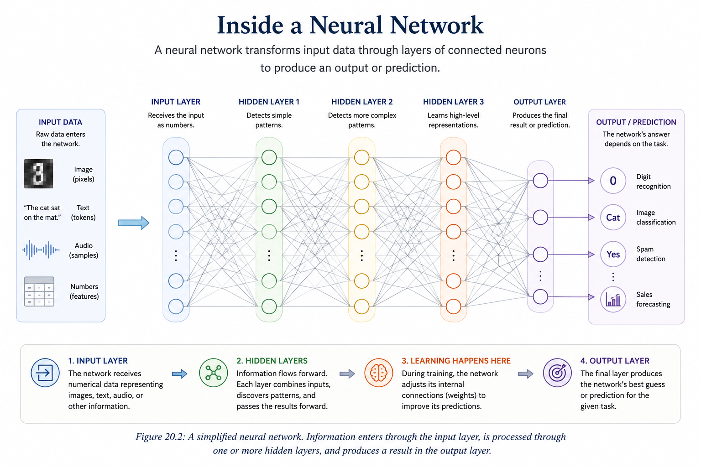
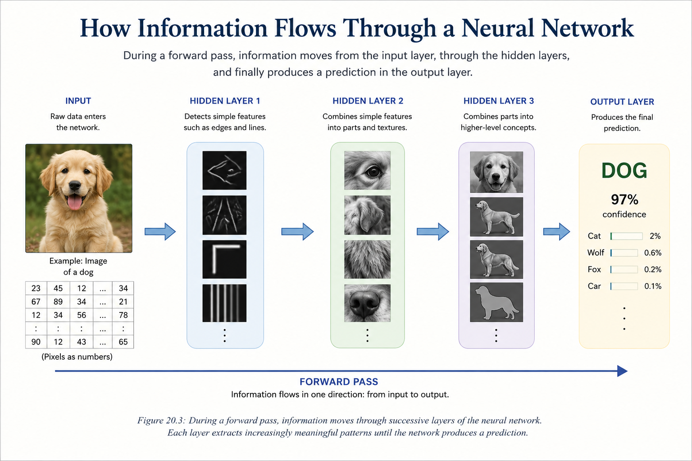

# Chapter 20 -- Neural Networks

## Opening Story: How Do You Recognize a Face?

Imagine you are walking through a crowded airport.

Hundreds of people are moving in every direction. Some are rushing to catch flights. Others are waiting near the gates. Many are complete strangers.

Then, across the crowd, you spot a friend.

You recognize them instantly.

You do not measure the distance between their eyes.

You do not calculate the shape of their nose.

You do not compare thousands of facial features one by one.

Your brain simply knows.

Somehow, a collection of shapes, colors, shadows, and patterns becomes a familiar face.

Now consider how difficult this task is for a computer.

A computer does not naturally understand faces.

It sees only numbers.

A photograph that looks obvious to you is nothing more than millions of tiny numerical values stored in memory. The computer has no built-in concept of eyes, ears, smiles, or people.

Yet today, AI systems can recognize faces, identify objects, understand speech, translate languages, and even generate realistic images.

How?

The answer lies in one of the most important ideas in modern artificial intelligence: the neural network.

Neural networks are the engines that power many of the AI systems we use every day. They help computers discover patterns hidden inside enormous amounts of data. Instead of following rigid instructions written by programmers, neural networks learn from examples.

Show them enough pictures of cats, and they learn what cats look like.

Show them enough examples of handwriting, and they learn to read handwritten text.

Show them enough language, and they learn how words and ideas relate to one another.

In a sense, neural networks allow computers to learn from experience—much like humans do.

The idea was inspired by the human brain, but modern neural networks are far simpler than real biological neurons. Even so, they have become one of the most powerful tools ever created in computer science.

In this chapter, we will explore what neural networks are, how they are structured, and why they became the foundation of the AI revolution. By the end, you will understand how simple mathematical building blocks can work together to perform tasks that once seemed impossible for machines.

# Section 1: What Is a Neural Network?

At first glance, the term *neural network* sounds intimidating.

Many people imagine a highly complex machine filled with advanced mathematics and mysterious algorithms. While modern neural networks can indeed become incredibly sophisticated, the core idea is surprisingly simple.

A neural network is a system designed to learn patterns from data.

That's it.

Instead of being programmed with a long list of rules, a neural network learns by studying examples. It looks for relationships, discovers patterns, and gradually improves its ability to make predictions or decisions.

Think about how a child learns to recognize dogs.

Nobody hands the child a detailed rulebook describing every possible dog. There is no instruction that says:

*"If it has exactly this ear shape, this tail length, and this fur color, then it is a dog."*

Instead, the child sees many examples.

Large dogs.

Small dogs.

Black dogs.

White dogs.

Fluffy dogs.

Short-haired dogs.

Over time, the brain begins to identify common patterns and develops an intuitive understanding of what makes a dog a dog.

Neural networks learn in a similar way.

Rather than receiving explicit rules, they learn from large collections of examples. By studying enough data, they gradually discover which patterns are important and which are not.

For example, a neural network might be trained to:

* Recognize faces in photographs
* Identify spam emails
* Understand spoken language
* Translate between languages
* Predict medical conditions
* Recommend movies or products
* Generate text, images, and computer code

In every case, the underlying principle remains the same.

The network learns from examples.

The term *neural network* comes from the fact that these systems were loosely inspired by the human brain. Researchers observed that biological brains consist of billions of interconnected neurons that communicate with one another. They wondered whether a simplified version of that idea could be recreated inside a computer.

The result was the artificial neural network.

It is important to understand that modern neural networks are not miniature digital brains. They do not think, feel, or possess consciousness. The resemblance to biology is only an inspiration.

An artificial neural network is simply a collection of small computational units connected together. Each unit performs a tiny calculation. Individually, these calculations are simple. But when millions or even billions of them work together, remarkable behavior can emerge.

*Figure 20.1: Individual artificial neurons perform simple calculations, but when connected together, they can recognize patterns, understand language, identify objects, and perform tasks that seem remarkably intelligent.*

A useful analogy is a large organization.

A single employee may know only a small piece of information. But when thousands of employees share information and work together, the organization can accomplish tasks that no individual could complete alone.

Neural networks operate in much the same way.

Each artificial neuron performs a small task.

Together, they can recognize speech, identify objects, answer questions, and generate human-like language.

This ability to learn patterns from data is what made neural networks the foundation of modern artificial intelligence.

Nearly every major AI breakthrough of the past decade—from image recognition to ChatGPT—has been built upon neural networks.

To understand modern AI, we must first understand how these networks are organized and how information flows through them.

# Section 2: Inside a Neural Network

Now that we understand the basic idea behind neural networks, let's look inside one.

Although modern neural networks can contain millions or even billions of artificial neurons, their overall structure follows a surprisingly simple design.

Most neural networks are organized into layers.

Information enters through one layer, passes through one or more intermediate layers, and finally reaches an output layer that produces a result.

At a high level, a neural network looks like this:

*Figure 20.2: A simplified neural network. Information enters through the input layer, is processed through one or more hidden layers, and produces a result in the output layer.*

**Input Layer → Hidden Layer(s) → Output Layer**

Each layer has a specific job.

Together, they transform raw data into useful predictions, classifications, or decisions.

## The Input Layer

The input layer is where information first enters the network.

Remember that computers understand everything as numbers.

Whether the original data is a photograph, a sentence, a voice recording, or a medical record, it must first be converted into numerical values.

For example:

* A photograph becomes millions of pixel values.
* A sentence becomes a sequence of token IDs.
* A patient's medical information becomes numerical measurements.
* Financial records become numerical data points.

The input layer simply receives these numbers and passes them into the network.

It does not make decisions or recognize patterns.

Its role is to provide the raw information that the network will analyze.

## The Hidden Layers

The hidden layers are where most of the work happens.

They are called *hidden* because we do not directly observe their calculations. We can see the input and the final output, but the internal processing occurs inside these intermediate layers.

Think of the hidden layers as a team of specialists.

Each specialist examines a different aspect of the data and passes useful information to the next group.

In an image-recognition system, one hidden layer might detect simple edges.

The next layer might combine those edges into shapes.

Another layer might identify eyes, ears, noses, or wheels.

Eventually, higher layers may recognize entire objects such as faces, cars, dogs, or buildings.

Each layer builds upon the work of the previous one.

This gradual transformation allows the network to discover increasingly complex patterns.

## The Output Layer

The output layer produces the network's final answer.

What that answer looks like depends on the task.

For example:

* An email filter might output "Spam" or "Not Spam."
* A medical AI system might output the probability of a disease.
* A language model might predict the next word in a sentence.
* An image classifier might identify an object as a cat, dog, bicycle, or airplane.

The output layer represents the network's best prediction based on everything it has learned.

## A Factory Assembly Line for Information

One way to visualize a neural network is as an assembly line.

Imagine a factory that produces finished cars.

At the beginning of the line, workers receive raw materials.

As those materials move through the factory, different teams perform specialized tasks.

One team builds the frame.

Another installs the engine.

Another adds the electrical system.

Another paints the vehicle.

By the time the product reaches the end of the assembly line, a finished car emerges.

A neural network works in a similar way.

Raw data enters through the input layer.

The hidden layers progressively transform and refine that information.

Finally, the output layer produces a meaningful result.

The remarkable power of neural networks comes not from any single neuron, but from the way thousands, millions, or even billions of neurons cooperate across these layers.

In the next section, we will examine how information actually moves through a neural network and how each neuron contributes to the final decision.

# Section 3: How Information Flows Through a Neural Network

Now that we have seen the structure of a neural network, let's follow a piece of information as it travels through the system.

Imagine taking a photograph of a dog and giving it to a neural network.

To you, it is simply a picture.

To the computer, however, it is a collection of numbers.

Those numbers enter the input layer and begin a journey through the network.

At each step, information is passed from one artificial neuron to another until a final prediction is produced.

This process is known as a **forward pass** because information moves forward through the network from input to output.

*Figure 20.3: During a forward pass, information moves through successive layers of the neural network. Each layer extracts increasingly meaningful patterns until the network produces a prediction.*

## Artificial Neurons

The basic building block of a neural network is the artificial neuron.

An artificial neuron is a small computational unit that receives information, performs a calculation, and passes a result forward.

Think of it as a tiny decision-maker.

Each neuron receives inputs from several neurons in the previous layer.

It examines those inputs and produces an output that becomes part of the next layer's calculations.

Individually, these operations are simple.

Collectively, they allow the network to solve remarkably complex problems.

## Passing Information Forward

Imagine a relay race.

The first runner passes a baton to the second runner.

The second runner passes it to the third.

The process continues until the baton reaches the finish line.

Information moves through a neural network in a similar way.

The input layer passes information to the first hidden layer.

The first hidden layer processes the information and passes its results to the next hidden layer.

This continues until the information reaches the output layer.

At every stage, the network transforms the data slightly.

Each layer extracts new information from the patterns discovered by the previous layer.

## Recognizing a Dog

Suppose the network is analyzing a photograph of a dog.

The earliest hidden layers may detect simple visual features:

* Edges
* Lines
* Curves
* Areas of light and dark

The next layers combine those simple features into larger patterns:

* Fur textures
* Eyes
* Ears
* Legs

Higher layers combine those patterns into more meaningful concepts:

* Animal face
* Animal body
* Four-legged shape

Finally, the output layer may conclude:

**"This image is a dog with 97% confidence."**

Notice that no single neuron understands what a dog is.

Each neuron contributes only a tiny piece of the puzzle.

The final recognition emerges from the combined work of thousands or millions of neurons working together.

## From Simple Signals to Complex Understanding

One of the most remarkable aspects of neural networks is that complex understanding can emerge from many simple calculations.

No individual neuron is especially intelligent.

In fact, a single artificial neuron performs only a basic mathematical operation.

The power comes from cooperation.

As information flows through layer after layer, the network gradually transforms raw numbers into increasingly meaningful representations.

What begins as pixel values can eventually become a recognized face.

What begins as a sequence of tokens can eventually become a coherent paragraph.

What begins as numerical measurements can eventually become a medical prediction.

This transformation—from raw data to meaningful understanding—is what makes neural networks so powerful.

But one important question remains.

How does the network know which signals matter most?

The answer lies in the connections between neurons and the numerical values attached to those connections.

These values are called **weights**, and they are the secret ingredient that allows neural networks to learn.

# Section 4: The Secret of Learning — Connections and Weights

So far, we have seen that information flows through a neural network from one layer to the next.

But an important question remains.

If every neuron simply passes information forward, how does the network learn anything at all?

The answer lies in the connections between neurons.

Not every connection is treated equally.

Some connections are considered more important than others.

The numerical values that represent this importance are called **weights**.

## Why Some Signals Matter More

Imagine you are trying to decide whether to carry an umbrella.

You might consider several pieces of information:

* Dark clouds in the sky
* Weather forecast
* Wind conditions
* Humidity
* Time of year

Not all of these factors influence your decision equally.

A forecast predicting heavy rain probably matters more than a mild breeze.

In your mind, some clues carry more weight than others.

Neural networks work in a similar way.

Each connection between neurons has a numerical value attached to it.

This value determines how strongly one neuron influences another.

A large weight means:

*"This signal is important."*

A small weight means:

*"This signal is less important."*

By adjusting these weights, the network gradually learns which patterns matter most for a particular task.

## Learning What Matters

Consider an AI system trained to recognize dogs.

At the beginning of training, the network knows nothing.

The weights are essentially random.

As the network studies thousands or millions of examples, it begins to discover useful patterns.

Perhaps floppy ears are often associated with dogs.

Perhaps certain fur textures appear frequently.

Perhaps the overall body shape provides an important clue.

The network does not learn these concepts because a programmer explicitly tells it to.

Instead, it gradually adjusts its weights until useful patterns become more influential and less useful patterns become less influential.

Learning, in many ways, is simply the process of finding better weights.

## A Voting Analogy

Imagine a committee making an important decision.

Each member casts a vote.

Some members are experts and their opinions carry greater influence.

Others have less expertise and therefore contribute less to the final decision.

The final outcome depends on the combined influence of all participants.

A neural network behaves similarly.

Each neuron contributes information.

The weights determine how much influence that information has on the next layer.

*Figure 20.4: Not all signals carry equal weight — inputs are combined using weighted influence to produce a final decision.*

The network's final prediction emerges from the combined effect of countless weighted signals.

## The Hidden Knowledge of a Neural Network

When people talk about an AI model being "trained," they are usually referring to its weights.

The network's knowledge is not stored in a list of rules.

It is stored within the enormous collection of weights spread throughout the network.

Modern AI systems may contain millions, billions, or even trillions of these values.

Together, they encode everything the network has learned from its training data.

This is why two neural networks with the same architecture can behave very differently.

If their weights differ, their knowledge differs.

The architecture provides the structure.

The weights provide the learned intelligence.

## Preparing for the Next Chapter

Weights are one of the most important concepts in all of artificial intelligence.

They determine which signals are amplified, which are ignored, and ultimately how the network makes decisions.

In this chapter, we have only introduced the basic idea.

In the next chapter, we will take a deeper look at weights and parameters and explore how neural networks store knowledge inside these numerical values.

## Section 5: Why Neural Networks Became So Important

Neural networks existed for decades, but for much of their history they remained primarily academic concepts. Early computers lacked the processing power needed to train large networks, and the amount of available digital data was limited. As a result, neural networks often struggled to outperform simpler machine-learning methods.

The situation changed dramatically in the early twenty-first century. Three developments came together to unlock the potential of neural networks. First, the rapid growth of the internet, smartphones, and digital services created enormous amounts of data. Second, advances in computing hardware, particularly graphics processing units (GPUs), provided the computational power needed to train increasingly large networks. Third, researchers developed improved learning algorithms that made training deeper and more complex networks practical.

These advances enabled neural networks to tackle problems that had once been considered extremely difficult for computers. Systems could now recognize faces in photographs, understand spoken language, translate between languages, and identify objects in videos with impressive accuracy. In many cases, neural networks achieved performance that rivaled or exceeded earlier approaches.

A key reason for this success is that neural networks learn patterns directly from examples. Traditional software depends on programmers writing detailed instructions that specify exactly how a task should be performed. Neural networks take a different approach. Instead of being given every rule, they discover many of those rules automatically by analyzing large collections of data. This ability allows them to handle complex problems where explicit programming would be difficult or impossible.

Today, neural networks form the foundation of many AI technologies that people use every day. Recommendation systems suggest movies and products, speech-recognition systems convert spoken words into text, and language models generate human-like responses. Although these applications may appear very different on the surface, they all rely on the same underlying principle: networks of interconnected units that learn by adjusting their weights through experience.

Because of their flexibility and learning capability, neural networks have become one of the most important technologies in modern artificial intelligence. Understanding how they work provides insight into the systems that are driving today's AI revolution and shaping the future of countless industries.

**Key Takeaway:** Neural networks became important when abundant data, powerful computers, and improved learning methods finally allowed them to reach their full potential. Their ability to learn patterns from experience now powers many of the most successful AI systems in the world.

### Insight Box: The Power of Connections

A single artificial neuron is a simple decision-making unit. On its own, it can perform only limited tasks. The true power of neural networks emerges when thousands, millions, or even billions of these simple units are connected together.

This idea appears throughout nature. A single ant has limited intelligence, yet an ant colony can solve complex problems. A single neuron in the human brain cannot think, reason, or remember, but billions of interconnected neurons create the intelligence that allows humans to learn, communicate, and innovate.

Neural networks follow a similar principle. Each artificial neuron performs a small calculation, but when many neurons work together, they can recognize faces, understand speech, translate languages, and generate human-like text. Complexity emerges not from the sophistication of individual neurons, but from the vast network of connections between them.

One of the most important lessons in AI is that remarkable capabilities can arise from the interaction of many simple components. Understanding this principle helps explain why neural networks have become the foundation of modern artificial intelligence.

## Final Thoughts

At first glance, neural networks may seem mysterious. Terms such as neurons, layers, weights, and learning algorithms can make the subject appear highly technical. Yet beneath the complexity lies a surprisingly simple idea: a neural network learns by adjusting the strength of its connections based on experience.

This chapter showed how artificial neurons are inspired by biological neurons, how networks are organized into layers, and how learning occurs through the adjustment of weights. Although each individual neuron performs only a simple calculation, large networks of interconnected neurons can produce remarkably sophisticated behavior.

Neural networks have become one of the most important technologies in modern AI because they excel at discovering patterns in data. They can recognize images, understand speech, generate text, and solve problems that are difficult to address using traditional programming techniques. Many of the AI systems that people interact with every day are built upon these principles.

As we continue our journey through artificial intelligence, it is important to remember that neural networks are not intelligent in the human sense. They do not possess understanding, consciousness, or common sense. Instead, they are powerful pattern-recognition systems that learn from examples. Their capabilities arise from mathematics, data, and computation rather than human-like reasoning.

Understanding neural networks provides an essential foundation for understanding modern AI. In the chapters ahead, we will build upon this foundation and explore how increasingly sophisticated AI systems use these ideas to perform tasks that once seemed possible only for humans.

