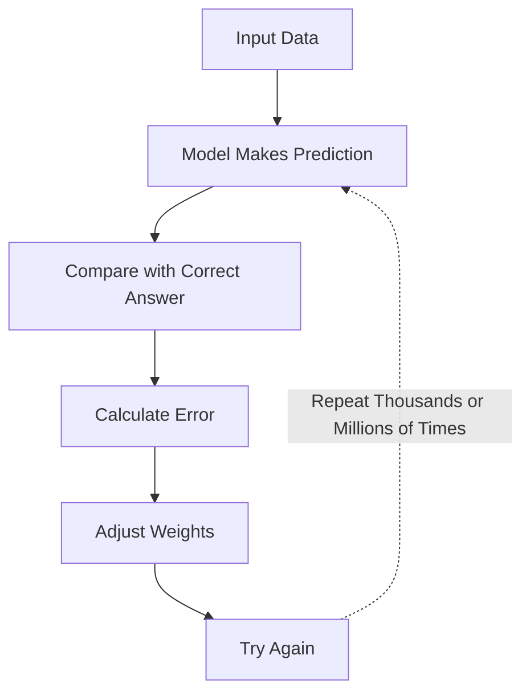
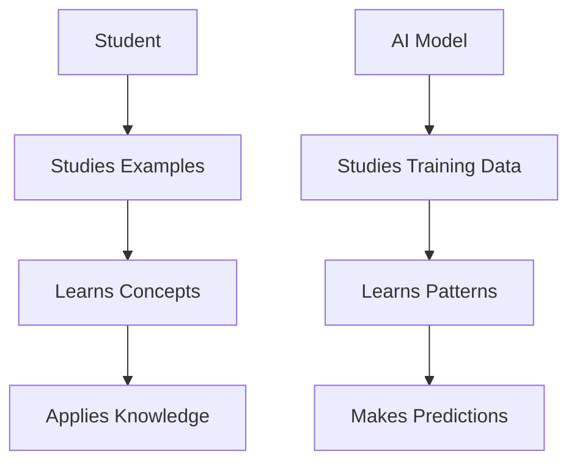
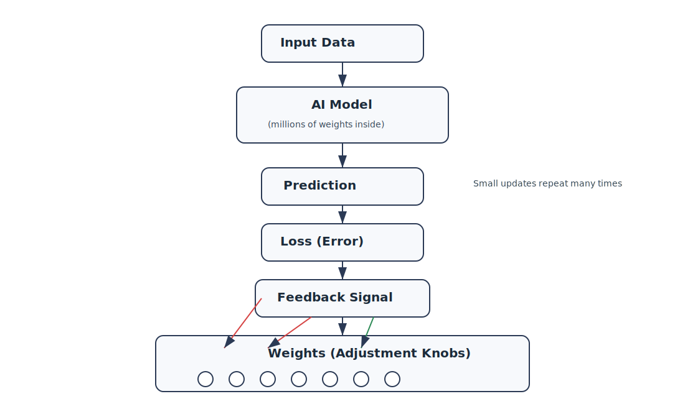
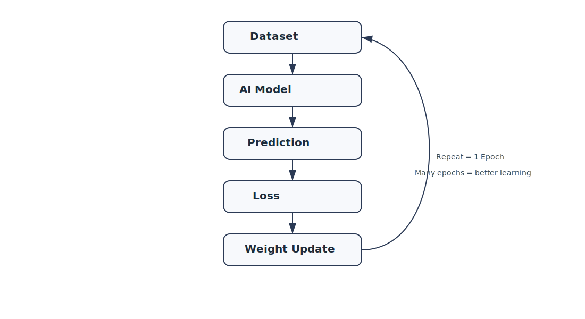
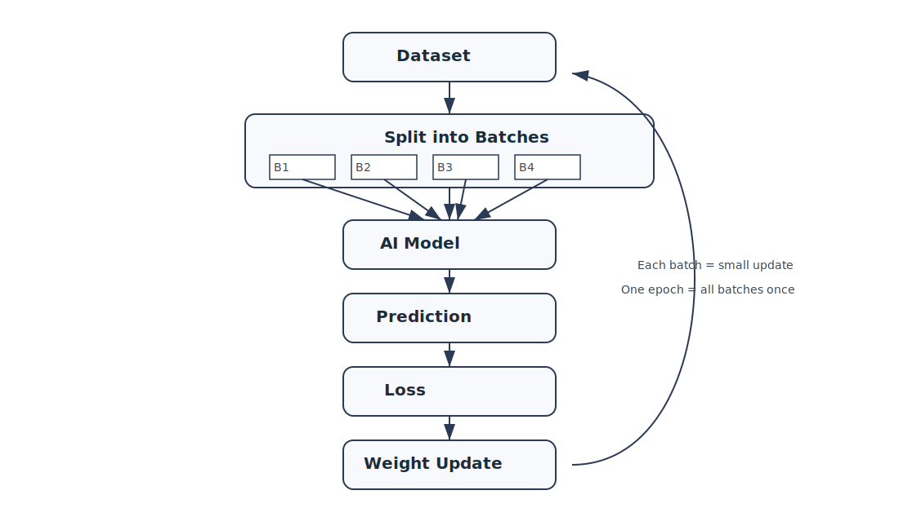
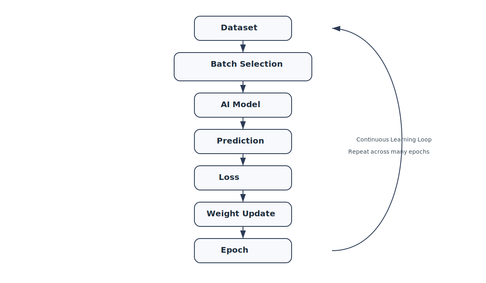

# Chapter 22 -- Training


## Opening Story: Learning to Shoot a Basketball

Imagine a teenager standing alone on a basketball court.

He picks up a basketball, aims at the hoop, and shoots.

The ball misses.

It bounces off the rim and rolls away.

Most people would not be surprised. After all, nobody becomes a great basketball player on their first attempt.

So he tries again.

This time the ball flies too far.

Another miss.

He adjusts his aim and shoots again.

Still wrong.

Again.

Again.

Again.

After dozens of attempts, something interesting begins to happen.

The player starts noticing patterns.

When he throws too hard, the ball overshoots the basket.

When he releases too late, the ball drifts to one side.

Every mistake provides information.

Without realizing it, he is learning.

Each shot gives feedback.

Each miss helps him make a small correction.

Over time, those tiny adjustments accumulate. His movements become more accurate. His timing improves. Eventually, shots that once seemed impossible begin dropping through the hoop with surprising consistency.

Now imagine teaching a computer to recognize a cat in a photograph.

The computer does not understand fur, whiskers, tails, or animals. At first, its guesses are essentially random.

A picture appears.

"Is this a cat?"

The computer guesses.

Usually, it is wrong.

But just like the basketball player, the computer receives feedback.

Wrong.

Adjust.

Try again.

Wrong.

Adjust.

Try again.

Thousands of times.

Millions of times.

Eventually, the computer becomes better and better at recognizing patterns that distinguish cats from everything else.

This process of learning from repeated mistakes is called **training**.

Training is one of the most important ideas in modern AI. It is the process through which a model improves its performance by repeatedly making predictions, measuring its errors, and adjusting itself to do better next time.

In the previous chapter, we learned about weights and parameters—the tiny numerical values that control how a neural network makes decisions.

In this chapter, we will see how those numbers are actually learned.

The secret is surprisingly simple:

**Guess. Measure the error. Adjust. Repeat.**

Everything from image recognition systems to ChatGPT ultimately learns through some version of this cycle.


# Section 1: What Does It Mean to Train an AI?

By now, we have learned that a neural network contains weights and parameters—the numerical values that influence every decision the model makes.

But an important question remains:

**Where do those numbers come from?**

The answer is simple:

**They are learned through training.**

Training is the process of teaching an AI model how to perform a task by showing it examples and allowing it to improve through repeated practice.

Think about how humans learn.

A child learning to read does not memorize every possible sentence. Instead, the child reads many examples and gradually learns patterns in language.

A medical student studies thousands of cases and slowly learns to recognize symptoms and diagnoses.

A musician practices the same piece repeatedly until the correct movements become automatic.

Learning requires exposure, feedback, and repetition.

AI learns in a surprisingly similar way.

Suppose we want to build an AI system that can recognize cats in photographs.

At the beginning, the model knows nothing about cats.

It does not understand fur.

It does not understand ears.

It does not understand tails.

To the computer, every image is simply a collection of numbers.

The model starts by making a guess.

The image is shown to the AI.

"Is this a cat?"

Perhaps it answers:

**20% confidence.**

But the correct answer is actually:

**Yes, this is a cat.**

The model made a poor prediction.

So the training process adjusts some of the model's internal weights and tries again with another example.

The cycle repeats thousands, millions, or even billions of times.

With each example, the model gradually improves.

It begins noticing patterns that frequently appear in cat images.

Pointed ears.

Whiskers.

Eye shapes.

Body outlines.

Over time, the model becomes increasingly accurate.

The remarkable thing is that nobody explicitly programs these rules.

An engineer does not write instructions such as:

* If whiskers exist, then cat.
* If pointed ears exist, then cat.

Instead, the AI discovers useful patterns on its own by learning from data.

This is one of the biggest differences between traditional software and modern AI.

Traditional software follows rules written by humans.

AI learns rules from experience.

You can think of training as a long process of trial and error.

The model makes a prediction.

The prediction is evaluated.

The model adjusts itself.

Then it tries again.



This learning cycle lies at the heart of nearly every modern AI system.

Whether the task is recognizing faces, translating languages, recommending movies, predicting legal outcomes, or generating text, the underlying principle is the same:

**Training allows a model to transform from a collection of random numbers into a system that has learned useful patterns from data.**


# Section 2: Training Data — The AI's Practice Material

Imagine trying to learn a new language without ever hearing anyone speak it.

Or learning to play the piano without touching a piano.

Or becoming a lawyer without reading a single case.

Learning requires practice material.

The same is true for AI.

No matter how sophisticated a model's architecture may be, it cannot learn without data.

In fact, data is often described as the fuel of AI.

Training data consists of examples that teach a model how to perform a task.

If we want an AI system to recognize cats, we show it many images of cats.

If we want it to translate languages, we provide examples of sentences and their translations.

If we want it to summarize legal documents, we provide documents along with high-quality summaries.

The model learns by studying these examples and searching for patterns.



**Caption:**  
*Figure 22.3: Human learning and AI learning follow a similar pattern. Both improve by studying examples and extracting useful patterns.*


Let's return to our cat-recognition example.

Suppose we provide the model with thousands of photographs.

Each image has a label attached:

* Cat
* Not Cat

At first, the model's predictions are little better than random guesses.

But as it processes more examples, it gradually discovers patterns that help distinguish one category from the other.

The more useful examples it sees, the better it becomes at recognizing those patterns.

You can think of training data as a textbook filled with examples.

The AI does not memorize every page.

Instead, it tries to learn the underlying lessons hidden within the examples.

This idea explains one of the most important principles in AI:

**The quality of the training data strongly influences the quality of the model.**

Imagine teaching a student using a textbook filled with mistakes.

The student would likely learn incorrect information.

The same thing happens with AI.

If the training data contains errors, biases, misleading information, or poor examples, those problems can be reflected in the model's behavior.

This is why AI researchers spend enormous amounts of time collecting, cleaning, organizing, and evaluating datasets.

In many AI projects, preparing the data requires more effort than building the model itself.

Modern AI systems are trained on astonishing amounts of information.

Image-recognition systems may analyze millions of photographs.

Speech-recognition systems may learn from thousands of hours of recorded audio.

Large language models such as ChatGPT are trained on vast collections of books, articles, websites, and other text sources.

The goal is not to memorize everything.

The goal is to expose the model to enough examples that it can discover useful patterns and apply them to situations it has never seen before.

Without training data, an AI model is like a student who has never opened a book.

The architecture may exist.

The parameters may exist.

But there is no knowledge to learn from.

Training data provides the experiences that make learning possible.


# Section 3: The Learning Signal — How AI Knows It Is Wrong

Training data gives the AI examples.

But examples alone are not enough.

A model also needs to know one critical thing:

**Was it right or wrong?**

Without this feedback, learning cannot happen.

Imagine again the student learning to play basketball.

If they shoot the ball and no one tells them whether it went in or not, they have no way to improve.

They might keep making the same mistakes forever.

AI systems face the same problem.

After making a prediction, the model needs a way to measure how far off it was from the correct answer.

This measurement is called **error**.

In machine learning, we often call it **loss**.

Loss is simply a number that tells us how bad the model's prediction was.

* Small loss → good prediction
* Large loss → bad prediction

Think of it as a scorecard for every guess the AI makes.

Let’s return to the cat recognition example.

The model sees an image and says:

> “This is a cat” (60% confidence)

But the correct answer is:

> “This is not a cat”

The system compares the prediction to the truth and calculates an error value.

That error becomes a signal.

Not a punishment.

Not a judgment.

Just information.

And that information is crucial.

Because now the model knows:

* Which direction it was wrong in
* How far off it was
* How much it needs to adjust

This idea is extremely important:

**AI does not learn from being right. It learns from being wrong.**

Every mistake becomes a guide for improvement.

You can think of loss as a compass.

It does not tell the model where to go directly.

But it does point out whether it is heading in the right direction or not.

Now connect this back to the training loop.

1. The model makes a prediction
2. The prediction is compared to the correct answer
3. The error (loss) is calculated
4. The model uses that error to adjust itself

This cycle repeats again and again.

```mermaid
flowchart TD

    A[Input Data] --> B[AI Makes Prediction]
    B --> C[Compare with Correct Answer]
    C --> D[Compute Loss (Error)]

    D --> E[Feedback Signal]

    E --> F[Adjust Model Weights]

    F --> B

```

**Caption:**  
*Figure 22.4: The loss signal acts as feedback. It measures how wrong the prediction is and guides the model to adjust its internal weights for the next attempt.*

Without the loss signal, training would be blind.

The model would be guessing without feedback.

With it, every mistake becomes a stepping stone toward better performance.

In the next section, we will see what the model actually *does* with this error signal—how it adjusts its internal weights to reduce future mistakes.


# Section 4: Adjusting the Knobs — How AI Actually Learns from Mistakes

We now know two key ingredients of training:

1. The model makes a prediction
2. We measure how wrong it is using loss

But this raises a deeper question:

**What does the model actually *do* with that error?**

It cannot simply “try harder.”

It cannot “understand” in the human sense.

Instead, it changes numbers.

Inside every neural network are millions—or even billions—of tiny values called **weights**.

You can think of these weights as adjustment knobs.

Each knob influences how the model processes information.

Some knobs matter a lot.

Some matter very little.

But together, they determine the final output.

Now imagine the model makes a mistake.

The loss function tells us:

> “This prediction is too high.”

or

> “This prediction is too low.”

or

> “This result is completely off.”

But it does not stop there.

It also provides a direction for improvement.

Not a full solution.

Just guidance.

This is where learning becomes powerful.

Instead of guessing randomly, the model adjusts its internal knobs slightly in the direction that reduces future error.

Not a big jump.

Just a small correction.

Then it tries again.

Think back to the basketball example.

A player misses a shot slightly to the left.

The correction is not dramatic.

They do not suddenly change their entire technique.

They simply adjust their aim a little to the right.

That is exactly how AI learns.

Small, continuous adjustments.

Now scale that idea up.

Instead of one player adjusting one movement, imagine millions of knobs being adjusted at the same time.

Each knob is nudged just a tiny bit.

Some increase.

Some decrease.

Some stay almost the same.

But collectively, these small changes improve the system’s performance.

Over time, the model becomes more accurate, more stable, and more reliable.

This adjustment process is guided by a mathematical method that determines:

* Which weights contributed to the error
* How much each weight should change
* In which direction to move each adjustment

You do not need the math to understand the idea.

The key insight is simple:

**Learning is not about changing everything at once. It is about making small, intelligent corrections repeatedly.**

This is what allows AI systems to improve from random guessing to highly accurate prediction systems.



**Figure 22.5: How AI learns by adjusting weights.**  
The model makes a prediction, measures error (loss), receives feedback, and updates internal weights. Each adjustment is small, but repeated many times it leads to learning.

In the next section, we will look at how these adjustments are applied repeatedly over large datasets—what it actually means when we say a model is “trained over many epochs.”


# Section 5: Repetition at Scale — Why One Round of Learning Is Not Enough

So far, we have described training as a cycle:

* Make a prediction
* Measure the error
* Adjust the weights
* Try again

But there is a subtle detail that changes everything:

**This cycle is not done once. It is done millions of times.**

One round of learning is not enough for a model to become intelligent.

Real learning comes from repetition.

Think again about learning to play basketball.

If you take one shot, correct your mistake, and stop—you do not become a good player.

Even ten shots are not enough.

Even one hundred shots are not enough.

Improvement comes only after thousands of attempts, each one slightly refining your skill.

AI training works the same way, but at a much larger scale.

Instead of a student taking thousands of shots, a model might process:

* Millions of images
* Billions of words
* Thousands of hours of audio

Each example contributes a tiny lesson.

Now connect this back to the learning loop.

Each time the model:

1. Makes a prediction
2. Computes loss
3. Adjusts weights

…it completes one **training step**.

But training does not stop there.

The model repeats this process over and over, often cycling through the entire dataset multiple times.

Each full pass through the data is called an **epoch**.



**Figure 22.6: Training happens in repeated cycles called epochs.**  
Each epoch means the model has seen the full dataset once. Repeating this cycle allows the model to refine its understanding over time.

You can think of an epoch as one complete learning round.

* One epoch = the model has seen all training examples once
* Many epochs = the model sees the same data repeatedly, refining its understanding each time

Why repeat the same data?

Because understanding is not instant.

The first time the model sees data, it learns very rough patterns.

The second time, it begins refining them.

The third time, it corrects subtle mistakes.

Over many passes, the model gradually stabilizes into a reliable system.

There is an important tradeoff here.

If a model learns too little, it underperforms.

If it trains too much on the same data, it may begin to memorize instead of generalize.

This balance between learning and over-learning is one of the central challenges in AI training.

But at its core, the idea is simple:

**Intelligence is not created in a single step. It emerges through repeated exposure and gradual adjustment.**

Training is not a moment.

It is a process stretched across time, data, and repetition.

And when that process is scaled up enough, simple prediction systems begin to behave in surprisingly intelligent ways.


# Section 6: Learning in Small Batches — Why AI Doesn’t Study Everything at Once

So far, we have described training as if the model learns from the entire dataset in one go.

But in reality, that is not how it works.

Modern AI systems do not study everything at once.

Instead, they learn in small groups of examples called **batches**.

Think about studying for an exam.

If you try to read an entire textbook in a single sitting, your brain quickly becomes overloaded.

But if you break the material into smaller sections and study them step by step, learning becomes manageable and more effective.

AI follows the same principle.

Instead of processing millions of examples at once, the model processes a small subset of data, makes adjustments, and then moves on to the next subset.

Each batch acts like a mini-lesson.

Here is what happens in one batch:

1. The model receives a small group of training examples
2. It makes predictions for each example
3. It calculates the error (loss)
4. It updates its weights slightly

Then it repeats this process with the next batch.

Why not use the full dataset at once?

There are three important reasons.

First, **computational limits**.

Processing the entire dataset simultaneously would require enormous memory and computing power. Breaking it into batches makes training practical.

Second, **speed of learning**.

Smaller updates happen more frequently. This allows the model to adjust continuously instead of waiting for one massive correction.

Third, and most interestingly, **better generalization**.

Because each batch contains only part of the data, the model sees slightly different patterns each time. This introduces a form of controlled randomness that actually helps the model avoid overfitting.

Overfitting is when a model becomes too focused on memorizing the training data instead of learning general patterns.

Batching helps prevent this by forcing the model to learn gradually from varied slices of data.

Now we can connect all the pieces together:

* A **batch** is a small group of examples
* A **step** is one update based on a batch
* An **epoch** is one full pass through all batches

So training looks like this:

Many steps → one epoch → many epochs → learning emerges

This structure is what makes modern AI training scalable.

Instead of trying to understand everything at once, the model learns:

* A little at a time
* From different parts of the data
* Repeatedly over many cycles

And from this simple but powerful structure, intelligence begins to emerge.



**Figure 22.7: Training happens in small batches instead of the full dataset.**  
Each batch produces a small weight update. One epoch is completed when all batches have been processed once.


# Section 7: The Complete Picture — How Training Really Works

At this point, we have broken training into several pieces:

* The model makes a prediction
* We measure the error using loss
* The model adjusts its internal weights
* The process repeats over many steps
* The data is processed in batches
* The system cycles through the dataset over many epochs

Individually, each idea is simple.

But the real power of AI comes from how all of these parts work together as one system.

Let’s zoom out.

Training an AI model is not a collection of separate techniques.

It is a single continuous loop running at scale.

Here is the complete flow:



**Figure 22.8: The complete AI training system.**  
Training is a continuous loop where data is processed in batches, predictions are evaluated using loss, and weights are updated repeatedly over many epochs.

1. A batch of data is selected from the dataset
2. The model processes the data and makes predictions
3. The predictions are compared to the correct answers
4. The loss function calculates how wrong the model is
5. That error signal is used to adjust the model’s weights
6. The system moves to the next batch and repeats

Once all batches have been processed, one **epoch** is complete.

Then the process starts again.

This cycle continues for many epochs.

Thousands of steps.

Millions of adjustments.

Eventually, something remarkable happens.

The model stops behaving like a random system and starts behaving like a structured one.

It begins to consistently recognize patterns in data.

Not because someone explicitly programmed those patterns.

But because the training process shaped the internal parameters over time.

You can think of this entire system as a learning engine.

Data flows in.

Predictions come out.

Errors flow back in.

Weights are adjusted.

And the cycle repeats.

Nothing in this process requires understanding in the human sense.

There is no awareness.

No intention.

No reasoning at the beginning.

Only repeated adjustment guided by error.

And yet, over time, this simple loop produces systems that can:

* Recognize images
* Understand language
* Translate text
* Generate responses
* Assist in complex tasks

The key insight is this:

**Intelligence, in modern AI systems, is not a single breakthrough moment. It is the result of a repeated feedback loop operating at massive scale.**

Once you understand this full cycle, every modern AI system—from image classifiers to large language models—starts to look less like magic and more like engineering.

A very large system.

Built on a very simple idea.

Repeat. Correct. Improve.

Again and again.


# Insight Box — What Training Really Means

If you strip away all the technical terms, training is surprisingly simple.

It is a loop that runs over and over again:

- The model makes a prediction  
- It checks how wrong it was  
- It adjusts itself slightly  
- It repeats the process  

Nothing more complicated than that.

But when this simple loop is repeated millions or billions of times, something interesting happens.

The model stops behaving like a random system and starts behaving like a structured one that can recognize patterns in data.

There is no moment where the model “understands” in a human sense.

There is no sudden leap into intelligence.

Instead, intelligence emerges slowly from repetition, feedback, and adjustment.

The key idea is this:

**AI does not learn by thinking. It learns by correcting.**

Every improvement is the result of many small updates, not one big decision.

Once you see training this way, modern AI systems become less mysterious.

They are not magic.

They are feedback systems running at scale.


# Final Thoughts

Training is the quiet engine behind every modern AI system.

It is not a single algorithm or a clever trick. It is a process—a disciplined loop that turns raw data into structured behavior.

At first glance, the steps seem almost too simple: predict, measure error, adjust, repeat. But simplicity is deceptive here. When this loop is executed at scale, across massive datasets and billions of parameters, it produces systems that can recognize patterns, generate language, and solve problems that once required human intelligence.

The important shift in understanding is this:

AI is not “built” in the traditional sense. It is *trained*.

And training is not about teaching rules directly. It is about shaping behavior indirectly through feedback.

What emerges from this process is not memorization, but adaptation. Not instruction, but refinement.

This is why modern AI feels so powerful—and sometimes unpredictable. It has not been explicitly programmed for every situation. It has learned statistical structure from experience.

If there is one idea to carry forward, it is this:

**Intelligence in AI is not designed. It is optimized.**

In the next chapter, we will look deeper into how this optimization actually works—how errors are traced backward through a network to improve every internal connection. That process is where learning becomes precise, and where the real mechanics of “learning from mistakes” are fully revealed.


