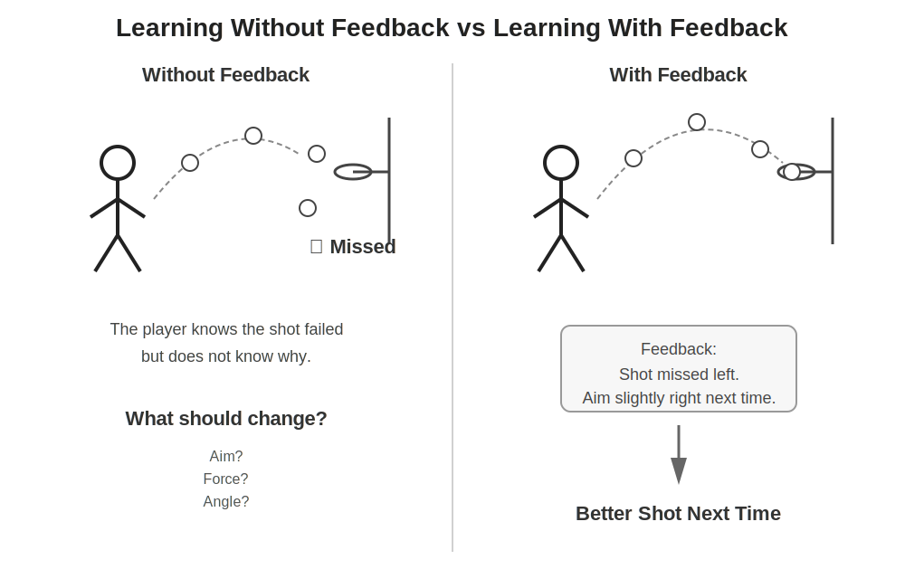
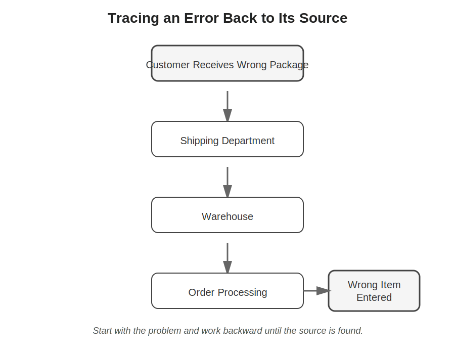
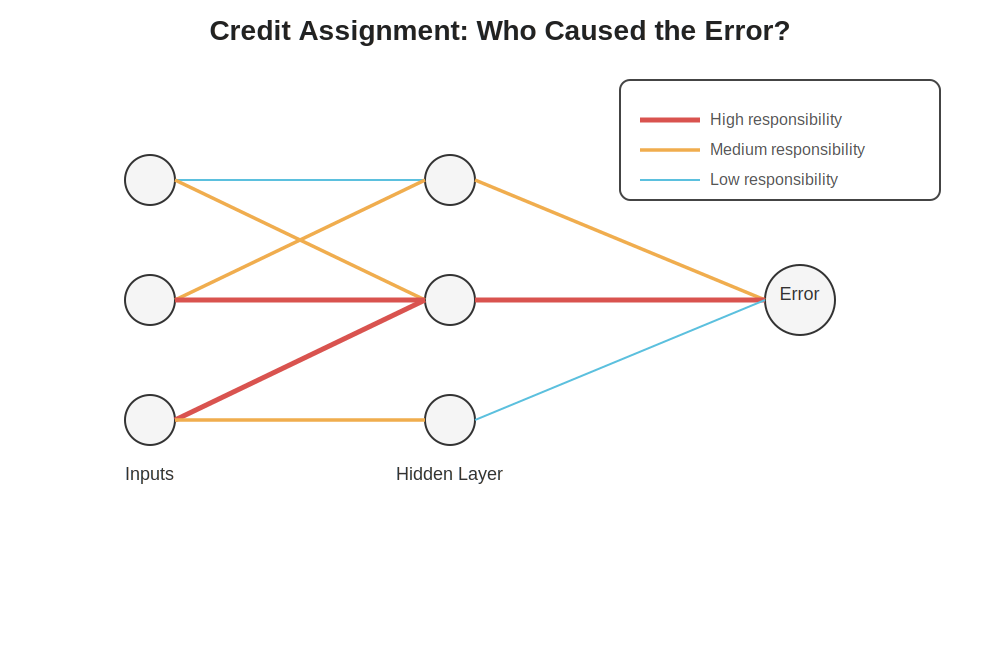
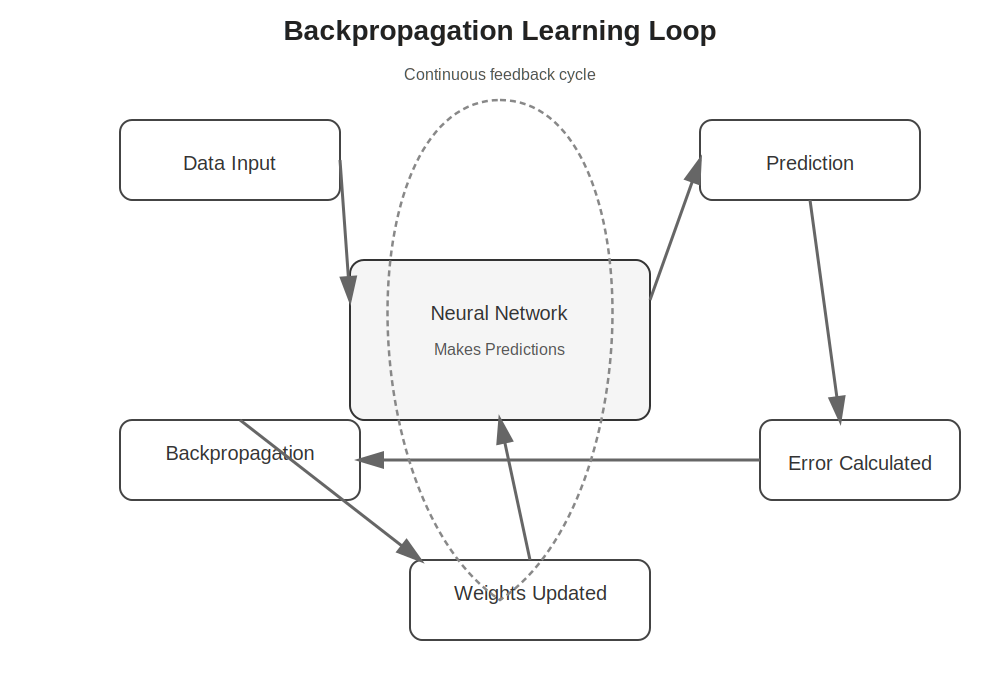
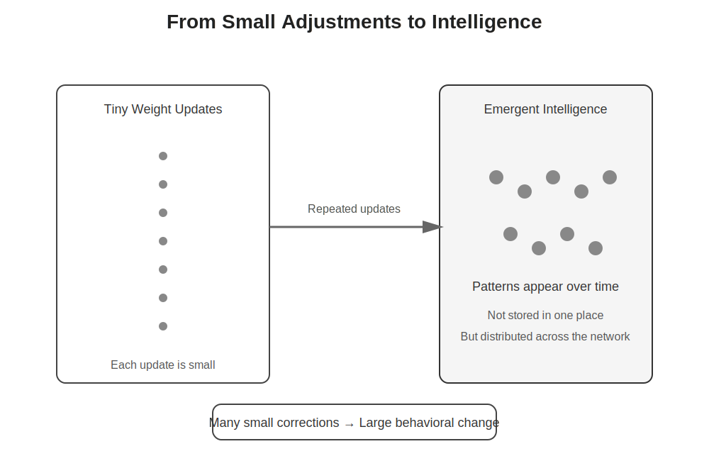
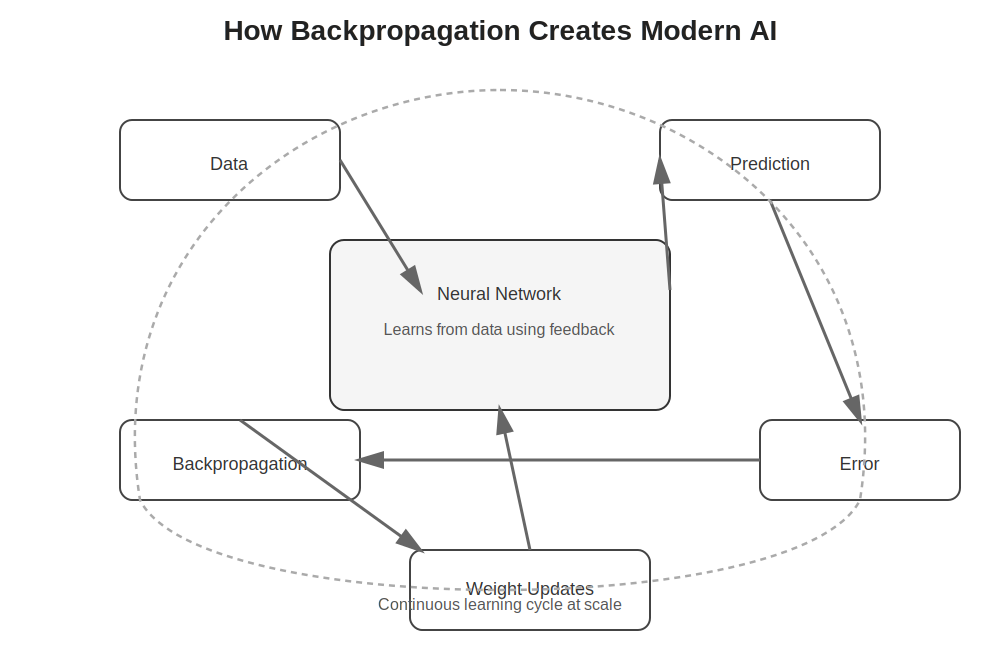

# Chapter 23 -- Backpropagation Simplified

## Opening Story: Learning the Perfect Basketball Shot

Imagine a teenager standing alone on a basketball court after school.

He takes a shot.

The ball misses the basket by several feet.

Most people would not be surprised. Nobody expects a beginner to make every shot.

What happens next is far more interesting.

The teenager does not simply throw the ball the same way again.

Instead, his brain automatically asks questions:

* Did I throw too hard?
* Did I aim too far to the left?
* Was the angle too low?
* Should I jump a little higher?

Without realizing it, he analyzes the mistake.

He makes a small adjustment and tries again.

This time the ball gets closer.

Not perfect, but better.

So he adjusts again.

Another shot.

Another correction.

Another improvement.

After hundreds of attempts, something remarkable happens.

The teenager becomes a skilled shooter.

He was not born knowing the perfect angle, force, and timing.

He learned through mistakes.

Every missed shot contained information.

Each error acted as feedback, telling him what to change next.

Learning, whether in humans or machines, often works this way.

Artificial neural networks do something surprisingly similar.

When an AI model makes a prediction and gets the wrong answer, it does not simply give up. It measures how wrong it was, determines which internal connections contributed to the mistake, and makes small adjustments to improve future predictions.

This process is called **backpropagation**.

The name sounds technical and intimidating, but the core idea is simple:

**Make a prediction. Measure the error. Figure out what caused the mistake. Adjust. Try again.**

Just like the basketball player learning to shoot more accurately, an AI model gradually improves by learning from its errors.

In the previous chapter, we explored the training process and saw how AI learns through repeated practice. In this chapter, we will look inside that learning process and discover the mechanism that tells the model exactly what needs to change after every mistake.

That mechanism is backpropagation—the engine that powers learning in modern neural networks.

# Section 1: Why Training Needs More Than Practice

In the previous chapter, we learned that AI models improve through training.

The basic idea seemed straightforward:

1. Give the model some data.
2. Let it make a prediction.
3. Compare the prediction with the correct answer.
4. Adjust the model.
5. Repeat.

At first glance, this process sounds almost magical.

If the model keeps practicing, why doesn't it eventually learn everything on its own?

The answer is that practice alone is not enough.

Imagine trying to learn basketball while wearing a blindfold.

You take a shot.

You hear people groan.

You know you missed.

But you have no idea why.

Was the ball too short?

Too far?

Too far left?

Too far right?

Without knowing what went wrong, improving becomes extremely difficult.

The same problem exists for AI.

When a neural network makes a mistake, it needs more than a simple message saying, "Wrong answer."

It needs detailed feedback.

*Figure 23.1: Practice alone is not enough. Learning requires feedback that explains what went wrong and how to improve. Backpropagation provides this feedback for neural networks.*

It must know:

* Which parts of the network contributed to the error?
* Which connections should change?
* Should those changes be large or small?
* How can the mistake be reduced next time?

This becomes especially challenging in deep neural networks.

A modern AI model may contain millions, billions, or even trillions of parameters. When an error occurs, the model must somehow determine which of those parameters need adjustment.

That is like trying to identify which individual musician made a mistake during a performance by a giant orchestra containing thousands of players.

Simply knowing that the final song sounded wrong is not enough.

You must trace the problem back to its source.

This is exactly what backpropagation does.

Backpropagation is the process that takes an error at the output of a neural network and works backward through the network, determining how much each connection contributed to that error.

Once those contributions are known, the network can make targeted adjustments to improve future predictions.

Without backpropagation, neural networks would have no efficient way to learn from their mistakes.

Training would be slow, unreliable, and largely ineffective.

Backpropagation gives the network a way to answer one of the most important questions in machine learning:

**"What exactly should I change to do better next time?"**

That question lies at the heart of learning—not only for machines, but for humans as well.

# Section 2: Following the Error Backward

The word *backpropagation* sounds complicated, but its meaning is surprisingly simple.

The term comes from two ideas:

* **Back** means moving backward through the network.
* **Propagation** means passing information from one place to another.

Put together, backpropagation means:

**Sending information about an error backward through a neural network so the network can learn what to change.**

To understand why this is necessary, imagine a student taking a math test.

The student answers ten questions and receives a score of 70%.

The score tells the student that mistakes were made, but it does not explain which questions were wrong.

To improve, the student needs more detailed feedback.

Perhaps the student missed two algebra questions and one geometry question.

Now the student knows where to focus future study.

The same principle applies to neural networks.

Suppose an AI system is trained to identify pictures of cats and dogs.

A picture of a cat is shown to the network.

The network confidently predicts:

**Dog — 95%**

Unfortunately, the correct answer is **Cat**.

The network has made a mistake.

The error can be measured, but the network still faces a difficult problem:

Which of its many internal connections caused the wrong answer?

A neural network may contain multiple layers and thousands, millions, or even billions of parameters.

The incorrect prediction did not come from a single connection.

It emerged from countless small decisions made throughout the network.

Backpropagation helps solve this mystery.

Starting with the final error, the network works backward through each layer.

At every step, it asks a question:

**How much did this connection contribute to the mistake?**

Some connections may have had a large influence.

Others may have had only a tiny effect.

Backpropagation estimates the contribution of each connection and distributes responsibility throughout the network.

This process is similar to investigating a mistake inside a large company.

Imagine a customer receives the wrong product.

Management wants to know what happened.

Did the mistake occur in the warehouse?

Was the shipping label printed incorrectly?

Did someone enter the wrong information into the ordering system?

The investigation begins with the final problem and traces the chain of events backward until the source of the error is found.

*Figure 23.2: Finding the cause of a mistake often requires tracing events backward. Backpropagation applies the same idea to neural networks by starting with the final error and working backward to identify the connections that contributed to it.*

Backpropagation does something very similar.

It starts with the wrong prediction and traces responsibility backward through the network.

Once the network understands which connections contributed most to the error, it can adjust those connections and improve future predictions.

The key idea is simple:

**Errors do not merely tell the network that something went wrong. They help reveal where the problem originated.**

That information is what makes learning possible.

# Section 3: The Credit Assignment Problem

By now, we know two important ideas.

First, an AI model makes a prediction.

Second, when the prediction is wrong, we can measure the error.

And in the previous section, we saw something even more important:

The error is not random—it can be traced backward through the system to find where things went wrong.

But this creates a deeper question.

Once we find the source of the mistake, what exactly do we do with that information?

In a neural network, the “source of the mistake” is not a single switch or button.

It is a huge collection of tiny numerical values called **weights**.

These weights control how strongly one neuron influences another.

There may be millions or even billions of them.

So when the model makes an error, we face a difficult problem:

**How do we decide which weights deserve credit for the mistake—and by how much?**

This is known as the **credit assignment problem**.

To understand it, imagine a group project at school.

The final grade is low.

Everyone in the group is told:

“You did poorly.”

But that is not very helpful.

To improve next time, the group needs more detailed feedback:

* Who contributed a lot but made small mistakes?
* Who misunderstood the instructions completely?
* Who barely contributed at all?
* Who made a critical error that affected everything else?

Without answering these questions, improvement becomes guesswork.

Neural networks face the same challenge.

*Figure 23.3: Backpropagation solves the credit assignment problem by distributing responsibility for an error across all connections in proportion to their influence.*

When the output is wrong, the model cannot simply say:

“This network is bad.”

Instead, it must determine:

* Which connections contributed strongly to the error?
* Which ones had only a small influence?
* Which ones should change a lot?
* Which ones should barely change at all?

This is where backpropagation becomes powerful.

It does not treat every weight equally.

Instead, it assigns **responsibility** across the network in proportion to influence.

Some weights receive a large correction because they played a major role in the error.

Others receive a tiny adjustment because their contribution was small.

And some may not change at all.

The key idea is subtle but important:

**Learning is not just about knowing that a mistake happened. It is about distributing responsibility for that mistake.**

Once responsibility is assigned, the network can make targeted adjustments—small, precise changes that reduce the chance of repeating the same error.

This is what allows neural networks to improve gradually, even when they contain millions of interconnected parts.

Backpropagation is not just error detection.

It is **error attribution at scale**.

And without it, deep learning would not work at all.

# Section 4: How Backpropagation Actually Works

Up to this point, we have built the intuition.

We know that:

* A neural network makes a prediction.
* It can be wrong.
* The error can be traced backward.
* Responsibility for the error is shared across many connections.

Now we arrive at the core question:

**How does backpropagation actually update the network?**

At its heart, backpropagation is not mysterious.

It is a careful, step-by-step calculation that answers one question for every connection in the network:

**If this weight changes slightly, how does the error change?**

This idea is the key.

Instead of guessing how to fix the network, backpropagation measures the sensitivity of the error to each weight.

If a small change in a weight causes a big improvement in accuracy, that weight gets adjusted more.

If a change barely affects the outcome, it gets adjusted less.

If it makes things worse, it gets adjusted in the opposite direction.

This is where the learning process becomes precise rather than random.

To understand this, imagine walking down a foggy mountain.

You cannot see the entire path.

But you can feel the slope under your feet.

If the ground slopes downward in a certain direction, you take a small step that way.

Then you feel again.

Step by step, you move toward the lowest point.

Backpropagation works in a similar way.

The “height of the mountain” is the error of the model.

The goal is to reach the lowest possible error.

Each weight in the network represents a direction you can adjust.

Backpropagation calculates which direction reduces the error most effectively.

This process relies on a mathematical idea called the **gradient**, which measures how the error changes when each weight changes.

*Figure 23.4: Backpropagation is a continuous feedback cycle. The model makes predictions, measures error, propagates that error backward, and updates weights repeatedly to improve performance.*

You do not need to think of the gradient as a complicated formula.

You can think of it as a simple signal:

**“Increase this weight.”
“Decrease this weight.”
“Change this weight very little.”**

Once these signals are computed for every weight in the network, the model updates all of them slightly.

Not dramatically.

Not randomly.

But in small, controlled steps.

Then the process repeats:

* Make a prediction
* Measure the error
* Compute gradients
* Update weights

Again and again.

Over time, these small adjustments accumulate into intelligence.

The model becomes better at recognizing patterns, making predictions, and generalizing from examples it has never seen before.

Backpropagation is not a single action.

It is a loop.

A feedback cycle that slowly transforms random connections into structured knowledge.

And that is what makes modern AI learning possible.

# Section 5: From Small Adjustments to Intelligence

If you step back and look at the learning process, something almost surprising becomes clear.

Nothing in a neural network changes in large jumps.

There is no moment where the system suddenly “becomes intelligent.”

Instead, learning happens through a vast number of tiny adjustments.

Each time backpropagation runs:

* A few weights increase slightly
* A few weights decrease slightly
* Most weights change only a little

At first, these changes seem insignificant.

One small adjustment cannot possibly mean much.

But neural networks do something remarkable: they accumulate improvement over time.

To understand this, imagine polishing a rough stone.

A single stroke of sandpaper does almost nothing.

You would not notice a difference.

But after thousands of strokes, the surface becomes smooth.

The transformation is not sudden.

It is the result of consistent, repeated refinement.

Backpropagation works in exactly this way.

Each training step is like a single stroke of sandpaper.

*Figure 23.5: Intelligence in neural networks emerges from countless small weight updates. Individually they are insignificant, but together they form structured patterns and behavior.*

Individually, it is small.

Collectively, it is powerful.

There is another important idea hidden here.

Neural networks do not store knowledge the way humans write notes in a notebook.

They store knowledge in the structure of their connections.

In other words:

**Intelligence is not stored in one place. It is distributed across the entire network.**

This is why backpropagation must adjust many weights at once.

A single mistake is rarely caused by a single connection.

It is the combined effect of many small influences.

So learning must also be distributed.

Each adjustment is tiny, but together they reshape the entire system.

Over time, this produces something powerful:

The network begins to recognize patterns it was never explicitly told about.

It starts to generalize.

It can identify a cat it has never seen before.

It can translate a sentence it has never encountered.

It can respond to questions in ways that feel intelligent.

But nothing about this process required a sudden leap.

It is all built from repetition:

* Make a prediction
* Measure error
* Trace responsibility
* Adjust weights
* Repeat again and again

Backpropagation is not just a mechanism for fixing mistakes.

It is the engine of gradual transformation.

And intelligence, in modern AI systems, is not a single invention.

It is the result of millions or billions of small corrections layered on top of each other until patterns begin to emerge.

# Section 6: Why Backpropagation Changed Everything

At this point, the mechanics of backpropagation are clear.

A model makes a prediction.
It measures the error.
It traces responsibility backward.
It adjusts millions of small connections.
Then it repeats the process again and again.

On its own, none of these steps feels revolutionary.

But together, they unlock something far more important:

**Scalable learning.**

Before backpropagation became practical, building intelligent systems was extremely limited. Humans tried to manually design rules for machines:

“If you see this, do that.”
“If this happens, then choose that.”

These rule-based systems worked in narrow cases, but they quickly broke down in complex, real-world situations. The world is too messy, too variable, and too large for hand-written rules.

Backpropagation changed the approach completely.

Instead of telling a machine *what to do*, we let it *learn what to do* from data.

This shift is the foundation of modern artificial intelligence.

It is why systems today can:

* Recognize faces in photos
* Translate between languages
* Recommend videos and products
* Generate human-like text
* Assist with complex reasoning tasks

None of these abilities come from manually programmed rules.

They come from networks that have been trained through repeated cycles of:

**prediction → error → backpropagation → update**

The real power of backpropagation is not that it is mathematically elegant.

It is that it scales.

It works whether a network has:

* 100 connections
* 1 million connections
* or 1 trillion connections

The same simple idea continues to function: adjust what contributed most to the error, slightly improve, and repeat.

This is why modern AI systems, including large language models, can improve from massive amounts of data without being explicitly programmed for every situation they encounter.

Backpropagation is not just a training technique.

It is the reason artificial intelligence can learn from experience at scale.

And once learning becomes scalable, intelligence stops being a handcrafted system and becomes an emergent property of data, computation, and feedback.

That is the real shift.

*Figure 23.6: Backpropagation enables a continuous learning cycle—data, prediction, error, and weight updates—scaled across billions of parameters to produce modern AI systems.*

Not smarter rules.

But systems that learn their own rules.

# Insight Box: Backpropagation in One View

Backpropagation is the mechanism that allows neural networks to learn from mistakes.

At its core, it follows a simple loop:

A model makes a prediction.
The prediction is compared to the correct answer.
The difference between them is the error.

Instead of treating the error as a single label (“right” or “wrong”), backpropagation breaks it down and distributes responsibility across the entire network.

Each connection (weight) is assigned a degree of influence on the mistake.
Some connections contributed a lot, others very little.

Once responsibility is assigned, each weight is adjusted slightly in the direction that reduces future error.

This process is guided by a signal called the gradient, which indicates how much each weight should increase or decrease to improve performance.

The cycle repeats thousands to billions of times:

Prediction → Error → Backward tracing → Weight update → Repeat

Over time, these small adjustments accumulate into structured behavior.

This is how a network gradually becomes better at recognizing patterns, making predictions, and generalizing to new situations.

Backpropagation does not create intelligence in a single step.

It builds it through continuous correction at scale.

# Final Thoughts

Backpropagation is one of those ideas that feels far more complex than it actually is.

Once the layers of terminology are removed, what remains is a simple principle: systems improve when they can measure their mistakes and adjust what caused them.

This is not unique to machines. It is a general pattern of learning.

Humans refine skills the same way—through feedback, correction, and repetition. The difference is scale. Neural networks apply this process across millions or billions of small components simultaneously.

What makes backpropagation powerful is not that it is “intelligent” on its own, but that it enables intelligence to emerge from repeated adjustment. It turns error into a useful signal instead of a dead end.

This chapter showed how learning is not a single event. It is a process of continuous refinement, where small changes accumulate into meaningful capability.

In the next chapter, we step back from the learning mechanism itself and look at what is being learned: the structure of models, and how they are designed to represent knowledge.

Understanding backpropagation is important because it explains *how* AI improves.

Understanding models explains *what* is actually being improved.

