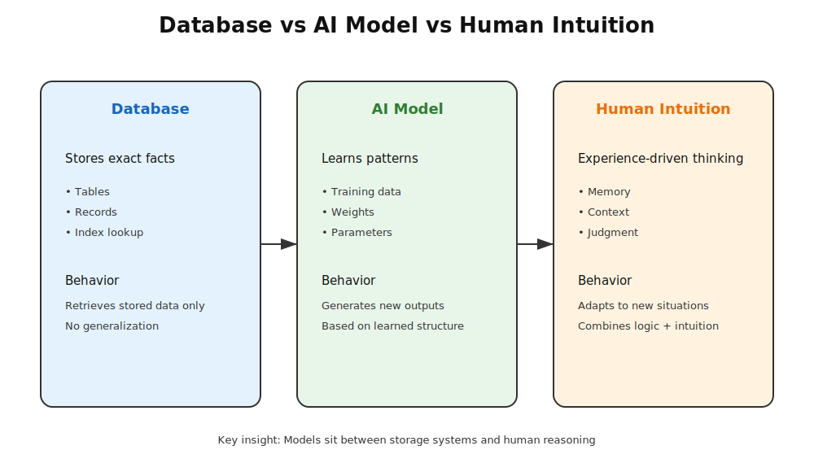
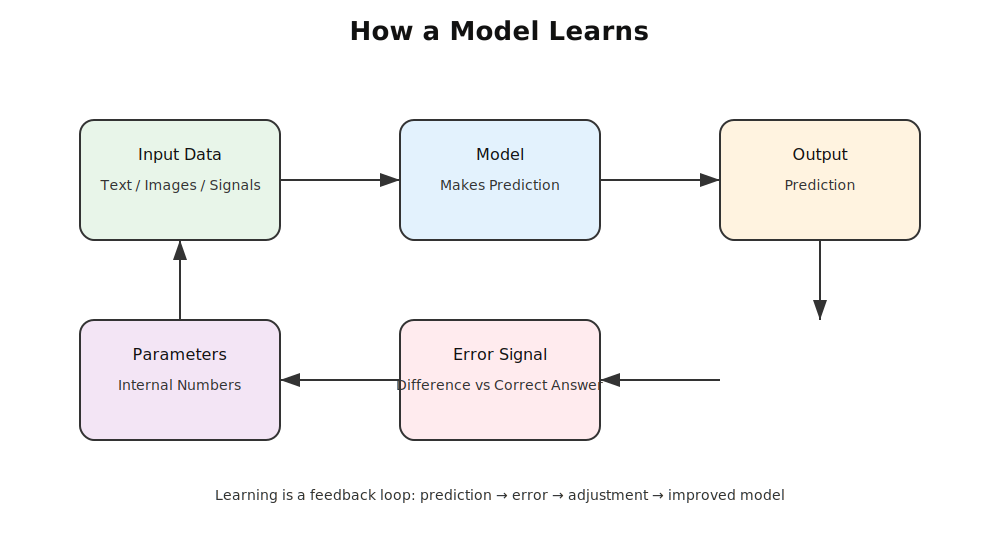
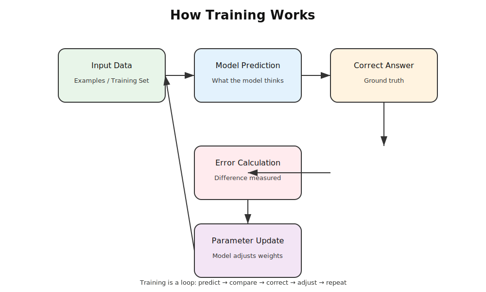
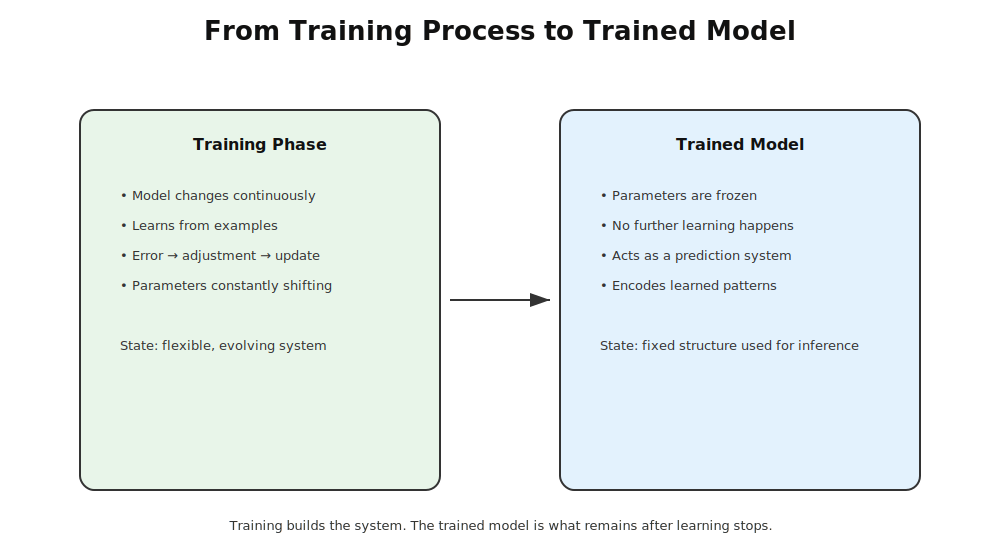
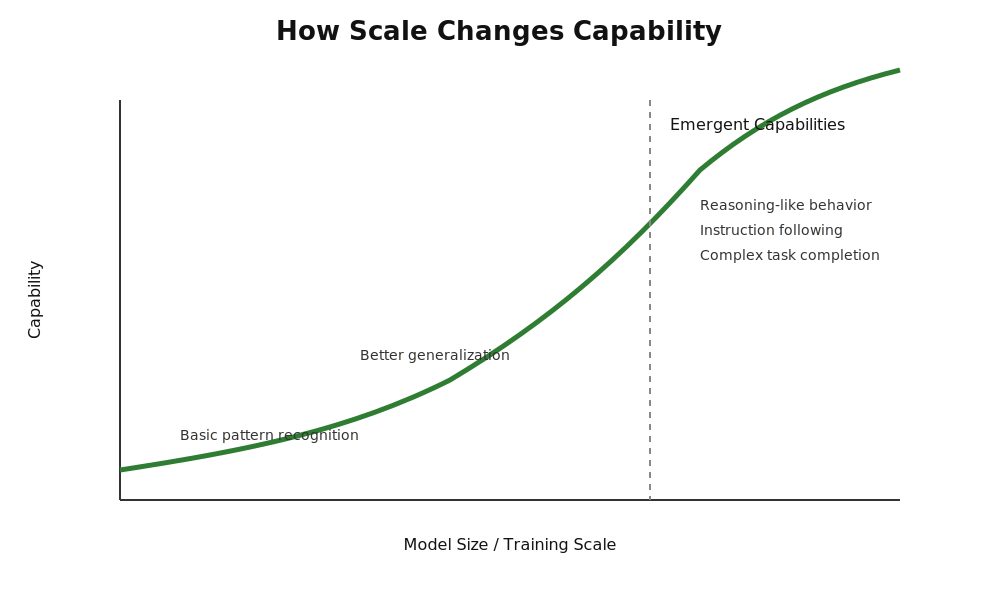

# Chapter 24 -- Models

## Opening Story

A young attorney walks into court carrying two briefcases.

One is labeled **“Laws, precedents, statutes.”**  
The other is labeled **“Experience.”**

Inside the courtroom, opposing counsel presents a complex contract dispute. The facts are messy. The clauses contradict each other. Even the judge pauses longer than usual before speaking.

The attorney opens the first briefcase. It is full of information—years of legal knowledge, case citations, and structured rules. Everything is correct, organized, and complete. But something is missing: it does not immediately tell her what matters most in this specific situation.

She opens the second briefcase. It contains experience—patterns from past cases, intuition about how judges tend to interpret ambiguity, and a sense of which arguments usually succeed. But it has a different problem: it cannot explain itself clearly or consistently.

Alone, each briefcase is useful. Together, they start to look like something powerful.

She pauses.

Then she imagines a system that doesn’t separate the two—but merges them. A system where structure and learned experience are not competing forces, but parts of the same mechanism. One defines how information is organized. The other defines what has been learned from it.

That idea is where modern AI models begin.

Because a model is not just “knowledge,” and it is not just “design.” It is both working together:

A blueprint for how to think about information, and a compressed memory of everything it has seen before.

In the simplest terms:

If data is what the model is given, and training is how it learns, then the model itself is what remains afterward—shaped, structured, and ready to respond.

By the time she stands up to argue her case, she isn’t relying on either briefcase alone anymore.

She is using a system that has learned how to combine them.

## Section 1 — What Is a Model?

In everyday language, a “model” is something simple: a smaller version of something real. A model airplane. A model of a building. A model you can look at, touch, and understand without dealing with the full complexity of the real thing.

In artificial intelligence, the idea is similar—but more abstract and far more powerful.

An AI model is not a physical object. It is a system that has learned patterns from data and uses those patterns to make predictions or generate outputs.

Think of it like this:

You don’t explicitly program every answer. Instead, you train the system so it learns the structure of the problem itself.

A model is what remains after learning has taken place.

It is the “compressed intelligence” formed from exposure to massive amounts of examples.

---

### From Rules to Learning

Before modern AI, systems were built using explicit rules.

For example:
- If a customer is late, send a reminder
- If temperature > 100°C, trigger alert
- If email contains “urgent,” flag it

This is rigid. Everything must be written by humans.

But real-world problems don’t behave like neat rulebooks.

Language changes. Fraud patterns evolve. Medical symptoms overlap. Legal arguments contradict each other.

So instead of writing rules manually, we shifted the responsibility:

We stopped telling machines *what to do in every case*  
and started showing them *many examples so they can learn patterns themselves*.

That shift is what creates a model.

---

### The Core Idea

At its simplest, a model is:

- Input → Output system  
- shaped by experience (data)  
- refined through training  

It takes something in (a sentence, an image, a signal) and produces something out (a prediction, a classification, a response).

But what makes it powerful is not the input-output flow.

It is what sits inside it: learned structure.

---

### Not Memory. Not Rules. Something In Between.

## Figure 24.1 — Database vs AI Model vs Human Intuition

**Caption:**  
Database retrieves stored facts, AI models learn patterns and generate outputs, and human intuition combines experience and context to reason flexibly.

A common misunderstanding is that models “store information” like a database.

They don’t.

They also don’t follow fixed rules like traditional software.

Instead, they sit in a middle space:

- They are not memorizing every example
- They are not manually programmed rules
- They are statistical structures shaped by data

A model is closer to intuition than to instruction.

It behaves more like a trained mind than a lookup table.

---

### Why This Matters

This distinction is critical.

Because once you understand what a model really is, everything else in AI starts to make sense:

- Why it can generalize to new situations  
- Why it sometimes makes mistakes  
- Why more data improves performance  
- Why architecture matters  

A model is not magic.

It is structure shaped by experience—nothing more, and nothing less.

But when scaled up, that simple idea becomes something surprisingly powerful: a system that can approximate aspects of reasoning, language, vision, and decision-making.

---

In the next section, we break this down further by asking a deeper question:

If a model is shaped by learning… what exactly is it learning from?

## Section 2 — What a Model Actually Learns

When people hear that an AI “learns,” it can sound vague—almost like a metaphor. But in technical terms, learning is very specific.

A model does not learn ideas, meaning, or facts the way humans do. It learns **statistical relationships between inputs and outputs**.

That sounds abstract, but the core idea is simple:

> A model learns how likely one thing is to follow another.

---

### Learning Patterns, Not Rules

A traditional program follows explicit instructions:
- If X happens, do Y

A model does something different:
- Given many examples of X → Y pairs, it estimates what Y should be for a new X

Instead of being told the rules, it infers them indirectly from data.

For example:
- It sees thousands of sentences
- It sees which words tend to follow others
- It builds an internal structure that reflects those probabilities

Nothing is explicitly stored as “knowledge.” Instead, the knowledge is embedded in numerical parameters.

---

### The Role of Data

A model is only as good as the data it learns from.

During training:
- It is shown input examples
- It makes predictions
- It compares its predictions to the correct answers
- It adjusts itself slightly to reduce errors

Over time, this process reshapes the model so that it becomes better at predicting outcomes.

This is not memorization in the traditional sense. It is **compression of patterns across massive datasets**.

---

### What Gets Stored Inside the Model

Inside a trained model are millions or even billions of numbers called **parameters** (or weights).

These numbers:
- Do not store sentences or images directly
- Do not behave like a database
- Encode relationships between concepts indirectly

You can think of them as a dense mathematical structure that captures patterns like:
- Word associations
- Visual features (edges, shapes, objects)
- Logical relationships between inputs and outputs

But none of these exist in readable form. They are distributed across the network.

---

### A Simple Analogy

Imagine learning how people behave in a city:

- You do not write down every rule
- You observe thousands of interactions
- Over time, you develop intuition for how people are likely to act

A model does something similar—but without consciousness, awareness, or understanding.

It builds a statistical “feel” for the data.

---

### Key Insight

A model does not store knowledge like a library.

It does not follow rules like software.

Instead, it becomes a **compressed representation of patterns in data**, shaped entirely by what it has seen.

This is why two models trained on different datasets behave differently—even if their architecture is identical.

---

In the next section, we will break down what actually happens during training, and how a model gradually adjusts itself to reduce errors step by step.

## Figure 24.2 — How a Model Learns

**Caption:**  
A model learns through a feedback loop: it makes a prediction, compares it to the correct answer, computes an error signal, and adjusts its internal parameters to improve future predictions.

## Section 3 — How Training Actually Works

If Section 2 explained *what a model learns*, then this section explains *how it actually learns it*.

The process is called **training**, and despite how advanced modern AI looks, the core idea is surprisingly simple:

> Training is repeated correction.

---

### The Basic Loop

Training follows a cycle:

1. The model receives an input  
2. It produces an output (a prediction)  
3. That prediction is compared to the correct answer  
4. The difference between them is measured as an error  
5. The model is adjusted slightly to reduce that error  

Then the process repeats—millions or even billions of times.

Each cycle is small. But together, they reshape the model.

---

### Learning by Correction, Not Explanation

A key difference between humans and AI is *how learning happens*.

Humans often learn through:
- explanations
- reasoning
- instructions
- understanding concepts

A model does not learn in that way.

It learns through:
- trial
- error
- adjustment

It is not told *why* something is correct.  
It is only told *how wrong it was*.

Over time, repeated correction builds structure.

---

### Gradual Adjustment

When a model makes a mistake, it does not “rewrite itself.”

Instead, it makes very small changes to its internal parameters.

Think of it like tuning thousands of tiny knobs:
- One knob slightly adjusts how it understands grammar
- Another adjusts how it recognizes patterns in images
- Others influence relationships between concepts

No single knob controls anything meaningful on its own.  
But together, they determine the model’s behavior.

This distributed structure is what makes modern AI both powerful and difficult to interpret.

---

### Why Repetition Matters

A model is not trained once and finished.

It is trained through repeated exposure to:
- massive datasets
- repeated examples
- repeated corrections

This repetition is what allows it to generalize beyond the training data.

It begins to recognize:
- patterns in language
- structure in images
- relationships in data

Not by memorizing them, but by reinforcing statistical structure.

---

### The Hidden Engine Behind Learning

Under the hood, training relies on a mathematical process that:
- measures error
- determines how each parameter contributed to that error
- adjusts parameters in the direction that reduces future error

You do not need the math to understand the idea:

> The system continuously asks: “How can I be slightly less wrong next time?”

And then it acts on that answer.

---

### Key Insight

Training is not a moment. It is a process.

A model does not suddenly become intelligent.

It becomes gradually less wrong across enormous numbers of small updates.

What emerges at the end is not knowledge in the human sense—but a highly tuned system of patterns that can respond effectively to new inputs.

---

In the next section, we will connect everything so far into a single idea: what a “trained model” actually represents once training is complete.

## Figure 24.3 — How Training Works

**Caption:**  
Training is a repeated loop where a model makes a prediction, compares it to the correct answer, computes an error, and updates its internal parameters to reduce future mistakes.

## Section 4 — What a Trained Model Really Is

After training is complete, something important happens:

The system stops being “a learning process” and becomes a **fixed structure**.

This is what we call a **trained model**.

But that term is misleading if taken too literally. Nothing inside the system resembles knowledge in the human sense. There are no stored facts, no explicit rules, and no readable instructions.

What remains is something more abstract:

> A trained model is a compressed mathematical representation of patterns learned from data.

---

### From Process to Artifact

During training, the system is constantly changing.

After training:
- The changes stop
- The parameters are frozen
- The system becomes stable and reusable

At this point, it is no longer “learning.”  
It is now a tool that applies what it has already learned.

You can think of it as the difference between:
- A student studying (training)
- A student taking an exam (inference)

---

### What Actually Exists Inside

A trained model is made up of:
- Millions or billions of parameters (numbers)
- A fixed architecture (structure of computation)
- Learned statistical relationships encoded in those parameters

Importantly:
- No sentence is stored
- No image is stored
- No rule is explicitly written

Instead, everything is distributed across the network in a highly compressed form.

---

### Why It Still Feels “Intelligent”

Even though nothing inside the model resembles human understanding, it can still:
- Complete sentences coherently
- Recognize patterns in images
- Generate plausible answers to new questions

This happens because it has learned:
> how data tends to behave, not what data means.

That distinction is crucial.

A trained model is not reasoning in the human sense. It is:
- matching patterns
- extending structures
- producing statistically likely outputs

Yet at scale, this produces behavior that looks surprisingly intelligent.

---

### Generalization: The Real Power

The most important property of a trained model is **generalization**.

It can respond correctly to inputs it has never seen before.

This happens because:
- It does not memorize examples directly
- It learns underlying structure in the data

So when it encounters a new situation, it does not search for an exact match.

Instead, it reconstructs a likely response based on patterns it has absorbed.

---

### Key Insight

A trained model is not a repository of knowledge.

It is a **compressed prediction engine**.

It takes an input and produces an output based on learned statistical structure—not stored facts.

This is why two identical models trained on different data can behave completely differently.

## Figure 24.4 — What a Trained Model Really Is

**Caption:**  
A trained model is the result of training: a frozen system of parameters that no longer changes. It no longer learns—it only applies learned patterns to new inputs during inference.

They are shaped entirely by what they were exposed to.

---

In the next section, we will break down why larger models tend to perform better—and what “scale” actually changes inside these systems.

## Section 5 — Why Bigger Models Work Better

One of the most surprising discoveries in modern AI is this:

> When you make models larger, they don’t just get slightly better — they often become fundamentally more capable.

At first, this seems counterintuitive. You might expect performance to improve gradually, like upgrading a camera or adding more storage to a phone.

But AI doesn’t behave like typical engineering systems.

Instead, it shows something closer to a **phase change**—where small increases in size unlock entirely new behaviors.

---

### What “Bigger” Actually Means

When we say a model is “bigger,” we are usually referring to:

- More parameters (internal numerical values)
- More layers (deeper structure)
- More training data (broader experience)
- More computation during training

Each of these expands the model’s ability to represent patterns in data.

But the most important factor is usually **parameters**.

More parameters means:
> more internal “space” to store and refine patterns.

---

### Capacity: The Hidden Ingredient

Think of a model as a system with limited internal capacity.

A small model can only capture:
- simple relationships
- surface-level patterns
- basic associations

A larger model can capture:
- subtle relationships
- long-range dependencies
- abstract structures across data

This is not because it is “smarter” in a human sense.  
It is because it has more room to encode complexity.

---

### Emergent Behavior

At a certain scale, something interesting happens:

New capabilities appear that were not explicitly programmed.

Examples include:
- better reasoning in language tasks
- improved translation quality
- ability to follow multi-step instructions
- more coherent long-form generation

These are often called **emergent behaviors**.

They do not come from a single rule or feature.  
They arise from the interaction of many learned patterns.

## Figure 24.5 — How Scale Changes Capability

**Caption:**  
As models become larger and are trained on more data, their capabilities often improve gradually at first and then accelerate, enabling behaviors that smaller models cannot reliably perform.

---

### Why This Happens

A useful way to think about it:

- Small models are like shallow maps — they capture only main roads
- Large models are like detailed maps — they include side streets, intersections, and hidden paths

When enough detail is present, the system can navigate unfamiliar situations more effectively.

It is not guessing more intelligently.  
It simply has more structure to work with.

---

### Scaling Is Not Just Size

It is important to avoid a common misconception:

> Bigger alone is not enough.

Performance depends on a combination of:
- model size
- data quality
- training method
- compute resources

A large model trained poorly can perform worse than a smaller well-trained one.

So scaling is not brute force—it is a balance of multiple factors.

---

### Key Insight

Scaling increases more than accuracy.

It increases **capability space**.

As models grow, they move from:
- pattern matching → to structured reasoning behavior
- simple completion → to multi-step coherence
- local understanding → to broader generalization

This is why modern AI progress is so tightly linked to scale.

---

In the next section, we will connect everything so far into a single unified picture of what “AI systems” actually are in practice.

## Insight Box — The Big Idea Behind AI Models

Throughout this chapter, we have used the word *model* repeatedly. By now, you may have noticed something surprising:

A model is not a database.

It does not store information in neatly organized records that can simply be looked up later.

A model is not a collection of rules either.

No programmer sits down and writes millions of instructions telling it exactly how to respond to every possible situation.

And a model is not a human mind.

It has no consciousness, self-awareness, understanding, beliefs, or intentions.

Instead, a model is something unique:

> A model is a learned mathematical structure that captures patterns from data.

Training shapes that structure by repeatedly reducing errors. The result is a system that can take new inputs and generate useful outputs based on patterns it has learned before.

This idea lies at the heart of modern AI.

Whether the system is recognizing faces, translating languages, generating legal summaries, or answering questions, the underlying principle is the same:

The model is not retrieving intelligence.

The model *is* the learned structure that makes intelligent behavior possible.

---

## Final Thoughts

At the beginning of this chapter, we asked a simple question:

**What is a model?**

The answer turned out to be more interesting than it first appeared.

A model is not merely software. It is not merely data. It is not merely training.

A model is what emerges when data, architecture, and learning come together.

We explored how models learn patterns rather than rules, how training gradually adjusts billions of parameters, and how the final result becomes a compressed representation of experience encoded in numbers.

We also saw why larger models often become dramatically more capable. As scale increases, models can capture richer and more complex patterns, allowing them to perform tasks that smaller systems struggle to handle.

Most importantly, we learned that a model is not magic.

It is a carefully trained prediction system.

Everything from image recognition to modern chatbots ultimately depends on the same fundamental idea: learning patterns from data and using those patterns to respond to new situations.

In the next chapter, we will look more closely at one of the most important discoveries in modern AI:

Why does making a model larger often make it dramatically more capable?

The answer will reveal how scale became one of the driving forces behind the AI revolution.
