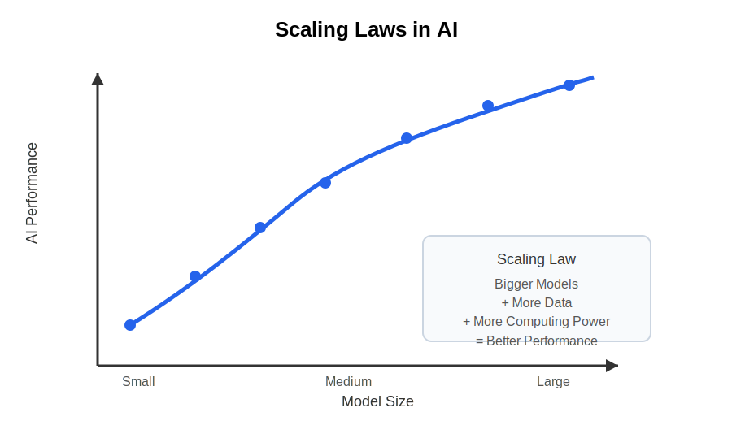
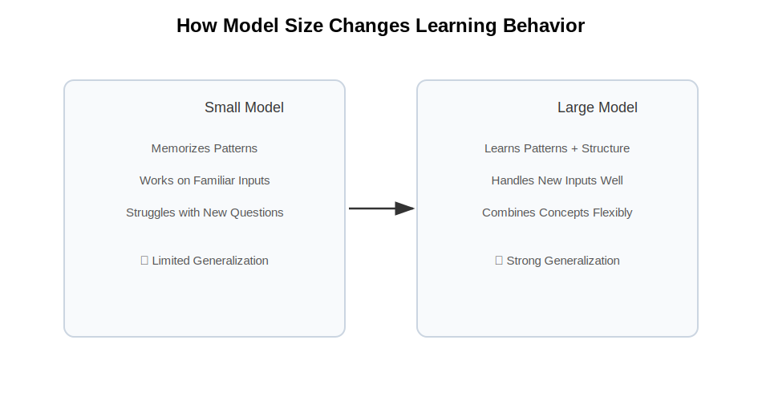
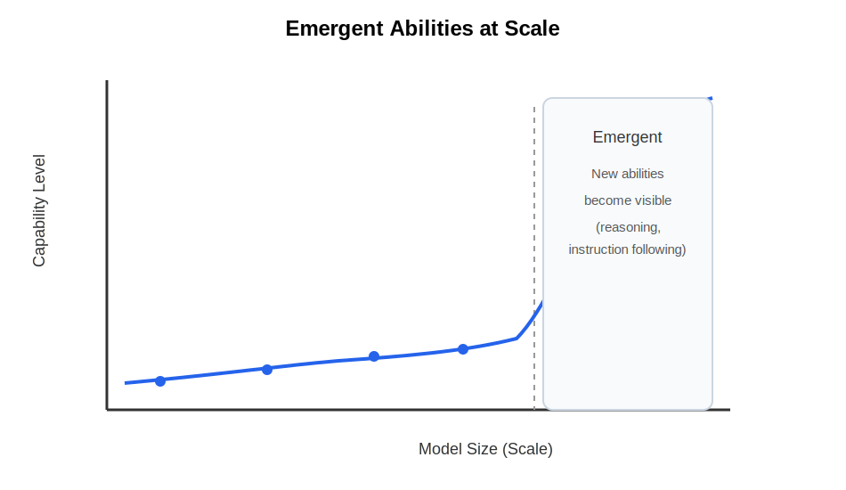
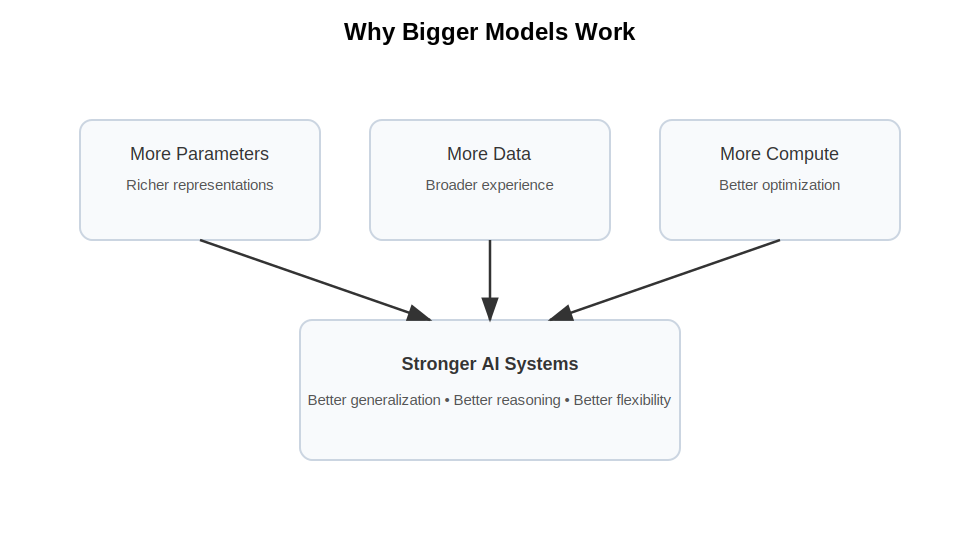

# Chapter 25 -- Why Bigger Models Work

# Opening Story: The Library Visitor

Imagine walking into a small neighborhood library.

It contains only a few hundred books.

There are books about history, cooking, travel, and science, but the collection is limited. If you ask a difficult question—perhaps about ancient Rome, contract law, astronomy, and economics all at once—the librarian may struggle to help. The information simply isn't there.

Now imagine visiting a much larger library.

This one contains millions of books gathered from around the world. Every shelf is packed with knowledge, stories, facts, explanations, and examples. When you ask a question, the librarian has access to far more information. Chances are good that somewhere in those countless shelves lies the knowledge needed to help you.

The librarian has not become smarter.

The librarian has simply learned from a much larger collection.

Modern AI models work in a surprisingly similar way.

When researchers build larger AI systems, they increase the number of parameters—the internal values that store what the model has learned during training. More parameters allow the model to capture more patterns, more relationships, and more knowledge from the enormous amounts of data it studies.

Over the past decade, one of the most surprising discoveries in artificial intelligence has been that making models bigger often makes them dramatically more capable. Larger models can write better, reason more effectively, translate more accurately, and solve a wider variety of problems than their smaller predecessors.

At first, many researchers assumed that simply adding size would eventually stop helping.

Instead, something unexpected happened.

As models grew from millions of parameters to billions—and then to hundreds of billions—they began displaying abilities that earlier systems never seemed to possess.

Why does this happen?

Why does a larger model often perform so much better than a smaller one?

And is there a limit to how far this trend can go?

In this chapter, we'll explore one of the most important discoveries in modern AI: why bigger models often work better, and how scale became one of the driving forces behind the AI revolution.

## Section 1: What Does “Bigger” Mean?

When people hear that an AI model is "bigger," they often imagine a larger computer or a bigger piece of software.

In AI, however, "bigger" has a very specific meaning.

A bigger model is a model with more **parameters**.

As we learned in the previous chapter, parameters are the internal values that an AI system adjusts during training. They represent everything the model has learned from the data it has seen.

You can think of parameters as tiny pieces of memory.

Each parameter stores a small amount of information about patterns found during training. Individually, a parameter is not very useful. But when billions of parameters work together, they can represent an astonishing amount of knowledge.

Imagine trying to store information in notebooks.

A small notebook may contain a few pages of notes. A larger notebook can hold much more information. A room full of notebooks can hold even more.

The same idea applies to AI models.

A model with one million parameters has less capacity to learn patterns than a model with one billion parameters. A model with one billion parameters has less capacity than a model with one hundred billion parameters.

More parameters give the model more room to capture relationships in language, images, sounds, and other types of data.

Consider the sentence:

*"The lawyer reviewed the contract before presenting it to the client."*

A small model might recognize common words such as "lawyer," "contract," and "client." A larger model may also learn more subtle relationships, such as the roles people play in legal work, how contracts are reviewed, and how these concepts relate to one another in different contexts.

The larger model has more capacity to store and organize patterns it has learned during training.

This does not mean that every large model is automatically better. A poorly trained large model can still perform badly. However, when researchers provide enough training data and computing power, larger models often become significantly more capable than smaller ones.

This observation has become one of the most important discoveries in modern artificial intelligence.

As researchers continued building larger and larger models, they noticed something remarkable: performance kept improving.

## Section 2: The Discovery of Scaling Laws

For many years, AI researchers believed that making models larger would eventually stop helping.

The assumption seemed reasonable.

Imagine learning a new skill such as cooking. At first, every new recipe teaches you something useful. But after years of practice, learning one more recipe may not make a dramatic difference.

Researchers expected AI to behave in a similar way.

They assumed that as models became larger and larger, the improvements would eventually level off. At some point, adding more parameters should produce only tiny benefits.

But something surprising happened.

The improvements kept coming.

As researchers increased model size, provided more training data, and used more computing power, the models consistently became better at a wide range of tasks.

They wrote more coherent text.

They answered questions more accurately.

They translated languages more effectively.

They generated better summaries.

They even showed improvements on tasks they had never been specifically trained to perform.

What surprised researchers most was not merely that larger models performed better—it was that the improvement followed a predictable pattern.

When scientists plotted model size against performance, they discovered smooth curves rather than sudden jumps or random results. As models grew, their capabilities often improved in a remarkably consistent way.

These patterns became known as **scaling laws**.

*Figure 25.1: Scaling laws show that as model size increases (with more data and compute), AI performance tends to improve in a predictable pattern.*

A scaling law is simply a relationship that describes how performance changes as a system becomes larger.

In AI, researchers found that increasing three factors often led to better results:

* More parameters
* More training data
* More computing power

When these factors increased together, performance frequently improved in ways that could be predicted surprisingly well.

Imagine planting trees.

A larger tree generally needs more soil, more water, and more sunlight. If all three increase together, the tree can continue growing.

Similarly, larger AI models require more data and more computing resources. When researchers provided all three ingredients, the models continued improving.

This discovery transformed the field.

Instead of focusing only on clever new algorithms, many research teams began asking a different question:

*"What happens if we simply make the model bigger?"*

Again and again, the answer was the same.

The model became better.

This realization helped launch the modern era of large language models and set the stage for some of the most powerful AI systems ever created.

## Section 3: What Changes When Models Get Bigger?

At first glance, it might seem like a larger AI model is just a more powerful version of a smaller one.

Same design. Same idea. Just more memory and more computing power.

But that view is incomplete.

When models grow in size, something more subtle happens. They don’t just become slightly better at the same tasks—they begin to capture patterns in a more structured and flexible way.

To understand this, imagine two students studying for an exam.

The first student memorizes a small set of example questions. This student can perform well when the exam closely matches what was studied, but struggles when the questions are phrased differently.

The second student studies a much larger and more diverse set of materials. Instead of memorizing specific answers, this student begins to recognize deeper patterns in the subject. As a result, they can handle unfamiliar questions more effectively.

Large AI models behave more like the second student.

As the number of parameters increases, the model has more capacity to organize what it learns into richer internal representations. It begins to form more general patterns rather than narrow, surface-level associations.

This leads to an important effect: **generalization improves**.

*Figure 25.2: Smaller models tend to rely on memorization and struggle with new inputs, while larger models generalize patterns and adapt more effectively.*

Generalization is the ability to apply what has been learned to new situations. It is the difference between memorizing facts and understanding them.

But there is another, more surprising phenomenon.

As models become large enough, they sometimes begin to show abilities that were not explicitly programmed and were not clearly visible in smaller versions.

These are often called **emergent abilities**.

For example, a small model might be able to complete simple sentences. A larger model might suddenly become capable of following complex instructions, solving multi-step reasoning problems, or producing structured explanations.

Nothing in the architecture was fundamentally changed.

Only scale was changed.

This suggests that intelligence in these systems is not just built from individual components, but from the way those components interact at scale.

Think of it like water.

A single molecule of water does not behave like a wave. But when enough molecules come together, entirely new behaviors emerge—waves, currents, and tides.

Similarly, in large AI systems, new behaviors can emerge when scale crosses certain thresholds.

Researchers are still studying exactly why this happens. It appears to be related to how information is distributed across many parameters and how the model organizes internal representations when given enough capacity and data.

What is clear, however, is that size does not simply refine performance.

It transforms it.

And this transformation is what makes modern large models fundamentally different from earlier, smaller systems.

## Section 4: Emergent Abilities

One of the most surprising discoveries in modern AI research is that increasing scale does not always lead to gradual improvement.

Sometimes, it leads to sudden change.

As AI models become larger, they do not only get better at the same tasks. At certain points, entirely new abilities appear that were not clearly visible in smaller versions of the same model.

These are called **emergent abilities**.

The word “emergent” is important. It means something new appears from a system once it reaches a certain level of complexity—something that cannot be easily predicted just by looking at the smaller version.

To understand this, imagine a dimmer switch for a light.

At low levels, the room is dark. As you slowly turn the dial, the light gradually increases. Nothing unexpected happens.

Now imagine another system where turning the dial produces no visible change for a long time. The room remains dark. You keep turning it. Still nothing. Then suddenly, at a certain point, the light turns on clearly and the room becomes visible.

That second behavior is closer to what researchers sometimes observe in large AI models.

For a long time, a model may appear limited. It can complete simple sentences, answer basic questions, or follow short instructions. But it struggles with multi-step reasoning, structured problem solving, or more complex forms of language understanding.

Then, as the model becomes larger and is trained with more data and compute, something changes.

Suddenly, it can follow longer instructions more reliably.

It can solve problems that require multiple steps of reasoning.

It can write structured explanations that were previously inconsistent or incomplete.

Importantly, nothing in the architecture has been redesigned to add these abilities. The same basic system is being scaled up.

What changes is the interaction between millions or billions of learned parameters. At sufficient scale, these interactions begin to produce more coherent and flexible behavior.

This is why researchers often describe emergence as a **threshold effect**.

*Figure 25.3: Some AI capabilities appear gradually in the background but only become visible after a scale threshold is crossed.*

Below a certain level of scale, a capability may appear absent. Above that level, it becomes clearly present.

However, this does not mean the ability suddenly “appears out of nowhere.” In reality, the behavior is likely improving gradually in the background. But the improvement may not be noticeable until it crosses a practical threshold where it becomes useful or reliable.

Emergent abilities remain an active area of research. Scientists are still working to understand exactly why certain skills appear at specific scales and how predictable these transitions really are.

What is clear, however, is this:

In large AI systems, scale does not only improve performance—it can also change what the system is capable of doing in the first place.

And that makes scale not just a matter of efficiency, but a driver of entirely new behavior.

## Section 5: The Real Reason Bigger Models Work

By this point, one idea should be clear: increasing the size of AI models changes their behavior in powerful ways.

But the deeper question remains—why does this actually work?

The simplest answer is also the most important one:

Larger models have more capacity to learn patterns from data.

However, that answer alone is not enough. It does not fully explain why performance improves so consistently, or why new abilities sometimes emerge.

To understand this better, we need to think about what happens during training.

An AI model is exposed to an enormous amount of data—text, images, or other forms of information. During training, it repeatedly tries to predict missing or future parts of that data and adjusts itself when it makes mistakes.

A small model has limited space to store what it learns. It must compress patterns aggressively. This often leads to oversimplification. Important details may be lost, and complex relationships may not be fully captured.

A larger model, on the other hand, has far more parameters available. This gives it more “room” to organize information internally. Instead of forcing many patterns into a small space, it can represent them in a more distributed and flexible way.

This difference in capacity is crucial.

With more space, the model can store not just individual facts, but relationships between facts. It can capture structure, context, and variation across examples. This leads to better generalization and more reliable performance across tasks.

There is also a second factor: optimization.

When training large models, the learning process becomes smoother and more stable in certain regimes. Instead of getting stuck in narrow, brittle solutions, large systems can explore a wider range of useful patterns in the data.

Together, these effects help explain why scaling works:

* More parameters allow richer representations
* More data provides broader experience
* More compute allows better optimization

When all three increase together, the model is not just becoming bigger—it is becoming more capable of forming a deeper internal model of the world represented in its training data.

This is why scaling has become one of the central principles of modern AI.

*Figure 25.4: Larger models succeed because they combine increased parameter capacity, more training data, and improved optimization behavior.*

It is not magic.

It is not randomness.

It is the predictable outcome of giving learning systems more capacity, more experience, and more time to refine what they learn.

And yet, even with this understanding, one truth remains:

We still do not fully understand everything that emerges at scale.

Which is exactly why this field continues to move so quickly.

## Insight Box: The Hidden Power of Scale

The most important idea in this chapter is not that larger models are “stronger” in a simple sense.

It is that scale changes what a learning system is capable of representing and discovering.

When a model is small, it behaves like a compact summary of patterns. It can perform well on familiar inputs, but it struggles to go beyond what it has effectively memorized.

When a model becomes large, something different happens. It stops behaving like a narrow pattern matcher and starts behaving like a flexible system that can combine, reorganize, and generalize what it has learned.

This shift is not gradual in the way people usually expect. Some abilities improve steadily. Others appear only after the system crosses a certain level of scale.

That is why modern AI feels different from earlier systems. It is not just more accurate—it is more adaptable.

Three forces drive this change:

* **Capacity:** More parameters allow richer internal representations.
* **Experience:** More data exposes the model to more variation in the world.
* **Optimization:** Better training dynamics help the model find useful patterns more reliably.

Individually, none of these factors is enough. Together, they create the conditions for complex behavior to emerge.

This is the core lesson of scaling:

Intelligence in modern AI is not designed in a single step. It is grown through scale.

## Final Thoughts

For a long time, progress in AI was thought of as a matter of better ideas—new algorithms, smarter architectures, more clever designs.

Those things still matter.

But modern AI has revealed something more fundamental: scale itself is a driver of capability.

As models grow larger, they do not simply become faster or more accurate versions of the same system. They begin to change in behavior. They learn more flexible representations, generalize more effectively, and sometimes develop abilities that were not explicitly engineered into them.

This does not mean size is a replacement for understanding. On the contrary, understanding is what allows us to use scale effectively and safely.

What scaling has shown us is that intelligence is not only about design—it is also about capacity, data, and the ability to learn from vast experience.

At small scales, systems are limited in what they can represent. At large scales, those limitations begin to loosen, and new behaviors become possible.

We are still in the early stages of understanding what this means.

Why scaling works so well is not fully explained.

Why certain abilities emerge at specific thresholds is still an open question.

And how far this trend can continue remains unknown.

What is clear is this:

Scale is not just an engineering detail. It is one of the central forces shaping modern artificial intelligence.

And we are only beginning to see where it leads.
