# Chapter 31 -- Hallucinations
  
## Opening Story

A late evening in a law library, the kind where the lights hum softly and every desk looks like a small island of concentration.

Maya, a second-year law student, is preparing a memo on contract disputes. She types a simple request into an AI assistant:

> “Find a relevant case where a service contract was enforced even without a written agreement.”

The response comes back almost instantly.

It reads smoothly. Confident tone. Clean structure. It even includes a case name, a court, a year, and a quoted legal principle that sounds exactly like something she remembers from class.

Maya pauses.

It looks right.

She copies the case name into a search engine. Nothing.

She tries a legal database. Still nothing.

Then she adjusts the spelling slightly, thinking it might be a typo. Now she finds something close—but not the same case, not the same facts, and certainly not the quoted passage.

The AI didn’t hesitate when it answered her. It didn’t say “I think” or “possibly.” It didn’t flag uncertainty. It simply produced an answer that *felt* like law: structured, authoritative, and precise.

But it wasn’t real.

Across the table, her professor later explains something that sticks more than the assignment itself:

> “AI systems don’t always retrieve truth. Sometimes they generate something that *looks like truth* based on patterns in data. That’s the danger. Not that they refuse to answer—but that they answer too well.”

Maya looks back at her screen.

The explanation changes how she reads everything now. Not with less trust, but with a new habit—verification before acceptance.

Because the problem wasn’t that the AI was silent.

It was that it spoke too confidently in a moment it should have been uncertain.

And that gap—the space between fluency and fact—is where this chapter begins.

# Section 1 — When AI Sounds Right but Isn’t

AI systems do not “know” things in the way humans do. They do not store facts in a database of truth. Instead, they learn statistical relationships between words, ideas, and contexts.

This design creates something powerful: fluent, coherent language generation.

It also creates something dangerous: confident errors.

These confident errors are called **hallucinations**.

---

## What a Hallucination Really Is

An AI hallucination occurs when a model produces output that:

- Appears factual  
- Is grammatically and structurally correct  
- Fits the context of the question  
- But is not grounded in real, verifiable information  

Importantly, nothing inside the system “flags” this as wrong.

There is no internal truth-checker. No factual awareness. No intent.

Only prediction.

---

## Why This Happens (The Core Mechanism)

Large language models are trained to do one thing extremely well:

> Predict the next most likely token in a sequence.

Not verify truth. Not reason like a human. Not cross-check sources.

So when faced with uncertainty, the model does not stop.

It continues generating the most statistically plausible continuation based on patterns seen during training.

If those patterns resemble factual language, the output will also *sound factual*—even when it is not.

---

## Visual: How Hallucination Emerges

Place this image directly below this section.

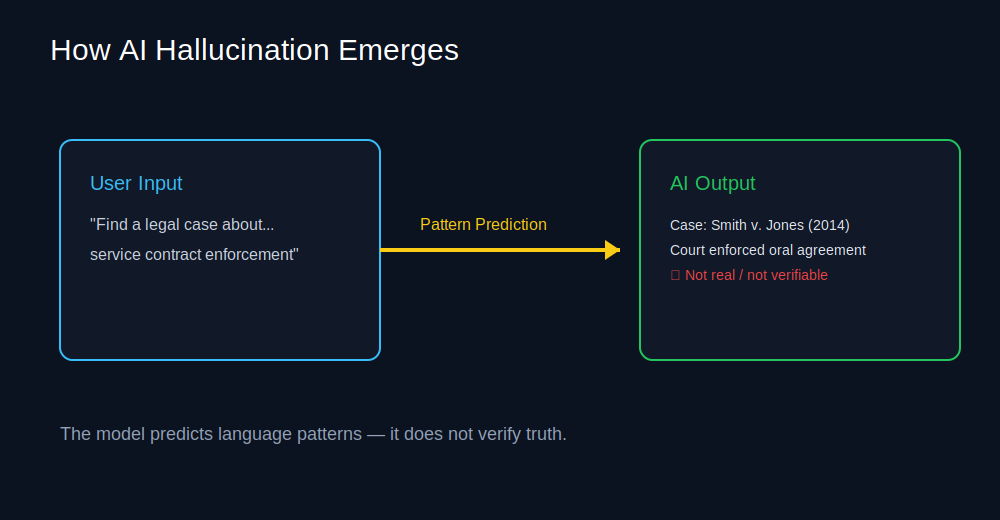

---

## The Critical Misconception: Confidence = Truth

One of the most misleading properties of AI systems is that **language quality mimics reliability**.

A hallucinated answer can be:

- Well structured  
- Professionally worded  
- Cited in a believable format  
- Delivered without hesitation  

This creates a false signal of correctness.

In human communication, confidence often correlates with expertise.

In AI systems, it does not.

That mismatch is where most real-world misuse begins.

---

## Visual: Confidence vs Accuracy Gap

Place this image directly below this section.

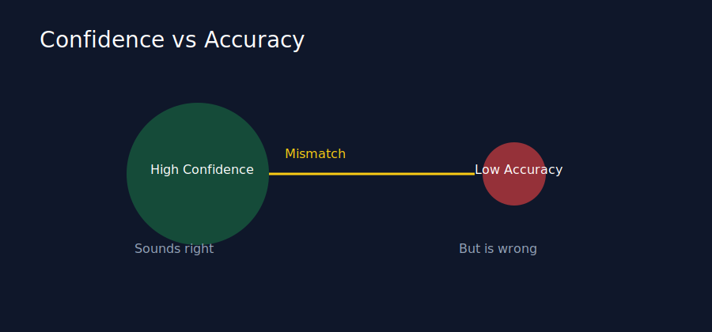

---

## Generation vs Verification

To understand hallucinations, it helps to separate two fundamentally different approaches to knowledge:

### Retrieval Systems
These systems:
- Search databases  
- Return stored, verified information  
- Are constrained by existing records  

### Generative Systems
These systems:
- Construct responses dynamically  
- Predict likely language sequences  
- Do not inherently verify facts  

Most AI assistants belong to the second category.

And that difference is fundamental.

---

## Visual: Two Ways of Producing Answers

Place this image directly below this section.

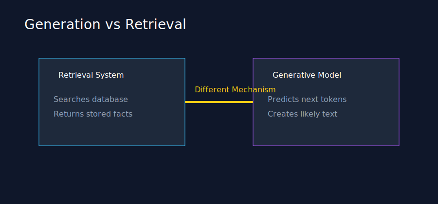

---

## Why This Matters in Real Work

In domains like law, healthcare, and finance, hallucinations are not just technical errors.

They become:
- Misleading citations  
- Incorrect case references  
- Confident but false explanations  

The risk is not randomness.

The risk is **plausible falsehood at scale**.

---

## Key Insight

Hallucination is not a rare malfunction.

It is a predictable behavior of systems designed for linguistic prediction rather than factual grounding.

This leads to a practical rule:

> AI output is a starting point, not a final authority.

---

## Transition

Once this behavior is understood, the next question becomes more important:

How do we reduce hallucinations—or at least detect them before they cause harm?

That is where the next section begins.

# Section 2 — Why Even Powerful AI Gets Things Wrong

Hallucinations are not random mistakes. They are structured outcomes of how language models are trained, scaled, and used.

To understand why they happen, it helps to move beyond the idea of “wrong answers” and focus on a deeper question:

> What is the system actually optimized to do?

The answer is simple, and slightly uncomfortable.

It is optimized to produce the most likely continuation of text—not the most truthful one.

---

## The Training Objective Problem

Large language models are trained using a single core objective:

> Predict the next token in a sequence.

This means the model learns patterns like:

- How legal language is structured  
- How scientific explanations are phrased  
- How facts are typically described in text  

But it does not learn:

- Whether a statement is true  
- Whether a citation exists  
- Whether a claim is verified in reality  

So when the model generates an answer, it is completing a linguistic pattern—not consulting a truth database.

---

## Visual: What the Model Actually Learns

Place this image directly below this section.

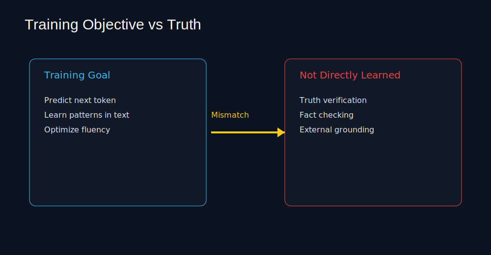

---

## The Role of Data: Everything is Mixed Together

Training data contains:

- Correct information  
- Outdated information  
- Contradictory explanations  
- Fictional content  
- Poor-quality text  

The model does not separate these categories.

It compresses them into statistical relationships.

So the system does not “store facts.”

It stores *associations between words that often appear together*.

This is powerful—but not clean.

---

## Why Plausibility Wins Over Accuracy

When generating text, the model evaluates many possible next words and selects the most statistically likely one.

If multiple continuations exist:

- One is factually correct  
- One is commonly phrased  
- One is structurally smoother  

The model often chooses the one that “sounds right,” not the one that is verified.

This is especially dangerous in domains where incorrect phrasing still looks authoritative.

---

## Visual: Plausible but Wrong Path

Place this image directly below this section.

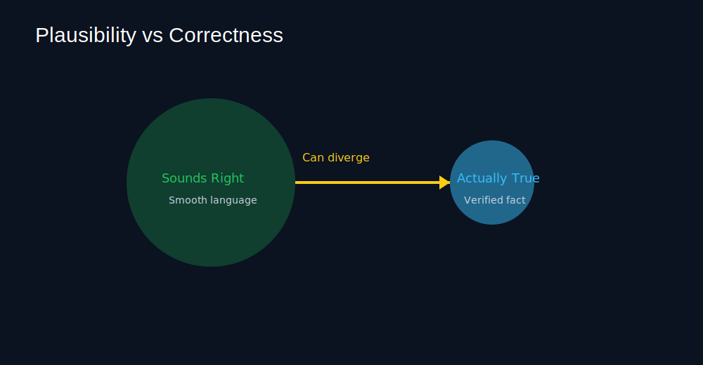

---

## No Built-In Reality Check

A critical misunderstanding is assuming the model “checks its answer.”

It does not.

There is no internal mechanism that says:

- “Is this citation real?”  
- “Does this case exist?”  
- “Is this medical claim verified?”  

Unless explicitly connected to external tools (search engines, databases, retrieval systems), the model operates in isolation.

That isolation is where hallucinations grow.

---

## Visual: Isolated Generation System

Place this image directly below this section.

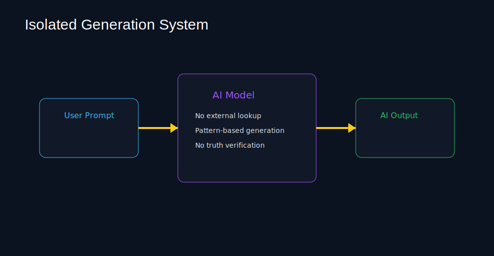

---

## Scaling Makes the Problem More Subtle

As models become larger:

- Language becomes more fluent  
- Structure becomes more convincing  
- Domain coverage becomes broader  
- Errors become harder to detect  

Paradoxically, better language quality can make hallucinations *less visible but more believable*.

This is why modern AI failures are often not obvious mistakes—they are convincing inaccuracies.

---

## The Real Failure Mode

The problem is not that AI is unpredictable.

The problem is that it is **predictably fluent even when uncertain**.

That creates a new category of risk:

> High-quality language with low-quality grounding.

---

## Key Insight

Hallucinations are not edge cases to be eliminated.

They are a direct consequence of optimizing for language fluency without guaranteed grounding in truth.

This means:

- The model is not broken  
- The objective is simply incomplete for factual reliability  

---

## Transition

Once we understand why hallucinations happen, the next step is practical:

How do we detect them, reduce them, and design systems that compensate for them?

That is where things become operational rather than theoretical.

# Section 3 — How to Detect When AI Is Making Things Up

Knowing that hallucinations exist is not enough. In real workflows—especially legal, medical, or financial work—the critical skill is not awareness, but detection.

The challenge is simple:

> AI does not usually announce when it is uncertain.

So the responsibility shifts to the user and the system design.

---

## The Core Problem: Fluent Falsehoods

Hallucinations are difficult to detect because they are not messy.

They are clean.

A hallucinated answer often includes:

- Proper structure  
- Professional tone  
- Plausible citations  
- Internally consistent reasoning  

In other words, it looks like high-quality output.

This is what makes detection non-trivial.

---

## Detection Strategy 1 — Source Anchoring

One of the most reliable ways to detect hallucinations is to ask a simple question:

> “Where did this come from?”

If the answer includes:

- Verifiable citations  
- Known databases  
- Traceable documents  

Then the claim can be checked.

If not, the response is likely generated rather than retrieved.

---

## Visual: Source Anchoring Check

Place this image directly below this section.

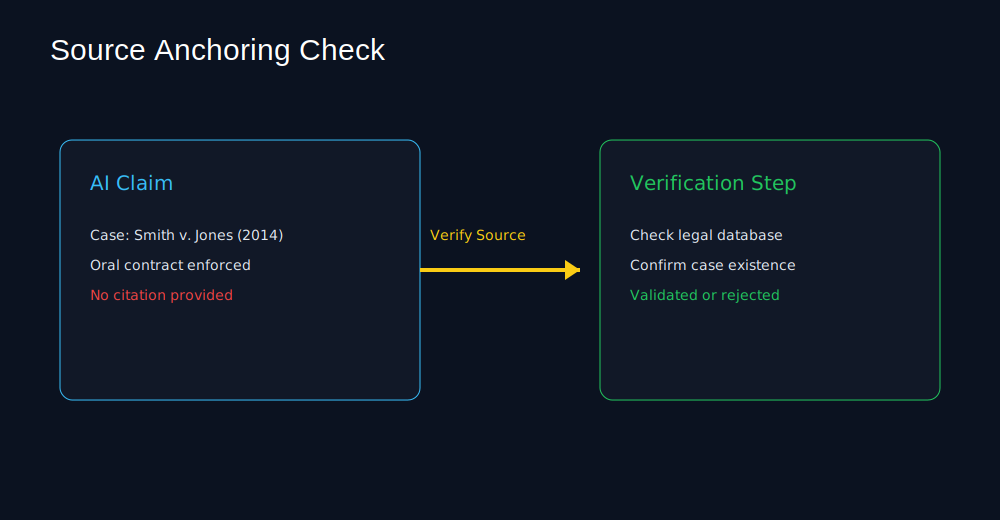

---

## Detection Strategy 2 — Specificity Stress Test

Hallucinations often fail under pressure.

A useful technique is to increase specificity:

- Ask for case numbers  
- Ask for exact dates  
- Ask for direct quotations  
- Ask for jurisdiction details  

If the model begins to:

- Hedge  
- Shift language  
- Or produce inconsistent details  

It is likely filling gaps rather than recalling grounded information.

---

## Visual: Specificity Stress Test Flow

Place this image directly below this section.

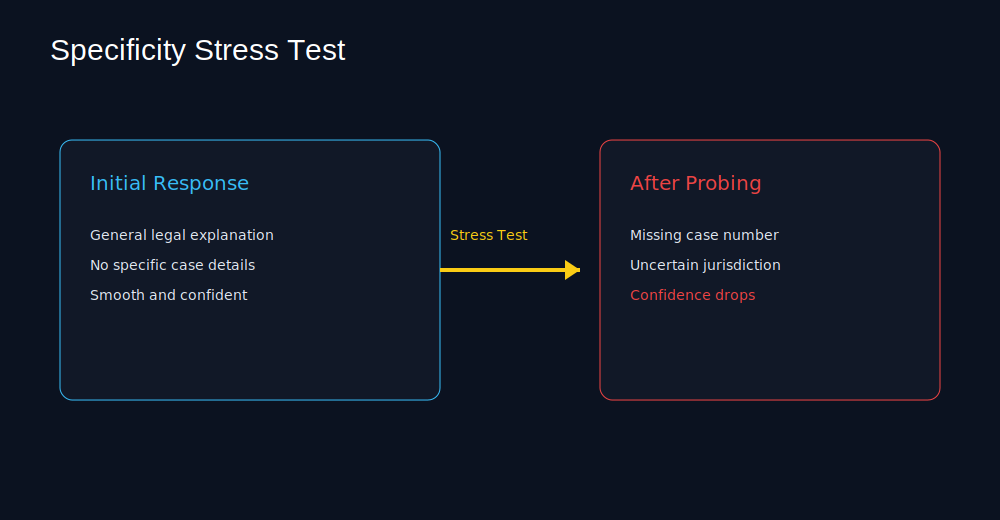

---

## Detection Strategy 3 — Cross Verification

No single AI output should be treated as authoritative.

A simple rule applies:

> If it matters, verify it twice.

Cross-verification methods include:

- Checking legal databases  
- Using search engines  
- Comparing multiple AI outputs  
- Consulting primary sources  

Consistency across independent sources increases confidence.

Inconsistency is a warning signal.

---

## Visual: Cross Verification System

Place this image directly below this section.

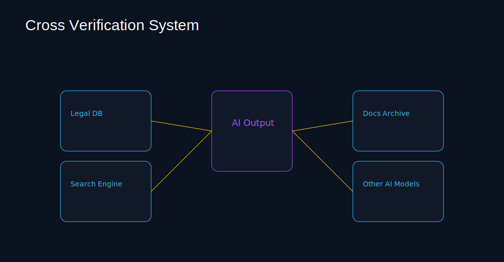

---

## Detection Strategy 4 — Internal Logic Audit

Even when external sources are unavailable, hallucinations can sometimes be detected internally.

Look for:

- Overly perfect reasoning chains  
- Claims without supporting steps  
- Sudden introduction of specific facts without buildup  
- Unsupported legal or technical references  

A real explanation builds constraints gradually.  
A hallucination often inserts details abruptly.

---

## Why Detection Is Still Hard

Even with these strategies, hallucinations remain difficult to eliminate because:

- They are linguistically polished  
- They mimic authoritative writing styles  
- They often align with user expectations  
- They exploit gaps in domain knowledge  

This creates a trust illusion.

The system appears competent even when it is uncertain.

---

## Visual: Trust Illusion Loop

Place this image directly below this section.

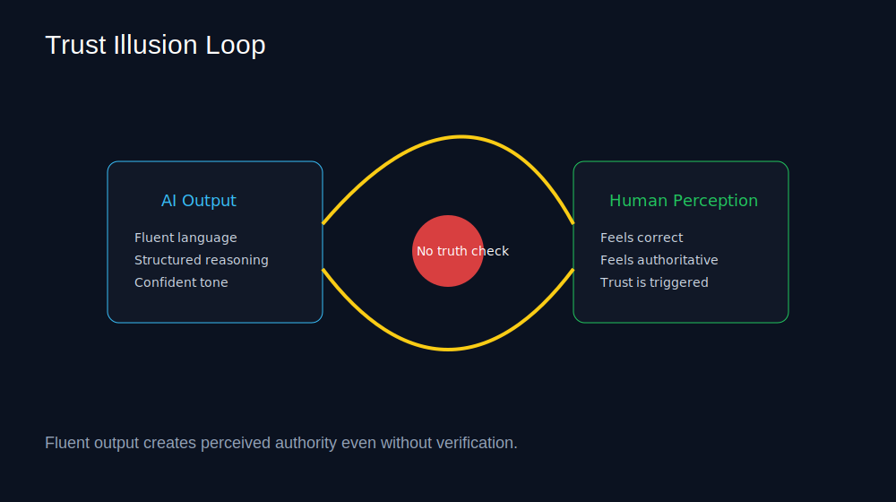

---

## Key Insight

Detection is not about finding obvious errors.

It is about identifying *hidden uncertainty disguised as certainty*.

This requires a shift in mindset:

> Do not evaluate AI outputs for how they sound.  
> Evaluate them for how they can be verified.

---

## Transition

Once detection becomes a habit, the next step is system-level thinking:

How do we design AI tools that reduce hallucinations at the source rather than relying on human correction?

That is where architecture begins to matter more than prompts.

# Section 4 — Designing AI Systems That Stay Grounded

Detection helps you catch hallucinations after they appear.  
But in production systems, that is not enough.

The real engineering challenge is earlier in the pipeline:

> How do you design systems that reduce hallucinations before they happen?

This is where architecture matters more than prompts.

---

## From “One Model” to “One System”

A common misconception is that modern AI is a single brain answering questions.

In reality, robust AI applications are **systems**, not models.

A production-grade AI setup often includes:

- A language model (generation)  
- A retrieval system (facts)  
- A ranking system (relevance)  
- Guardrails (safety and validation rules)  
- Tool access (search, databases, APIs)  

When these components work together, hallucinations can be reduced significantly.

---

## Visual: From Model to System

Place this image directly below this section.

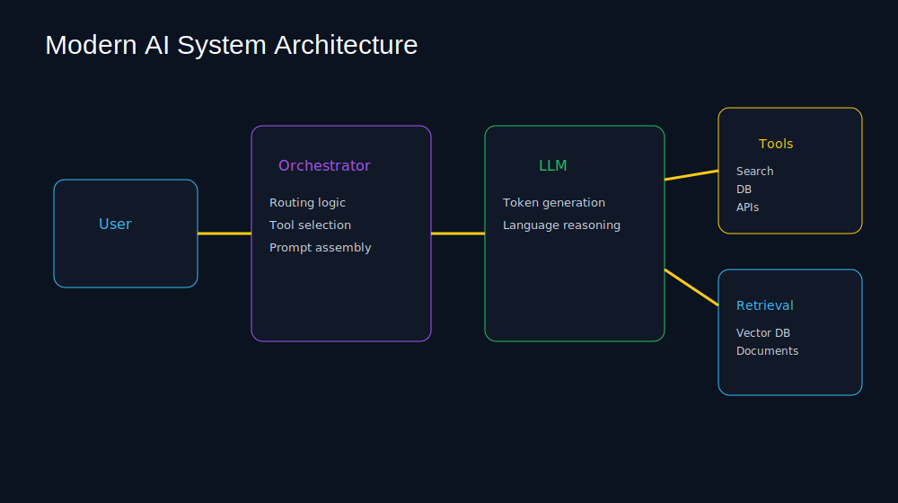

---

## RAG: The Most Important Antidote

The most widely used solution to hallucination in real-world systems is:

> Retrieval-Augmented Generation (RAG)

Instead of relying only on internal memory, the model:

1. Receives a question  
2. Searches external documents  
3. Retrieves relevant passages  
4. Generates an answer grounded in those sources  

This changes everything.

The model is no longer guessing in isolation—it is anchored to evidence.

---

## Visual: RAG Pipeline

Place this image directly below this section.

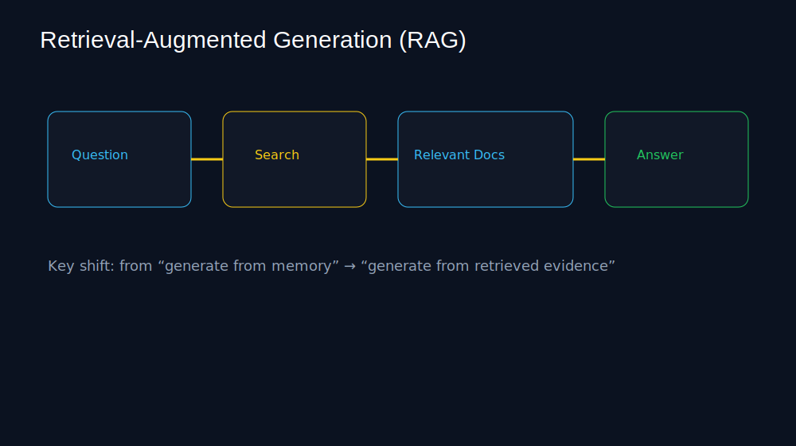

---

## Why RAG Works

RAG works because it shifts the system from:

- “What is most likely text?”  
to  
- “What is most relevant evidence?”

This introduces a constraint that language models alone do not have:

> Grounded context from real data sources

However, RAG is not perfect. It inherits problems from:

- Incomplete databases  
- Poor retrieval quality  
- Irrelevant document ranking  

So it reduces hallucination, but does not eliminate it.

---

## Guardrails: Controlling Output Behavior

Even with retrieval, models can still hallucinate or over-generalize.

This is where guardrails come in.

Guardrails are system-level rules such as:

- “Only answer using retrieved sources”  
- “Cite documents before making claims”  
- “Refuse when no evidence is found”  
- “Flag uncertain outputs”  

They do not change the model itself.

They control how the model is allowed to behave.

---

## Visual: Guardrails Layer

Place this image directly below this section.

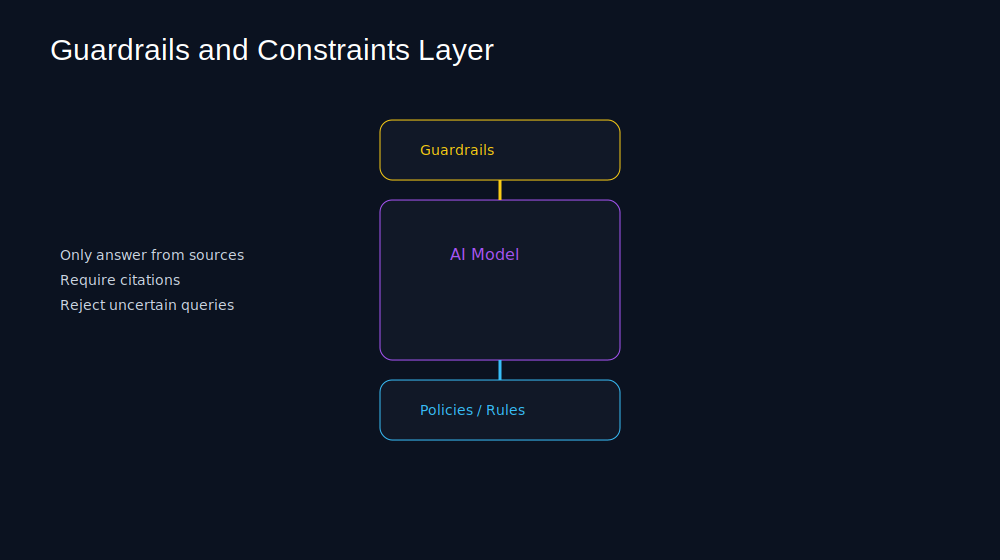

---

## Tool Use: Forcing External Reality Checks

Another powerful approach is tool integration.

Instead of generating everything internally, the model can:

- Query databases  
- Search the web  
- Call APIs  
- Retrieve structured legal or medical records  

This forces interaction with external reality.

The difference is simple but important:

- Without tools → imagination-driven generation  
- With tools → evidence-constrained generation  

---

## Visual: Tool-Enabled AI Flow

Place this image directly below this section.

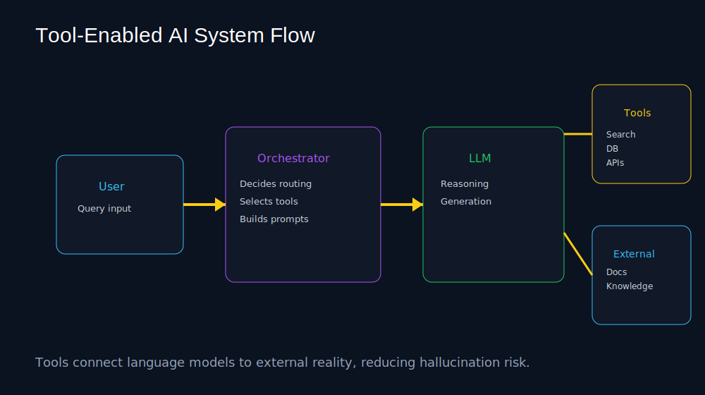

---

## The Real Engineering Insight

The most reliable AI systems are not those that “know more.”

They are systems that:

- Know when to search  
- Know when to refuse  
- Know when to cite sources  
- Know when uncertainty is required  

In other words:

> Reliability is not intelligence—it is constraint design.

---

## Why Hallucinations Still Persist

Even with RAG, tools, and guardrails, hallucinations still appear because:

- Retrieval systems can miss relevant data  
- Models can over-generalize retrieved content  
- Instructions can be ignored in edge cases  
- Context windows can drop important constraints  

So the goal is not elimination.

It is reduction and containment.

---

## Key Insight

Hallucinations are not solved by making models “smarter.”

They are controlled by surrounding them with:

- Better data pipelines  
- Strong retrieval systems  
- Explicit constraints  
- External verification tools  

The intelligence is distributed across the system—not concentrated in the model.

---

## Transition

Once systems are grounded in external evidence, the final question emerges:

Even with all safeguards in place, why do hallucinations still appear in subtle, unexpected ways?

That is where we move from system design to real-world failure modes.

# Section 5 — AI Failure Taxonomy and Real-World Legal Failure Cases

At this point, hallucinations are no longer abstract.

They are observable behaviors that show up in production systems, legal workflows, and decision pipelines.

To make them operationally useful, we need a taxonomy—not just descriptions.

Because not all hallucinations are the same failure.

Some are harmless.  
Some are subtle.  
Some are legally catastrophic.

---

# 1. The AI Failure Taxonomy

AI hallucinations can be grouped into distinct failure modes based on *how* and *why* the system breaks.

---

## 1.1 Fabricated Entities (Nonexistent Facts)

This is the most direct form of hallucination.

The model generates:

- Fake case names  
- Nonexistent statutes  
- Invented research papers  
- Incorrect citations  

These outputs look real because they follow correct formatting patterns.

### Key property:
> The structure is real. The content is not.

---

### Visual: Fabricated Entity Failure

Place this image directly below this section.

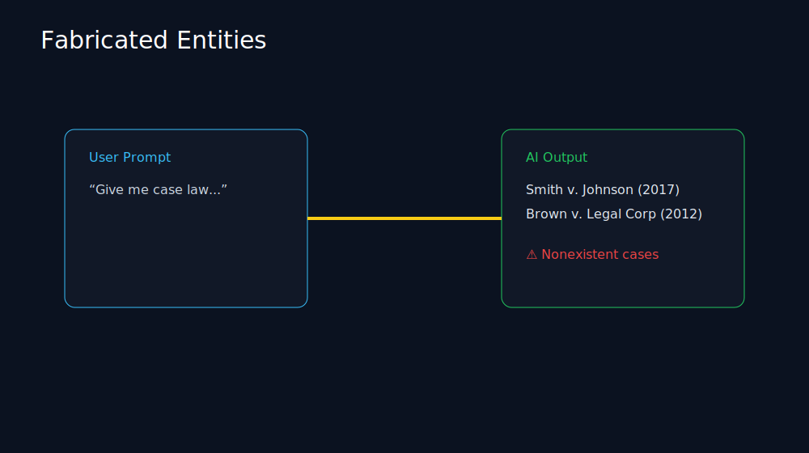

---

## 1.2 Blended Reality (Partial Truth Corruption)

Here, the model mixes:

- Real cases  
- Real principles  
- Incorrect facts or jurisdictions  

This is more dangerous than full fabrication because it feels “almost correct.”

### Example pattern:
A real case exists, but:
- Wrong holding is attached  
- Wrong year is inserted  
- Jurisdiction is altered  

---

### Visual: Blended Reality Failure

Place this image directly below this section.

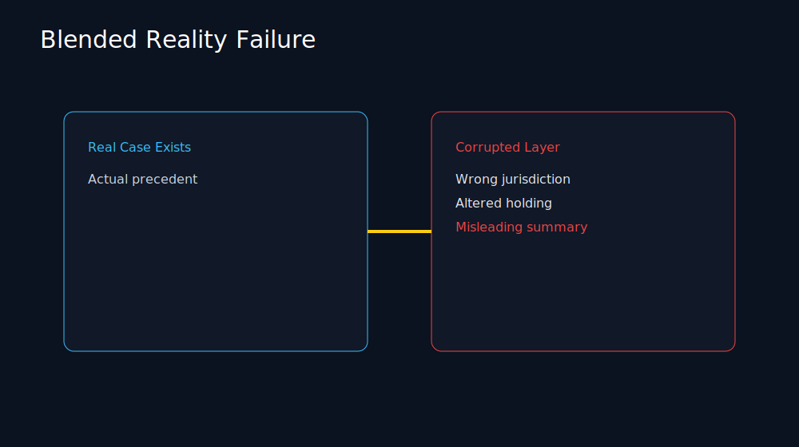

---

## 1.3 Citation Hallucination (Fake Authority Layering)

This is especially critical in legal workflows.

The model produces:

- Real-sounding citations  
- Fake page numbers  
- Fabricated quotes  
- Misattributed rulings  

Even when the reasoning is correct, the authority is not.

### Key risk:
> Users trust the citation more than the reasoning.

---

### Visual: Citation Hallucination Layer

Place this image directly below this section.

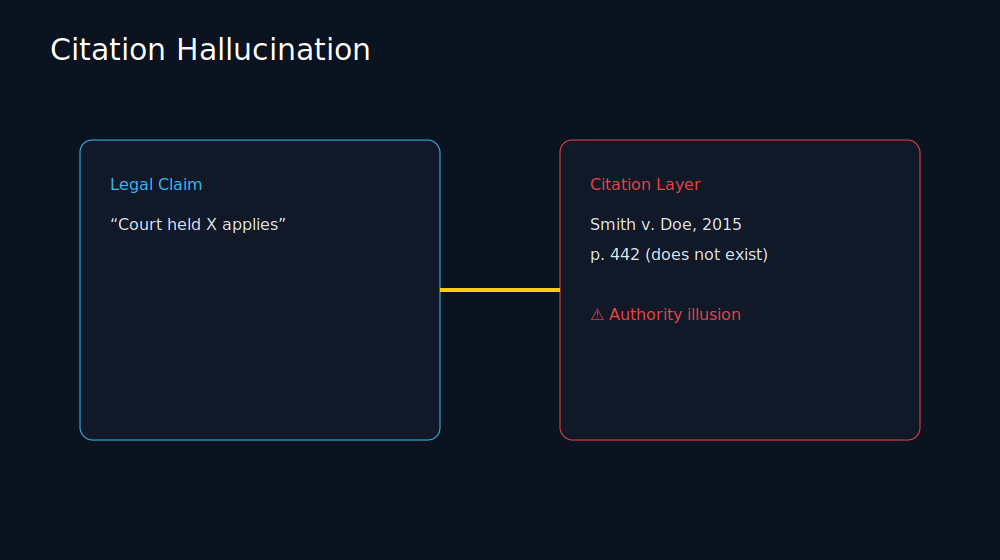

---

## 1.4 Reasoning Drift (Logical Consistency Failure)

In this case, the model starts correctly but gradually diverges.

Common patterns:

- Steps remain logical locally  
- Global conclusion becomes incorrect  
- Assumptions silently change mid-explanation  

This is subtle and difficult to detect without careful review.

---

### Visual: Reasoning Drift Path

Place this image directly below this section.

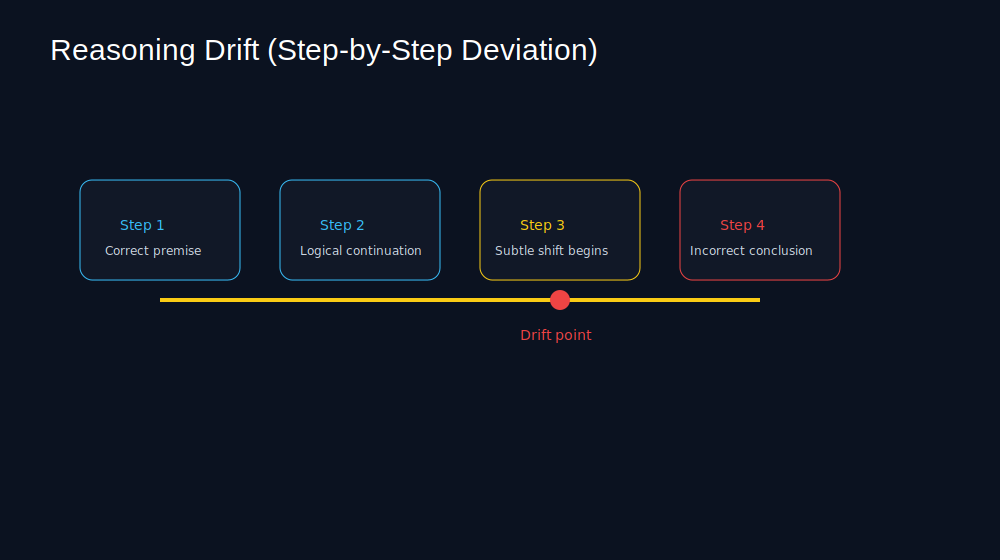

---

## 1.5 Overgeneralization Failure

The model takes:

- A valid rule  
and expands it beyond its scope.

Example:
- A rule that applies in one jurisdiction is generalized globally  
- A concept from one domain is applied incorrectly in another  

This is common in legal reasoning.

---

### Visual: Overgeneralization Expansion

Place this image directly below this section.

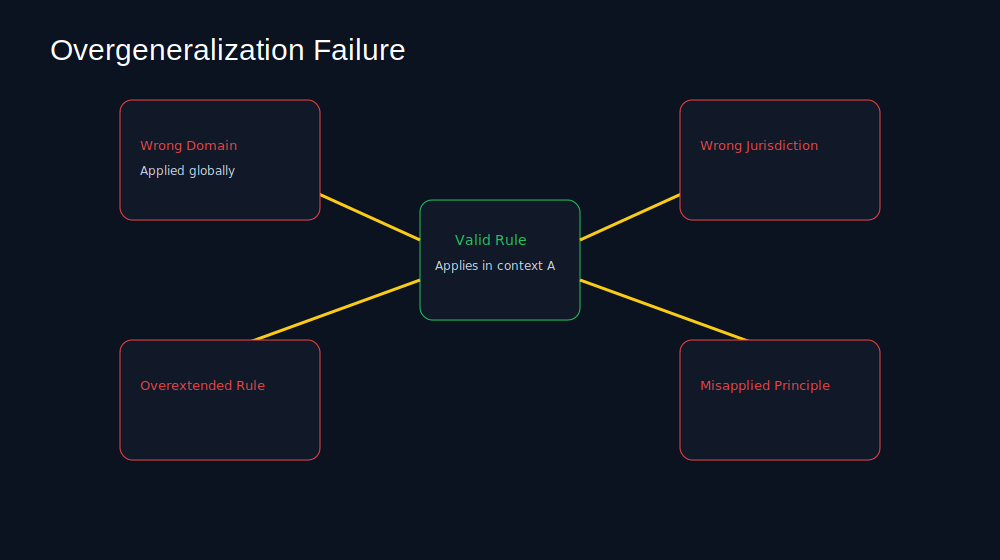

---

# 2. Real-World Legal Failure Patterns

Now we move from classification to reality.

These are failure patterns observed in legal AI usage, research assistants, and early generative legal tools.

---

## 2.1 The Fake Case Problem

One of the earliest and most documented failures in legal AI systems:

A model generates:

- Case names that do not exist  
- Court decisions that are not recorded  
- Citations that lead nowhere  

In legal workflows, this is not a minor error—it is disqualifying.

Even a single fabricated case can undermine an entire argument.

---

### Why it happens:
Because legal writing has strong structural predictability:

- Case formats are repetitive  
- Citation styles are standardized  
- Language patterns are highly formulaic  

This makes legal text easy to imitate—and easy to fake convincingly.

---

## 2.2 The “Hallucinated Precedent” Risk

A more subtle failure:

The AI references a real case—but misrepresents its legal significance.

Example pattern:

- Case exists  
- Holding is oversimplified or reversed  
- Legal principle is generalized incorrectly  

This creates *false legal authority*.

---

### Why this is dangerous:
Law depends on precise interpretation, not just existence of cases.

A slightly wrong interpretation can change:

- Liability outcomes  
- Contract validity  
- Statutory interpretation  

---

## 2.3 Jurisdiction Drift

AI systems often fail to respect jurisdictional boundaries.

They may:

- Mix US federal and state law  
- Combine UK and US legal principles  
- Ignore local statutory differences  

This leads to legally invalid conclusions that still sound plausible.

---

## 2.4 Fabricated Quotations in Legal Arguments

A particularly high-risk failure:

The model generates:

> “Direct quotes” from judges or statutes that do not exist

These are often syntactically perfect and formatted correctly.

But they are entirely fictional.

This is one of the most dangerous forms of hallucination in legal contexts because it mimics authoritative evidence.

---

## 3. Why Legal Domains Are Especially Vulnerable

Legal text is uniquely vulnerable because:

- It is highly structured  
- It relies on precedent repetition  
- It contains standardized citation formats  
- It values authority signals over raw explanation  

This creates a perfect environment for hallucinations to look legitimate.

---

## Visual: Legal Vulnerability Map

Place this image directly below this section.

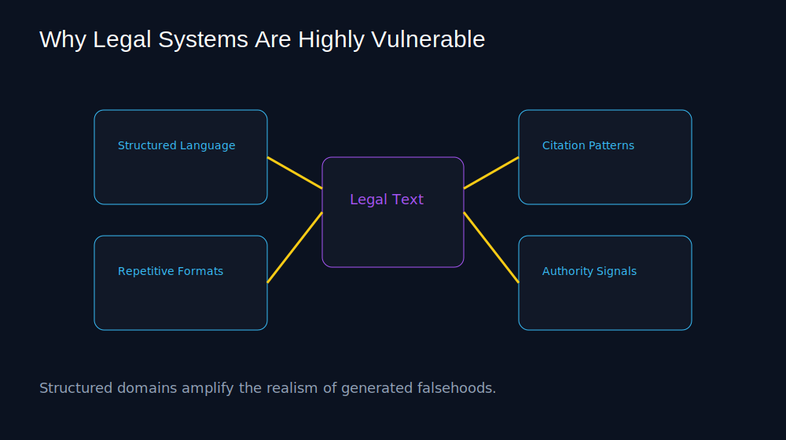

---

# 4. Key Insight: Failure Is Structured, Not Random

Across all categories, one pattern emerges:

> AI failures are not chaotic—they follow predictable structures.

This means:

- They can be categorized  
- They can be anticipated  
- They can be mitigated in system design  

But they cannot be fully eliminated.

---

# 5. Final Insight of Section 5

The goal is not to build hallucination-free systems.

The goal is to build:

- Verification-aware systems  
- Source-grounded workflows  
- Constraint-driven generation pipelines  

Because in real-world applications:

> Reliability is not the absence of error—it is the control of error impact.

---

# Transition

With hallucinations now mapped, detected, and categorized, the final question emerges:

What does it mean to build AI systems that fail safely rather than fail silently?

That is where the discussion moves next.

# Section 6 — Working With AI That Can Be Wrong

At this point, one conclusion should be obvious:

AI systems will hallucinate in real workflows.

Not occasionally. Not theoretically. Practically.

So the question is no longer whether hallucinations exist.

It is:

> How do professionals work safely in systems that are statistically fluent but not always factually grounded?

The answer is not avoidance. It is structured usage.

---

# 1. The Core Shift: From Trust to Workflow Design

Most failures in real-world AI usage come from a single mistake:

> Treating AI output as finished truth instead of draft reasoning.

In professional environments, the correct mental model is:

- AI = fast generator of plausible drafts  
- Human = verifier of correctness and applicability  

This is not about mistrust.

It is about role separation.

---

## Visual: Human–AI Responsibility Split

Place this image directly below this section.

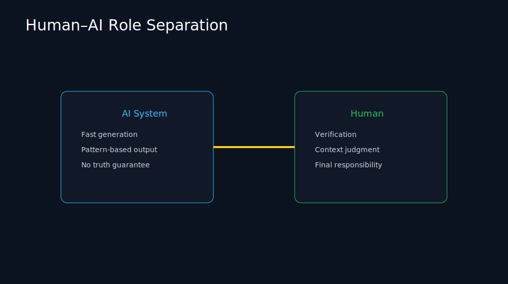

---

# 2. The Verification-First Workflow

The safest way to use AI in high-stakes domains is not to “ask better questions.”

It is to enforce a **verification pipeline**.

A reliable workflow looks like this:

### Step 1 — Generate
AI produces a draft answer.

### Step 2 — Extract claims
Identify:
- Facts  
- Citations  
- Legal references  
- Numbers or entities  

### Step 3 — Validate
Cross-check against:
- Primary sources  
- Databases  
- Trusted references  

### Step 4 — Decide
Only then accept, modify, or reject.

---

## Visual: Verification Pipeline

Place this image directly below this section.

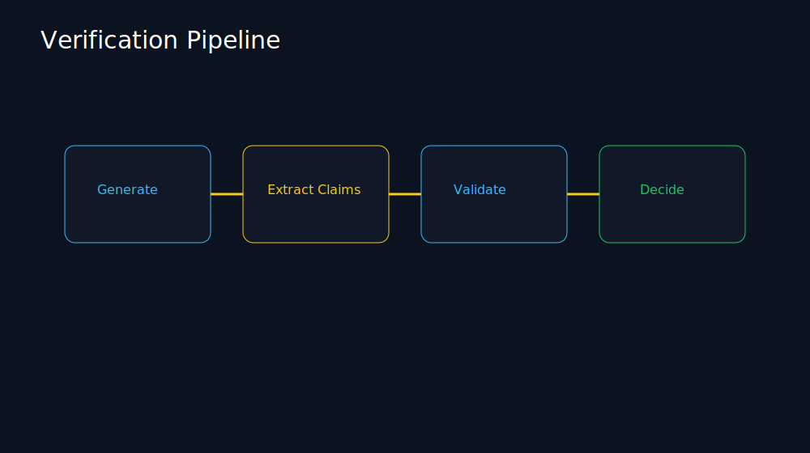

---

# 3. Human-in-the-Loop is Not Optional

A critical misunderstanding in AI deployment is automation bias:

> If the system is intelligent, it must be correct.

This assumption fails in domains where:

- Precision matters more than fluency  
- Errors have legal or financial consequences  
- Authority signals are easy to fake  

So the correct architecture is:

> AI generates → Human validates → System records decision

Not full automation.

Not blind trust.

---

## Visual: Human-in-the-Loop System

Place this image directly below this section.

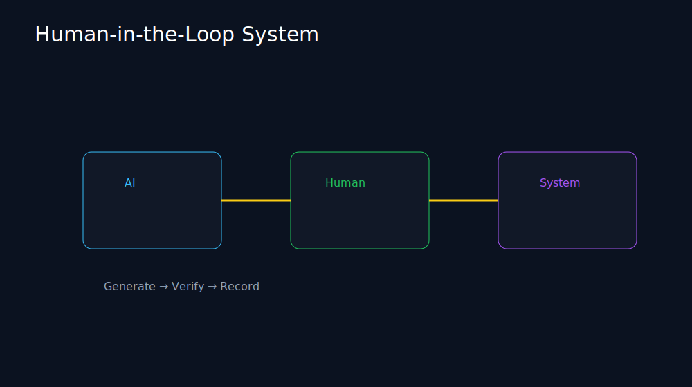

---

# 4. Risk-Based Usage: Not All Queries Are Equal

Not every AI interaction carries the same risk.

We can classify usage into three tiers:

## Low Risk
- Brainstorming ideas  
- Drafting emails  
- Summarizing general knowledge  

## Medium Risk
- Technical explanations  
- Research assistance  
- Educational content  

## High Risk
- Legal interpretation  
- Medical guidance  
- Financial or compliance decisions  

Each tier requires a different level of verification rigor.

---

## Visual: AI Risk Tier Model

Place this image directly below this section.

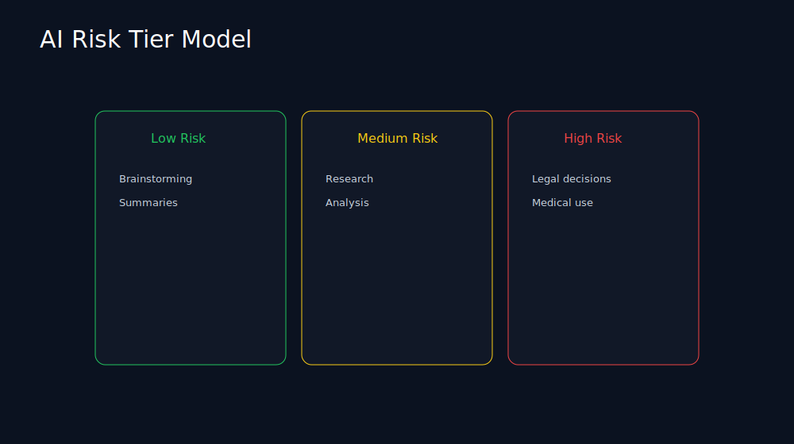

---

# 5. Citation Discipline in Professional Use

In legal and research-heavy workflows, hallucination risk concentrates around citations.

So a strict rule applies:

> A claim without a source is not a usable claim.

Professionals should enforce:

- Source-first reasoning  
- Citation validation before adoption  
- Zero tolerance for fabricated references  

If a citation cannot be verified, the entire argument built on it becomes unstable.

---

# 6. Designing Against Hallucinations (System View)

The most reliable systems do not rely on the model alone.

They combine:

- Retrieval systems (RAG)  
- Validation layers  
- Tool access (databases, APIs)  
- Output constraints (citations required)  
- Human review checkpoints  

This creates a layered defense.

Not elimination of error—but containment of error impact.

---

## Visual: Defense-in-Depth AI System

Place this image directly below this section.

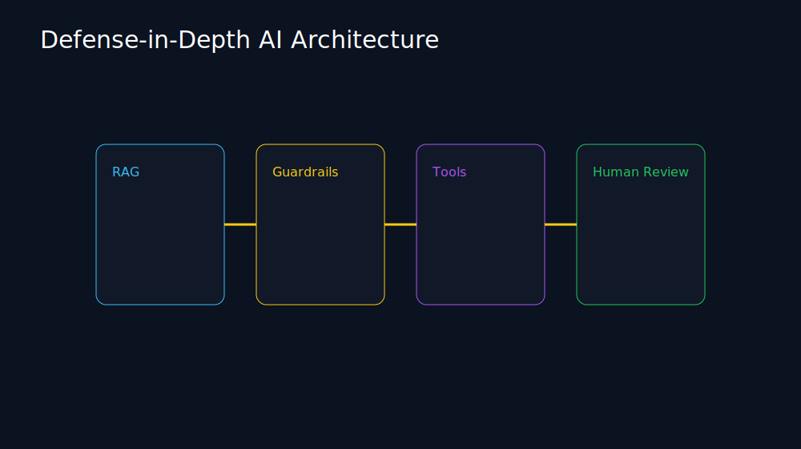

---

# 7. Key Insight

The most important shift in professional AI usage is this:

> The goal is not to eliminate hallucinations.  
> The goal is to make them economically and operationally harmless.

This changes how systems are designed:

- Less focus on “perfect answers”  
- More focus on “verifiable answers”  
- Less trust in generation  
- More trust in pipelines  

---

# 8. Final Insight of Chapter 31

Hallucinations are not failures you remove at the model level.

They are risks you manage at the system level.

And once you accept that, AI stops being a questionable oracle…

…and becomes what it was always meant to be:

> A powerful but bounded reasoning engine inside a structured verification system.

---

# Transition to Chapter 32

Even with all safeguards in place, some limitations remain unavoidable.

The next chapter explores exactly that:

> What AI still cannot do—no matter how advanced it becomes.

# Insight Box — Hallucinations in One Frame

If you strip away the technical language, hallucinations can be reduced to a simple operational reality:

> AI systems are optimized to produce *likely language*, not guaranteed truth.

This single design choice explains most of what follows:

- Why answers sound confident even when they are wrong  
- Why fabricated citations appear so realistic  
- Why legal and technical domains are especially vulnerable  
- Why errors scale with fluency, not accuracy  

---

## The Core Trade-off

Every AI system sits on a fundamental tension:

- **Fluency**: Does the output sound natural, structured, and helpful?  
- **Fidelity**: Is the output grounded in verifiable reality?

Modern language models heavily optimize for the first.

They approximate the second only when supported by external systems like retrieval, tools, or validation layers.

---

## What Hallucination Actually Means

A hallucination is not a “bugged answer.”

It is:

- A statistically plausible continuation of text  
- Produced without access to truth verification  
- Accepted by humans because it resembles authoritative language  

In other words:

> Hallucination is linguistic realism without epistemic grounding.

---

## Why This Matters Practically

In real-world usage, the risk is not obvious failure.

It is **credible error**:

- Wrong legal precedent that looks legitimate  
- Incorrect medical explanation that sounds precise  
- Fake citation formatted like a real one  
- Reasoning that is internally consistent but externally false  

The danger increases in proportion to how well the system communicates.

---

## The Professional Rule

Across law, engineering, research, and policy work, a simple operational rule emerges:

> If it cannot be verified, it should not be treated as fact.

This leads to a workflow principle:

- AI is a generator of hypotheses  
- Humans and systems are validators of truth  

---

## Final Insight

Hallucinations are not anomalies to eliminate at all costs.

They are constraints to design around.

The real maturity of AI systems is not measured by whether they can avoid errors entirely, but by:

> how safely they behave when errors inevitably occur.

# Final Thoughts

Hallucinations are often treated like a flaw that needs to be engineered away. That framing is incomplete.

They are better understood as a structural consequence of how modern AI systems work.

A system trained to predict language will inevitably produce language that *resembles truth*, even when truth is not accessible or verified. That is not a failure of intent. It is a limitation of mechanism.

---

## What This Chapter Really Established

Across this chapter, a consistent pattern emerges:

- AI can generate convincing answers without grounding  
- Confidence is not a measure of correctness  
- Errors are often fluent, structured, and hard to detect  
- Certain domains amplify this risk dramatically  
- System design matters more than model behavior alone  

Taken together, these points shift the discussion away from “Can we trust AI?” toward something more precise:

> “Under what conditions can AI be made reliable enough to use safely?”

---

## The Real Shift in Thinking

The most important change is not technical—it is cognitive.

Before understanding hallucinations, users tend to assume:

- Correctness is embedded in fluency  
- Authority is implied by structure  
- A confident answer is a validated answer  

After understanding hallucinations, that assumption breaks.

What replaces it is a more disciplined model:

- Output is provisional until verified  
- Language quality is independent of factual accuracy  
- Systems must be designed with external grounding in mind  

---

## Where This Leads Next

Once hallucinations are understood as system behavior rather than anomalies, the next logical question is unavoidable:

> What are the hard limits of these systems, even when everything is designed correctly?

There are domains where:
- Retrieval is incomplete  
- Context is insufficient  
- Ambiguity cannot be resolved  
- And uncertainty is not reducible  

These are not edge cases. They are structural boundaries.

---

## Closing Insight

The most important lesson from this chapter is not how to detect hallucinations, or how to reduce them in systems.

It is this:

> Intelligence without grounding is not reliability—it is fluency under uncertainty.

And once that distinction is clear, the role of AI changes.

It stops being treated as an authority.

And starts being used for what it actually is:

A powerful generator of structured ideas that must always be anchored to something outside itself before being trusted.