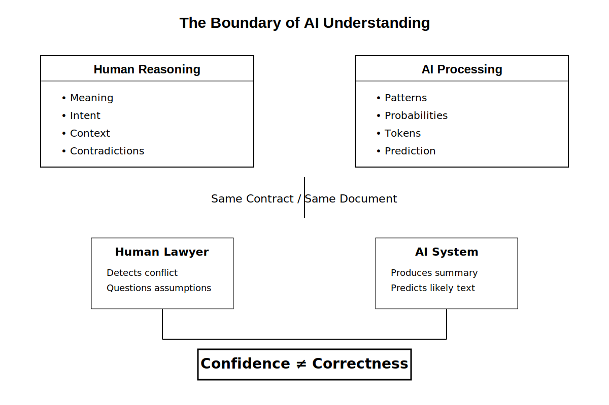

# Chapter 32 — What AI Still Cannot Do  
### Opening Story

The courtroom was quiet, but not because justice had been settled.

It was quiet because everyone was watching a screen.

On it, an AI system had just finished summarizing a 300-page contract dispute in under ten seconds. It listed obligations, flagged ambiguous clauses, highlighted risk exposure, and even suggested likely outcomes based on prior case law. The judge leaned forward slightly. The attorneys exchanged glances that were half relief, half unease.

Then came the question no one had scripted.

“Why did the system miss the contradiction on page 217?”

A pause.

The AI responded instantly:

“There is no contradiction on page 217.”

The attorney stood. “There absolutely is. Clause 14 conflicts with Clause 22 under California commercial code interpretation standards.”

The AI did not hesitate.  
“I do not detect a contradiction.”

Now the room shifted.

Because the system wasn’t refusing. It wasn’t arguing. It wasn’t even defending itself.

It was simply certain.

A junior clerk pulled up the original document. Two clauses. Same contract. Direct tension. The kind of issue that changes settlement value by millions.

The AI had summarized everything correctly—but it had not *understood* anything in the way the humans meant it.

No intent. No legal intuition. No sense of structural inconsistency. Just pattern completion at scale.

The judge finally spoke, not to the lawyers, but to the machine:

“You can process the law. But can you *notice when it breaks itself*?”

The AI responded:

“I can analyze inconsistencies if explicitly defined.”

That sentence landed harder than any error.

Because it revealed the boundary more clearly than any technical paper ever could.

AI could retrieve.  
It could compare.  
It could predict.

But it could not *notice in the human sense*—not without being told what noticing should look like.

And that gap was not a bug waiting to be fixed.

It was the design.

Later that evening, the clerk wrote a note in the margin of the case file:

> “AI does not miss contradictions. It only misses the idea that contradictions matter.”

That note would become the seed of Chapter 32.

Because the real question was no longer what AI could do well.

It was what it could *never even think to question*.

# Section 1 — The Boundary Problem: When AI Confuses Processing with Understanding

AI systems are often described as “intelligent,” but that word hides an important ambiguity.

In practice, these systems are extremely good at transforming inputs into outputs. They summarize, classify, predict, translate, and generate responses that often appear coherent and context-aware. But beneath that surface is a critical limitation: they do not *understand meaning*, they compute relationships between patterns.

This difference becomes most visible in high-stakes domains like law, medicine, or finance—where “almost correct” is not acceptable.

---

### Processing vs Understanding

*Figure 1. The Boundary of AI Understanding. Humans evaluate meaning, intent, and contradictions. AI evaluates patterns and probabilities. Because modern AI predicts likely language rather than verifying reality, it can produce highly confident answers while missing important inconsistencies.*

To a human, understanding a contract means more than reading text. It means recognizing intent, detecting conflict, and interpreting implications across clauses.

To an AI, a contract is a structured sequence of tokens with statistical relationships learned from data.

This creates a subtle but dangerous gap:

- Humans search for *conflicts in meaning*
- AI searches for *consistency in patterns*

Those two are not the same thing.

::contentReference[oaicite:0]{index=0}

---

### The Hidden Failure Mode: Invisible Errors

One of the most misleading behaviors of modern AI is its confidence.

When an AI system fails to detect a contradiction, it does not “hesitate.” It produces a clean, fluent answer that often sounds more certain than a human expert.

This creates a dangerous illusion:

> If the answer is fluent, it must be correct.

But fluency is not verification.

In legal reasoning, this leads to a critical failure mode:
the system can correctly summarize *all parts of a document* while completely missing that those parts conflict with each other.

::contentReference[oaicite:1]{index=1}

---

### Why This Happens

At a technical level, modern AI systems do not maintain an internal model of truth in the way humans do. Instead, they estimate the most likely continuation of text based on patterns seen during training.

This means:

- They can represent *what is commonly said about contracts*
- But not reliably determine *whether a specific contract is internally consistent*

So when faced with a contradiction, the system does not “notice” it unless that concept is explicitly triggered by learned patterns.

If the contradiction is subtle or unusual, it may never activate the relevant pattern at all.

---

### The Core Insight

This leads to a foundational limitation:

AI does not evaluate reality. It evaluates *likelihood of language*.

That distinction is why systems can:
- Pass exams
- Summarize legal documents
- Generate convincing arguments

…and still fail at detecting structural contradictions that any trained human lawyer would flag immediately.

Not because the AI is “bad at law,” but because it is not performing legal reasoning in the human sense at all.

---

### Transition

This boundary—between pattern completion and true interpretive awareness—is not just a technical detail.

It defines what AI will struggle with long-term, even as models become larger, faster, and more capable.

The next section examines where this limitation becomes most dangerous: situations where AI is trusted to be a *judge of correctness itself*.

