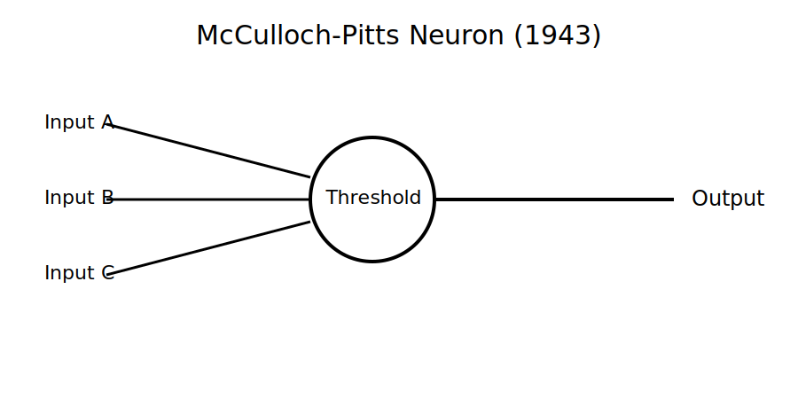

# Chapter 3: Artificial Neurons (1943)

## Section 1: The Idea That Thinking Could Be Reduced to Structure

Before artificial intelligence became a field of engineering, it began with a quiet but disruptive question: if thinking happens in the brain, can it be reduced to a set of simple rules?

In the early 1940s, Warren McCulloch and Walter Pitts approached this question from an unusual angle. They did not try to build a machine. They did not try to replicate the brain in full biological detail. Instead, they focused on something more abstract: the logic underneath neural activity.

At the time, neuroscience could observe neurons firing, but it could not yet explain how those firings produced thought. The brain was understood as a network of cells exchanging electrical signals, but the mechanism linking those signals to reasoning, memory, or perception remained unclear.

McCulloch and Pitts made a simplifying assumption that would prove historically significant: ignore the biology, keep only the decision process.

In their model, a neuron is not a biological mystery. It is a unit that performs a basic operation:

It receives inputs.
It combines them.
It produces an output based on a rule.

That rule is simple. Each input contributes either positively or not at all. The unit adds the inputs and compares the result to a threshold. If the threshold is reached, it activates. If not, it stays silent.

In compact form, the behavior can be described as:

Inputs → Weighted combination → Threshold check → Output

What matters here is not accuracy to biology, but clarity of structure. They reduced a complex living system into something closer to a logical circuit.

This shift in perspective was the real breakthrough. The question stopped being “How does the brain produce thought?” and became “What is the simplest system that can behave as if it is making decisions?”

That change is subtle, but powerful. It moves intelligence out of the realm of mystery and into the realm of construction.

Under this model, thinking is no longer a continuous, invisible process. It becomes a sequence of discrete decisions made by many small units working together.

Each unit is weak on its own. But when many are connected, the system begins to exhibit behavior that looks increasingly intelligent.

The model itself was limited. It could represent basic logical functions, but it could not learn from experience in any meaningful way. It had no memory of past inputs beyond its structure. It was, in essence, a static decision rule.

But that limitation was not a failure. It was a starting point.

Because once you accept that a neuron can be simplified into a rule-based unit, the next step becomes obvious: connect many of these units together and observe what emerges.

That idea would become the foundation of neural networks, and eventually everything from image recognition systems to modern language models.

At this stage, however, nothing “intelligent” had been built. Only a blueprint existed.

A blueprint suggesting something unusual for its time: intelligence may not be something we discover in biology—it may be something we can assemble from simple parts.


Here is the publication-ready draft for Section 2 of Chapter 3.

## Section 2: The First Artificial Neuron

The idea proposed by McCulloch and Pitts was elegant, but it remained an idea until it was expressed as a model.

Their goal was not to recreate the complexity of a biological neuron. Instead, they wanted to capture its essential behavior in the simplest possible form.

Imagine a neuron as a gatekeeper.

Several signals arrive at the gate. The neuron examines those signals and decides whether to send a signal of its own. If enough evidence is present, it activates. If not, it remains silent.



*Figure 3.1 – The McCulloch-Pitts neuron simplified the biological neuron into a mathematical decision-making unit that receives inputs, applies a threshold, and produces an output.*

That simple decision-making process became the foundation of the first artificial neuron.

The model begins with inputs.

An input is simply a signal arriving from somewhere else. In a biological brain, that signal might come from another neuron. In a machine, it could represent any piece of information.

For example, imagine a system that decides whether to carry an umbrella.

The inputs might be:

* Is it raining?
* Are there dark clouds?
* Does the weather forecast predict rain?

Each input contributes information to the decision.

The artificial neuron combines these inputs and compares the result to a threshold.

A threshold is simply a minimum level required for action.

If the combined signal exceeds the threshold, the neuron activates.

If the signal falls below the threshold, nothing happens.

In other words:

Inputs → Decision Rule → Output

This may seem almost trivial, but it introduced an incredibly powerful idea.

A single artificial neuron can perform a simple logical operation.

For example:

If Input A is true AND Input B is true, activate.

Or:

If Input A is true OR Input B is true, activate.

In effect, the artificial neuron could mimic the logical building blocks used in mathematics and electronic circuits.

This was important because complex reasoning can often be broken into many simple logical decisions.

A single neuron is not intelligent.

A single neuron cannot recognize a face.

A single neuron cannot understand language.

A single neuron cannot play chess.

But a network containing thousands, millions, or even billions of such units can perform astonishingly sophisticated tasks.

The key insight was that complexity does not always require complex components.

Sometimes complexity emerges from large numbers of simple components working together.

Nature already provided an example.

A single biological neuron is not intelligent.

Yet roughly 86 billion neurons working together produce the human brain.

McCulloch and Pitts wondered whether machines might eventually achieve something similar.

Their artificial neuron was extremely simple by modern standards, but it established a principle that still lies at the heart of modern AI.

Today's neural networks contain vastly more sophisticated artificial neurons, organized into enormous interconnected layers. They learn from data, adjust their internal parameters, and perform tasks that the pioneers of 1943 could scarcely imagine.

Yet beneath all that complexity, the basic concept remains surprisingly familiar.

Information arrives.

A decision is made.

A signal is passed forward.

The first artificial neuron was small, simple, and limited.

But it was the first building block in a journey that would eventually lead to modern artificial intelligence.


## Section 3: From Brain Cells to Mathematical Models

One of the most fascinating aspects of artificial intelligence is that it was inspired by biology but ultimately became mathematics.

When people hear the term "neural network," they often imagine a digital copy of the human brain. The reality is both simpler and more interesting.

Artificial neurons were inspired by biological neurons, but they are not miniature brain cells living inside a computer. They are mathematical models designed to capture a few key ideas about how neurons process information.

To understand the relationship, let's compare the two.

A biological neuron is a living cell.

It receives signals through structures called dendrites, processes those signals within the cell body, and sends an output signal through a long extension called an axon. The output may then influence thousands of other neurons.

This process involves chemistry, electricity, proteins, neurotransmitters, and countless biological mechanisms that scientists are still studying today.

An artificial neuron is much simpler.

Instead of electrical and chemical activity, it receives numerical inputs.

Instead of a cell body, it performs a mathematical calculation.

Instead of firing a biological signal, it produces a numerical output.

The resemblance is conceptual rather than biological.

Both systems receive information.

Both process information.

Both produce an output.

That shared structure was enough to inspire generations of AI researchers.

A useful way to think about the relationship is through the analogy of flight.

When engineers wanted to build flying machines, they studied birds. Early aircraft borrowed ideas from nature, but modern airplanes do not flap their wings or imitate birds in every detail.

Instead, engineers extracted the essential principles of flight and used them to create something entirely different.

Artificial neurons followed a similar path.

Researchers looked at the brain, identified a few important concepts, and transformed them into mathematical rules that computers could execute.

As AI developed, these mathematical models became increasingly detached from biology.

Modern neural networks contain structures and techniques that have no direct equivalent in the human brain. Their purpose is not to replicate biology perfectly but to solve problems efficiently.

Yet the connection to neuroscience remains important because it provided the original spark.

The brain demonstrated that remarkable intelligence could emerge from vast networks of relatively simple units. That observation encouraged researchers to ask a profound question:

If billions of biological neurons can create intelligence, what might happen if machines used large networks of artificial neurons?

The answer would take decades to unfold.

The first artificial neurons were too simple to recognize images, understand speech, or translate languages. But they introduced a powerful possibility: intelligence might emerge from connections rather than complexity.

Instead of building one enormously sophisticated machine component, researchers could connect many simple components together and allow collective behavior to emerge.

That idea remains one of the most important principles in artificial intelligence today.

Modern AI systems are dramatically more powerful than the models of 1943, but they still trace their lineage back to the same fundamental insight:

Complex intelligence may arise from the interaction of many simple units working together.

**Suggested Visual for Section 3**

Title: *Biological Neuron vs Artificial Neuron*

```text
BIOLOGICAL NEURON                 ARTIFICIAL NEURON

Dendrites                         Inputs
     ↓                               ↓
 Cell Body                  Mathematical Calculation
     ↓                               ↓
   Axon                           Output
     ↓                               ↓
 Other Neurons                 Other Artificial Neurons
```


Here is the publication-ready draft for Section 4.

## Section 4: Teaching a Machine to Make Simple Decisions

So far, we have seen that an artificial neuron receives inputs, processes them, and produces an output. But what can such a simple system actually do?

The answer may seem modest at first: it can make basic logical decisions.

Yet those simple decisions turned out to be the building blocks of modern computing and, eventually, artificial intelligence.

To understand how, imagine a neuron that receives two inputs.

Each input can have one of two states:

* True
* False

Or, in computer terms:

* 1
* 0

The neuron examines these inputs and decides whether to activate.

This may sound familiar because it resembles the way we make many everyday decisions.

Consider a security system that unlocks a door only when two conditions are met:

* A valid key card is presented.
* The correct access code is entered.

If either condition is missing, the door remains locked.

Only when both conditions are satisfied does the door open.

This is known as an AND decision.

An artificial neuron can perform exactly this type of operation.

Input A = True

Input B = True

Output = True

Any other combination produces a False output.

The neuron effectively answers the question:

"Are all required conditions satisfied?"

Now consider a different situation.

Suppose your weather app sends an alert if either of the following occurs:

* Heavy rain is expected.
* High winds are expected.

Only one condition needs to be true for the alert to appear.

This is an OR decision.

Again, an artificial neuron can perform this operation.

The neuron asks:

"Is at least one important condition present?"

There is also a third type of logical operation called NOT.

A NOT decision reverses a signal.

If the input is True, the output becomes False.

If the input is False, the output becomes True.

For example, imagine a motion sensor controlling a security light.

If motion is detected, the system might disable an "all clear" signal.

The output becomes the opposite of the input.

These three operations—AND, OR, and NOT—may appear almost trivial.

However, they form the foundation of digital logic.

Every calculator, smartphone, laptop, and data center ultimately relies on combinations of these simple decision-making rules.

What fascinated McCulloch and Pitts was the realization that artificial neurons could perform the same logical operations.

A neuron was no longer just a biological inspiration.

It became a computational building block.

One neuron could implement a simple rule.

A group of neurons could implement several rules.

Large networks of neurons could potentially perform increasingly sophisticated forms of reasoning.

This was an extraordinary idea for 1943.

The researchers were not claiming that they had created intelligence.

Far from it.

Their artificial neurons could not learn.

They could not adapt.

They could not recognize images or understand language.

But they had demonstrated something important: logical reasoning could be represented by networks of artificial neurons.

For the first time, thinking appeared to be something that could be expressed mathematically and implemented mechanically.

The implications were profound.

If simple neurons could perform simple reasoning, perhaps larger networks could perform more complex reasoning.

And if enough complexity could be achieved, perhaps machines might someday perform tasks that had previously been considered uniquely human.

The path from a simple AND decision to modern AI would take many decades.

But the journey began with a remarkably modest insight:

A machine does not need to understand the world to make a decision.

It only needs rules for transforming inputs into outputs.

That principle remains at the heart of every neural network in existence today.

**Suggested Visual for Section 4**

```text
LOGICAL DECISIONS WITH AN ARTIFICIAL NEURON

AND Rule

Input A    Input B    Output
   0          0          0
   0          1          0
   1          0          0
   1          1          1

OR Rule

Input A    Input B    Output
   0          0          0
   0          1          1
   1          0          1
   1          1          1
```


Here is the publication-ready draft for Section 5.

## Section 5: Why This Discovery Mattered

Looking back from the age of ChatGPT, self-driving cars, and AI-powered assistants, the artificial neuron of 1943 can seem almost laughably simple.

It could not learn.

It could not adapt.

It could not recognize images, understand speech, or answer questions.

Compared to modern AI systems, it was little more than a mathematical toy.

So why do historians of artificial intelligence still regard the work of McCulloch and Pitts as one of the most important milestones in the field?

The answer lies not in what their model could do, but in what it proved was possible.

Before their work, intelligence was generally viewed as something inseparable from living organisms. Human reasoning, perception, and decision-making appeared to belong exclusively to biological brains.

Machines, by contrast, were seen as tools.

A machine could calculate.

A machine could follow instructions.

A machine could automate repetitive work.

But a machine could not think.

At least, that was the common assumption.

McCulloch and Pitts challenged that assumption.

Their model suggested that thinking might not be a mysterious property of biology. Instead, it could be viewed as a process involving information, decisions, and logical relationships.

If those relationships could be described mathematically, then perhaps they could also be implemented in a machine.

This was a profound shift in perspective.

For centuries, people had asked questions such as:

What is thought?

What is reasoning?

What makes intelligence possible?

McCulloch and Pitts approached those questions differently.

Rather than debating the nature of intelligence, they attempted to model its underlying mechanisms.

In doing so, they transformed intelligence from a purely philosophical topic into something that could be studied scientifically and engineered practically.

This change may seem obvious today, but in 1943 it was revolutionary.

For the first time, researchers had a framework that connected three previously separate fields:

* Neuroscience, which studied the brain
* Logic, which studied reasoning
* Computing, which studied machines

The artificial neuron became a bridge between them.

The idea was simple enough to understand and powerful enough to inspire decades of research.

Many of the pioneers who followed would build upon this foundation.

Researchers began asking new questions.

If one artificial neuron can perform simple logical operations, what happens when many neurons are connected together?

Can networks of neurons solve more complex problems?

Can machines learn from experience?

Can intelligence emerge from large collections of simple components?

These questions would shape the next several decades of AI research.

Not every answer would be encouraging.

Some experiments would succeed.

Others would fail spectacularly.

Periods of excitement would be followed by periods of disappointment.

Yet throughout all of those ups and downs, the central insight remained alive.

Intelligence might be constructed from simple building blocks.

That belief became one of the guiding ideas behind artificial intelligence.

Modern AI systems are enormously more sophisticated than anything McCulloch and Pitts imagined. Today's neural networks contain billions of adjustable parameters and perform tasks that once seemed impossible.

Yet the intellectual foundation can still be traced back to a simple realization made in 1943:

If the processes underlying thought can be described, they can be modeled.

And if they can be modeled, they can potentially be built.

That idea changed the direction of computer science, influenced generations of researchers, and helped launch one of the most transformative technological revolutions in human history.


Here is the publication-ready draft for Section 6.

## Section 6: The Limits of the First Artificial Neuron

The work of McCulloch and Pitts was groundbreaking, but it is important to understand what their artificial neuron could not do.

Like many important inventions, its greatest contribution was opening a door rather than completing the journey.

The artificial neuron demonstrated that simple logical decisions could be represented mathematically. It showed that machines could mimic certain aspects of reasoning.

But there was a major limitation.

The neuron could not learn.

Every rule had to be designed in advance by a human.

If researchers wanted the neuron to perform a different task, they had to manually change its structure or rewrite its decision rules.

The neuron could not improve itself through experience.

Imagine teaching a child to recognize dogs.

The child sees one dog, then another, and then another. Over time, the child begins to recognize common patterns. Eventually, the child can identify a dog they have never seen before.

No one needs to rewrite the child's brain after every example.

Learning happens naturally.

The McCulloch-Pitts neuron worked very differently.

If a new situation arose, the neuron could not adapt.

It would continue applying the same fixed rule forever.

This limitation might not seem significant at first, but it represented one of the biggest challenges in early AI research.

Researchers were not interested in building machines that simply followed prewritten rules.

They wanted machines that could learn from experience.

They wanted systems that could improve over time.

They wanted machines that could discover patterns rather than having every pattern programmed into them.

The first artificial neuron could do none of these things.

There was another problem as well.

Even when many neurons were connected together, researchers had no practical way to determine the best connections automatically.

Someone had to decide how the network should be organized.

Someone had to define the rules.

Someone had to tell the system exactly what to do.

The intelligence remained largely in the human designer rather than in the network itself.

As a result, early neural models were interesting demonstrations, but they were far from intelligent in the modern sense.

They could perform carefully designed logical operations, but they could not adapt to changing circumstances.

They could execute instructions, but they could not learn new knowledge.

They could follow rules, but they could not create them.

Yet these limitations revealed something valuable.

They pointed directly toward the next challenge.

If intelligence requires learning, then researchers needed a way for artificial neurons to modify their behavior based on experience.

In other words, they needed a mechanism for learning.

This question would dominate AI research for years to come.

How can a machine improve itself after seeing examples?

How can it become better without being explicitly reprogrammed?

How can knowledge emerge from experience?

The search for answers would lead to new ideas, new experiments, and new generations of researchers.

Some of those efforts would succeed.

Others would fail.

But the quest had begun.

The first artificial neuron had proven that machine-based reasoning was possible.

The next challenge was far more ambitious:

Could a machine learn?

That question would shape the next chapter in the story of artificial intelligence.

**Suggested End-of-Chapter Insight Box**

> The first artificial neuron solved one problem and revealed another.
>
> It showed that reasoning could be represented mathematically.
>
> But it also exposed the central challenge that would drive AI research for decades:
>
> How do you teach a machine to learn?


