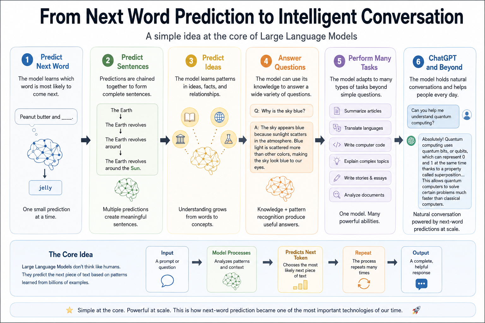
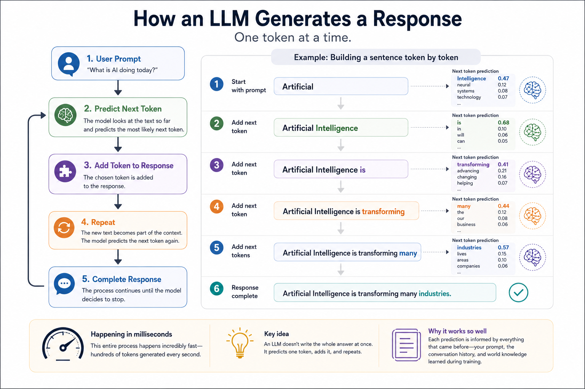
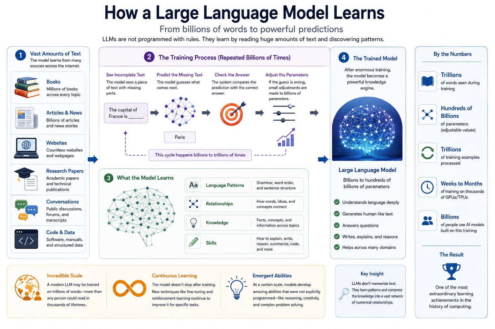

# Chapter 15: Large Language Models


## Opening Story: The Librarian Who Could Write

Imagine walking into the largest library ever built.

Not a city library.

Not a national library.

A library containing millions of books, articles, websites, speeches, research papers, poems, movie scripts, instruction manuals, and conversations.

Now imagine hiring a librarian and giving them a very unusual job.

You do not ask them to fetch a book.

You do not ask them to point you to a shelf.

Instead, you ask:

"Can you explain black holes to a twelve-year-old?"

A few seconds later, they write a brand-new explanation.

Then you ask:

"Can you summarize this legal contract?"

Again, they write an answer.

Next you ask:

"Create a poem about California sunsets."

Another original response appears.

The librarian is not copying text from a book.

The librarian is creating new text every time.

How?

After reading millions of documents, the librarian has learned patterns in language. They have learned which words often appear together, how ideas connect, how explanations are structured, and how stories are told.

When they write, they are not searching for a memorized sentence. They are predicting what should come next, one word at a time.

Surprisingly, this is very close to how modern AI language systems work.

Systems such as ChatGPT can answer questions, write essays, summarize documents, create stories, explain complex topics, and even help with computer programming.

To many people, this seems almost magical.

But underneath the surface, something surprisingly simple is happening.

These systems have become extraordinarily good at predicting the next piece of language.

In this chapter, we will explore how Large Language Models emerged, why they became so powerful, and how they transformed artificial intelligence from a specialized technology into a tool used by hundreds of millions of people around the world.


## Section 1. What Is a Large Language Model?

The term "Large Language Model" sounds intimidating, but the idea can be broken into three simple words.

**Large.**

The model is trained using enormous amounts of text. Books, articles, websites, discussions, technical documents, and many other forms of written language are used during training.

**Language.**

The model works with human language. It learns patterns in words, sentences, paragraphs, and conversations.

**Model.**

A model is simply a system that has learned from data and can make predictions.

Put together, a Large Language Model (LLM) is a system that learns patterns from vast amounts of text and uses those patterns to generate language.

At first glance, this may not sound impressive.

After all, predicting the next word seems like a small task.

Suppose you read the sentence:

*"Peanut butter and ____."*

Most people immediately think of the word *jelly*.

Why?

Because your brain has seen those words together many times.

Now consider:

*"The Earth revolves around the ____."*

You probably thought of *Sun*.

Again, your brain used patterns learned from previous experience.

Large Language Models operate in a similar way, but on a much larger scale.

They are trained on enormous collections of text and learn statistical relationships between words, phrases, facts, ideas, and concepts.

Over time, the model becomes surprisingly good at predicting what should come next.

When generating a response, the model does not create an entire paragraph all at once.

Instead, it works step by step.

It predicts one token.

Then another.

Then another.

Each prediction influences the next one.

The process is similar to building a sentence brick by brick.

A simple illustration looks like this:

"The Earth"
↓
"The Earth revolves"
↓
"The Earth revolves around"
↓
"The Earth revolves around the"
↓
"The Earth revolves around the Sun"

One small prediction at a time eventually becomes a complete explanation, story, summary, or conversation.

This leads to one of the most surprising discoveries in modern AI.

Researchers found that if they made models larger, trained them on more data, and gave them more computing power, entirely new abilities began to appear.



*Figure 15.1: Large Language Models begin with a surprisingly simple task—predicting the next word. As models grow larger and learn from vast amounts of text, this capability expands into answering questions, writing, reasoning, coding, and carrying on natural conversations.*


Models that started as next-word predictors gradually learned to:

• Answer questions

• Summarize documents

• Translate languages

• Write computer code

• Explain complex concepts

• Generate stories and essays

• Hold natural conversations

The result was a new generation of AI systems that felt dramatically different from earlier software.

Traditional programs followed explicit instructions written by programmers.

Large Language Models learned patterns from data and generated responses dynamically.

They did not contain a giant database of prepared answers.

Instead, they learned a compressed representation of language itself.

This breakthrough would eventually lead to systems like ChatGPT and trigger one of the most significant technological shifts of the twenty-first century.


## Section 2 — Predicting One Token at a Time

One of the biggest misconceptions about AI is that it somehow "knows" entire answers before it begins responding.

In reality, a Large Language Model creates its response one small piece at a time.

To understand this, imagine playing a word prediction game on your phone.

You type:

*"The capital of France is..."*

The phone suggests:

*"Paris."*

The suggestion is not magic. The software has simply learned that the word *Paris* often follows that sequence of words.

Large Language Models operate on the same basic principle, but at a vastly larger scale.

When you ask ChatGPT a question, the model does not instantly create a complete paragraph.

Instead, it predicts the most likely next piece of text.

Then it predicts the next piece after that.

Then another.

And another.

The process continues until a complete response emerges.

Surprisingly, the model is usually not predicting whole words.

It predicts units called **tokens**.

A token may be:

* A complete word
* Part of a word
* A punctuation mark
* A number
* A symbol

For example, the word:

*"unbelievable"*

might be divided into smaller tokens such as:

*"un" + "believ" + "able"*

Different AI systems use different tokenization methods, but the central idea remains the same: language is broken into manageable pieces.

The model predicts one token at a time.

Suppose the model begins generating the sentence:

*"Artificial intelligence is..."*

At that moment, many possible next tokens compete with one another.

The model might consider:

* changing
* transforming
* becoming
* advancing
* powerful

Each possibility receives a probability score.

The model then selects one of the most likely options and continues.

After choosing the next token, the process repeats.

The newly generated text becomes part of the context used for the following prediction.

The cycle looks like this:

Prompt
↓
Predict Next Token
↓
Add Token to Response
↓
Predict Next Token
↓
Add Token to Response
↓
Repeat




*Figure 15.2: A Large Language Model generates text one token at a time. Each newly generated token becomes part of the context used to predict the next token, allowing the model to gradually construct complete sentences, paragraphs, and conversations.*

This process may occur hundreds or even thousands of times during a single conversation.

What makes the result seem intelligent is that each prediction is influenced by everything that came before it.

The model considers your question, the conversation history, grammar, facts it learned during training, and the words it has already generated.

The result is a continuous chain of predictions that gradually forms explanations, stories, summaries, computer programs, or conversations.

This idea may sound almost disappointingly simple.

Yet one of the most surprising discoveries in modern AI is that predicting the next token turns out to be an extraordinarily powerful learning task.

By learning what comes next in billions of examples of human writing, Large Language Models begin to capture patterns about language, knowledge, reasoning, and communication itself.

What appears to be a conversation is actually a remarkable sequence of predictions happening at incredible speed—often hundreds of tokens every second.


## Section 3 — Learning from Billions of Words

Imagine trying to learn a new language by reading every book in a library.

Not just a few shelves.

Every shelf.

Every room.

Every building.

Now imagine reading millions of libraries.

That comparison begins to hint at the enormous scale involved in training a Large Language Model.

Modern AI systems learn from vast collections of text gathered from many different sources. Books, articles, websites, research papers, encyclopedias, manuals, public discussions, and many other forms of written language contribute to the learning process.

The goal is not to memorize every sentence.

The goal is to discover patterns.

During training, the model repeatedly encounters incomplete pieces of text and attempts to predict what comes next.

For example, it might see:

*"The capital of France is..."*

and attempt to predict the missing word.

If the model predicts incorrectly, the training system adjusts the model's internal parameters slightly.

Then it tries again.

And again.

And again.

This process occurs billions or even trillions of times.



*Figure 15.3: During training, a Large Language Model processes enormous amounts of text, repeatedly predicts missing words or tokens, measures its errors, and adjusts billions of internal parameters. After countless repetitions, the model becomes increasingly skilled at recognizing patterns in language and generating useful responses.*

Over time, the model gradually becomes better at recognizing patterns in language.

It learns that certain words often appear together.

It learns how sentences are structured.

It learns relationships between ideas.

It learns how explanations, arguments, stories, and conversations are typically organized.

A useful analogy is learning to recognize faces.

You were never given a formal rulebook explaining how to identify every person you know.

Instead, your brain learned from countless examples.

Eventually, recognition became automatic.

Large Language Models learn in a similar way.

They are not handed a giant encyclopedia of rules.

Instead, they discover patterns by processing enormous numbers of examples.

This learning process depends on something called **parameters**.

Parameters are the adjustable values inside a neural network that store what the model has learned.

You can think of them as tiny knobs.

During training, billions of these knobs are continuously adjusted.

Each adjustment is extremely small.

Yet after countless adjustments, the model develops an increasingly sophisticated understanding of language patterns.

The largest modern models contain hundreds of billions of parameters.

No human could inspect them individually.

Instead, the model's knowledge is distributed across an immense network of learned relationships.

This leads to an important insight.

Large Language Models do not store knowledge the way a library stores books.

A library preserves information in its original form.

An LLM compresses patterns from its training data into a vast network of numerical relationships.

The facts, concepts, writing styles, and language structures become embedded within the model itself.

That is why an LLM can explain a legal concept, summarize a scientific article, write a poem, or help create computer code without searching through a stack of documents each time.

The knowledge is not stored as pages waiting to be retrieved.

It has been transformed into patterns that guide the model's predictions.

By the end of training, the model has effectively completed one of the largest learning exercises ever performed by a machine.

It has read more text than any human could encounter in thousands of lifetimes.

And from that ocean of language, it has learned how words, ideas, and concepts connect to one another.


## Section 4 — GPT and the Rise of Generative AI

By the late 2010s, researchers had discovered something remarkable.

When neural networks became larger, training datasets became bigger, and computing power increased, language models began exhibiting capabilities that had not been explicitly programmed.

The models seemed to cross a threshold.

Instead of merely completing sentences, they could answer questions, summarize information, translate languages, write essays, and generate computer code.

One of the most important developments in this transformation was a family of models known as **GPT**.

GPT stands for **Generative Pre-trained Transformer**.

```text
GPT
│
├── Generative
│     Creates new content
│
├── Pre-trained
│     Learns from vast amounts of text
│
└── Transformer
      Uses the attention mechanism
      to understand context
```

*Figure 15.4: The name GPT stands for Generative Pre-trained Transformer. Each part of the name describes a key ingredient that helped make modern Large Language Models possible.*

Although the name sounds technical, each word describes a key idea.

**Generative** means the model can create new content rather than simply selecting information from a database.

**Pre-trained** means the model learns from enormous amounts of text before it is given specific tasks.

**Transformer** refers to the neural network architecture introduced in 2017 in the landmark paper *Attention Is All You Need*, which we explored in the previous chapter.

The Transformer architecture solved a major challenge in language processing.

Instead of reading text one word at a time and gradually forgetting earlier words, Transformers could pay attention to relationships throughout a sentence or even across large passages of text.

This allowed them to understand context much more effectively.

The breakthrough proved far more powerful than researchers initially expected.

As GPT models grew larger, they began demonstrating abilities that seemed to emerge naturally from scale.

Researchers call these **emergent abilities**.

An emergent ability is a capability that appears unexpectedly when a system becomes sufficiently large or complex.

Consider a single water molecule.

It does not have the property of a wave.

Yet when countless water molecules interact together, waves emerge.

Similarly, individual parameters inside a neural network do not understand language.

But when billions of parameters work together, sophisticated language capabilities can emerge.

Each new generation of GPT models demonstrated significant improvements.

GPT-1 showed that large-scale language pre-training could be effective.

GPT-2 surprised researchers by generating coherent paragraphs and stories.

GPT-3 expanded to hundreds of billions of parameters and displayed impressive abilities across a wide variety of tasks.

With every increase in scale, researchers observed new behaviors and improved performance.

This led to a surprising realization.

Many capabilities that engineers had once believed would require specialized systems could emerge from a single model trained to predict the next token.

The model was not separately programmed to summarize articles, answer questions, or write poetry.

Instead, these abilities arose from patterns learned during training.

The implications were enormous.

For decades, AI researchers had built separate systems for separate tasks.

One system translated languages.

Another summarized documents.

Another answered questions.

Large Language Models suggested a different future.

A single foundation model could perform many tasks simply by responding to different prompts.

This marked the beginning of what became known as **Generative AI**.

Rather than merely analyzing information, AI systems could now generate text, images, code, audio, and other forms of content.

The technology was moving from recognition to creation.

And the world was about to notice.


## Section 5 — The Moment AI Went Mainstream

For decades, artificial intelligence was largely a topic discussed by researchers, engineers, and technology companies.

Most people had never interacted directly with an advanced AI system.

They might encounter AI indirectly through search engines, recommendation systems, spam filters, or voice assistants, but AI remained mostly hidden behind the scenes.

That changed dramatically in late 2022.

When ChatGPT was released to the public, millions of people experienced something they had never seen before.

They could simply type a question into a chat window and receive a detailed, natural-language response.

No programming.

No technical knowledge.

No specialized training.

Just a conversation.

People asked the system to explain difficult concepts, summarize documents, write stories, create business plans, draft emails, generate computer code, and answer questions on thousands of different topics.

The experience felt fundamentally different from traditional software.

Most software is designed to perform a specific task.

A spreadsheet manages numbers.

A word processor edits documents.

A calculator performs calculations.

ChatGPT appeared capable of assisting with an astonishing variety of activities using the same simple interface: a conversation.

The public response was unprecedented.

Within days, millions of people were experimenting with the technology.

Teachers, lawyers, students, doctors, business professionals, writers, and software developers all began exploring possible uses.

Some saw it as a productivity tool.

Others viewed it as a research assistant.

Many simply found it fascinating.

For the first time, a large portion of society could directly experience the capabilities of a modern Large Language Model.

The rapid adoption of ChatGPT surprised even many experts in the field.

Researchers had spent years improving language models, but widespread public awareness arrived almost overnight.

Suddenly, discussions about artificial intelligence were no longer confined to research laboratories and technology conferences.

AI became a topic of conversation in homes, classrooms, boardrooms, and government offices.

The launch also sparked important questions.

Could AI transform education?

How would it affect legal work?

What would happen to creative professions?

Would it create new jobs, eliminate existing jobs, or both?

Could society trust AI-generated information?

These questions remain active today.

What became clear, however, was that AI had crossed an important threshold.

For the first time, hundreds of millions of people could interact directly with a powerful language model.

Artificial intelligence was no longer a distant technology of the future.

It had become a tool available in the present.

The release of ChatGPT did not mark the beginning of AI.

```text
1943  Artificial Neuron
  ↓
1956  AI Is Named
  ↓
1986  Backpropagation
  ↓
2012  Deep Learning
  ↓
2017  Transformer
  ↓
2022  ChatGPT
  ↓
AI Goes Mainstream
```

*Figure 15.5: ChatGPT was built upon decades of advances in artificial intelligence. Its release made those advances accessible to the general public.*

Rather, it marked the moment when decades of research suddenly became visible to the world.

In many ways, ChatGPT was the smartphone moment for artificial intelligence—a technology that transformed a complex research achievement into something ordinary people could use every day.

The world had entered a new phase of the AI era.


## Section 6 — Why Large Language Models Matter

Large Language Models represent more than another milestone in the history of artificial intelligence.

They mark a fundamental shift in how humans interact with computers.

For most of the history of computing, people had to learn the language of machines.

Users memorized commands.

Programmers wrote code.

Software required menus, buttons, and carefully designed interfaces.

The burden was largely on humans to adapt to computers.

Large Language Models begin to reverse that relationship.

Instead of forcing humans to communicate in machine language, computers are becoming increasingly capable of communicating in human language.

You can ask a question, describe a problem, request a summary, or explain a goal in ordinary English.

The AI attempts to understand your intent and respond appropriately.

This may seem like a small change, but its implications are profound.

Natural language is the universal interface of human society.

We use language to teach, negotiate, plan, explain, persuade, learn, and collaborate.

When computers become capable of participating in those activities, entirely new possibilities emerge.

A lawyer can ask for help reviewing documents.

A student can request an explanation of a difficult concept.

A doctor can summarize research findings.

A business owner can brainstorm ideas for a new product.

A programmer can describe software and receive working code.

The same underlying technology can support countless different tasks.

This flexibility is one reason Large Language Models have spread so quickly across industries and professions.

At the same time, their growing capabilities raise important questions.

How accurate are their answers?

How should AI-generated content be verified?

What responsibilities do developers and users have?

How should society balance innovation with safety?

These questions have no simple answers.

They will likely shape the next chapter of AI development for many years.

What is already clear, however, is that Large Language Models have become the foundation for much of modern artificial intelligence.

Many of today's most advanced systems are built on top of LLMs.

AI assistants, coding tools, research systems, customer-support agents, and many emerging applications all rely on the capabilities of large language models.

In other words, Large Language Models are not the final destination.

They are the foundation upon which a new generation of AI systems is being built.

In the next part of this book, we will explore those systems.

We will see how Large Language Models can be specialized through fine-tuning, connected to external knowledge through Retrieval-Augmented Generation, equipped with tools as AI agents, and expanded beyond text into images, audio, and video.

The story of Large Language Models is only the beginning.

The systems built on top of them are already transforming how people work, learn, create, and solve problems.

And their influence is likely to grow for many years to come.


## Insight Box: The Surprising Secret Behind ChatGPT

One of the most surprising facts about modern AI is that systems like ChatGPT were not originally designed to be experts, assistants, teachers, programmers, or writers.

Their core training objective was far simpler:

**Predict the next token.**

At first glance, this seems almost too simple to explain the capabilities we see today.

How could predicting the next word lead to answering questions, writing essays, generating code, translating languages, or carrying on conversations?

The answer lies in scale.

To become good at predicting what comes next, a model must learn an extraordinary amount about how language works. It must learn grammar, facts, relationships between ideas, patterns of reasoning, styles of writing, and countless other features hidden within human communication.

Researchers discovered that as models became larger, training datasets grew, and computing power increased, new abilities began to emerge.

The result was one of the most unexpected findings in the history of artificial intelligence:

**A system trained to predict the next token became capable of performing hundreds of useful tasks.**

Understanding this idea is the key to understanding Large Language Models.

Beneath every conversation, explanation, summary, story, and answer is the same fundamental process:

The model is predicting what should come next.


## Final Thoughts

When most people first encounter ChatGPT, the experience can feel almost magical.

You ask a question, and a detailed answer appears.

You request a summary, and the information is organized for you.

You describe an idea, and the system helps turn it into a story, a business plan, a legal outline, or even a computer program.

It is easy to focus on what these systems can do and overlook how they became possible.

As we have seen throughout this chapter, Large Language Models did not appear overnight.

They are the result of decades of breakthroughs that began with artificial neurons, continued through neural networks and backpropagation, accelerated with deep learning and powerful GPUs, and reached a new level with the Transformer architecture.

Each chapter in this journey added an essential piece to the puzzle.

The result was a new kind of AI system—one capable of learning from vast amounts of language and generating remarkably human-like responses.

Yet perhaps the most surprising lesson is that beneath all this complexity lies a simple idea:

A Large Language Model learns to predict what comes next.

From that seemingly modest objective emerged one of the most powerful technologies of the modern era.

Today, Large Language Models are transforming education, business, law, medicine, science, software development, and countless other fields.

Tomorrow, they may become the foundation for even more capable systems that can reason, collaborate, create, and solve problems in ways we are only beginning to imagine.

But understanding what comes next requires understanding what exists today.

In the chapters ahead, we will move beyond Large Language Models themselves and explore how they are being combined with new techniques and tools to create complete AI systems.

The story of AI is no longer just about models.

It is about what people can build with them.

