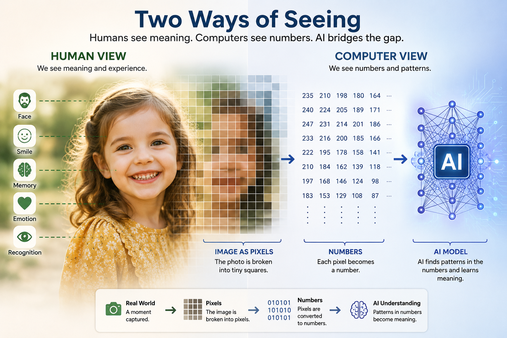
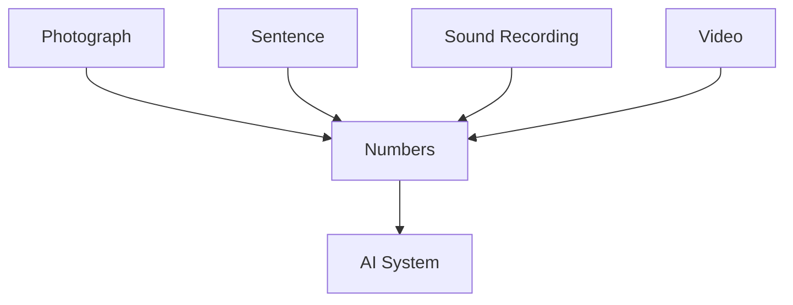
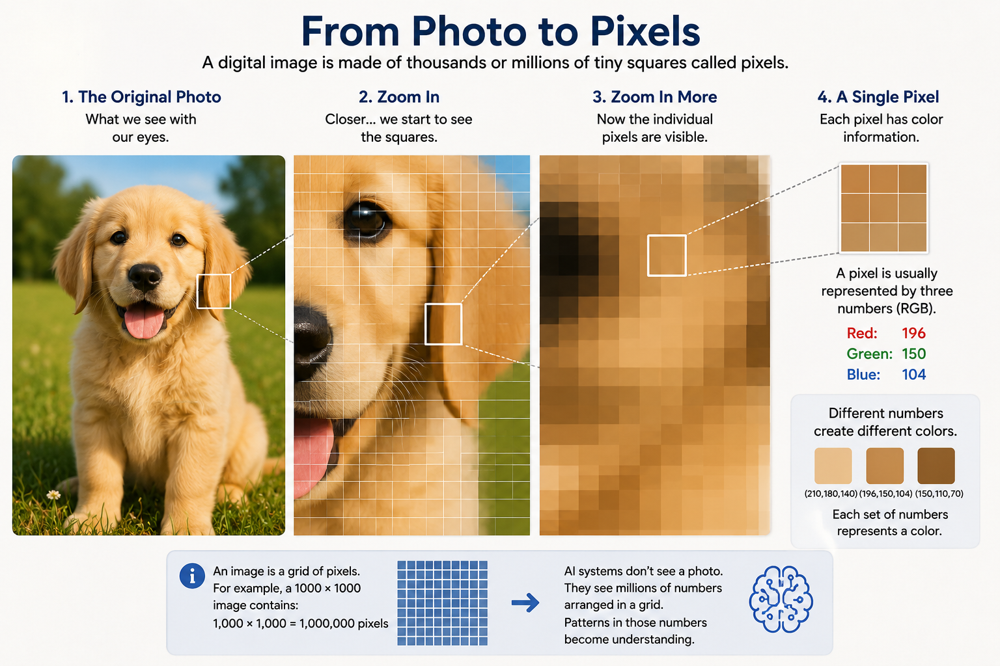
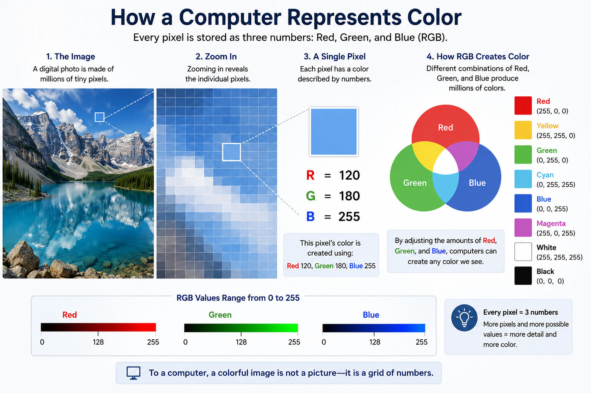
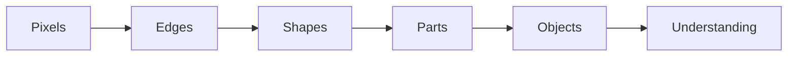
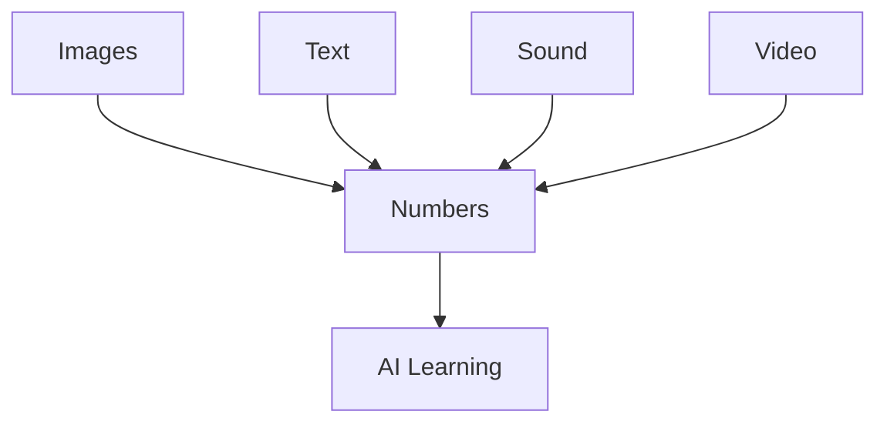

# Chapter 17: How Computers See Everything as Numbers

## Opening Story: The Picture That Became Millions of Numbers

Imagine you are holding a photograph of your granddaughter.

You look at the picture and instantly recognize her face. You notice her smile. You remember the day the photo was taken. Perhaps you even feel an emotion attached to the memory.

Now imagine showing that same photograph to a computer.

The computer does not see a face.

It does not see a smile.

It does not see a granddaughter.

In fact, it does not see a picture at all.

What the computer receives is a giant collection of numbers.

Every pixel in the image becomes numerical information. The colors become numbers. The brightness becomes numbers. The location of every tiny dot becomes numbers.

A photograph that feels rich with meaning to a human is, to a computer, simply a large mathematical table.

Yet something remarkable happens.

By processing those numbers, modern AI systems can learn to recognize faces, identify animals, read handwriting, detect diseases in medical scans, and even generate entirely new images that never existed before.

How can a machine do that?

The answer begins with one of the most important ideas in artificial intelligence:

Before AI can understand anything, it must first turn everything into numbers.

*Figure 17.1: Humans naturally see meaning, memories, and emotions. Computers see pixels and numbers. Artificial intelligence learns to connect the two.*

In this chapter, we will explore how computers represent images, words, sounds, and even ideas as numerical information. Once you understand this concept, many of the mysteries of AI begin to make sense.

---

## Section 1 — Why Computers Need Numbers

Human beings experience the world through sights, sounds, language, touch, and emotions.

Computers experience none of these things.

A computer has no eyes.

No ears.

No understanding of language.

No sense of color.

At its deepest level, a computer only understands electrical signals that can be represented as numbers.

Everything a computer processes must eventually be converted into numerical form.

Think about a calculator.

If you enter:

2 + 2

the calculator can perform the operation because the information is already represented as numbers.

But what happens when you show a calculator a photograph of a cat?

It has no idea what to do.

The image must first be translated into a numerical representation.

The same principle applies to AI systems.

Whether the input is:

* A photograph
* A sentence
* A voice recording
* A video clip
* A medical scan
* A legal document

the information must first become numbers before the AI can process it.

*Figure 17.2: Regardless of the original form, computers convert information into numbers before processing it.*

This idea may seem obvious, but it is one of the foundational concepts behind modern artificial intelligence.

AI does not work with pictures.

AI works with numbers that represent pictures.

AI does not work with words.

AI works with numbers that represent words.

AI does not work with sounds.

AI works with numbers that represent sounds.

The challenge of AI is not simply performing calculations.

The challenge is finding numerical representations that preserve enough information for the machine to recognize patterns.

For example, when humans see the word:

Dog

we instantly associate it with fur, barking, pets, and countless memories.

A computer sees none of those things.

The word must first be converted into a numerical form that allows the machine to work with it.

Likewise, when humans see a photograph of a dog, we recognize it immediately.

The computer sees only a grid of numbers representing color values.

The amazing achievement of modern AI is that it has learned how to find patterns inside those numbers and connect them to meaningful concepts.

In a sense, AI is a giant pattern-detection system built entirely on mathematics.

Everything begins with a simple rule:

**If a computer cannot turn something into numbers, it cannot process it.**

And once something becomes numbers, AI can begin learning from it.

## Section 2 — Images Are Made of Tiny Squares

When we look at a photograph, we see a complete image.

We see people, trees, cars, buildings, animals, and countless other objects.

Computers do not see images that way.

To a computer, every digital image is made from thousands—or even millions—of tiny squares called pixels.

The word *pixel* comes from the phrase *picture element*. A pixel is the smallest individual piece of a digital image.

From a normal viewing distance, pixels are so small that they blend together seamlessly. This creates the illusion of a smooth photograph.

But if you zoom in far enough, the illusion disappears.

*Figure 17.3: What appears to be a smooth image is actually a grid of tiny colored squares called pixels.*

Instead of seeing a face, you begin to see a grid of tiny colored squares.

Imagine looking at a large mosaic made from thousands of small tiles.

From across the room, you see a complete picture.

Up close, you see only individual tiles.

Digital images work in exactly the same way.

A photograph on your smartphone might contain millions of pixels. Each pixel stores information about a single tiny portion of the image.

Consider a photograph that is 1,000 pixels wide and 1,000 pixels tall.

That image contains:

1,000 × 1,000 = 1,000,000 pixels

In other words, one million tiny pieces of information combine to create a single picture.

Each pixel contributes a small amount of visual information. By itself, a single pixel means almost nothing.

Together, millions of pixels create the detailed images we see every day.

This idea is crucial because AI never examines a photograph as a complete picture.

Instead, it examines the individual pixels.

When an AI system analyzes an image of a dog, it does not immediately recognize fur, ears, or a tail.

At first, it sees only a massive collection of pixel values.

The AI's task is to discover patterns hidden inside those pixels.

Over time, during training, the system learns that certain arrangements of pixels often correspond to specific objects.

Eventually, patterns of pixels become shapes.

Shapes become features.

Features become recognizable objects.

That is how an image of a dog eventually becomes the concept of a dog.

Everything begins with pixels.

Before AI can recognize faces, read handwriting, detect tumors, or identify traffic signs, it must first examine the tiny squares that make up the image.

The journey from pixels to understanding is one of the most remarkable achievements in modern artificial intelligence.

## Section 3 — How Colors Become Numbers

So far, we have learned that images are made of pixels.

But a question remains:

How does a computer know what color each pixel should be?

The answer is surprisingly simple.

Computers represent colors using numbers.

Every pixel in a digital image contains numerical values that describe its color. The most common system is called RGB, which stands for:

* Red
* Green
* Blue

These three colors act like the primary ingredients of digital color.

By combining different amounts of red, green, and blue, a computer can create millions of different colors.

Think of it like mixing paint.

An artist might combine different amounts of red, yellow, and blue to create new colors.

A computer performs a similar process, except it uses red, green, and blue light.

Each RGB value is represented by a number ranging from 0 to 255.

A value of:

* 0 means none of that color
* 255 means the maximum amount of that color

For example:

Red pixel:

Red = 255

Green = 0

Blue = 0

Yellow pixel:

Red = 255

Green = 255

Blue = 0

White pixel:

Red = 255

Green = 255

Blue = 255

Black pixel:

Red = 0

Green = 0

Blue = 0

Every pixel in an image contains a set of three numbers like these.

*Figure 17.4: Computers represent colors using combinations of red, green, and blue values. Every pixel stores three numbers that define its color.*

A photograph containing one million pixels therefore contains roughly three million color values.

That is a tremendous amount of numerical information.

Yet modern computers process these numbers effortlessly.

To humans, a photograph appears to be a meaningful scene.

To a computer, the same photograph is simply a giant table of RGB values.

Imagine zooming into a picture of a blue sky.

You might find pixels represented by values such as:

(120, 180, 255)

To you, that is a pleasant shade of blue.

To the computer, it is merely three numbers.

This idea reveals something important about AI.

When an AI system looks at an image of a dog, it does not see fur, eyes, ears, or a tail.

Instead, it sees millions of RGB values arranged in a grid.

The intelligence comes from learning patterns within those values.

Over time, the AI discovers that certain combinations of colors and shapes frequently appear together.

Those patterns eventually become meaningful concepts.

What begins as numbers eventually becomes recognition.

A face becomes a face.

A stop sign becomes a stop sign.

A dog becomes a dog.

All because the computer learned how to interpret patterns hidden inside millions of color values.

The remarkable fact is that every photograph ever taken with a digital camera, every image on a website, and every picture analyzed by AI ultimately comes down to the same thing:

Rows and rows of numbers.

## Section 4 — Finding Patterns in the Pixels

At this point, we know that a computer sees an image as a massive collection of numbers.

Every pixel has color values.

Every image is a grid of pixels.

But a fascinating question remains:

How does AI turn all of those numbers into understanding?

The answer is pattern recognition.

Humans are natural pattern detectors.

When you see two dots and a curved line, you instantly recognize a smiley face.

When you see a few familiar shapes and colors, you recognize a car, a tree, or a dog.

You rarely think about the process because your brain performs it automatically.

AI systems must learn to do something similar.

Imagine showing an AI thousands of photographs of dogs.

At first, the images appear to be nothing more than enormous collections of RGB values.

The AI does not know what a dog is.

It does not know what fur is.

It does not know what ears are.

All it sees are numbers.

During training, however, the AI begins searching for patterns that appear repeatedly.

Certain groups of pixels often form edges.

Certain edges often form shapes.

Certain shapes frequently appear together.

Over time, the AI discovers that some combinations of shapes appear in nearly every photograph labeled "dog."

Without being explicitly programmed, it gradually learns what characteristics are useful for identifying a dog.

This learning process happens in stages.

At the lowest level, the AI learns simple visual features such as:

* Edges
* Lines
* Corners
* Color transitions

These features may seem unimportant to humans, but they provide the building blocks for understanding an image.

As information moves deeper through the neural network, the AI begins combining these simple features into more complex ones.

*Figure 17.5: AI gradually builds understanding by combining simple visual patterns into increasingly complex concepts.*

Edges become shapes.

Shapes become parts.

Parts become objects.

A collection of curved edges might become an ear.

Several ears, eyes, and a nose might become a face.

A face combined with other features might become a dog.

The remarkable aspect of this process is that the AI never truly "sees" the dog the way a human does.

It discovers statistical patterns that consistently appear when dogs are present.

To humans, recognition feels natural.

To AI, recognition is the result of finding useful patterns within vast amounts of numerical data.

This idea extends far beyond photographs.

The same principle helps AI recognize:

* Handwritten text
* Medical images
* Traffic signs
* Human faces
* Manufacturing defects
* Satellite imagery

In every case, the process begins the same way.

Numbers become patterns.

Patterns become features.

Features become understanding.

That transformation is the foundation of modern computer vision.

## Section 5 — Seeing Beyond Images: Everything Can Become Numbers

By now, we have explored how computers represent photographs as pixels and colors as numbers.

But images are only one type of information.

The same principle applies to almost everything AI processes.

Text becomes numbers.

Sound becomes numbers.

Video becomes numbers.

*Figure 17.6: Different types of information can all be converted into numbers, allowing AI systems to learn from them using the same underlying principles.*

Even concepts and relationships can eventually be represented using numbers.

This idea is one of the most important themes in artificial intelligence.

Once information can be expressed numerically, a computer can analyze it, compare it, and search for patterns within it.

Consider a simple sentence:

"The cat sat on the mat."

To a human, these words have meaning.

To a computer, they must first be converted into a numerical form.

Modern AI systems break sentences into smaller pieces called tokens.

Each token is assigned a numerical identifier.

For example:

"The" → 1024

"cat" → 5847

"sat" → 3192

These numbers are not important by themselves.

They simply provide a way for the computer to represent language mathematically.

The same idea applies to sound.

When you speak into a smartphone, your voice creates vibrations in the air.

A microphone converts those vibrations into electrical signals.

The computer then converts those signals into numerical values that describe the sound wave.

What feels like speech to you becomes a sequence of numbers to the machine.

Video follows the same pattern.

A video is essentially a rapid sequence of images displayed one after another.

Since each image can be represented as numbers, an entire video can also be represented numerically.

This means that photographs, books, conversations, songs, movies, and even medical scans can all be transformed into data that AI can process.

At first glance, these forms of information seem completely different.

A photograph looks nothing like a spoken sentence.

A song feels very different from a legal document.

Yet to a computer, they share something important.

They can all be represented using numbers.

This realization has driven many of the breakthroughs in modern AI.

Once researchers learned how to convert different kinds of information into numerical representations, the same underlying learning techniques could be applied across many domains.

The AI that recognizes faces, the AI that translates languages, and the AI that generates text all rely on the same fundamental principle:

Convert information into numbers.

Learn patterns within those numbers.

Use those patterns to make predictions.

In many ways, the story of artificial intelligence is the story of finding better ways to represent the world numerically.

The more effectively we can translate reality into numbers, the more effectively AI can learn from it.

## Insight Box: The Secret Language of Computers

One of the biggest surprises in artificial intelligence is that computers do not experience the world the way humans do.

When you look at a photograph, you see people, places, memories, and meaning.

When a computer looks at the same photograph, it sees numbers.

When you read a sentence, you understand ideas.

When a computer reads that sentence, it sees numerical representations.

When you listen to music, you hear melody and emotion.

When a computer processes music, it analyzes patterns in numerical data.

This may seem strange at first, but it reveals a profound truth:

**The computer's language is mathematics.**

Everything an AI system learns begins with converting information into numbers.

Pictures become pixels.

Pixels become color values.

Words become tokens.

Sounds become waveforms.

Videos become sequences of images.

Once information has been translated into numbers, AI can search for patterns that humans might never notice.

That ability has enabled remarkable breakthroughs in fields ranging from medicine and science to language and art.

The next time you use an AI system, remember what is happening behind the scenes.

The machine is not seeing what you see.

It is not hearing what you hear.

It is not reading what you read.

Instead, it is finding meaning hidden inside vast oceans of numbers.

And from those numbers, intelligence begins to emerge.

## Final Thoughts

At first, it may seem almost magical that artificial intelligence can recognize faces, describe photographs, drive vehicles, or generate images.

But beneath all of these impressive abilities lies a surprisingly simple idea.

Computers understand numbers.

Nothing more.

Nothing less.

A photograph that appears rich and meaningful to us is, to a computer, a grid of pixels.

Each pixel contains color values.

Those color values are stored as numbers.

By finding patterns within those numbers, AI systems gradually learn to recognize edges, shapes, objects, and eventually entire scenes.

The same principle extends far beyond images.

Text becomes numbers.

Sound becomes numbers.

Video becomes numbers.

Much of modern AI can be understood as the process of transforming the world into numerical representations and then discovering patterns within them.

This chapter marks an important milestone in our journey.

We have moved beyond the history of AI and begun exploring how AI actually works beneath the surface.

Understanding that computers see the world as numbers provides the foundation for many of the chapters ahead.

In the next chapter, we will examine one of the most important ideas behind modern language models.

If computers only understand numbers, how can they work with words?

The answer begins with something called a token.

And as we will discover, every conversation with an AI system starts by turning language into pieces that a computer can understand.
