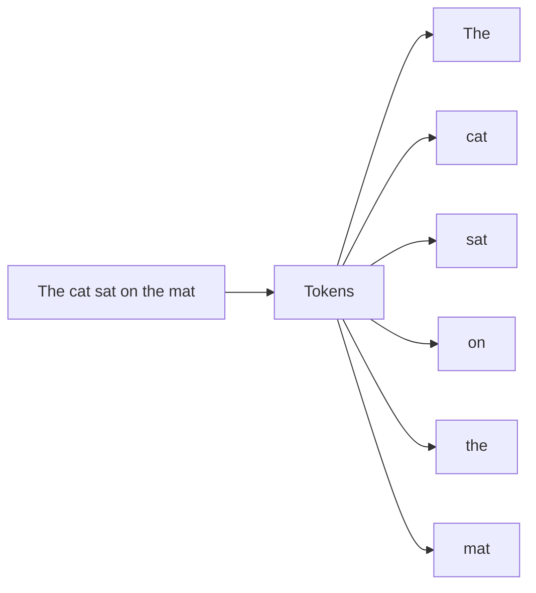
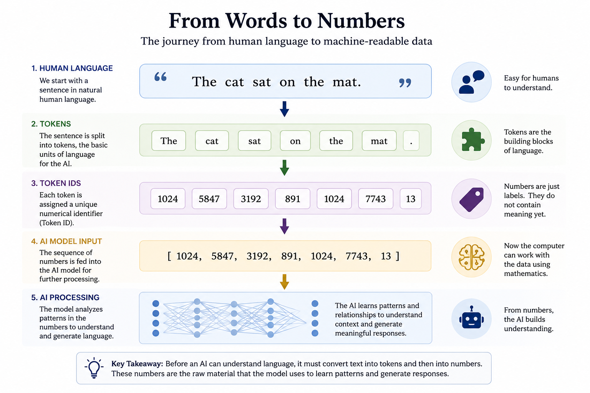
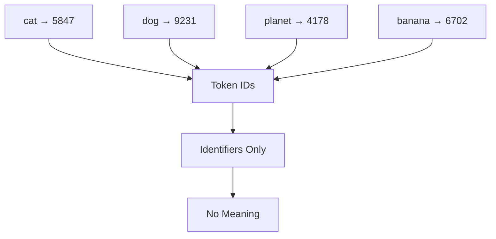

# Chapter 18 — Tokens

## Opening Story: The Librarian Who Could Not Read

Imagine a librarian who has access to every book ever written.

Millions of books.

Billions of pages.

An unimaginable amount of knowledge.

Now imagine something unusual.

The librarian cannot actually read.

He does not understand English.

He does not understand French, Spanish, Chinese, or any other language.

In fact, he does not understand words at all.

Instead, every word in every book has been replaced by a number.

The librarian sees:

4827 194 7621 33 981

rather than:

"The cat sat on the mat."

Yet somehow, the librarian becomes remarkably good at predicting what number is likely to come next.

After examining billions of pages, he notices patterns.

When he sees certain sequences of numbers, other numbers frequently follow.

Over time, he becomes so skilled at recognizing these patterns that he can generate entire paragraphs that appear meaningful to human readers.

From the outside, it almost looks as though he understands language.

But underneath, he is really working with numbers.

Surprisingly, this is very similar to how modern language models such as ChatGPT operate.

When you type a question into an AI system, the computer does not see words the way you do.

It does not see sentences.

It does not see grammar.

It does not see meaning in the human sense.

Before the AI can process your message, every word must first be transformed into a format the computer understands.

Just as images become pixels and numbers, language must also become numbers.

The first step in that transformation is something called a token.

Tokens are one of the most important building blocks of modern AI.

Every conversation with a language model begins with them.

In this chapter, we will explore what tokens are, why they exist, and how they allow computers to work with human language.

# Section 1 — What Is a Token?

If computers only understand numbers, a problem immediately appears.

Human language is not made of numbers.

It is made of words.

When you read a sentence, you naturally understand the meaning behind it.

Consider the sentence:

"The cat sat on the mat."

A human reader instantly recognizes the words, understands the grammar, and forms a mental picture.

A computer cannot do that.

Before an AI system can process language, it must first convert the text into a form it can understand.

This is where tokens come in.

A token is a piece of text that an AI system uses as a basic unit of language.

*Figure 18.1: Before AI can process language, text is broken into smaller units called tokens.*

You can think of tokens as the building blocks that allow computers to work with words.

Sometimes a token is an entire word.

For example:

"The"

"cat"

"sat"

"on"

"mat"

In this case, each word could become a separate token.

However, tokens are not always complete words.

A token might be:

* A word
* Part of a word
* A punctuation mark
* A number
* A symbol

For example, the word:

"unbelievable"

might be broken into smaller pieces such as:

"un"

"believ"

"able"

Each of these pieces becomes a token.

Why would AI systems do this?

Because human language contains an enormous number of possible words.

New words appear constantly.

People invent slang.

Technical fields create new terminology.

Names and abbreviations emerge every day.

If AI treated every possible word as a completely separate item, the system would become inefficient and difficult to train.

By breaking language into smaller reusable pieces, AI can handle unfamiliar words much more effectively.

Imagine a child learning language.

Even if the child has never heard the word "microscope" before, recognizing parts such as "micro" can provide clues about its meaning.

Modern AI systems benefit from a similar approach.

Instead of memorizing every possible word, they learn patterns involving smaller language units.

Once the text has been divided into tokens, the AI can begin the next step.

Each token is assigned a numerical identifier.

For example:

"The" → 1024

"cat" → 5847

"sat" → 3192

These numbers do not contain meaning by themselves.

They simply allow the computer to represent language mathematically.

At this stage, the original sentence has been transformed from human language into something the computer can process.

Words have become tokens.

Tokens have become numbers.

Only then can the AI begin searching for patterns.

This idea may seem simple, but it is one of the most important concepts in modern artificial intelligence.

Every question you ask ChatGPT.

Every response it generates.

Every document analyzed by a language model.

Every translation produced by AI.

All begin with the same essential step:

Breaking language into tokens.

# Section 2 — Why AI Does Not Simply Use Words

At first, tokens may seem unnecessary.

Why not simply treat every word as a separate unit?

After all, humans think in words.

Why shouldn't AI do the same?

The answer becomes clear when we consider how large human language really is.

English alone contains hundreds of thousands of words.

Every year, new words are invented.

Companies create new product names.

Scientists introduce new terminology.

Internet culture produces new slang.

People combine words in creative ways.

If an AI system tried to store every possible word as a separate item, the language would become almost impossible to manage.

Consider the word:

"unhappiness"

Should it be treated as a completely unique word?

What about:

"happiness"

"happy"

"unhappy"

"happily"

These words are clearly related.

Humans naturally recognize the connection.

An AI system benefits from recognizing those relationships as well.

This is one reason modern language models often break words into smaller pieces called subword tokens.

Instead of treating "unhappiness" as a completely new word, the AI might divide it into parts such as:

*Figure 18.2: Modern language models often split words into smaller reusable pieces called subword tokens. Like building blocks, these pieces can be combined to represent millions of different words while helping AI recognize relationships between them.*

"un"

"happi"

"ness"

Each part appears in many different words.

By learning patterns involving these smaller pieces, the AI can understand a much larger vocabulary without memorizing every possible word.

Think of it like building with LEGO® bricks.

A child does not need a separate toy for every object in the world.

Instead, the same collection of bricks can be combined in countless ways.

Subword tokens work similarly.

A relatively small collection of language pieces can be assembled into millions of words and phrases.

This approach also helps AI handle words it has never seen before.

Imagine encountering the word:

"bioinformatics"

Even if you have never seen it, you might recognize parts such as:

"bio"

"inform"

"atics"

Those familiar pieces provide clues about the word's meaning.

AI systems gain a similar advantage when language is broken into reusable components.

Another benefit involves efficiency.

Modern language models are trained on enormous collections of text containing billions or even trillions of words.

Managing a smaller set of reusable tokens is far more practical than maintaining separate representations for every possible word.

As a result, tokenization helps language models become:

* More efficient
* More flexible
* Better at handling unfamiliar words
* Better at recognizing relationships between words

This is why the process of tokenization plays such an important role in modern AI.

The goal is not simply to break language apart.

The goal is to break language apart in a way that helps the computer discover patterns.

Once those patterns have been learned, the AI can begin understanding how pieces of language fit together.

What appears to us as words and sentences becomes a system of reusable building blocks that the computer can analyze mathematically.

And those building blocks are the foundation upon which modern language models are built.

## Section 3 — From Tokens to Numbers

By now, we have seen that AI systems break language into tokens.

But tokens alone are not enough.

Remember one of the most important lessons from the previous chapter:

Computers understand numbers.

Not words.

Not sentences.

Not ideas.

Numbers.

This means that after text has been divided into tokens, each token must be converted into a numerical form that the computer can process.

This process is surprisingly straightforward.

Every token is assigned a unique numerical identifier.

*Figure 18.3: Before a language model can process text, words are broken into tokens and converted into numerical identifiers. This transforms human language into a format that computers can process mathematically.*

For example, a language model might represent the sentence:

"The cat sat on the mat."

as something like:

"The" → 1024

"cat" → 5847

"sat" → 3192

"on" → 891

"the" → 1024

"mat" → 7743

The specific numbers themselves are not important.

They are simply labels that allow the computer to keep track of different tokens.

You can think of these identifiers as similar to library catalog numbers.

A library may contain thousands of books.

Each book is assigned a unique identifier that helps librarians locate and organize it.

The number itself does not contain the book's meaning.

It simply serves as a reference.

Token identifiers work in much the same way.

The word "cat" might be represented by one number, while the word "dog" is represented by another.

At this stage, however, the computer still does not understand what either word means.

It merely knows that they are different tokens.

This is an important distinction.

Many people imagine that assigning a number to a word somehow gives the computer an understanding of language.

It does not.

Replacing a word with a number is only the first step.

The numerical identifier acts like a name tag.

It tells the computer which token it is dealing with, but it does not explain what that token represents.

A useful analogy is a telephone contact list.

Suppose your phone stores:

John → Contact #57

Mary → Contact #92

David → Contact #148

These numbers help the phone identify different people, but they do not describe who those people are.

The same is true for token identifiers.

The number associated with a token helps the computer recognize it, but the meaning comes later.

Modern language models process enormous vocabularies.

Many contain tens of thousands or even hundreds of thousands of possible tokens.

Every token has its own identifier.

When you type a sentence into an AI system, the first thing that happens is that the words are converted into tokens and then into numerical identifiers.

At that moment, human language has become machine-readable data.

The computer can now begin applying mathematical operations to the text.

This transformation is a critical step in the journey from language to intelligence.

Words become tokens.

Tokens become numbers.

And those numbers become the raw material from which AI learns patterns.

In the next section, we will take an even bigger step forward.

We will discover that simple token identifiers are not enough for true language understanding.

To capture meaning, AI needs something much more powerful.

It needs a way to represent relationships between words.

That idea leads us to one of the most important concepts in modern AI: embeddings.

## Section 4 — Why Numbers Alone Are Not Enough

At this point, it might seem that we have solved the problem of language.

Words become tokens.

Tokens become numbers.

The computer can process those numbers.

Case closed.

But there is a problem.

The numbers themselves contain no meaning.

Consider the words:

"cat"

"dog"

"planet"

"banana"

A language model might assign them token identifiers such as:

cat → 5847

dog → 9231

planet → 4178

banana → 6702

To a computer, these are simply labels.

The number 5847 does not tell the AI that a cat is an animal.

The number 9231 does not reveal that dogs and cats are related.

The numbers contain no information about meaning, similarity, or relationships.

Think about telephone numbers.

Suppose two neighbors have these phone numbers:

555-1234

555-1235

The numbers are very close together.

But that does not mean the people are similar.

Likewise, two people living on opposite sides of the country might have completely unrelated phone numbers.

The numbers themselves tell us almost nothing about the individuals.

*Figure 18.4: Token IDs help the computer identify words, but the numbers themselves do not capture meaning or relationships between concepts.*

Token identifiers work the same way.

They are useful for identifying tokens, but they do not capture meaning.

This creates a major challenge for AI.

Human language is built on relationships.

When humans hear the word "doctor," they often think about hospitals, medicine, patients, and health.

When we hear "king," we may think of queens, kingdoms, royalty, and leadership.

Words do not exist in isolation.

Their meaning comes largely from their relationships to other words.

If AI is going to understand language, it must somehow learn those relationships.

Simply assigning numbers to tokens is not enough.

The computer needs a way to represent meaning itself.

Researchers spent decades searching for a solution.

The breakthrough came when they realized that words could be represented not by a single number, but by collections of numbers that capture relationships between concepts.

Instead of asking:

"What number identifies this word?"

they began asking:

"What numerical representation best captures this word's meaning?"

This idea transformed natural language processing.

It allowed AI systems to recognize that:

* Cats and dogs are related.
* Doctors and nurses often appear in similar contexts.
* Paris and London are both cities.
* Apples and oranges are both fruits.

The system could begin learning not just individual words, but the relationships between them.

That capability became one of the foundations of modern language models.

The solution is called an embedding.

Embeddings allow AI to represent words, phrases, and concepts in a way that preserves meaning and relationships.

They are one of the most important breakthroughs in the history of language AI.

And they are the subject of our next chapter.

## Insight Box: Why AI Counts Words Instead of Reading Them

One of the most surprising facts about modern AI is that language models do not read text the way humans do.

When you see the sentence:

"The cat sat on the mat."

you immediately recognize words, grammar, and meaning.

You might even picture a cat sitting peacefully on a mat.

An AI system does none of those things.

Before it can process the sentence, it must first transform the text into tokens.

Those tokens are then converted into numbers.

By the time the information reaches the AI model, the original sentence has become a sequence of numerical values.

This may seem like a strange way to work with language.

After all, humans do not think in token IDs.

Yet this approach allows computers to process vast amounts of text using mathematics.

Every question you ask ChatGPT.

Every document analyzed by an AI assistant.

Every translation produced by a language model.

Every AI-generated paragraph.

All begin with tokenization.

In a sense, tokens are the bridge between human language and machine computation.

Humans communicate using words.

Computers operate using numbers.

Tokens connect the two worlds.

But tokenization alone does not create understanding.

A token ID merely identifies a piece of language.

It does not explain what that language means.

That realization led researchers to one of the most important breakthroughs in modern AI:

finding ways to represent meaning itself.

The story of tokens is therefore only the beginning.

They provide the raw materials from which language models are built.

The next challenge is learning how those materials acquire meaning.

And that challenge leads directly to embeddings.

## Final Thoughts

In this chapter, we uncovered one of the most important secrets behind modern language models:

AI does not directly read words.

It processes tokens.

At first glance, this may seem like a small technical detail, but tokenization is actually the foundation of how systems like ChatGPT operate.

We began with ordinary language—a sentence a human can understand instantly. Then we followed the transformation step by step:

- Words become tokens  
- Tokens may break into smaller reusable pieces  
- Tokens are assigned numerical identifiers  
- Those numbers become the input for AI models  

This process allows computers to handle language mathematically, in much the same way they process pixels in images.

---

### The Flow of Language Through AI

---

### The Big Insight

One of the most important insights from this chapter is that token IDs themselves do not contain meaning.

The number assigned to “cat” does not tell the computer that a cat is an animal. It is simply a label.

True language understanding requires something more: a way to capture relationships between words and concepts.

That is why modern AI moved beyond simple token IDs toward embeddings—numerical representations that preserve meaning and similarity.

---

### Why This Matters

Understanding tokens changes how we interpret AI conversations.

When you type a question into ChatGPT, the system is not “reading” your message like a human. Instead, it is:

- Breaking your text into tokens  
- Converting those tokens into numbers  
- Searching for patterns in those numbers  
- Predicting the most likely next tokens in response  

The result can feel human, but underneath, the process is mathematical and statistical.

---

### Looking Ahead

Tokens are the bridge between human language and machine computation.

But they are only the beginning.

In the next chapter, we will explore how AI systems represent meaning itself using embeddings. We will see how words, phrases, and ideas can be placed in a mathematical “meaning space” where related concepts sit closer together.

That breakthrough is what allows modern AI to recognize that:

- Cats and dogs are related  
- Paris and London are both cities  
- Doctor and nurse often appear in similar contexts  

The journey from words to understanding is about to take a major leap forward.