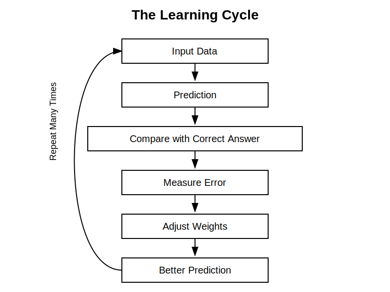

# Chapter 21: Weights and Parameters

## Opening Story: Choosing a Restaurant

Imagine that you and a group of friends are trying to decide where to have dinner.

Several factors influence your choice. The quality of the food matters. The price matters. The distance matters. The atmosphere matters. The availability of parking matters. If someone in the group is vegetarian, that matters too.

But not all of these factors are equally important.

For one person, food quality might be the most important consideration. They are willing to drive farther and pay a little more if the restaurant serves excellent meals. Another person may care most about price. A third person may prioritize convenience and choose the closest option.

Without realizing it, your brain is assigning different levels of importance to each factor. Food quality might count heavily in the decision, while parking availability might have only a small influence. The final choice emerges from combining all of these factors according to their relative importance.

Artificial intelligence systems make decisions in a surprisingly similar way.

When a neural network receives information, it does not treat every input equally. Some inputs are given greater importance, while others have less influence. The numerical values that determine this importance are called **weights**. During training, the AI gradually adjusts these weights, learning which signals are most useful for making accurate predictions.

Modern AI systems contain millions, billions, or even trillions of these adjustable values. Together, they represent what the system has learned from experience. These learned values are known as **parameters**, and they form the knowledge stored inside an AI model.

In the previous chapter, we explored how neural networks process information through interconnected layers. In this chapter, we will look inside those connections and discover the hidden numbers that make learning possible. Understanding weights and parameters is one of the most important steps toward understanding how modern AI systems actually work.


## Section 1: What Is a Weight?

In the previous chapter, we learned that a neural network is made up of many interconnected artificial neurons. Information flows from one neuron to another through these connections. But not all connections are treated equally.

Each connection in a neural network has an associated numerical value called a **weight**. A weight determines how much influence one neuron has on another. In simple terms, a weight tells the network how important a particular piece of information is when making a decision.

Consider the restaurant example from the opening story. Suppose you are choosing a restaurant based on three factors: food quality, price, and distance. If food quality matters most to you, it will have a greater influence on your decision than the other factors. In a neural network, that greater influence would be represented by a larger weight.

You can think of a weight as a volume control knob. Important signals have their volume turned up, while less important signals have their volume turned down. The neural network combines all of these weighted signals before producing an output.

For example, imagine an AI system that helps identify whether an email is spam. Certain clues may be highly important, such as suspicious links or known spam phrases. Other clues may be less significant. Through training, the network learns which signals deserve higher weights and which deserve lower ones.

The remarkable aspect of neural networks is that these weights are not manually programmed. Instead, the network learns them automatically from data. During training, the system repeatedly adjusts its weights, gradually discovering which combinations lead to accurate predictions.

Without weights, every input would be treated equally, and the network would have little ability to learn complex patterns. Weights give neural networks the flexibility to distinguish between strong signals and weak signals, making intelligent behavior possible.

**Key Takeaway:** A weight is a numerical value that determines how much influence an input or connection has within a neural network. Learning largely consists of adjusting these weights to improve the network's predictions.


## Section 2: Learning Means Changing Weights

One of the most important ideas in artificial intelligence is that learning is not about adding new rules to a program. Instead, learning is about adjusting weights.

Imagine a child learning to recognize dogs. At first, the child may confuse dogs with wolves, foxes, or other animals. Over time, repeated exposure helps the child notice which features are most important. The child learns to pay more attention to certain clues and less attention to others.

A neural network learns in a similar way.

When a neural network begins training, its weights are usually assigned random values. At this stage, the network has no useful knowledge and its predictions are often incorrect. It is essentially making educated guesses.

The network is then shown many examples. After each prediction, the system measures how far its answer is from the correct answer. This difference is called the **error**.

The goal of training is to reduce this error. To do that, the network slightly adjusts its weights. Connections that contribute to correct predictions may become stronger, while connections that contribute to mistakes may become weaker.



*Figure 21.1: During training, a neural network repeatedly makes predictions, measures its errors, and adjusts its weights. Over time, these adjustments improve the network's performance.*

This process repeats thousands, millions, or even billions of times. With each adjustment, the network gradually improves its understanding of the patterns hidden within the data. What begins as a collection of random numbers slowly transforms into a system capable of making useful predictions.

Consider an AI system trained to recognize handwritten digits. Early in training, the network may confuse a handwritten "3" with an "8." As it processes more examples, it learns which visual features are most important for distinguishing between the two. The weights connected to those features are adjusted accordingly, improving the system's accuracy.

This is why AI learning can be described in a surprisingly simple way: learning is the process of finding better weights. Everything the network learns—from recognizing faces to understanding language—is ultimately stored in the values of those weights.

**Key Takeaway:** Neural networks learn by adjusting their weights. Training is a continuous process of making predictions, measuring errors, and modifying weights to improve future performance.


## Section 3: What Are Parameters?

As neural networks became larger and more sophisticated, researchers needed a way to describe all of the values that the network learns during training. This is where the term **parameter** enters the picture.

A parameter is a value inside an AI model that can be adjusted through learning. In most neural networks, weights are the most important type of parameter. Every time a weight changes during training, the model is updating one of its parameters.

> ### Figure 21.2: Parameters — The Model's Memory Library
>
> **Before Training**
>
> ```text
> Empty Library
>
> ┌─────────────────┐
> │                 │
> │    No Books     │
> │                 │
> └─────────────────┘
> ```
>
> The model starts with little useful knowledge.
>
> ↓ Training on large amounts of data ↓
>
> **After Training**
>
> ```text
> Model's Memory Library
>
> ┌─────────────────┐
> │ Language        │
> │ Facts           │
> │ Patterns        │
> │ Relationships   │
> │ Examples        │
> │ Knowledge       │
> └─────────────────┘
> ```
>
> All of this learned knowledge is stored in the model's **parameters**.

You can think of parameters as the memory of a neural network. They store everything the system has learned from its training data. When people say that a model has learned how to recognize faces, translate languages, or answer questions, that knowledge is not stored as human-readable rules. Instead, it is encoded within millions or billions of parameter values.

Imagine teaching a student to identify different species of birds. Over time, the student learns to notice subtle details such as beak shape, feather patterns, and wing structure. The knowledge is stored in the student's experience and judgment rather than in a written list of rules. Similarly, an AI model stores what it has learned within its parameters.

Modern AI models contain enormous numbers of parameters. Early neural networks might have contained only a few hundred or a few thousand parameters. Today's large language models may contain hundreds of billions or even trillions of parameters. Each parameter contributes a tiny piece to the model's overall behavior, but together they create systems capable of remarkably complex tasks.

This explains why model size is often discussed in AI. When people refer to a "7-billion-parameter model" or a "70-billion-parameter model," they are describing how many adjustable values the system contains. A larger number of parameters generally gives a model greater capacity to learn patterns, although size alone does not guarantee better performance.

The distinction between weights and parameters is simple but important. A weight is a specific adjustable connection within a neural network. A parameter is a broader term that refers to any value the model learns during training. In many neural networks, most parameters are weights.

Understanding parameters helps us appreciate what an AI model truly is. At its core, a trained model is not a collection of programmed instructions. It is a vast collection of learned numerical values that collectively capture patterns from data.

**Key Takeaway:** Parameters are the learned values inside an AI model. They store the knowledge acquired during training, and weights are the most common type of parameter in modern neural networks.


## Section 4: Why Parameter Count Matters

If parameters represent what an AI model has learned, an obvious question arises: does having more parameters make a model smarter?

The answer is often yes—but only up to a point.

Imagine two libraries. One contains a few hundred books, while the other contains millions of books covering countless subjects. The larger library has the potential to hold far more knowledge and information. Similarly, a model with more parameters has a greater capacity to learn patterns from data.

This is one reason why modern AI models are much larger than their predecessors. Early neural networks might have contained only thousands of parameters. Today's advanced language models contain billions or even trillions of parameters. These additional parameters allow the models to capture more complex relationships, remember more patterns, and perform a wider variety of tasks.

However, parameter count alone does not determine quality. A larger model still requires high-quality training data and effective training methods. A poorly trained model with billions of parameters may perform worse than a smaller model trained on better data.

An analogy can be found in education. A student with access to a huge library does not automatically become knowledgeable. Learning depends on how effectively the information is studied and understood. Likewise, AI models benefit from both sufficient capacity and effective training.

Researchers often describe models by their parameter count. You may hear references to a "7-billion-parameter model," a "70-billion-parameter model," or even larger systems. These numbers provide a rough indication of the model's capacity, although they do not tell the entire story.

As AI has evolved, increasing parameter counts have often led to surprising improvements in performance. Larger models have demonstrated stronger language understanding, better reasoning abilities, and greater flexibility across different tasks. This trend has become one of the defining characteristics of modern AI development.

Understanding parameter count helps explain why AI models vary so greatly in capability. The number of parameters influences how much a model can learn, but true performance depends on the combination of model size, training data, computing power, and learning techniques.

**Key Takeaway:** More parameters generally give a model greater capacity to learn patterns and perform complex tasks, but parameter count alone does not guarantee intelligence or quality. Effective training remains just as important as model size.


## Section 5: The Hidden Knowledge Inside AI

When people interact with an AI system, they often see only the final result. A chatbot answers a question, a translation system converts text into another language, or an image-recognition system identifies objects in a photograph. What remains hidden is the vast collection of learned parameters that make these capabilities possible.

It is tempting to imagine that AI systems store knowledge in the same way that humans do. We might assume there is a database containing facts, definitions, and rules that the AI simply retrieves when needed. In reality, most neural networks work very differently.

The knowledge learned during training is distributed across millions or billions of parameters. No single parameter represents a complete fact, idea, or rule. Instead, knowledge emerges from the combined effect of many parameters working together. A single parameter may contribute only a tiny amount to the model's behavior, but collectively they create the patterns that allow the system to understand language, recognize images, and make predictions.

An analogy can be found in the human brain. Neuroscientists do not believe that a single neuron stores a complete memory. Instead, memories are believed to arise from patterns of activity across large networks of neurons. Similarly, an AI model does not store knowledge in one specific location. What it has learned is spread throughout its parameters.

This distributed form of knowledge helps explain both the strengths and limitations of AI systems. Because knowledge is represented as patterns rather than explicit rules, AI can recognize subtle relationships and generalize to new situations. At the same time, it can sometimes make mistakes or produce unexpected answers because it is relying on learned patterns rather than true understanding.

As models grow larger and acquire more parameters, they gain the ability to capture increasingly complex relationships within data. This is one reason why modern AI systems can perform tasks that would have seemed extraordinary only a few years ago. Yet regardless of a model's size, its capabilities ultimately depend on the knowledge encoded within its parameters.

The next time you use an AI system, it is worth remembering what lies beneath the surface. Behind every response is a vast network of learned numerical values, each contributing a small piece to the final result. Together, these parameters form the hidden knowledge that powers modern artificial intelligence.

**Key Takeaway:** AI models do not store knowledge as human-readable rules or facts. Instead, knowledge is distributed across millions or billions of parameters, whose combined interactions produce the intelligent behavior we observe.


### Insight Box: The Numbers That Hold Knowledge

One of the most surprising facts about modern AI is that everything it learns is ultimately stored as numbers.

When an AI model is trained, it does not create a collection of written rules, facts, or instructions. Instead, it adjusts millions or billions of numerical values called parameters. These numbers determine how strongly different patterns influence the model's decisions.

To humans, a list of billions of numbers would appear meaningless. Yet within those numbers lies the model's ability to recognize faces, translate languages, answer questions, and generate text. What appears to be intelligence emerges from the combined effect of countless learned values working together.

This idea highlights a profound difference between human knowledge and machine learning. Humans often think in words, concepts, and experiences. AI models store knowledge as mathematical relationships encoded within parameters.

The next time you hear that a model contains billions of parameters, remember what that really means: billions of learned numerical values that collectively represent the model's understanding of the world.


## Final Thoughts

At first glance, weights and parameters may seem like obscure technical details hidden deep inside AI systems. In reality, they are among the most important concepts in all of artificial intelligence.

Weights determine how strongly different pieces of information influence a model's decisions. During training, these weights are adjusted repeatedly, allowing the system to learn from experience. Over time, the collection of learned values grows into the model's parameters—the numerical memory that stores everything the AI has learned.

This perspective reveals an important truth about modern AI. A trained model is not a collection of hand-written rules or carefully programmed instructions. Instead, it is a vast network of learned parameters that capture patterns, relationships, and knowledge from data.

Understanding weights and parameters also helps explain why AI models vary so greatly in capability. Larger models often contain billions of parameters, giving them the capacity to learn more complex patterns. Yet regardless of size, every model learns through the same fundamental process: adjusting its parameters to reduce errors and improve predictions.

As we continue our exploration of AI, it is worth remembering that the impressive abilities of modern systems ultimately arise from these learned numerical values. Whether an AI is recognizing images, translating languages, or generating human-like text, its behavior is shaped by the parameters created during training.

In the next chapter, we will examine that training process in greater detail. We will follow the journey of an AI model as it learns from data, makes mistakes, receives feedback, and gradually improves. This process of training is where the numbers inside a model acquire their meaning and where artificial intelligence truly begins to learn.

**Chapter Summary:** Weights control the influence of information within a neural network, while parameters store what the model has learned. Together, they form the foundation of modern AI and enable machines to learn from experience rather than follow fixed rules.


