# Chapter 26: Fine-tuning
  
### Opening Story: “The Generalist Who Knew Everything… but Not Enough”

The courtroom was quiet except for the faint hum of an old ceiling fan trying its best to sound important.

A young law associate sat with a stack of case files, a tight deadline, and a growing sense of regret. The partner had asked for a quick summary of precedent cases involving digital privacy violations in cross-border data transfers. Nothing unusual—just the kind of task that eats weekends for breakfast.

So, like everyone else now, the associate turned to a general-purpose AI assistant.

And to be fair, it was impressive.

It explained privacy law in clear language. It summarized landmark cases. It even sounded confident—dangerously so. The associate copied the answer, skimmed it once, and almost sent it.

Then something felt off.

One cited case didn’t exist in the jurisdiction. Another mixed European GDPR principles with outdated U.S. rulings as if they were interchangeable cousins. The answer wasn’t wrong in an obvious way—it was wrong in a sophisticated, convincing way. The kind of wrong that looks correct until a courtroom starts asking uncomfortable questions.

The associate deleted the draft.

Frustration set in. “It knows everything,” they muttered, “so why does it still mess this up?”

Across town, a different team was solving the same problem—but differently.

They weren’t using a general AI model. They had taken one and *fine-tuned it* on thousands of verified legal documents: court rulings, jurisdiction-specific interpretations, regulatory updates, and internal legal memos. The same underlying model, but reshaped—like taking a talented law graduate and putting them through years of highly specialized training in one narrow field.

When asked the same question, their system responded differently.

It didn’t try to sound broadly intelligent.

It sounded precise.

It separated jurisdictions cleanly. It refused to merge incompatible legal systems. It cited only verified sources. Most importantly, when uncertain, it admitted it.

The difference wasn’t intelligence.

It was *specialization*.

Later that week, the associate learned the term that explained everything:

**Fine-tuning.**

Not building a new AI from scratch. Not changing its core brain. But carefully retraining it on focused knowledge so it behaves like an expert in a specific domain—law, medicine, finance, or anything where “almost right” is not good enough.

And suddenly, the earlier failure made sense.

The general model wasn’t broken.

It was simply trained to speak to everyone.

What the legal world needed wasn’t someone who knew everything.

It needed someone who knew *this*—deeply, reliably, and without improvisation.

And that’s where fine-tuning begins.

## Section 1 — What Is Fine-Tuning?

If a general AI model is a well-read graduate who has studied almost everything available on the internet, then fine-tuning is what turns that graduate into a specialist who actually works in a real-world profession.

Fine-tuning is the process of taking an already trained AI model and *training it further* on a smaller, carefully selected dataset so it performs better at a specific task.

Not more intelligence. Not a bigger brain.  
Just sharper behavior in a narrower domain.

---

### The Core Idea

### Visual — General vs Fine-Tuned Model

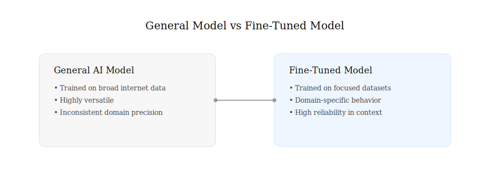

A general AI model learns from massive, diverse data: books, articles, code, conversations, websites. This gives it broad capability—but also broad uncertainty.

Fine-tuning takes that same model and exposes it to *focused examples*, such as:

- Legal case summaries for law AI
- Medical records for healthcare AI
- Financial reports for banking systems
- Customer support chats for service bots

The model adjusts its internal patterns so its responses better match the style, rules, and expectations of that domain.

---

### A Simple Analogy

### Visual — How Learning Changes (Analogy)

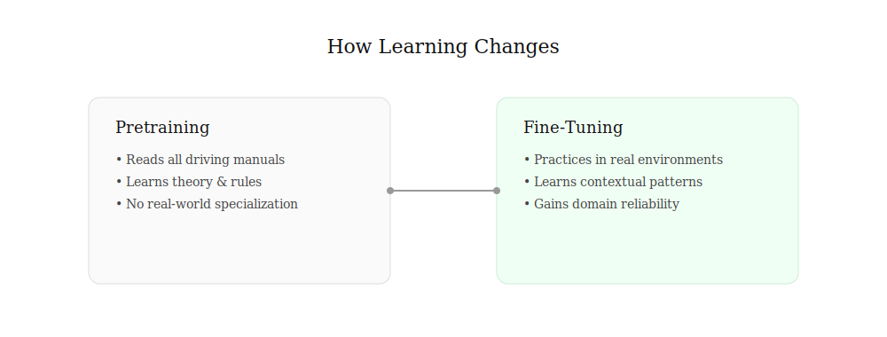

Think of learning to drive:

- **Pretraining** is like reading every driving manual in the world.
- You understand rules, theory, road signs, and vehicle mechanics.

But you’ve never actually driven in a specific city.

- **Fine-tuning** is practicing repeatedly in *New York traffic*, where:
  - Lane discipline is different  
  - Traffic is aggressive  
  - Unwritten rules matter as much as written ones  

After fine-tuning, you don’t become “more intelligent.”

You become *locally reliable*.

---

### What Actually Changes Inside the Model?

### Visual — Internal Adjustment of Model Behavior

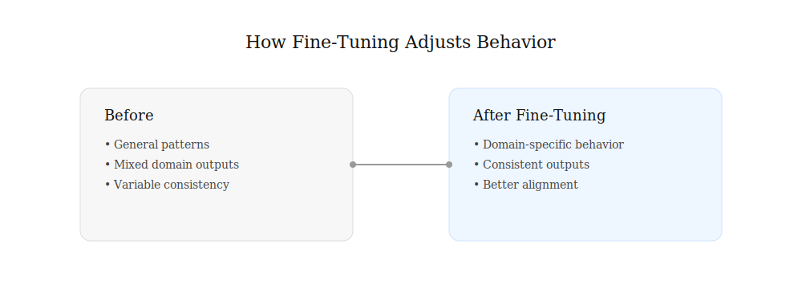

Inside an AI model are millions (or billions) of internal settings called **parameters**.

During fine-tuning:

- These parameters are adjusted slightly
- The model learns new patterns from domain-specific examples
- It begins to prefer certain answers over others in that context

Importantly:

> Fine-tuning does not erase what the model already knows.  
> It reshapes how that knowledge is applied.

---

### Why Fine-Tuning Matters

Without fine-tuning, a general AI model will:

- Sound confident but mix domains
- Blend legal systems incorrectly
- Miss subtle but critical distinctions
- Provide “average” answers across everything

With fine-tuning, it can:

- Follow domain-specific logic consistently
- Use correct terminology naturally
- Reduce irrelevant or incorrect generalization
- Align with professional expectations

In short:

> General models are versatile.  
> Fine-tuned models are dependable.

---

### The Hidden Trade-Off

Fine-tuning comes with a constraint that matters in real-world systems:

- You gain specialization  
- You lose some flexibility

A highly fine-tuned legal model may perform poorly in medical or technical domains. It becomes excellent—but focused.

That is the design choice every AI system must confront:

Do you want a model that can *talk about everything*,  
or one that can *perform one thing correctly every time*?

---

### Key Takeaway

Fine-tuning is not about making AI smarter.

It is about making AI *behave appropriately in a specific world*.

It is the step that transforms a general conversational system into a practical tool used in law firms, hospitals, financial institutions, and enterprise systems where accuracy is not optional—it is required.

## Section 2 — Why Not Train a New Model From Scratch?

When people first hear about fine-tuning, a question often follows:

**Why not simply build a brand-new AI model for every task?**

If a law firm needs a legal AI, why not train a legal model from the beginning? If a hospital needs a medical AI, why not start from scratch with medical data?

The answer is surprisingly simple:

**Training a modern AI model from scratch is extraordinarily expensive.**

In fact, it is one of the most resource-intensive activities in modern computing.

---

## The Cost of Starting From Zero

Imagine teaching a child everything they need to know about the world.

Before they can become a lawyer, they must first learn:

* Language
* Grammar
* Reading
* Writing
* Logic
* History
* Basic facts about how the world works

Only after acquiring this broad foundation can they begin studying law.

Training an AI model follows a similar path.

Before an AI can summarize legal cases or analyze contracts, it must first learn:

* How language works
* How sentences are structured
* How words relate to one another
* How facts are expressed
* How ideas connect across documents

This foundational learning requires enormous amounts of data and computation.

Modern foundation models are trained on vast collections of books, articles, websites, code repositories, and other publicly available information. The process can take months and require thousands of specialized computer processors running continuously.

For most organizations, recreating that effort would be impractical.

### Figure 26.1 — Training From Scratch vs Fine-Tuning

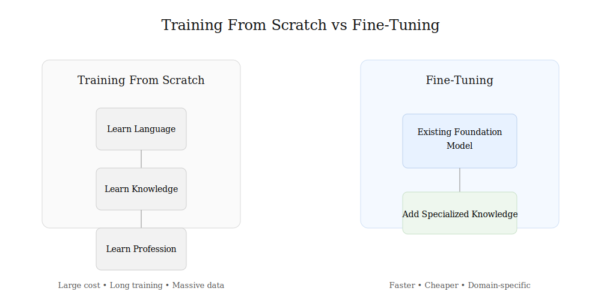

*Building a foundation model requires enormous resources. Fine-tuning starts with an existing model and adds specialized expertise.*

---

## Standing on the Shoulders of Giants

Fine-tuning offers a much smarter approach.

Instead of building a new model from nothing, developers start with a model that has already learned the fundamentals.

The model already understands:

* Language
* Grammar
* Reasoning patterns
* General knowledge
* Conversation structure

In other words, the difficult part has already been completed.

Fine-tuning then adds specialized expertise on top of that existing foundation.

A legal AI does not need to relearn English.

A medical AI does not need to rediscover grammar.

A financial AI does not need to learn what numbers are.

The model already possesses those capabilities.

Fine-tuning simply teaches it how to apply them within a particular domain.

---

## The University Analogy

Think of a university graduate.

After completing a broad education, they understand mathematics, communication, research, and critical thinking.

When they enter law school, they are not starting from zero.

They are building specialized knowledge on top of an existing foundation.

Fine-tuning works in exactly the same way.

The pretrained model is the university graduate.

The fine-tuning process is the professional specialization.

### Figure 26.2 — From General Knowledge to Specialization

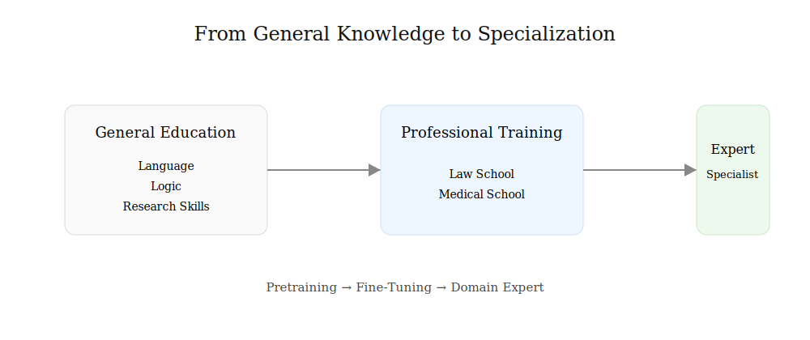

*Fine-tuning builds specialized expertise on top of a broad foundation, much like professional education builds on general learning.*

---

## Faster, Cheaper, and More Practical

Compared with training from scratch, fine-tuning offers several advantages:

* Requires far less data
* Requires far less computing power
* Costs dramatically less
* Can be completed much faster
* Produces domain-specific expertise

This is why most organizations today do not create entirely new foundation models.

Instead, they adapt existing models to their specific needs.

---

## A New Pattern in AI Development

As AI systems have become larger and more capable, a new pattern has emerged:

A small number of organizations build massive foundation models.

Thousands of organizations then customize those models for specialized tasks.

The result resembles the software industry.

Few companies build operating systems from scratch.

Most build applications on top of existing platforms.

Likewise, few organizations build foundation models from scratch.

Most build specialized AI systems on top of models that already exist.

---

## Key Takeaway

Training a modern AI model from scratch is like building an entire university before teaching a single course.

Fine-tuning takes a different approach.

It starts with a model that has already learned the fundamentals and then teaches it a specialized profession.

That is why fine-tuning has become one of the most practical and widely used techniques in modern AI.

## Section 3 — How Fine-Tuning Works

By now, fine-tuning may sound almost magical.

A general AI model somehow becomes a legal expert, a medical assistant, or a financial analyst simply by being exposed to specialized data.

But what actually happens during that process?

The answer is simpler than most people expect.

Fine-tuning is essentially a continuation of learning.

The model already knows a great deal about language and the world. Fine-tuning simply gives it additional examples that teach it how to behave in a specific domain.

---

## Starting With a Pretrained Model

Every fine-tuning project begins with an existing pretrained model.

This model has already spent months learning from enormous collections of text.

It understands:

* Words and grammar
* Sentence structure
* General knowledge
* Patterns in language
* Basic reasoning

Think of it as a graduate who has already completed a broad education.

The model is not starting from zero.

It already possesses a substantial foundation.

---

## Providing Specialized Examples

The next step is to provide examples from the target domain.

For a legal AI, those examples might include:

* Court opinions
* Legal briefs
* Contracts
* Statutes
* Regulatory documents

For a medical AI, the examples might include:

* Medical literature
* Clinical guidelines
* Diagnostic reports
* Healthcare documentation

The goal is not to teach the model language again.

The goal is to teach it how experts in a specific field communicate, reason, and solve problems.

---

## Learning Through Repetition

The model studies these examples repeatedly.

For each example:

1. The model generates a prediction.
2. The prediction is compared with the desired answer.
3. An error is measured.
4. Internal parameters are adjusted slightly.

The process is remarkably similar to the training methods discussed in earlier chapters.

The difference is that the learning now focuses on a much narrower area of expertise.

Instead of learning everything, the model learns what matters most for a particular profession or task.

### Figure 26.3 — The Fine-Tuning Process

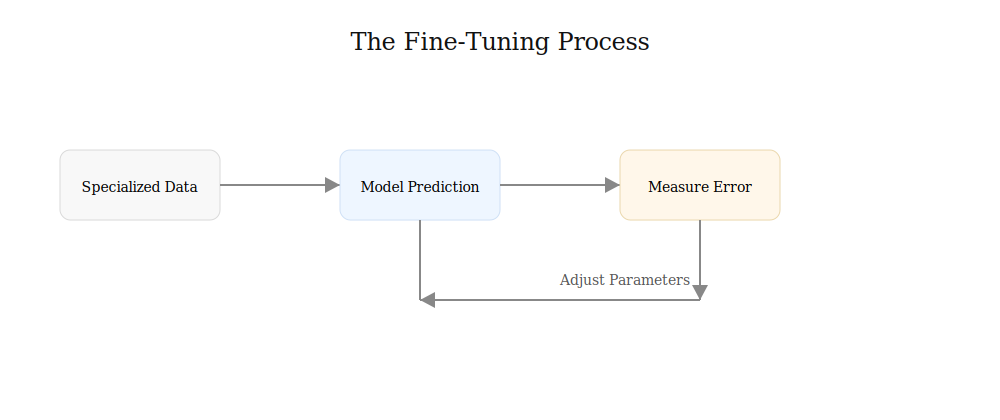

*Fine-tuning repeatedly compares model predictions with desired answers and makes small adjustments to improve future responses.*

---

## Small Adjustments, Big Effects

One of the most surprising aspects of fine-tuning is how little needs to change.

Modern AI models contain millions or billions of parameters.

During fine-tuning, only small adjustments may be required.

Imagine a professional pianist.

After years of training, they already understand music.

Learning a new song does not require relearning every note, scale, and technique from the beginning.

Instead, small refinements allow them to perform a specific piece beautifully.

Fine-tuning works in much the same way.

A model's general knowledge remains largely intact while its behavior becomes more specialized.

---

## Gradually Shaping Behavior

Fine-tuning is not simply about adding facts.

It also shapes preferences and behavior.

For example, a legal model may learn to:

* Use formal legal language
* Cite sources carefully
* Distinguish between jurisdictions
* Avoid unsupported conclusions

A medical model may learn to:

* Use clinical terminology
* Express uncertainty appropriately
* Follow established guidelines
* Prioritize patient safety

In both cases, the model is learning not just *what to know*, but *how to respond*.

---

## The Result

After enough examples and adjustments, the model begins to behave differently.

The underlying architecture remains the same.

The model still understands general language.

But it now performs much more effectively within its specialized domain.

What began as a broad generalist gradually becomes a focused expert.

That transformation is the essence of fine-tuning.

### Figure 26.4 — From Generalist to Specialist

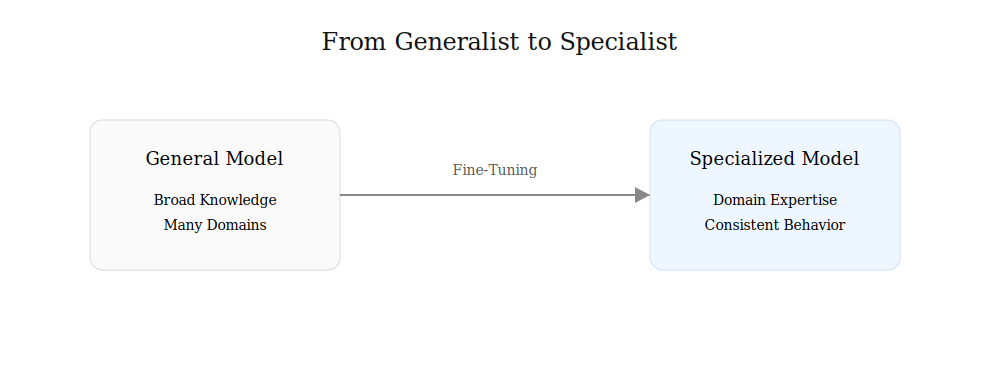

*Fine-tuning does not create a new model. It gradually transforms a broad generalist into a domain-focused expert.*

---

## Key Takeaway

Fine-tuning works by continuing the learning process on carefully selected examples.

The model starts with broad knowledge, studies specialized data, and gradually adjusts its internal parameters.

The result is not a completely new intelligence.

It is the same model—guided, refined, and adapted for a specific purpose.

## Section 4 — Fine-Tuning in the Real World

Fine-tuning may sound like a technical procedure performed inside research laboratories, but in reality it is one of the most widely used techniques in modern AI.

Every day, organizations around the world adapt general-purpose AI models to solve highly specialized problems.

Law firms, hospitals, banks, software companies, and customer service centers all face the same challenge:

How can a general AI system become an expert in a specific field?

Fine-tuning is one of the most common answers.

### Figure 26.5 — One Foundation Model, Many Specialists

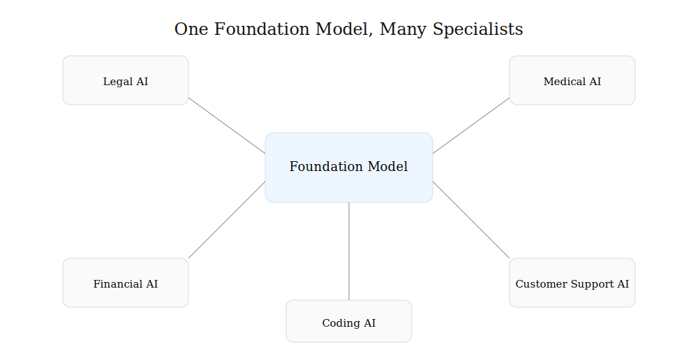

*The same foundation model can be fine-tuned into many specialized systems serving different professions and industries.*

---

## Legal AI

Consider the legal profession.

A general AI model may understand contracts, court cases, and legal terminology, but it was trained on information from many different domains.

As a result, it may:

* Mix legal systems
* Use incorrect citations
* Misinterpret legal terminology
* Overlook jurisdiction-specific rules

To improve performance, developers can fine-tune a model using:

* Court opinions
* Legal briefs
* Statutes
* Regulatory guidance
* Contract language

After fine-tuning, the model becomes more familiar with legal reasoning, legal writing styles, and domain-specific terminology.

It does not become a lawyer.

But it becomes much better at supporting legal work.

---

## Medical AI

Healthcare presents an even greater challenge.

Medical decisions often involve specialized language, complex procedures, and significant consequences.

A general-purpose AI may understand medical concepts, but healthcare organizations frequently require higher levels of accuracy and consistency.

Fine-tuning can help models learn:

* Clinical terminology
* Medical documentation styles
* Diagnostic guidelines
* Treatment protocols

The result is an AI system better suited for assisting healthcare professionals in their daily work.

---

## Customer Support Systems

Many companies use AI to answer customer questions.

Without fine-tuning, a model might provide answers that are technically correct but inconsistent with company policies.

For example, an airline's customer support system needs to understand:

* Refund policies
* Baggage rules
* Loyalty programs
* Company procedures

By fine-tuning on company-specific documents and support conversations, the AI learns how the organization expects questions to be answered.

This creates a more consistent customer experience.

---

## Financial Services

Banks, insurance companies, and investment firms often operate under strict regulatory requirements.

Fine-tuned models can learn:

* Industry terminology
* Compliance requirements
* Internal procedures
* Financial reporting styles

Because financial information is highly specialized, even small improvements in consistency and accuracy can provide significant value.

---

## Software Development

Fine-tuning is also common in software engineering.

A general coding model may understand many programming languages, but organizations often want models that understand:

* Internal coding standards
* Company frameworks
* Preferred design patterns
* Proprietary software systems

Fine-tuning helps align the model with the organization's development practices.

As a result, generated code becomes more consistent with existing projects.

---

## More Than Knowledge

One of the most important lessons about fine-tuning is that it does not simply teach facts.

It teaches behavior.

A fine-tuned model learns:

* How to communicate
* What style to use
* Which standards to follow
* How to handle uncertainty
* What information deserves special attention

In many cases, these behavioral improvements are just as valuable as additional knowledge.

### Figure 26.6 — Fine-Tuning Shapes Behavior

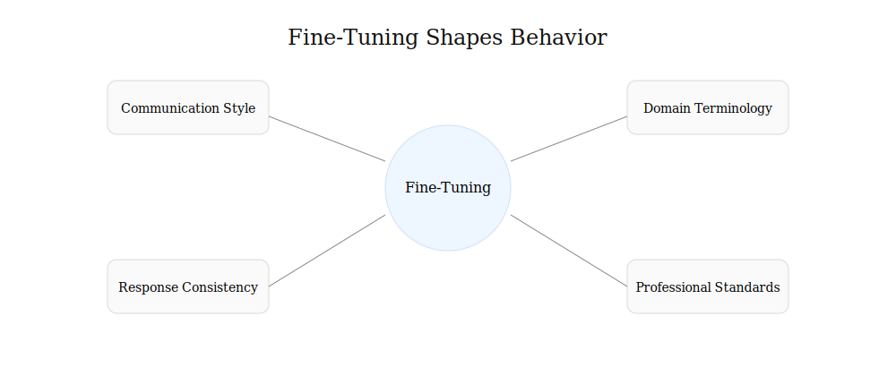

*Fine-tuning influences not only what a model knows, but also how it communicates, reasons, and responds.*

---

## Why Organizations Fine-Tune Models

Organizations typically choose fine-tuning because they want AI systems that are:

* More reliable
* More consistent
* Better aligned with professional standards
* Better adapted to specialized tasks

Rather than creating a completely new model, they build on an existing foundation and shape it to fit their needs.

---

## Key Takeaway

Fine-tuning allows organizations to transform general-purpose AI into domain-specific tools.

Whether the goal is legal research, medical assistance, customer support, financial analysis, or software development, the underlying idea remains the same:

Start with broad intelligence.

Then carefully shape it for a specific purpose.

That ability to adapt one model to many professions is one of the reasons fine-tuning has become such an important part of modern AI.

## Section 5 — The Limits of Fine-Tuning

By now, fine-tuning may seem like the perfect solution.

Need a legal AI?

Fine-tune a model.

Need a medical assistant?

Fine-tune a model.

Need better customer support?

Fine-tune a model.

While fine-tuning is extremely useful, it is not a magic wand.

Like every technology, it has strengths and limitations.

Understanding those limitations is important because they reveal why newer techniques—such as Retrieval-Augmented Generation (RAG)—have become so popular.

### Figure 26.7 — The Limits of Fine-Tuning

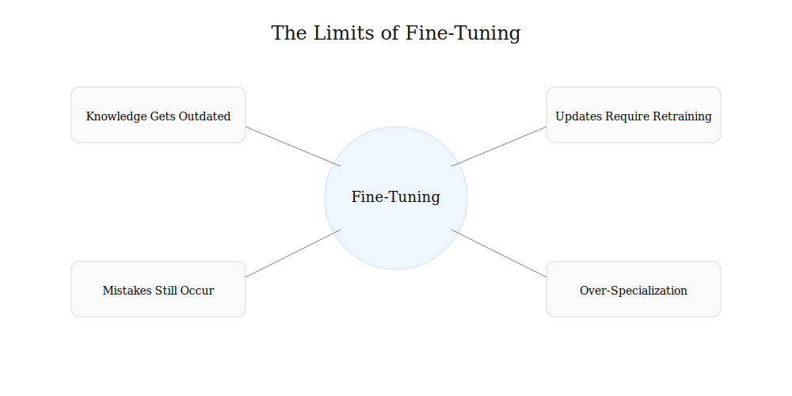

*Fine-tuning improves specialization, but it cannot solve every challenge faced by modern AI systems.*

---

## Knowledge Changes Over Time

One challenge is that the world never stops changing.

New laws are passed.

New court decisions are issued.

Medical guidelines evolve.

Financial regulations are updated.

When a model is fine-tuned, it learns from the information available at that moment.

But the world continues moving forward.

Over time, the model's specialized knowledge can become outdated.

To remain current, additional fine-tuning may be required.

---

## Updating Can Be Expensive

Although fine-tuning is far less expensive than training a model from scratch, it still requires:

* Data preparation
* Computing resources
* Testing
* Validation

If information changes frequently, repeatedly fine-tuning a model can become costly and time-consuming.

Organizations must decide whether retraining is worth the effort.

---

## Fine-Tuning Does Not Guarantee Accuracy

A common misconception is that fine-tuning makes a model incapable of mistakes.

Unfortunately, that is not true.

A fine-tuned model can still:

* Hallucinate
* Misinterpret information
* Make incorrect assumptions
* Produce confident but inaccurate answers

Fine-tuning improves behavior and specialization, but it does not eliminate the fundamental limitations of AI.

Human oversight remains important.

---

## Too Much Specialization

Specialization creates expertise.

But excessive specialization can reduce flexibility.

Imagine a doctor who has spent decades studying only one rare disease.

That doctor may become exceptionally knowledgeable in a narrow field but less capable outside that area.

AI models face a similar challenge.

A heavily specialized model may perform extremely well in one domain while becoming less effective in others.

In some cases, developers refer to this problem as *over-specialization*.

---

## Storing Knowledge Inside the Model

Fine-tuning places knowledge directly into the model's parameters.

This works well when the information is relatively stable.

However, some information changes constantly.

Consider:

* Stock prices
* Weather forecasts
* Flight schedules
* Breaking news
* Newly decided court cases

Embedding rapidly changing information into a model can be inefficient because it requires repeated retraining.

For dynamic information, a different approach may be more practical.

---

## The Rise of a New Idea

As AI systems became more widely used, researchers began asking an important question:

What if the model did not need to memorize everything?

What if it could look up information when needed?

Humans do this all the time.

Lawyers consult legal databases.

Doctors review medical references.

Students use libraries.

Researchers search scientific papers.

Perhaps AI systems could do something similar.

That question led to one of the most important developments in modern AI:

**Retrieval-Augmented Generation**, often called **RAG**.

Instead of storing all knowledge inside the model, RAG allows the model to retrieve information from external sources before generating an answer.

### Figure 26.8 — Fine-Tuning vs Retrieval-Augmented Generation (RAG)

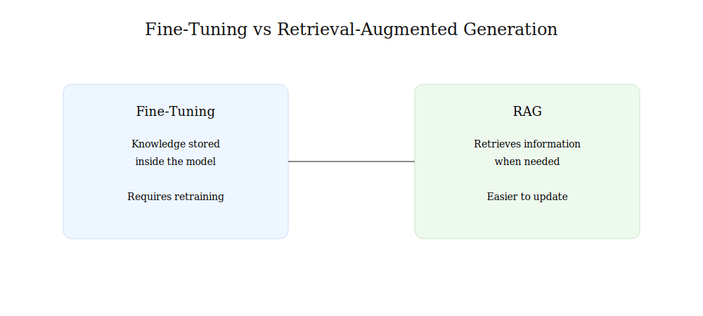

*Fine-tuning stores knowledge inside a model, while RAG retrieves information from external sources when needed.*

---

## Fine-Tuning and RAG Are Partners

It is important to understand that fine-tuning and RAG are not competitors.

In many modern systems, they work together.

Fine-tuning helps the model develop the right behavior and expertise.

RAG helps the model access current and relevant information.

Together, they often produce better results than either approach alone.

---

## Key Takeaway

Fine-tuning is a powerful way to create specialized AI systems, but it has limits.

Knowledge becomes outdated.

Updates require effort.

Mistakes can still occur.

And some information changes too quickly to store permanently inside a model.

These limitations inspired a new approach—one that allows AI to retrieve information when needed rather than memorizing everything in advance.

That approach is called RAG, and it will be the focus of the next chapter.

## Insight Box — Fine-Tuning in One Mental Model

If you strip everything down, fine-tuning is not a complex idea.

It is a **reuse strategy**.

Instead of building intelligence from scratch every time, we take a model that already understands language and reshape it for a specific job.

---

## The Core Mental Model

Think of AI development in three layers:

* **Pretraining** → teaches general intelligence (language, reasoning, patterns)
* **Fine-tuning** → teaches professional behavior (law, medicine, finance, etc.)
* **Application layer** → decides how the AI is used in a product

Fine-tuning sits in the middle. It is the bridge between “can talk” and “can perform a role.”

---

## What Fine-Tuning Actually Does

Fine-tuning does three subtle but important things:

* It **nudges probabilities** so certain answers become more likely in a domain
* It **teaches style and structure** (how answers should look, not just what they say)
* It **reduces randomness** in specialized contexts

It does not rewrite the model. It reshapes its behavior.

---

## The Key Insight Most People Miss

Fine-tuning is not about adding knowledge.

It is about **compressing experience into behavior**.

A legal model is not “loaded with law.”

It has simply learned to behave like someone who has seen a lot of legal work.

That difference matters.

One is memory. The other is pattern alignment.

---

## Why This Matters in Practice

This is why fine-tuned models feel different:

* They sound more disciplined
* They avoid mixing unrelated domains
* They respond in a more structured way
* They “stay in character” for a profession

That stability is often more valuable than raw intelligence.

---

## The Hidden Trade-Off

Every fine-tuned model makes a quiet sacrifice:

* It becomes **better at one thing**
* But slightly **less flexible at everything else**

This is not a flaw. It is a design choice.

Specialization always has a cost.

---

## Bridge to the Next Idea

Fine-tuning improves *behavior inside the model*.

But it still has one major limitation:

It cannot easily keep up with a changing world.

That gap is exactly where the next idea comes in.

Instead of forcing the model to remember everything, what if it could **look things up when needed**?

That question leads directly to Retrieval-Augmented Generation (RAG).

## Final Thoughts — Fine-Tuning

Fine-tuning is one of those ideas that looks bigger on the inside than on the outside.

On the surface, it is simple: take a pretrained model and train it further on specialized data.

But underneath that simplicity is a major shift in how AI systems are built and deployed.

---

## What This Chapter Really Showed

Across this chapter, one idea stayed constant:

Modern AI does not start from zero.

Instead, it builds on what already exists and adapts it.

Fine-tuning is the mechanism that turns:

* General intelligence → domain expertise
* Broad capability → professional behavior
* One model → many specialized systems

It is not about creating intelligence.

It is about shaping it.

---

## The Practical Reality

In real systems, fine-tuning is less about theory and more about engineering trade-offs.

It answers questions like:

* How do we make AI behave reliably in a specific field?
* How do we reduce errors in domain-specific tasks?
* How do we align outputs with professional standards?

The goal is not perfection.

The goal is consistency.

---

## What Fine-Tuning Is Not

It is just as important to understand what fine-tuning does *not* do:

* It does not guarantee factual correctness
* It does not remove hallucinations
* It does not make models universally better
* It does not replace external knowledge sources

It improves behavior, not truth itself.

That distinction becomes critical in real-world applications.

---

## The Bigger Pattern

Fine-tuning also reveals something deeper about modern AI systems:

Progress is no longer about building a single “perfect model.”

It is about building an ecosystem:

* Foundation models provide general intelligence
* Fine-tuning provides specialization
* External systems provide real-time knowledge

Each layer solves a different problem.

---

## Why This Matters Going Forward

As AI systems become more embedded in law, medicine, business, and daily life, the demand will not simply be for smarter models.

It will be for:

* Reliable models
* Consistent models
* Adaptable models
* Context-aware systems

Fine-tuning is one of the early answers to that demand.

But it is not the final answer.

---

## Closing Idea

If there is one takeaway from this chapter, it is this:

AI is not a single monolithic intelligence.

It is a flexible system that can be reshaped for different roles.

Fine-tuning is the process that makes that flexibility real.

And once you understand that, you start to see modern AI not as a mysterious black box, but as a layered system that can be guided, specialized, and improved with intention.

