# Chapter 27: Retrieval-Augmented Generation (RAG)

## Opening Story: The Lawyer Who Couldn’t Trust the Answer

It started with a simple question.

A junior associate at a mid-sized law firm needed a quick answer:  
*“What are the key precedents for liability in autonomous vehicle accidents in California?”*

She did what everyone does now—she asked an AI assistant.

The response came back almost instantly. Clean. Confident. Structured. It listed several landmark cases, complete with summaries and dates. It even explained how courts were “increasingly leaning toward shared liability models.”

It looked perfect.

She almost pasted it directly into the client memo.

But something felt off.

One of the cases sounded unfamiliar. Not just unfamiliar—suspiciously polished, like it had been written for a textbook rather than pulled from a real legal database. Another case citation didn’t match anything in Westlaw or LexisNexis.

So she did what good lawyers do when something feels too smooth to be true: she checked.

Nothing.

The cases weren’t real.

Not slightly wrong. Not misquoted. Just… fabricated.

The AI hadn’t *retrieved* legal knowledge. It had *guessed what a good answer should look like.*

And that’s when the problem became obvious.

A general AI model is like a brilliant intern who has read almost everything—but doesn’t have a law library open in front of them. When asked a question, it doesn’t search real cases. It predicts language that *sounds right.*

Sometimes that works beautifully.  
Sometimes it creates fiction with confidence.

That was the moment the firm changed how they used AI.

They didn’t stop using it.  
They just stopped trusting it blindly.

Instead, they introduced a new workflow:

First, the system *retrieves real documents* from trusted legal sources.  
Then, the AI *writes the answer using only that material.*

No guessing. No improvisation. No invented case law.

Just grounded reasoning.

That system had a name: **Retrieval-Augmented Generation**.

Or more simply: RAG.

And it solved the exact problem she had just experienced.

Not by making the AI smarter.  
But by making it *look things up before speaking.*

---

## The Core Idea (Without the Technical Noise)

A normal AI model:
- Remembers patterns
- Predicts answers
- Sometimes hallucinates details

A RAG system:
- Searches real documents first
- Feeds them into the model
- Forces answers to stay grounded in evidence

---

## Mental Model

Think of it like this:

A standard AI is a lawyer arguing from memory.

A RAG system is a lawyer who walks into court with a full digital library and cites everything live.

---

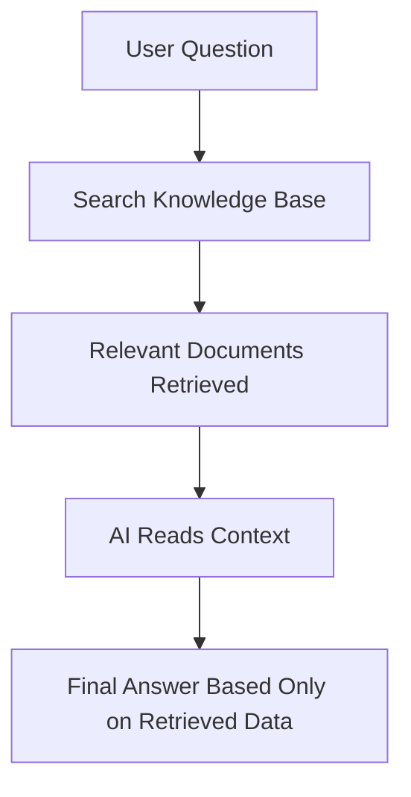

## Section 1 — Why This Problem Exists in the First Place

Retrieval-Augmented Generation does not begin as a solution.

It begins as a limitation.

To understand why it exists, you have to accept something that is not immediately obvious when interacting with modern AI systems:

**A language model is not connected to reality.**

It does not check facts.  
It does not query databases.  
It does not verify anything it says.

It simply generates the most statistically likely sequence of words based on patterns learned during training.

That difference is subtle in explanation—but decisive in consequence.

---

## A System That Never Looks Things Up

A standard AI model is trained on a massive snapshot of human text: books, articles, websites, code, and conversations.

But once training is complete, the system becomes static:

- No live updates  
- No access to external databases  
- No ability to verify information  
- No built-in mechanism to “look things up”

At runtime, there is only one process:

**Predict the next word based on learned patterns.**

So when a user asks:

> “What are the key precedents for liability in autonomous vehicle accidents?”

the model does not search legal databases like Westlaw or LexisNexis.

Instead, it reconstructs what such an answer *should look like* based on similar legal language it has seen before.

This is where the illusion begins.

---

## 📌 Figure 27.1 — Closed Book vs Open Book Thinking

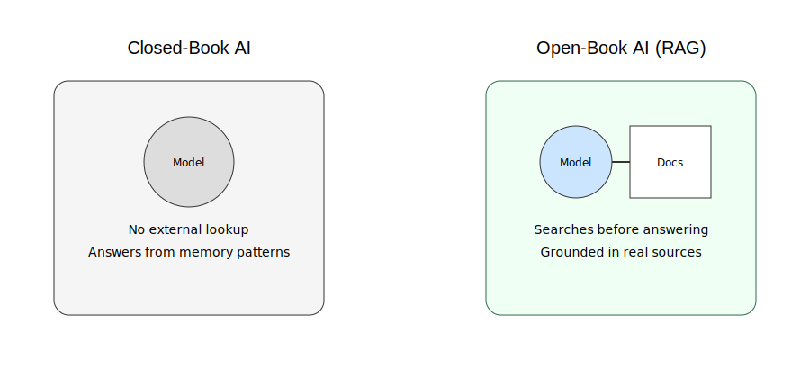

**Figure 27.1:** A standard AI operates like a closed-book system relying only on internal memory patterns, while retrieval-based systems act like open-book systems that consult external documents before answering.

---

## Hallucination: When Language Becomes Too Confident

Because the model is optimized to produce fluent and coherent text, it does not distinguish between:

- what is true  
- what is plausible  
- what merely *sounds* correct  

As a result, it can generate:

- realistic-sounding case law  
- convincing citations  
- structurally perfect legal reasoning  
- entirely fabricated facts  

This behavior is not accidental.

It is a direct consequence of how the system is designed: it completes patterns rather than verifying reality.

If the training data contains thousands of legal citations, the model learns the *shape* of a citation.

But it does not inherently know whether a newly generated citation corresponds to an actual legal case.

So it fills in the missing pieces with statistical confidence.

---

## 📌 Figure 27.2 — How Hallucination Emerges

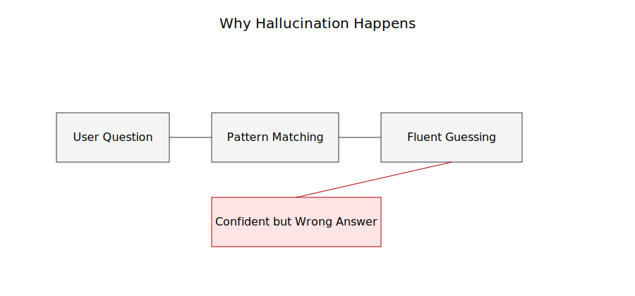

**Figure 27.2:** The model moves from user input to pattern matching to fluent generation, but without any verification step—leading to confident but ungrounded outputs.

---

## Why This Matters in Real-World Domains

In casual use, these errors are tolerable.

If an AI makes a mistake about a movie plot or suggests a slightly wrong recipe, the consequences are minimal.

But in professional environments, the cost structure changes:

- In law, a fabricated precedent can distort legal strategy  
- In medicine, a false claim can influence clinical decisions  
- In finance, incorrect assumptions can misguide investment models  

The issue is not occasional inaccuracy.

The issue is **confident inaccuracy presented in a professional tone.**

That combination is uniquely dangerous.

---

## The Missing Layer: Ground Truth

At the core of the problem is a structural absence:

The model has no guaranteed connection to real-world data at the moment it generates an answer.

It is effectively operating in isolation from external knowledge systems.

A useful analogy:

It is like asking a lawyer to argue a case after reading an entire law library once—  
but without allowing them to open the books again during the argument.

No matter how capable they are, recall alone is not enough.

---

## 📌 Figure 27.3 — The Disconnect from Reality

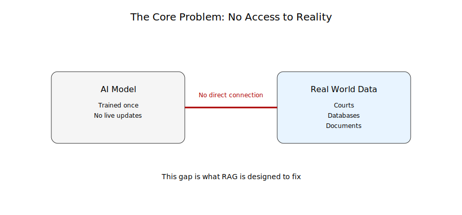

**Figure 27.3:** Standard language models operate without direct access to live external knowledge sources such as legal databases, court records, or verified documents.

---

## The Key Insight That Changed Everything

If the model cannot reliably *remember truth*, then the solution is not to improve memory.

It is to change the workflow entirely.

Instead of forcing the model to answer from internal patterns alone, we allow it to:

**retrieve relevant external information at the moment of answering.**

Not from memory.

Not from guesswork.

But from *grounded sources*.

This idea is the foundation that leads directly into Retrieval-Augmented Generation.

## Section 2 — What RAG Actually Changes

Once you understand the limitation of standard AI systems, RAG stops looking like an optional enhancement.

It becomes a correction layer.

Not an upgrade in intelligence—but a change in behavior.

The core shift is simple:

Instead of answering from internal patterns alone, the system first retrieves relevant external information and then generates an answer grounded in that information.

This introduces something the original model never had:

**a controlled connection to reality at runtime.**

---

## From Guessing to Grounding

In a standard model, the workflow is linear:

User question → internal pattern matching → generated response

In a RAG system, an extra step is inserted before generation:

User question → retrieval → contextual documents → grounded generation

That single change transforms how reliability is achieved.

The model is no longer forced to “remember” everything.

It is allowed to *consult sources* before responding.

---

## 📌 Figure 27.4 — Standard Model vs RAG Pipeline

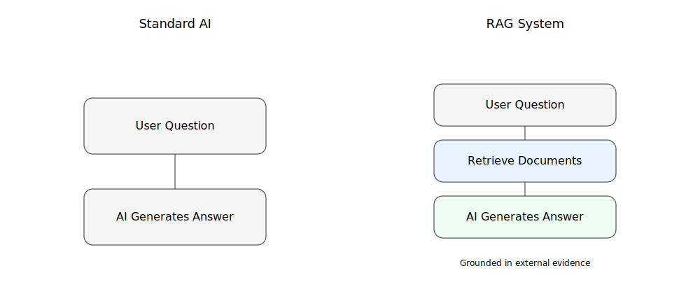

**Figure 27.4:** Standard AI generates responses directly from learned patterns, while RAG systems first retrieve relevant documents and then generate grounded responses using that context.

---

## The Three Core Components of RAG

A RAG system is not a single model.

It is a pipeline composed of three distinct stages:

### 1. Retrieval
The system searches external knowledge sources such as:
- legal databases
- internal company documents
- research archives
- vector databases

It identifies the most relevant information for the user’s query.

### 2. Augmentation
The retrieved content is then passed into the model as context.

This step is crucial.

The model does not “remember” this information—it temporarily reads it.

### 3. Generation
The model produces a response based *only* on:
- the user query
- the retrieved documents

This constrains hallucination at the source.

---

## 📌 Figure 27.5 — RAG Three-Stage Architecture

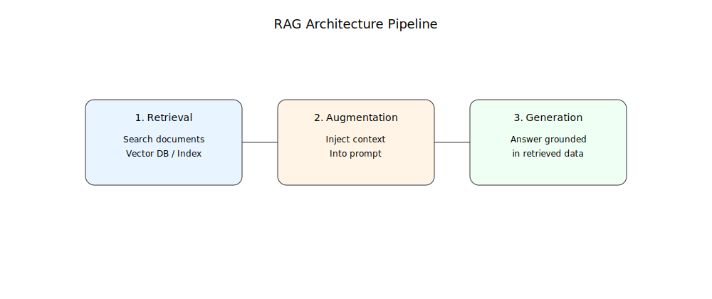

**Figure 27.5:** Retrieval identifies relevant documents, augmentation injects them into context, and generation produces an answer grounded in retrieved evidence.

---

## Why This Changes Reliability

The key difference is not cosmetic.

It is structural.

A standard model answers the question:

> “What is most likely a good answer?”

A RAG system answers a different question:

> “Given these retrieved documents, what is the correct answer?”

This shift reduces one of the most persistent issues in AI systems: **unsupported confidence.**

The model is no longer free to invent context when it runs out of knowledge.

It must anchor its response in retrieved material.

---

## 📌 Figure 27.6 — Answering Without vs With Evidence

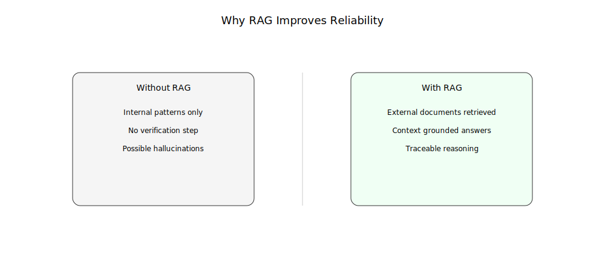

**Figure 27.6:** Without retrieval, responses are generated from internal patterns alone. With RAG, responses are constrained by external evidence retrieved at runtime.

---

## A Subtle but Important Shift

RAG does not make the model “know more.”

It makes it **consult more before speaking.**

That distinction is critical.

Because most failures in language models are not due to lack of capability.

They are due to lack of constraint.

RAG introduces that constraint by design.

---

## What This Means in Practice

In real-world systems, RAG enables:

- Legal assistants that cite real case law instead of invented precedents  
- Enterprise search systems that answer based on internal documents  
- Medical tools that ground responses in verified research papers  
- Customer support systems that respond using official documentation  

The common thread is not intelligence.

It is **traceability.**

Every answer can, in principle, be linked back to retrieved sources.

---

## The Foundation for Everything That Follows

RAG is not the end of the system design.

It is the beginning of a broader architecture shift.

Once retrieval becomes part of the pipeline, everything changes:

- how memory is handled  
- how knowledge is stored  
- how reasoning is constrained  
- how trust is established  

What comes next is not just better answers.

It is a new way of building AI systems that stay anchored to evidence rather than imitation.

## Section 3 — How RAG Actually Works Under the Hood

Up to this point, RAG has looked like a simple idea:

Retrieve information, then generate an answer.

But under the surface, there is a carefully engineered pipeline designed to solve a very specific problem:

**How do you find the right information fast enough, and reliably enough, for the model to use it in real time?**

This is where RAG becomes more than a concept. It becomes a system.

---

## The Core Problem: Search Is Not Trivial

At first glance, “retrieval” sounds simple.

You search a database, find relevant documents, and pass them to the model.

But real-world data is:

- unstructured
- massive in scale
- semantically ambiguous
- full of near-duplicates

A keyword search is not enough.

If a user asks:

> “What are the legal standards for negligence in autonomous driving cases?”

The system must understand meaning, not just words.

It must retrieve documents that are *conceptually relevant*, even if they do not share exact phrasing.

This is where traditional search breaks down—and RAG introduces a new mechanism.

---

## Step 1 — Turning Language Into Vectors

Instead of treating text as words, RAG systems convert it into numbers.

Each document is transformed into a mathematical representation called an **embedding**.

An embedding captures meaning such that:

- similar ideas → close together
- different ideas → far apart

This allows the system to search by *meaning*, not keywords.

A legal case about liability in autonomous systems and a case about driver negligence may look different in text—but sit close in semantic space.

---

## 📌 Figure 27.7 — From Text to Semantic Space

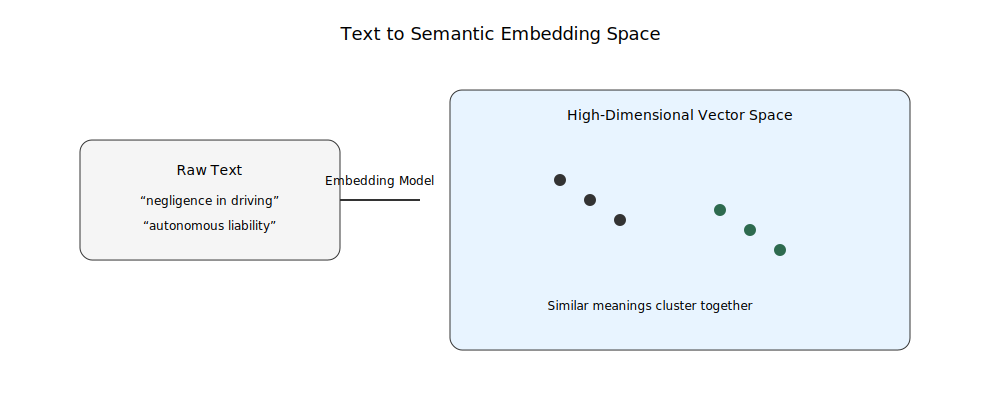

**Figure 27.7:** Text is converted into high-dimensional vectors where semantic similarity determines proximity, enabling meaning-based search instead of keyword matching.

---

## Step 2 — Storing Knowledge in a Vector Database

Once documents are converted into embeddings, they are stored in a **vector database**.

Unlike traditional databases, which store rows and columns, vector databases store:

- numerical representations of meaning
- optimized structures for similarity search

When a query arrives, it is also converted into an embedding.

The system then performs a nearest-neighbor search:

> “Which stored documents are most similar in meaning to this question?”

This is what makes retrieval intelligent rather than mechanical.

---

## Step 3 — Selecting the Right Context

The system does not pass everything it finds to the model.

It filters.

Typically, it selects:
- top-k most relevant documents
- optionally reranked for precision
- compressed to fit within token limits

This step is critical.

Too little context → incomplete answers  
Too much context → confusion and noise  

RAG systems are constantly balancing relevance and clarity.

---

## 📌 Figure 27.8 — Vector Search and Retrieval Flow

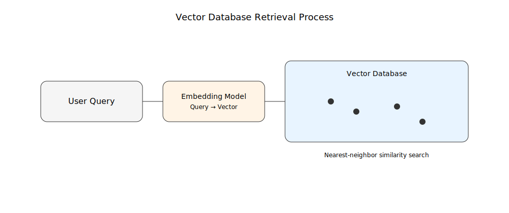

**Figure 27.8:** A user query is embedded, matched against a vector database, and the most semantically similar documents are retrieved and ranked before being passed to the model.

---

## Step 4 — Feeding Context Into the Model

Once the relevant documents are selected, they are inserted into the model’s input prompt.

At this point, the model is no longer working in isolation.

It is reading a curated set of external references.

However, one important detail must be emphasized:

The model does not “store” this information.

It only sees it temporarily—like notes placed on a desk during an exam.

Once the response is generated, the context disappears.

---

## The Subtle Shift in Intelligence

This architecture creates an important separation of responsibilities:

- Retrieval handles *knowledge*
- The model handles *reasoning and language*

This division is intentional.

It prevents the model from having to memorize everything, and instead focuses it on what it does best:

**composing coherent, context-aware answers.**

---

## Why This Design Is Powerful

RAG systems introduce three major advantages:

### 1. Freshness
Information can be updated without retraining the model.

### 2. Accuracy
Answers are grounded in retrieved documents rather than internal guesses.

### 3. Traceability
Responses can be linked back to specific sources.

This makes the system not just more capable—but more accountable.

---

## 📌 Figure 27.9 — Full RAG Workflow Summary

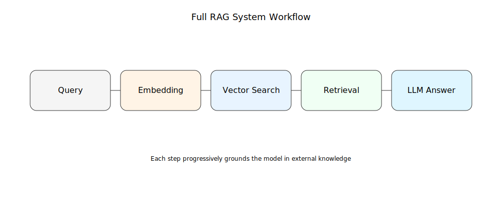

**Figure 27.9:** The full RAG system flow: query embedding → vector search → retrieval → augmentation → grounded generation.

---

## The Key Insight

RAG does not replace the model.

It reshapes its operating environment.

Instead of forcing the model to act as both *memory* and *reasoner*, RAG splits the job:

- External system provides knowledge
- Model provides interpretation

This separation is what makes modern AI systems both scalable and trustworthy.

Without it, large language models remain powerful—but unanchored.

With it, they become usable in environments where correctness matters more than fluency.

## Section 4 — Why RAG Is Not Enough (and What Comes Next)

At this point, RAG looks like a complete solution.

It grounds answers in real documents, reduces hallucinations, and introduces traceability.

For many systems, that is already a major upgrade.

But in production environments, another limitation quickly appears:

**retrieval is only as good as the system that decides what to retrieve.**

And that decision layer is far from perfect.

---

## The New Bottleneck: Finding the Right Context

RAG solves one problem—lack of external knowledge.

But it introduces a second problem:

> How do you ensure the *right information* is retrieved every time?

Because retrieval systems are not intelligent in the human sense. They rely on:
- similarity in meaning
- statistical proximity in vector space
- ranking heuristics

This works well in general cases.

But real queries are rarely clean.

A legal question like:

> “Can liability shift in semi-autonomous driving under mixed fault conditions?”

does not map neatly to a single document.

It spans multiple concepts:
- negligence
- shared liability
- autonomous systems
- jurisdictional variation

The system must infer intent, not just match meaning.

---

## When Retrieval Gets It Wrong

RAG systems fail in subtle ways:

- They retrieve relevant-looking but incomplete documents  
- They miss critical exceptions buried in long text  
- They prioritize common interpretations over rare but important cases  
- They compress nuance into similarity scores  

The model then does what it is told:

It generates an answer based on imperfect context.

So the final output is still grounded—but in **partial truth**.

This is the new failure mode.

Not hallucination.

**Omission.**

---

## 📌 Figure 27.10 — Good Retrieval vs Bad Retrieval

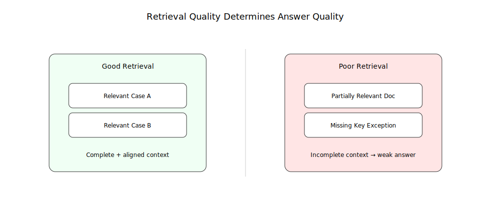

**Figure 27.10:** Even when a system uses retrieval, poor ranking can surface incomplete or misleading context, which still leads to weak or biased outputs.

---

## The Hidden Assumption in RAG Systems

RAG assumes something very important:

> “If we retrieve the right documents, the model will produce the right answer.”

This shifts the burden of correctness upstream.

But it does not guarantee:
- relevance completeness
- contextual coverage
- ranking accuracy
- multi-document reasoning

In other words, RAG improves grounding—but not intelligence.

---

## The Next Layer: Reasoning Over Retrieved Information

To address these limitations, modern systems begin adding another layer:

Instead of simply retrieving documents and passing them to the model, they introduce:

- re-ranking models  
- query rewriting  
- multi-step retrieval  
- iterative search loops  
- tool-using agents  

The system stops behaving like a single request-response pipeline.

It starts behaving like a **decision process**.

---

## From RAG to Agentic Systems

This is where the evolution begins:

- RAG retrieves information  
- Agents decide *how to use tools to gather better information*  

Instead of:

> Retrieve once → generate answer

We move toward:

> Think → retrieve → refine query → retrieve again → verify → generate

This loop changes everything.

Because now the system is not just answering questions.

It is actively improving its own understanding before responding.

---

## 📌 Figure 27.11 — Single-Step RAG vs Iterative Retrieval

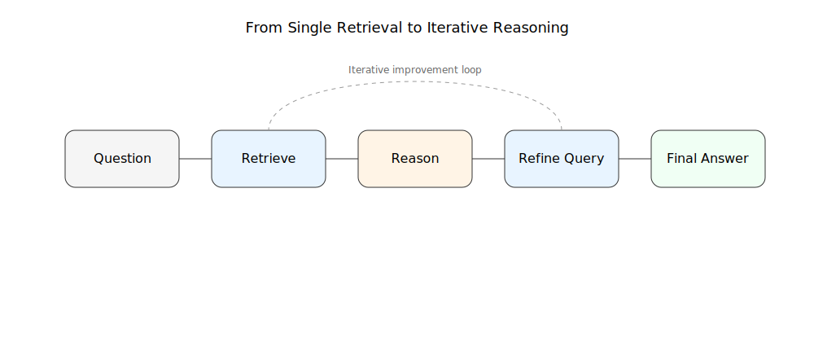

**Figure 27.11:** Traditional RAG retrieves once before generation, while advanced systems iterate through multiple retrieval and reasoning cycles before producing a final answer.

---

## Why This Matters

RAG was designed to solve hallucination.

But production systems discovered something more important:

The real constraint is not whether the model can generate answers.

It is whether the system can:
- find the right information  
- interpret it correctly  
- and decide when it is sufficient  

This moves AI design from static pipelines to dynamic systems.

---

## The Key Insight

RAG is not the final architecture.

It is the first step in separating:

- **knowledge acquisition**
- **reasoning**
- **decision-making**

Once those layers are separated, AI systems stop being simple responders.

They become structured problem solvers operating over external knowledge.

And that shift is what leads directly into the next evolution: **agent-based systems.**

## Section 5 — When RAG Is No Longer Enough: The Rise of Agents

RAG solved a critical problem in AI systems: it gave models access to external knowledge.

But something interesting happens when you deploy RAG at scale inside real workflows.

The system stops being a simple question-answer tool.

Because real users do not ask clean, single-step questions.

They ask messy, multi-part, evolving problems.

And RAG, in its basic form, is not designed for that.

---

## The Hidden Limitation: One-Shot Thinking

A standard RAG system follows a fixed pattern:

1. Receive a question  
2. Retrieve relevant documents  
3. Generate an answer  

That works well when:
- the question is well-defined  
- the required information is clearly retrievable  
- the answer exists in a single context window  

But real tasks rarely behave that way.

For example:

> “Summarize liability trends in autonomous driving, compare them across jurisdictions, and identify gaps in regulation.”

This is not one question.

It is a sequence of sub-problems.

A single retrieval pass is no longer sufficient.

---

## The Shift: From Answering to Planning

This is where a new idea emerges.

Instead of treating the system as a passive responder, we allow it to act more like a planner:

- break the problem into steps  
- decide what information is needed  
- choose tools for each step  
- refine its understanding iteratively  

This is the foundation of **agent-based systems**.

An agent is not just a model that responds.

It is a system that decides *how to proceed* before responding.

---

## 📌 Figure 27.12 — RAG vs Agent Behavior

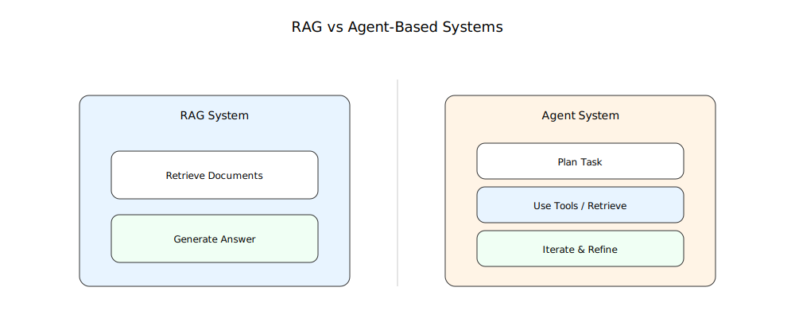

**Figure 27.12:** RAG systems perform a single retrieval-and-generation step, while agent systems plan, decompose tasks, and execute multiple tool-using steps before producing a final response.

---

## What Changes With Agents

Once planning is introduced, the system gains three new capabilities:

### 1. Task Decomposition
Large problems are broken into smaller, manageable steps.

Instead of answering everything at once, the system asks:
- What are the sub-questions?
- What information is needed for each part?

### 2. Tool Selection
The system can choose between different tools:
- retrieval systems  
- calculators  
- APIs  
- code execution  
- search engines  

It is no longer limited to one retrieval mechanism.

### 3. Iteration
The system can refine its own process:
- retrieve → evaluate → retrieve again  
- revise queries  
- correct missing context  
- improve reasoning depth  

This creates a feedback loop rather than a single pass.

---

## 📌 Figure 27.13 — Agent Workflow Loop

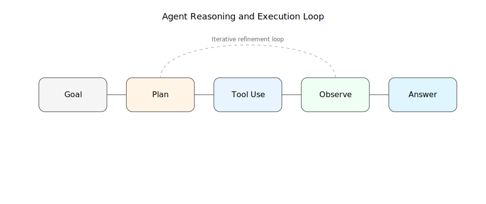

**Figure 27.13:** Agents operate through an iterative loop of planning, tool use, observation, and refinement before producing a final answer.

---

## From Knowledge Systems to Decision Systems

This transition is subtle but important.

- RAG systems improve *knowledge access*  
- Agent systems improve *problem-solving behavior*  

In other words:

RAG helps the model **see more information**.  
Agents help the model **decide what to do with it**.

This distinction defines the next generation of AI architecture.

---

## Why This Matters in Real Applications

Once agents are introduced, AI systems become capable of:

- multi-step legal analysis  
- research synthesis across multiple documents  
- dynamic querying of databases  
- verification before final response  
- structured decision-making workflows  

In legal contexts, this means the system can move beyond:
> “Here is a relevant case”

to:
> “Here is the relevant case law, here is how it applies, here is what is missing, and here is what should be checked next.”

That is a fundamentally different level of capability.

---

## The Structural Insight

RAG was never the final destination.

It was a bridge.

It connected language models to external knowledge.

But once that connection exists, a new question appears:

> What if the system can decide *how many times* it should retrieve, and *what it should retrieve next*?

That question leads directly to agents.

And agents represent the beginning of AI systems that are no longer just reactive—but **goal-directed**.

---

## The Real Evolution Path

The progression is now clear:

- Language Models → pattern-based generation  
- RAG → grounded generation  
- Agents → structured reasoning and tool use  

Each layer does not replace the previous one.

It adds control, structure, and autonomy.

And with that, AI systems begin to resemble something closer to *processes* than *predictions*.

## Section 6 — The Real Meaning of RAG

By this point, RAG may look like a technical pipeline:

retrieve documents → inject context → generate an answer

But that description hides what is actually happening.

RAG is not a feature.

It is a **design philosophy shift**.

---

## From Memory Systems to Evidence Systems

Before RAG, language models were treated as if everything important had to be stored inside the model.

RAG rejects that assumption.

Instead, intelligence is distributed:

- the model handles reasoning  
- external systems store knowledge  
- retrieval connects the two  

This changes the definition of “knowing.”

It is no longer about memorization.

It is about **access and use**.

---

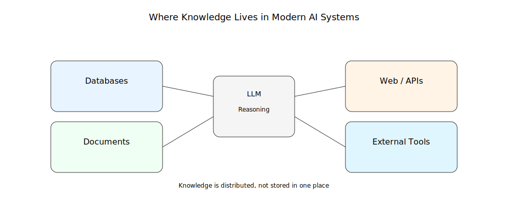

**Figure 27.14:** Knowledge is distributed across databases, documents, APIs, and tools—not stored inside the model alone.

---

## Why This Matters Beyond Engineering

RAG is not just a technical improvement.

It reflects a deeper shift in how we think about intelligence:

- humans don’t store everything  
- humans retrieve information when needed  
- reasoning happens after retrieval  

RAG makes machines behave in a similar way.

Not by copying humans.

But by removing unrealistic expectations of memory.

---

## The Real Breakthrough

The breakthrough is not that RAG reduces hallucination.

That is a side effect.

The real breakthrough is:

AI systems are no longer required to “know” everything internally.

They are allowed to:

- check  
- retrieve  
- verify  

This changes how trust is established.

---

## The Remaining Boundary

Even with RAG, limitations remain:

- poor retrieval leads to poor answers  
- missing data creates blind spots  
- outdated sources propagate outdated reasoning  

So correctness is not guaranteed.

It is **delegated to system design**.

---

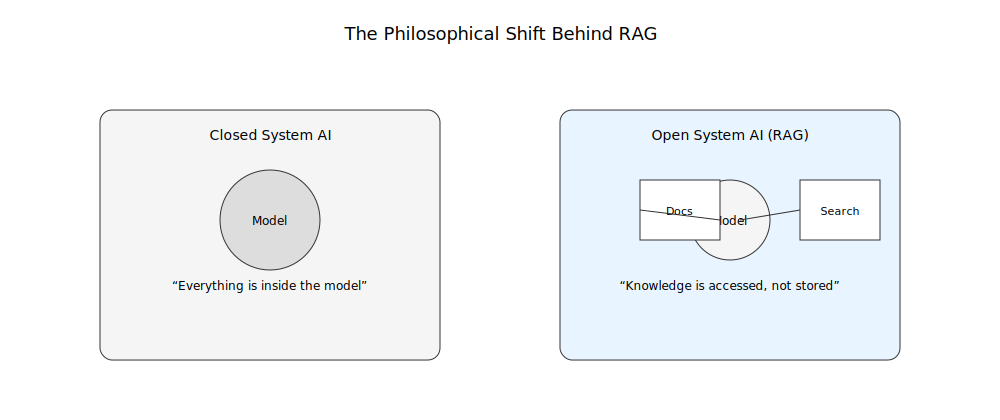

**Figure 27.15:** Closed systems rely entirely on internal memory, while open systems dynamically retrieve knowledge at runtime.

---

## The Final Shift

RAG is not the end of the architecture.

It is the first step toward systems that:

- retrieve knowledge  
- reason over it  
- decide how to act on it  

This leads directly into the next stage of evolution: **agent-based systems**.

---

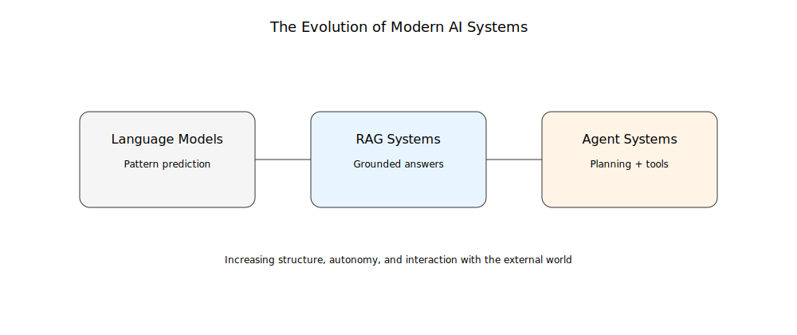

**Figure 27.16:** AI systems evolve from pure prediction (LLMs), to grounded retrieval (RAG), to goal-directed reasoning and tool use (agents).

---

## Closing Insight

RAG does not make AI perfect.

It makes AI **anchored to external reality**.

And once that anchor exists, everything else becomes possible:

- better retrieval  
- better reasoning loops  
- tool use  
- autonomous systems  

RAG is not the destination.

It is the beginning.

## Insight Box — What RAG Really Teaches Us About AI

RAG is often introduced as a technical improvement: a way to reduce hallucinations by giving models access to external documents.

That explanation is correct—but incomplete.

At a deeper level, RAG changes the assumption behind what an AI system *is*.

It shifts AI from being a self-contained knowledge system to being an interface over distributed knowledge.

---

## The Key Idea

Traditional language models assume:

> Knowledge is stored inside the model.

RAG replaces that with a different assumption:

> Knowledge is something the system must access, not memorize.

This single shift changes everything about system design.

---

## What Actually Improves

RAG does not make models more intelligent in the human sense.

Instead, it improves three operational properties:

- **Grounding** → answers are tied to real documents  
- **Freshness** → knowledge can be updated without retraining  
- **Traceability** → outputs can be linked back to sources  

These are not “intelligence gains.”

They are **system reliability gains**.

---

## The Hidden Trade-Off

RAG introduces a new dependency:

The quality of the answer is now constrained by the quality of retrieval.

If retrieval fails, everything downstream degrades—even if the model is powerful.

So the system does not eliminate error.

It relocates it.

---

## The Real Shift in Thinking

RAG forces a mental shift in how AI systems are designed:

- From **memorization → access**
- From **prediction → grounding**
- From **closed models → open systems**

This is the foundation of modern AI architecture.

---

## The Bigger Picture

RAG is not the final solution.

It is the first architectural step toward systems that:

- retrieve information  
- reason over it  
- refine their own understanding  
- and eventually take actions through tools and agents  

In that sense, RAG is not the destination.

It is the moment AI systems stopped pretending they could know everything internally—and started learning how to work with the world outside themselves.

## Final Thoughts — From Answers to Systems

RAG is easy to misunderstand.

At a surface level, it looks like a fix for hallucinations: add retrieval, improve accuracy, reduce errors.

But that framing is too small.

RAG is not a patch on language models.

It is a redesign of how AI systems relate to knowledge.

---

## The Quiet Revolution

Before RAG, the implicit assumption was simple:

> A model should contain knowledge.

After RAG, that assumption breaks:

> A model should *access* knowledge.

This is a subtle change in wording, but a major change in architecture.

Because once you accept that knowledge can live outside the model, everything becomes modular:

- memory becomes a database  
- search becomes a component  
- reasoning becomes a separate capability  

AI stops being a single object.

It becomes a system of interacting parts.

---

## What RAG Actually Solves

RAG does not solve intelligence.

It solves **grounding under uncertainty**.

It ensures that when a model speaks, it is not only relying on statistical memory, but on retrieved evidence that exists outside itself.

This is what makes it usable in serious domains like law, medicine, and finance.

Not perfection.

But controllable imperfection.

---

## What It Still Cannot Do

RAG systems still inherit constraints:

- retrieval can miss critical information  
- context can be incomplete or misleading  
- reasoning can still fail even with correct data  

In other words, RAG does not remove uncertainty.

It structures it.

---

## The Direction of Travel

Once systems begin retrieving information, a natural progression appears:

- retrieval improves → better grounding  
- reasoning improves → better interpretation  
- iteration is introduced → better completeness  
- tools are added → better capability  

RAG is the first stable step in that chain.

It opens the door to systems that do not just answer questions, but actively work through them.

---

## The Deeper Insight

The most important shift is not technical.

It is conceptual:

> Intelligence is no longer defined by what a system contains, but by how well it can connect to what exists outside itself.

That redefinition is what makes modern AI systems scalable, adaptable, and increasingly practical.

---

## Closing Perspective

RAG does not complete AI.

It repositions it.

From isolated prediction engines  
to connected, evidence-driven systems  

From “what does the model know?”  
to “what can the system access and verify?”

And that shift is what turns language models into infrastructure.

Not just tools that respond.

But systems that operate over knowledge.
