# Chapter 28: Agents

  
### Opening Story: *The Assistant That Refused to Stay Still*

It started with a simple request.

A lawyer in a small firm opened her laptop late in the evening and typed:

> “Find recent cases on contract disputes involving AI-generated content, summarize them, and draft a client memo.”

She expected what she always got from traditional tools: a list of links, maybe a few paragraphs of summary, and the rest of the work still waiting for her attention.

Instead, something unusual happened.

The system didn’t just respond. It *paused*—not in the human sense, but in a structured, deliberate way. It broke the request into parts, almost like it was thinking out loud, but silently:

- What needs to be found?
- Where should it look?
- Which sources are trustworthy?
- What format is required at the end?

Then it began working.

First, it searched legal databases. Not once, but repeatedly, refining its queries as new results appeared. Then it filtered cases by relevance, jurisdiction, and recency. It noticed contradictions between rulings and flagged them. It organized the material into themes—liability, authorship, and contractual intent.

But it didn’t stop there.

It drafted the memo.

Not as a rough outline. As a structured legal document with headings, reasoning, and citations placed exactly where they belonged. It even adjusted tone—more cautious in uncertain areas, more assertive where precedent was strong.

Then it paused again.

A final check.

Missing authority? Added. Weak argument? Rewritten. Ambiguous phrasing? Tightened.

Only then did it present the result.

The lawyer leaned back. Nothing about this felt like a search engine anymore. It felt like something had taken her request, understood the goal behind it, and carried the work forward step by step—without asking for permission at every stage.

That was the unsettling part.

Because traditional software waits.

This did not.

It acted.

---

### What just happened?

What she interacted with was not a single model responding to a prompt.

It was an **agent**—a system designed to take a goal, break it into steps, use tools, make decisions, and continue working until the objective is complete.

Not just answering.

Doing.

And once you see that difference clearly, everything about modern AI systems starts to shift.

## Section 1 — What Is an AI Agent?

Most software is predictable.

You give it an instruction, it executes that instruction, and it stops. Every step is explicitly defined in advance, either by a developer or by a fixed workflow.

An **AI agent** works differently. It starts with a goal and determines the steps required to achieve it.

Not prewritten steps.

Chosen steps.

That distinction is where everything changes.

---

### From “Responding” to “Executing”

A traditional AI system behaves like this:

> Input → Processing → Output → Stop

An agent behaves more like this:

> Goal → Planning → Action → Feedback → Adjustment → Repeat

The important shift is continuity. The system does not treat its response as the end of the process. It treats it as part of an ongoing cycle of work.

It is no longer just generating text.

It is managing a process.

---

### The Agent Loop

At the core of every agent is a repeating cycle of reasoning and action:

1. Understand the objective  
2. Decide the next step  
3. Take an action (often using tools)  
4. Observe the result  
5. Update its internal state  
6. Repeat until the goal is achieved  

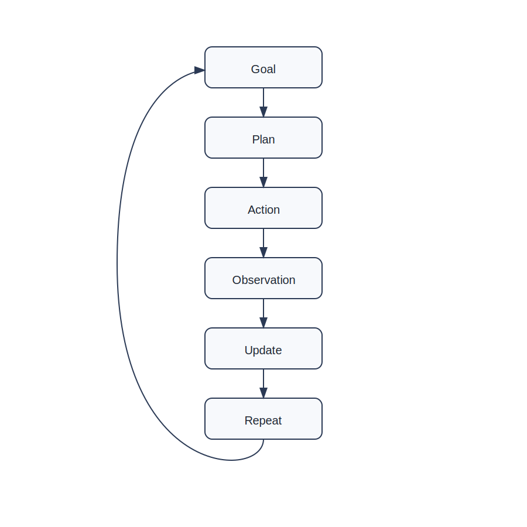

The loop is what allows agents to handle tasks that are too complex to solve in a single response. Instead of trying to “know everything upfront,” they adapt as new information becomes available.

---

### Chatbot vs Agent

To understand why this matters, compare two systems given the same request.

A chatbot waits for a prompt, produces a response, and stops.

An agent takes the same request and begins decomposing it into subtasks, deciding what to do first, what tools to use, and how to refine its output over time.

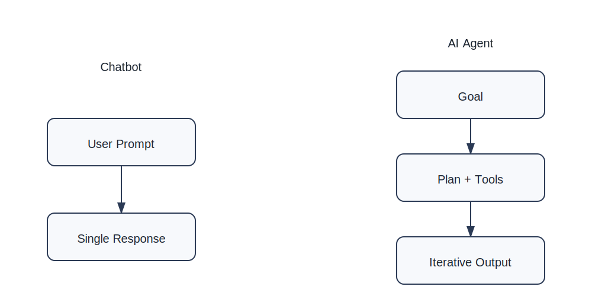

On the surface, both may produce text. But internally, their behavior is fundamentally different.

One reacts.

The other executes.

---

### Turning Goals into Work

An agent does not rely on a single monolithic response. Instead, it continuously transforms a high-level goal into actionable steps.

This typically looks like:

- Breaking the task into smaller components  
- Selecting tools or data sources  
- Running intermediate steps  
- Evaluating whether the result is sufficient  
- Refining the approach if necessary  

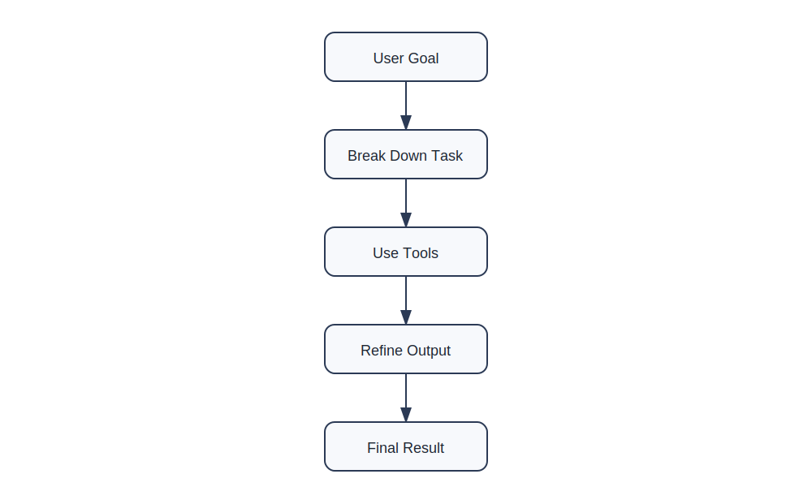

Each cycle improves the outcome. The system effectively “works toward correctness” rather than assuming correctness in one pass.

---

### Why This Matters

Agents fundamentally change what AI systems are capable of.

Instead of being tools that answer questions, they become systems that can carry out tasks:

- Researching multi-step problems  
- Writing structured documents  
- Coordinating tool usage  
- Iterating until results are satisfactory  

This is the first step toward AI systems that behave less like calculators and more like assistants that *do work*.

Not instantly.

But progressively.

And that difference is where modern AI begins to feel less like a model—and more like a system that operates.

  
## Section 2 — How Agents Actually Think

An agent does not “understand” in the human sense.

It processes goals, breaks them into steps, and continuously adjusts its behavior based on what it observes.

What looks like intelligence is actually a structured loop of decision-making.

---

### The Hidden Machinery Behind an Agent

When an agent receives a task, three things happen immediately:

1. It interprets the goal  
2. It constructs a working plan  
3. It decides what tools (if any) are needed  

But unlike traditional software, none of these steps are final.

They are continuously revised.

---

### Planning Is Not a Fixed Blueprint

A common misunderstanding is that agents follow a rigid plan.

They do not.

Instead, they operate with **adaptive planning**, meaning:

- Plans are created on the fly  
- Plans are updated after every action  
- Plans can be discarded entirely if they fail  

This is closer to navigation than execution.

You don’t map the entire journey once—you keep recalculating based on where you are.

---

### The Agent Decision Cycle

Every meaningful agent system is built around a decision loop:

- What is the current situation?  
- What action moves me closest to the goal?  
- What tool should I use?  
- What changed after the last step?  

This cycle is continuous.

It does not pause for confirmation after every step unless explicitly designed to.

---

### Visualizing Agent Decision Flow

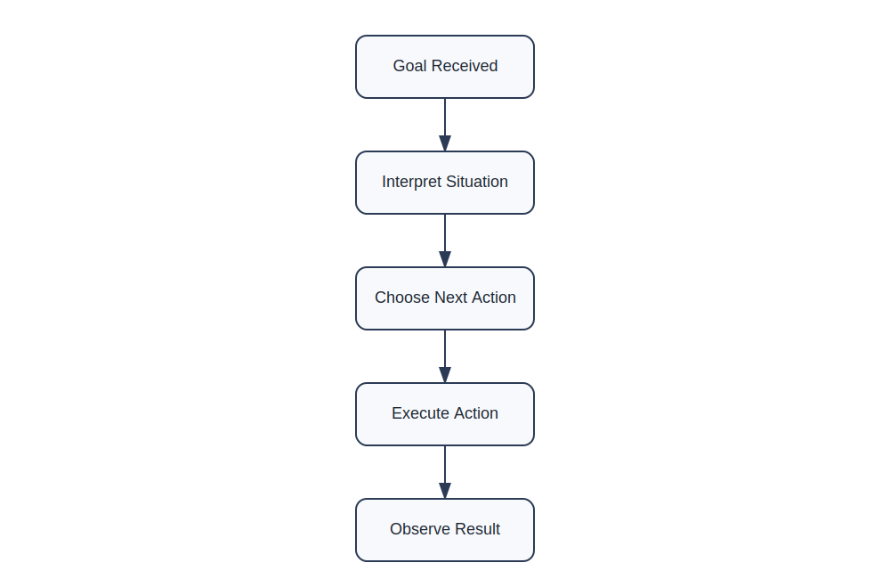

This diagram shows how an agent repeatedly evaluates its environment and adjusts its next action instead of following a fixed script.

---

### Tool Use: The Key Difference

A major distinction between simple AI models and agents is **tool access**.

Tools allow agents to interact with external systems:

- Search engines  
- Databases  
- Code execution  
- APIs  
- Documents  

Without tools, an agent is limited to internal knowledge.

With tools, it becomes operational.

---

### Tool-Driven Reasoning Loop

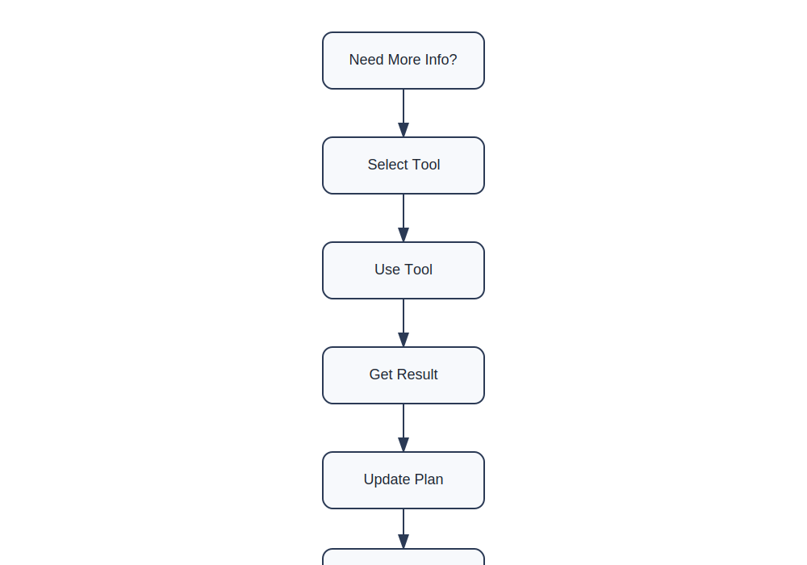

Each cycle typically follows this pattern:

- Decide if external information is needed  
- Select a tool  
- Use the tool  
- Interpret results  
- Update plan  

This is what transforms a model into a system that can *do work in the real world*.

---

### Why This Matters

This architecture explains why agents feel fundamentally different from chatbots.

Chatbots generate responses.

Agents generate outcomes.

They don’t just answer the question:

> They try to complete the task behind the question.

## Modern Trend: Thinking Agents

Modern AI agents are no longer just “task executors.”

They are evolving into something more interesting:

> systems that *reason while they act*.

This is where the idea of **thinking agents** comes in.

---

## From Execution to Thinking-in-Action

Earlier agent systems followed a simple pattern:

- Plan  
- Execute  
- Observe  
- Repeat  

That worked well for structured tasks.

But real-world problems are messy.

Information is incomplete. Goals shift. Tools fail. Context changes.

So modern agents evolved.

They no longer separate thinking and doing.

They combine them.

---

## What Is a “Thinking Agent”?

A **thinking agent** is an AI system that:

- reasons about a problem while working on it  
- updates its understanding continuously  
- revises its plan mid-execution  
- uses feedback to improve decisions in real time  

Instead of:

> “Think first, act later”

It becomes:

> “Think while acting”

---

## The Key Shift: Interleaved Reasoning

Traditional systems:

> Plan → Execute → Done

Thinking agents:

> Think → Act → Think → Observe → Adjust → Act → Think

This is called **interleaved reasoning**.

The intelligence is not in a single plan.

It is in constant adjustment.

---

## Why This Matters

This shift solves a major limitation of earlier AI systems:

- Plans were brittle  
- Errors were only discovered at the end  
- No mid-course correction  

Thinking agents fix this by treating every step as feedback.

---

## The Modern Agent Loop (Upgraded Version)

Modern agents often behave like this:

1. Interpret the goal  
2. Form a partial plan  
3. Take a step  
4. Evaluate the result  
5. Re-think the next step  
6. Update the plan  
7. Repeat  

This is no longer a straight loop.

It is a *self-correcting loop*.

---

### Visual: Thinking Agent Loop

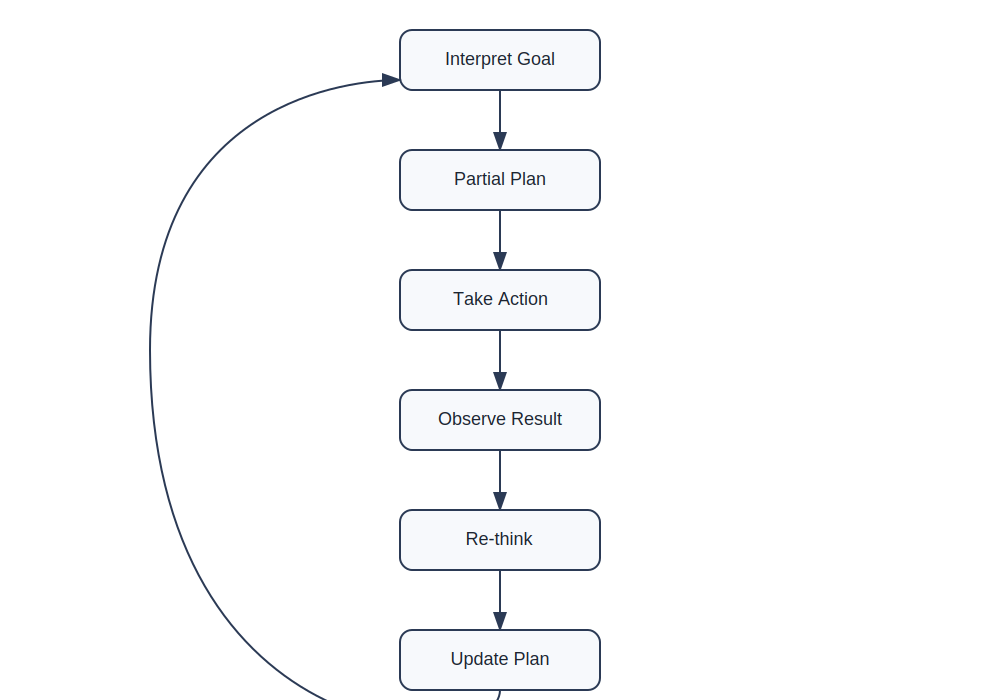

---

## Tool Use + Reasoning Together

Older agents treated tools as external utilities.

Modern thinking agents treat tools as part of reasoning.

They constantly decide:

- Do I already know enough?  
- Should I search?  
- Should I compute?  
- Should I verify?  

This is what makes them feel “adaptive.”

---

### Visual: Reasoning + Tool Integration

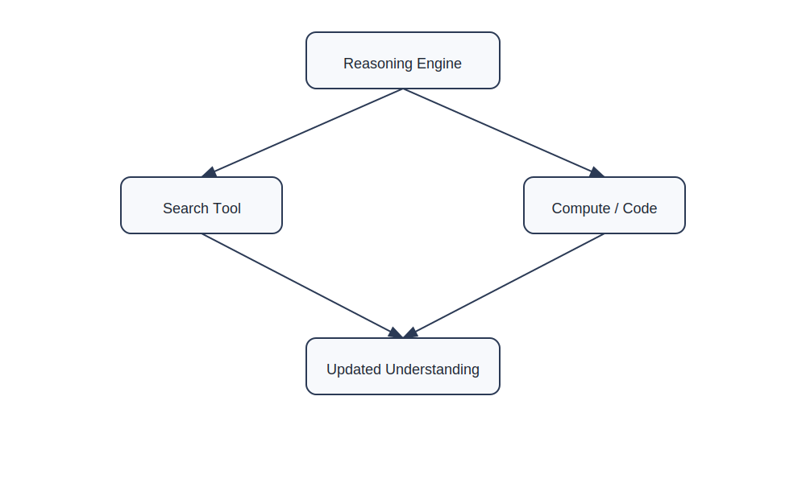

---

## The Big Idea: Agents Are Becoming “Process Systems”

A simple way to understand modern agents:

- Chatbots = generate answers  
- Classic agents = follow workflows  
- Thinking agents = manage evolving processes  

They do not just complete tasks.

They manage *how the task unfolds over time*.

---

## Where This Is Heading

The direction of research is clear:

- Less rigid planning  
- More continuous reasoning  
- More self-correction  
- More autonomy in tool selection  
- More persistence across long tasks  

In practical terms, this means:

> Agents will increasingly behave like junior collaborators, not tools.

They will not just respond to instructions.

They will carry responsibility for execution quality.

---

## Important Reality Check

Thinking agents are powerful, but not magical.

They still struggle with:

- hallucinated assumptions  
- overconfidence in uncertain steps  
- tool misuse  
- long-horizon planning drift  

So the real challenge is not building agents that “think.”

It is building agents that **think reliably**.

---

## Summary

The evolution looks like this:

- Chatbots → respond  
- Early agents → execute  
- Modern agents → adapt  
- Thinking agents → reason while executing  

And that final category is where most active research and industry systems are now moving.

Not toward static intelligence.

But toward **continuous decision-making systems that learn while they work**.

## Section 3 — The Building Blocks of an Agent

At first glance, an AI agent can seem mysterious.

You give it a goal, and somehow it plans, searches, decides, adapts, and produces results.

But underneath the surface, most modern agents are built from a surprisingly small set of components.

Think of an agent as a machine assembled from four essential building blocks:

1. Reasoning
2. Memory
3. Tools
4. Actions

Each component plays a different role.

Remove any one of them, and the agent becomes significantly less capable.

---

### Building Block 1: Reasoning

Reasoning is the agent's decision-making system.

It helps answer questions such as:

- What is the goal?
- What should I do next?
- Which tool should I use?
- Is the current approach working?

Reasoning is what allows an agent to move beyond simple automation.

Instead of blindly following instructions, it can evaluate options and choose a path forward.

For example, if an agent is asked to prepare a legal research memo, reasoning helps it determine:

- Which cases are relevant
- Which sources are trustworthy
- Which arguments deserve emphasis

Without reasoning, an agent becomes little more than a scripted workflow.

---

### Building Block 2: Memory

Humans constantly rely on memory.

We remember conversations, goals, facts, and previous decisions.

Agents increasingly do the same.

Memory allows an agent to retain information across multiple steps.

Without memory, an agent would need to rediscover everything repeatedly.

For example:

- A customer-support agent remembers earlier questions in a conversation.
- A legal research agent remembers cases already reviewed.
- A coding agent remembers files it modified earlier.

Memory creates continuity.

It allows work to build upon previous work.

---

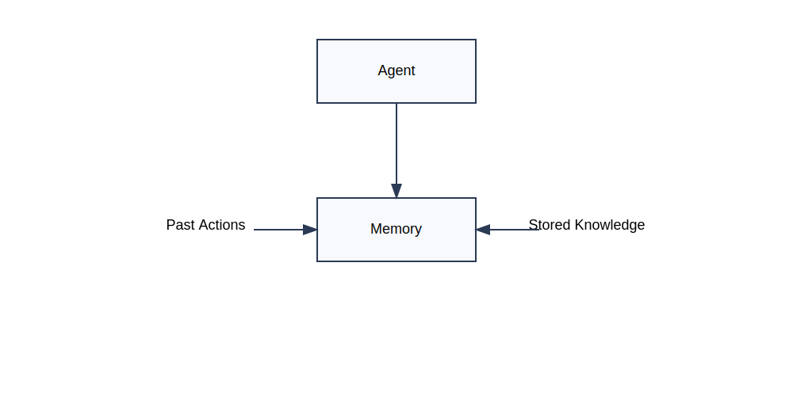

*Figure 28.4: Memory allows agents to retain context, previous actions, and important information while working toward a goal.*

---

### Building Block 3: Tools

Reasoning alone is not enough.

An agent also needs ways to interact with the outside world.

This is where tools come in.

Tools might include:

- Search engines
- Databases
- Calculators
- APIs
- Document repositories
- Code execution environments

A useful way to think about tools is this:

> Knowledge tells an agent what it knows.
>
> Tools help an agent discover what it does not know.

This dramatically expands what an agent can accomplish.

---

### Building Block 4: Actions

After reasoning and tool usage comes action.

An action is any step the agent takes that changes the state of a task.

Examples include:

- Searching a database
- Sending an email
- Generating a report
- Updating a document
- Executing code
- Scheduling a meeting

Actions transform planning into progress.

Without actions, reasoning remains only a thought process.

---

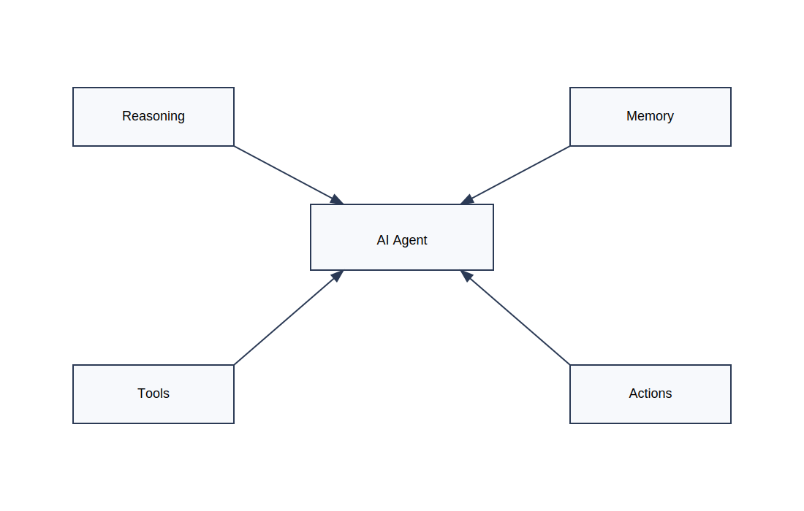

*Figure 28.5: Modern agents combine reasoning, memory, tools, and actions into a unified system.*

---

### How the Components Work Together

The real power of agents comes from the interaction between these components.

A typical workflow might look like this:

1. Reason about the goal.
2. Recall relevant information from memory.
3. Use tools to gather additional information.
4. Take actions based on what was learned.
5. Store new information in memory.
6. Repeat until the goal is complete.

Notice that no single component is responsible for intelligence.

The intelligence emerges from the combination.

---

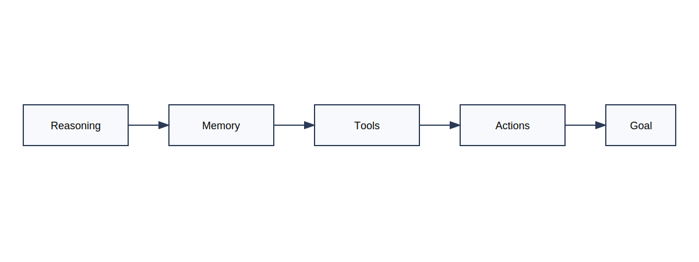

*Figure 28.6: The complete workflow of a modern AI agent.*

---

### Why This Matters

When people imagine AI agents, they often focus on the model itself.

But the model is only one piece of the puzzle.

Modern agents succeed because they combine:

- reasoning to make decisions,
- memory to maintain context,
- tools to access information,
- and actions to accomplish work.

Together, these building blocks transform a language model into a system capable of pursuing goals.

And as agents continue to evolve, these four foundations remain at the heart of nearly every modern design.

## Section 4 — Memory: The Secret Ingredient

Imagine meeting someone who forgets everything after every sentence.

You tell them your name.

A moment later, they ask again.

You explain a problem.

A few seconds later, they have forgotten the details.

Holding a meaningful conversation would be nearly impossible.

Yet this is surprisingly close to how early AI systems worked.

Without memory, every interaction begins from scratch.

This is why memory has become one of the most important ingredients in modern AI agents.

---

### Why Memory Matters

An agent's job is not merely to answer questions.

Its job is to achieve goals.

Goals often require many steps:

* Gathering information
* Making decisions
* Using tools
* Tracking progress
* Revising plans

Without memory, the agent would repeatedly lose track of what it has already done.

It would be forced to solve the same problems again and again.

Memory creates continuity.

It allows today's decision to benefit from yesterday's work.

---

### Short-Term Memory

The simplest form of memory is short-term memory.

This is the information an agent actively keeps while working on a task.

For example, if an agent is researching a legal issue, it may remember:

* Cases already reviewed
* Notes already written
* Arguments already considered
* Sources already searched

This prevents unnecessary repetition.

It also allows the agent to build increasingly sophisticated understanding as a task progresses.

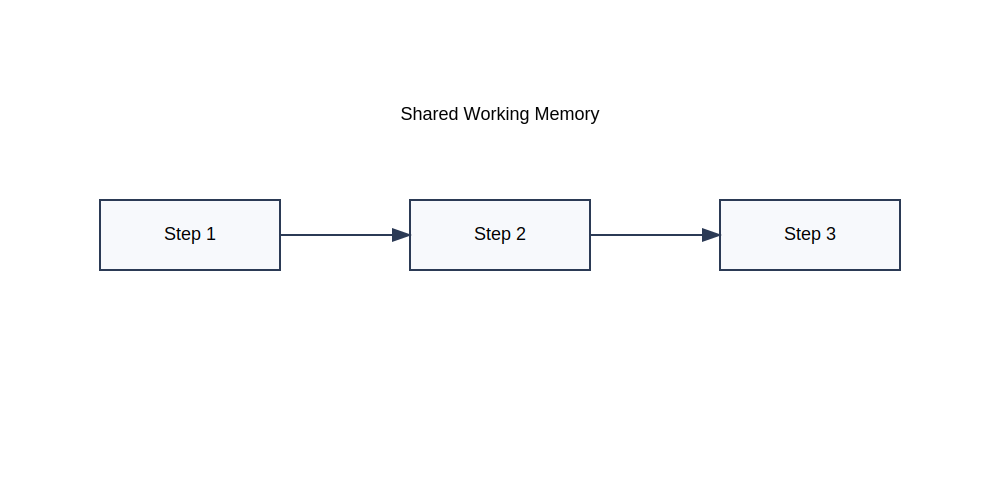

*Figure 28.7: Short-term memory helps an agent maintain context while working on an active task.*

---

### Long-Term Memory

Humans do not rely solely on short-term memory.

We also store information for later use.

Agents increasingly do the same.

Long-term memory allows an agent to remember information across days, weeks, months, or even years.

Examples include:

* User preferences
* Prior projects
* Frequently used documents
* Organizational knowledge
* Historical decisions

Instead of relearning everything repeatedly, the agent can build upon accumulated experience.

This creates a much more personalized and efficient system.

---

### Memory Is Not Just Storage

A common misconception is that memory is simply a database.

It is not.

Useful memory involves two separate abilities:

1. Storing information
2. Retrieving the right information at the right moment

An agent with perfect storage but poor retrieval is like a library with no catalog.

The information exists, but finding it becomes difficult.

The true challenge is not remembering everything.

The challenge is remembering what matters.

---

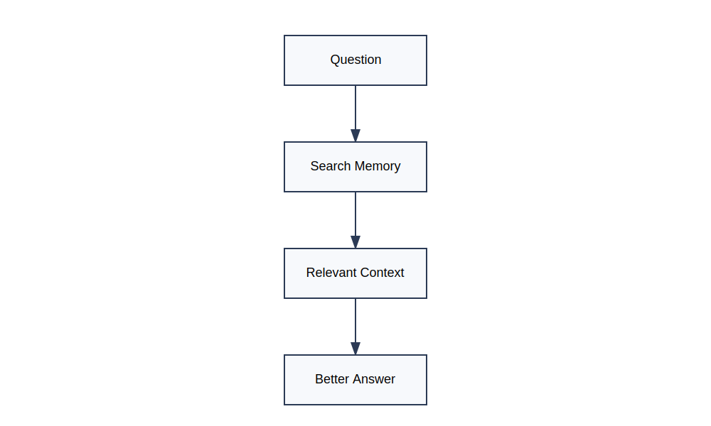

*Figure 28.8: Modern memory systems focus on retrieving relevant information when needed.*

---

### Memory Creates Better Decisions

Consider two agents performing the same task.

The first agent remembers previous work.

The second agent starts fresh every time.

Which one is likely to make better decisions?

Almost always, the first.

Memory improves:

* Consistency
* Personalization
* Planning
* Efficiency
* Accuracy

Each decision can build upon previous knowledge rather than beginning from zero.

This is one reason modern agents often feel significantly more capable than traditional chatbots.

---

### The Emergence of Persistent Agents

One of the most important trends in AI is the rise of persistent agents.

A persistent agent does not disappear when a conversation ends.

Instead, it maintains memory across interactions.

This allows it to:

* Track long-term goals
* Learn user preferences
* Continue unfinished work
* Improve future performance

In many ways, persistent memory transforms an agent from a tool into a long-term collaborator.

---

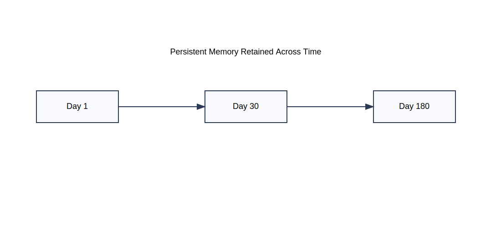

*Figure 28.9: Persistent memory allows agents to carry knowledge forward across multiple interactions.*

---

### Why This Matters

Reasoning helps an agent decide.

Tools help an agent act.

But memory helps an agent learn from experience.

Without memory, every task begins at zero.

With memory, every task starts from everything the agent already knows.

That simple difference may be one of the most important reasons modern agents are becoming increasingly powerful.

## Section 5 — Agents in the Real World

Up to this point, we have explored agents as concepts.

But agents are no longer experimental ideas confined to research laboratories.

They are increasingly becoming part of everyday software.

In fact, many of the most exciting developments in AI today involve systems that behave less like chatbots and more like agents.

The reason is simple:

People rarely want answers.

They want outcomes.

---

### From Information to Action

Consider the difference between these two requests:

> "What are the latest court decisions involving AI copyright?"

and

> "Research the latest AI copyright cases and prepare a summary for my client."

The first request asks for information.

The second asks for work.

Traditional AI systems excel at providing information.

Agents are designed to perform work.

This shift from answering questions to completing tasks is one of the biggest transitions occurring in modern AI.

---

### AI Agents in Legal Practice

The legal profession is an ideal environment for agents.

Legal work often involves:

* Research
* Document review
* Drafting
* Verification
* Organization

These activities consist of many interconnected steps.

An agent can help by:

* Searching legal databases
* Finding relevant precedents
* Organizing research results
* Drafting memoranda
* Summarizing lengthy documents

Rather than handling one isolated request, the agent can coordinate an entire workflow.

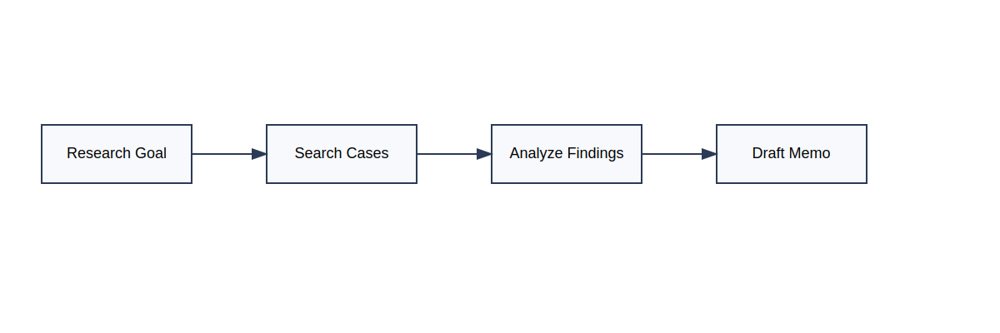

*Figure 28.10: A legal research agent coordinating multiple tasks to produce a final work product.*

---

### AI Agents in Business

Businesses are also adopting agent-based systems.

Imagine a sales manager asking:

> "Prepare a report on declining customer retention."

An agent might:

1. Access company databases
2. Retrieve customer metrics
3. Analyze recent trends
4. Generate visual summaries
5. Draft recommendations

What once required several tools and multiple employees can increasingly be coordinated by a single intelligent workflow.

---

### AI Agents in Software Development

One of the fastest-growing uses of agents is software development.

Modern coding agents can:

* Read source code
* Search documentation
* Suggest improvements
* Write new functions
* Execute tests
* Fix bugs

Instead of generating a single block of code, the agent participates in the entire development process.

This is one reason AI-assisted programming has advanced so rapidly.

*Figure 28.11: A coding agent continuously reasoning, modifying code, testing, and improving results.*

---

### The Rise of Multi-Agent Systems

An especially important trend is the emergence of multi-agent systems.

Rather than using a single agent, organizations are beginning to use teams of specialized agents.

For example:

* One agent performs research
* Another analyzes findings
* Another drafts documents
* Another verifies results

Together, they function like a digital team.

This approach mirrors how human organizations operate.

Different specialists handle different responsibilities while working toward a common objective.

---

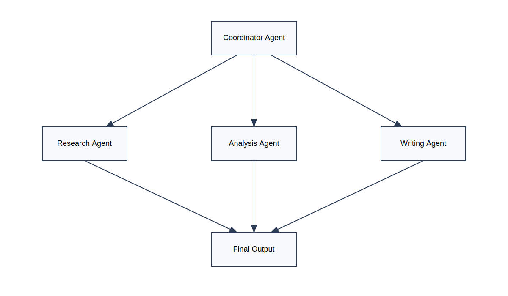

*Figure 28.12: Multiple specialized agents collaborating to solve a complex problem.*

---

### Why Companies Are Investing in Agents

Businesses are not investing billions of dollars in agents because they generate impressive text.

They are investing because agents have the potential to automate entire workflows.

The value comes from:

* Reduced manual effort
* Faster execution
* Better coordination
* Continuous operation
* Scalable expertise

In many industries, the goal is no longer simply to generate content.

The goal is to automate meaningful work.

---

### What Comes Next?

The future of agents is likely to involve:

* Better reasoning
* Longer memory
* More reliable planning
* Greater autonomy
* Improved collaboration between agents

Researchers are increasingly focused on building systems that can pursue goals over hours, days, or even weeks.

The long-term vision is not merely a smarter chatbot.

It is a digital collaborator capable of helping humans solve increasingly complex problems.

---

### Why This Matters

When most people hear the word "AI," they imagine a chatbot answering questions.

But the industry is rapidly moving toward something different.

The future is not just conversational AI.

The future is agentic AI.

Systems that can plan, reason, remember, use tools, and take action.

In other words:

Systems that do more than talk.

Systems that work.

## Insight Box — From Knowledge Machines to Work Machines

Throughout most of AI's history, the goal was to build systems that could answer questions.

Researchers wanted machines that could:

* Recognize images
* Translate languages
* Play games
* Predict outcomes
* Generate text

In other words, they wanted machines that could produce knowledge.

Modern agents represent a significant shift in that vision.

Instead of simply answering questions, agents are increasingly designed to accomplish objectives.

This may sound like a subtle difference, but it changes everything.

Consider the progression:

* A search engine helps you find information.
* A chatbot helps you understand information.
* An agent helps you complete a task.

Each step moves AI closer to becoming an active participant in human work.

The defining characteristic of an agent is not intelligence alone.

It is the ability to combine intelligence with action.

An agent can:

* Reason about a goal
* Remember relevant information
* Use tools to gather knowledge
* Take actions that move a task forward
* Adjust its strategy when circumstances change

This is why many experts believe agents represent the next major phase of AI development.

The future may not belong to systems that simply know things.

It may belong to systems that can reliably get things done.

That idea can be summarized in a single sentence:

> Chatbots answer questions. Agents pursue goals.

## Final Thoughts

When most people first encounter AI, they encounter a chatbot.

They ask a question.

The system provides an answer.

The interaction feels impressive, but ultimately familiar. It resembles a conversation.

Agents introduce something fundamentally different.

Instead of merely responding to prompts, they pursue goals.

They can plan, reason, remember, use tools, evaluate results, and adapt their behavior as circumstances change. Rather than producing a single response, they participate in an ongoing process aimed at accomplishing a task.

This shift may prove to be one of the most important developments in the history of AI.

For decades, researchers focused on making machines smarter.

Today, an equally important challenge has emerged:

> How do we make machines useful?

Agents are one answer to that question.

By combining language models with memory, tools, planning, and action, agents transform AI from a source of information into a system capable of performing meaningful work.

Yet it is important to maintain perspective.

Modern agents are not independent thinkers.

They do not possess human understanding, self-awareness, judgment, or common sense. They can make mistakes, follow flawed reasoning, and pursue incorrect assumptions if not properly guided.

Their strength lies not in replacing human intelligence, but in extending it.

The most powerful future is unlikely to be one where agents replace professionals.

It is more likely to be one where professionals use agents to amplify their capabilities.

A lawyer supported by research agents.

A doctor assisted by diagnostic agents.

An engineer collaborating with coding agents.

A teacher working alongside educational agents.

In each case, the human remains responsible for judgment, ethics, and final decisions.

The agent contributes speed, scale, memory, and persistence.

As we move deeper into the era of AI, understanding agents will become increasingly important because they represent the direction in which many AI systems are evolving.

The story of AI is no longer only about machines that can answer questions.

It is increasingly about machines that can help achieve goals.

And that journey is only beginning.

---

### Chapter Summary

In this chapter, you learned that:

* An AI agent is a system designed to pursue goals rather than simply answer questions.
* Agents operate through continuous cycles of planning, action, observation, and adjustment.
* Modern agents combine reasoning, memory, tools, and actions.
* Memory enables agents to maintain context and improve over time.
* Thinking agents continuously revise plans as they work.
* Agents are already being used in law, business, software development, and many other industries.
* The future of AI is moving toward systems that can perform increasingly complex tasks with greater autonomy.

The next chapter explores another rapidly emerging trend in AI:

**Vibe Coding**—the idea that software can increasingly be created through conversation, collaboration, and natural language rather than traditional programming alone.
