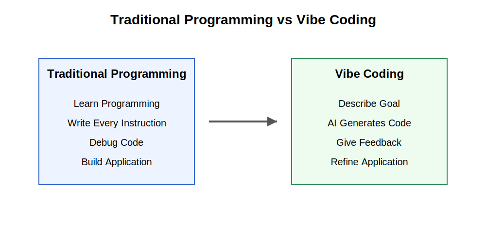
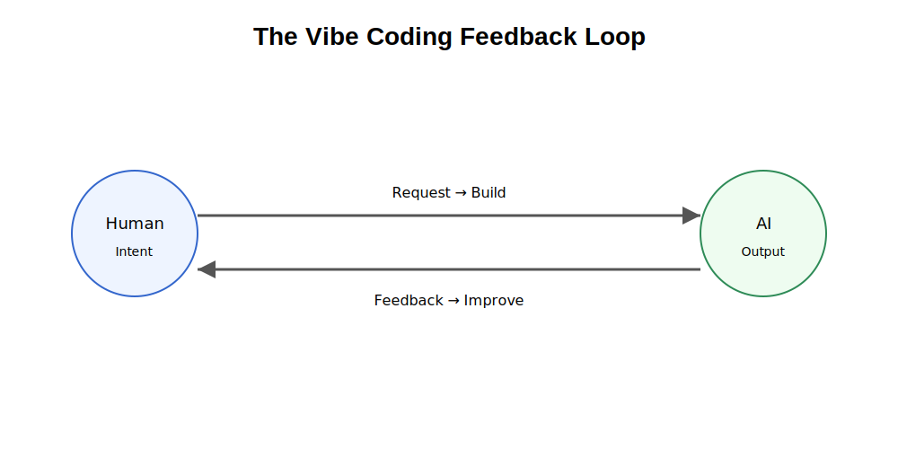
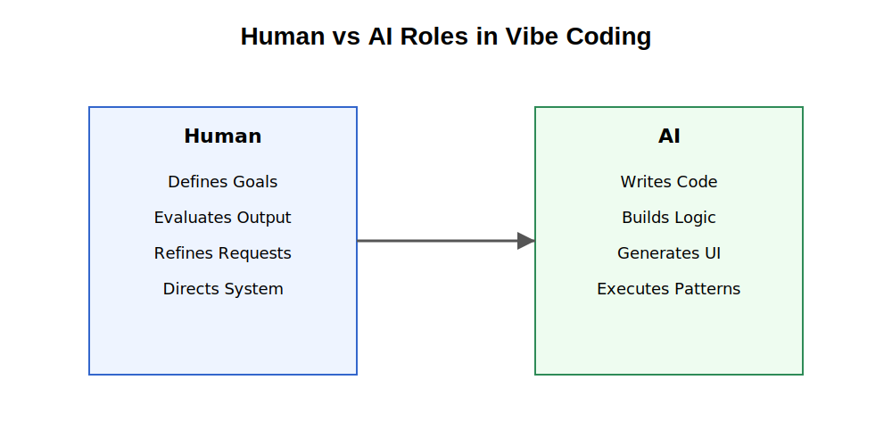
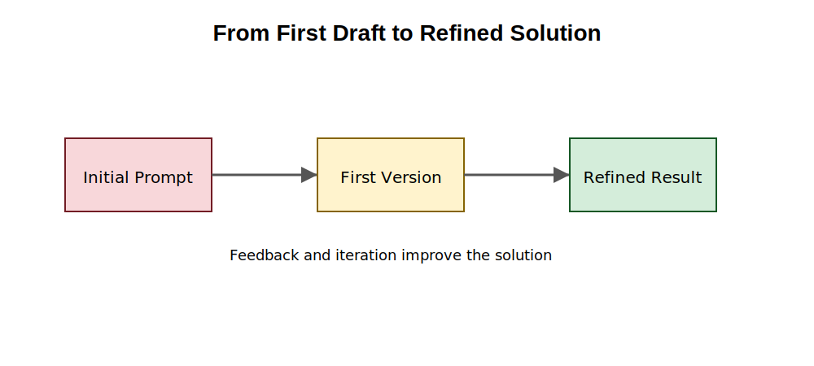
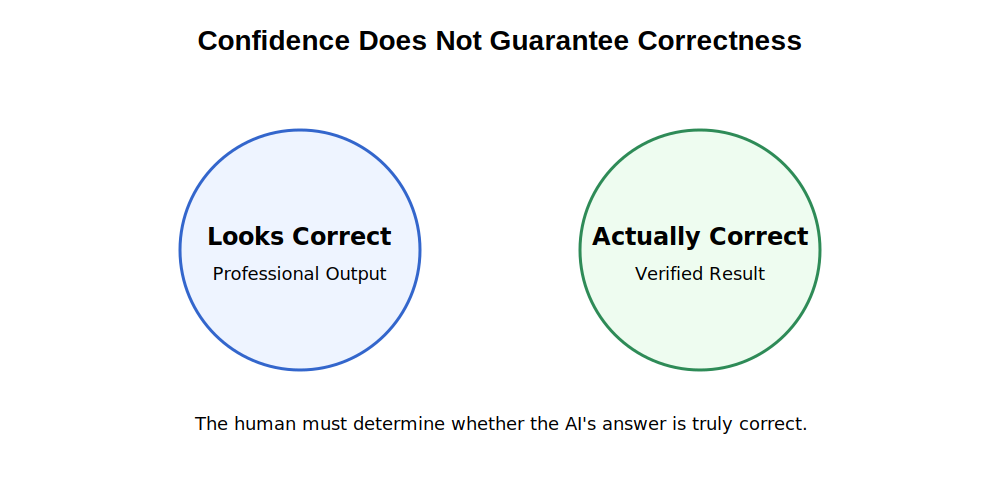
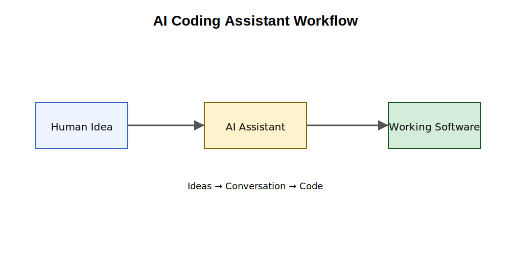
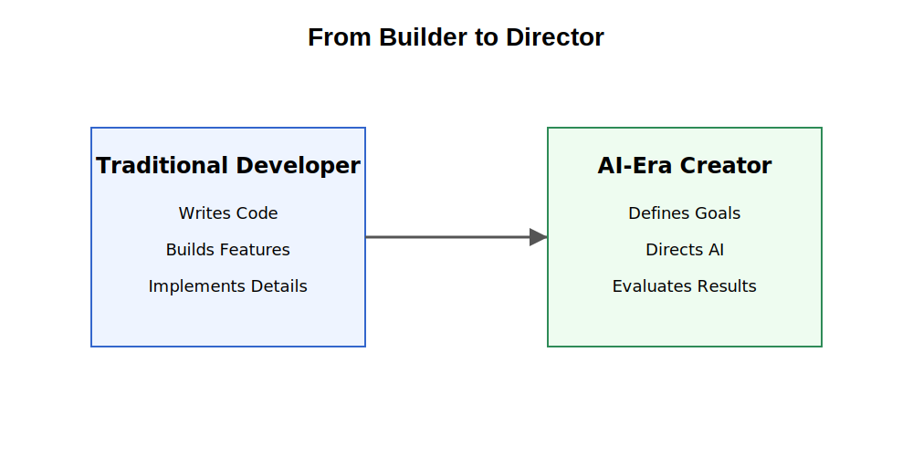
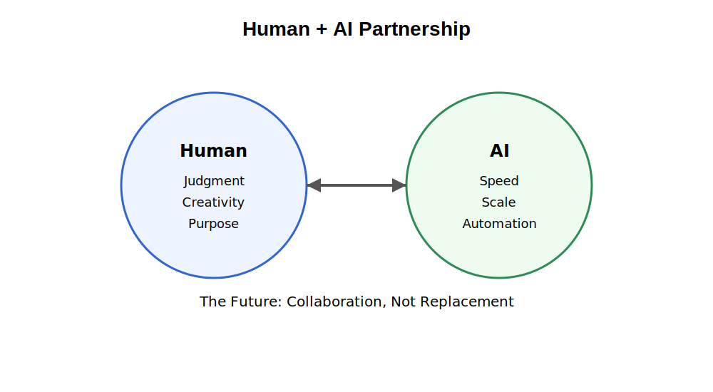

# Chapter 29: Vibe Coding

## Opening Story: Building Software by Conversation

On a rainy Saturday morning, Maya sat down with an idea.

She wasn't a software engineer.

She couldn't write Python.

She had never studied computer science.

But she had a problem she wanted to solve.

As a volunteer at a local legal aid clinic, she spent hours every week helping people find information about housing laws. The process was repetitive. Visitors would ask similar questions, and staff members would search through the same documents again and again.

"What if there were a simple website that could answer these questions automatically?" she wondered.

Ten years ago, that idea would have ended there.

Building software required specialized skills. You needed to understand programming languages, databases, web servers, and deployment tools. Even creating a basic application could take months of study.

But Maya lived in a different era.

She opened an AI coding assistant and typed a simple request:

> Create a website where users can ask housing-law questions and receive answers based on uploaded documents.

Within seconds, code appeared on her screen.

The AI generated a homepage.

Then a search interface.

Then a document-upload feature.

Maya was amazed.

She continued the conversation.

"Make the design easier for older users."

The AI adjusted fonts and spacing.

"Add a disclaimer that this is not legal advice."

The AI added one.

"Allow users to download answers as PDFs."

The AI wrote more code.

Hour by hour, the application became more capable.

Whenever something broke, Maya described the problem in plain English.

Whenever she wanted a new feature, she simply asked.

The process felt less like programming and more like collaborating with an incredibly fast assistant.

Of course, the AI wasn't perfect.

Some features worked immediately.

Others contained bugs.

Occasionally, the AI misunderstood the request entirely and produced code that solved the wrong problem.

But instead of writing every line herself, Maya spent most of her time describing goals, reviewing results, and refining ideas.

By the end of the weekend, she had a working prototype.

A project that once required extensive technical expertise had begun with a conversation.

This new style of software creation has become so common that it has earned an informal name:

**Vibe Coding.**

Rather than carefully writing every instruction for a computer, people increasingly describe what they want, evaluate what the AI produces, and guide the process through natural language.

The programmer becomes part architect, part editor, part coach.

The code is still important.

But the conversation becomes equally important.

In this chapter, we'll explore what vibe coding is, why it emerged, how modern AI coding assistants make it possible, and why understanding this new way of building software may become valuable even for people who never plan to become professional programmers.

## Section 1 -  What Is Vibe Coding?

A high school teacher built a working software tool in less than an hour.

He did not know how to code.

He did not hire a developer.

He simply described what he wanted in plain English.

And the software appeared.

This sounds like a trick. It is not.

Something fundamental has changed in how software is created, and it is beginning to reshape who gets to build it.

This new approach is called **vibe coding**.

But before defining it, it helps to see what is actually happening.

For most of computing history, software was built through precise instructions written in programming languages like Python, Java, or C++.

Humans had to describe every step in a way machines could understand exactly.

Computers were powerful, but extremely literal.

If you were slightly wrong, nothing worked.

If you missed a small detail, everything broke.

It was like trying to explain a recipe to someone who refuses to make any assumptions at all.

Today, that constraint is beginning to loosen.

Instead of writing code line by line, people can describe what they want in natural language, and an AI system attempts to generate the software for them.

The interaction feels less like programming and more like giving instructions to a very fast assistant who already knows how to code.

This shift is what people now call **vibe coding**.

The phrase was popularized in 2025 by AI researcher and entrepreneur Andrej Karpathy, describing a workflow where humans focus on intent while AI handles implementation.

The name is intentionally informal.

It is not a new programming language.

It is not a framework.

It is a behavioral shift.

The human describes what they want.

The AI generates a first version.

The human reacts.

The AI refines.

The cycle continues.

To understand how different this is, consider Daniel.

Daniel teaches high school art. His classroom is full of student sketches, paintings, and creative chaos. What is not visible is the administrative burden behind it—organizing submissions, tracking feedback, and responding to dozens of repetitive comments each week.

One afternoon, frustrated with the workload, he tries something new.

He opens an AI coding assistant and types:

> Create a simple system where my students can upload artwork and I can leave feedback on each piece.

A working application appears.

Daniel is surprised, but continues.

> Make it feel like an art gallery instead of a form.

The interface changes.

> Let students only see their own submissions.

The system updates again.

> Add a way for me to record short audio feedback instead of typing.

The AI modifies the application once more.

At no point does Daniel write code.

He does not think in programming terms.

He thinks in terms of his classroom.

The system evolves through conversation, not syntax.

This is the core idea behind vibe coding.

The user is not replacing programming entirely.

The user is replacing *low-level technical instructions* with *high-level intent*.

Instead of describing how to build something step by step, the human describes what the outcome should be, and the AI fills in the implementation details.

What makes this shift important is not just convenience—it is access.

For decades, software creation required specialized training.

If you could not code, your ideas depended on someone else to implement them.

Vibe coding changes that dynamic.

A teacher can build classroom tools.

A small business owner can create internal systems.

A lawyer can prototype research assistants.

A student can turn an idea into a working application.

This does not eliminate the role of software engineers.

In fact, experienced developers often benefit the most, because they can guide AI systems with precision and recognize when outputs are wrong or incomplete.

But the center of gravity is shifting.

The human is no longer just a coder.

The human becomes a director—defining goals, evaluating outputs, and steering the system.

The AI becomes the builder.

This partnership is what defines vibe coding.

And underneath it all, nothing magical is happening.

The AI is still generating code, still following logic, still assembling systems from learned patterns.

The difference is that the complexity is being hidden behind conversation.

Like using a smartphone without understanding how its circuits work, people are beginning to build software without seeing the full machinery underneath.

This is why vibe coding is widely seen as one of the most significant shifts in software creation since the rise of personal computers.

It turns programming from a technical craft into a collaborative conversation between humans and machines.

## Section 2 - How AI Becomes a Coding Partner

To understand vibe coding, you do not need to understand complex programming.

You need to understand one simple shift:

> The computer is no longer just executing instructions. It is participating in a conversation.

That conversation follows a repeating loop.

---

## The Core Idea: A Continuous Loop

Instead of “write code → run → fix everything manually,” modern AI tools work like a cycle:

The loop is simple:

* You say what you want
* The AI builds something
* You react
* The AI adjusts
* Repeat

That is the entire system.

Everything else is detail.

---

## What the AI Actually Does

When you type something like:

> “Make a simple app to track daily expenses”

it does not “understand” the idea like a human.

Instead, it:

* predicts what software usually looks like for that request
* assembles known coding patterns
* generates a working first draft

Think of it like this:

A chef has memorized thousands of recipes.

You say:

> “I want something sweet but not too heavy”

The chef does not invent food from nothing.

They assemble a likely recipe based on experience.

AI coding tools behave in a similar way—but for software.

---

## The Two Roles in the System

At the heart of vibe coding are two distinct roles:

### The Human

* Defines the goal
* Describes what “good” looks like
* Judges the output
* Refines instructions

### The AI

* Writes code
* Builds structure
* Generates interfaces
* Fixes repetitive technical work

The boundary is clear:

> Humans decide direction. AI handles execution.

---

## Why This Feels Different From Traditional Programming

In traditional programming:

* You must be precise from the start
* Small mistakes break everything
* Debugging is a major time cost

In vibe coding:

* You start rough
* You improve through feedback
* The system adapts as you go

This is a major shift in workflow.

Not because coding disappeared.

But because precision is no longer required upfront.

---

## A Simple Way to Think About It

Imagine building a house.

Old way:

* You design every blueprint in detail
* You supervise every step of construction
* You fix problems manually at every stage

New way with AI:

* You describe the kind of house you want
* The builder produces a draft
* You adjust rooms, layout, style
* The builder iterates quickly

You are no longer the person laying bricks.

You are the person directing the build.

---

## The Real Breakthrough

The important change is not speed.

It is translation.

AI systems are becoming better at converting:

> human intent → working software

This is why vague instructions like:

* “make it simpler”
* “make it feel modern”
* “add something like a dashboard”

actually produce usable results.

Earlier systems could not do this.

Modern AI can—because it has learned patterns from massive amounts of software and design examples.

---

## The Shift in Work

Because of this loop, the work changes:

Old focus:

* syntax
* debugging
* strict structure

New focus:

* clarity of intent
* evaluation
* iteration

The hardest part is no longer writing code.

It is deciding:

> “Is this what I actually wanted?”

That is the new skill emerging from vibe coding.

## Section 3 - Why Vibe Coding Sometimes Fails

After watching an AI generate software in seconds, many people have the same reaction:

> "If it can do all of this, why do we still need programmers?"

It is a reasonable question.

The answer reveals one of the most important truths about modern AI.

AI coding assistants are remarkably capable.

They can write code.

They can build websites.

They can create mobile applications.

They can automate tasks.

They can even fix many of their own mistakes.

But they are not infallible.

In fact, one of the most important skills in vibe coding is learning when the AI is wrong.

The easiest way to understand this is to remember that AI does not truly understand software the way humans do.

It predicts.

It generates.

It estimates.

Most of the time those predictions are surprisingly useful.

Sometimes they are not.

---

## The First Draft Problem

Imagine asking an architect to design a house after a single five-minute conversation.

Even if the architect is highly skilled, the first design will probably not be perfect.

There may be missing rooms.

The layout may feel awkward.

Important details may have been overlooked.

The architect is not incompetent.

The architect simply does not yet know everything you want.

AI coding assistants face the same challenge.

When you provide a prompt, the AI creates its best interpretation of your request.

Sometimes that interpretation is accurate.

Sometimes it is incomplete.

Sometimes it solves a different problem than the one you intended.

This is why vibe coding is a process of refinement rather than a one-time event.

The first version is usually a starting point, not the destination.

---

## When AI Misunderstands the Goal

Consider a simple request:

> Build a website for scheduling appointments.

To a human, this might sound straightforward.

To an AI, however, many questions remain unanswered:

* Who is scheduling appointments?
* Doctors?
* Lawyers?
* Teachers?
* How long are appointments?
* Can appointments overlap?
* Should reminders be sent?
* Is payment required?

Humans often leave these assumptions unstated because people naturally fill in missing details from context.

AI systems cannot reliably do this.

As a result, the AI may produce a perfectly functioning solution that is still the wrong solution.

The software works.

It just does not work the way the user intended.

This is one reason experienced vibe coders spend significant time clarifying requirements and refining prompts.

---

## The Confidence Illusion

One of the most surprising characteristics of AI is that it often presents correct and incorrect answers with the same level of confidence.

When a calculator makes a mistake, it usually displays an error.

When AI makes a mistake, it often produces an answer that looks completely reasonable.

The code may appear professional.

The explanation may sound convincing.

The application may even run successfully.

Yet hidden problems can still exist beneath the surface.

This creates a dangerous illusion.

Users may assume:

> "The AI sounds confident, so it must be correct."

Unfortunately, confidence and correctness are not the same thing.

This is why human judgment remains essential.

---

## Why Experienced Humans Still Matter

Ironically, the rise of AI has made human judgment more valuable, not less.

The AI can generate hundreds of lines of code in seconds.

But it cannot always determine:

* whether the software solves the real problem
* whether important requirements are missing
* whether the design is appropriate
* whether the results can be trusted

These decisions still require human evaluation.

A useful analogy is GPS navigation.

A GPS can calculate routes far faster than a human.

But if the GPS directs a driver toward a closed road, the driver must recognize the problem and choose a different path.

The GPS provides guidance.

The human provides judgment.

Vibe coding works in much the same way.

The AI accelerates creation.

The human provides oversight.

---

## Failure Is Part of the Process

Many beginners become discouraged when an AI-generated application fails.

They assume the system is broken.

In reality, iteration is the normal workflow.

Professional software developers rarely produce perfect software on the first attempt.

They build.

They test.

They revise.

They repeat.

Vibe coding follows exactly the same pattern.

The difference is that the conversation happens much faster.

A feature that once required hours of manual coding may now require only a few minutes of iterative prompting.

Failure has not disappeared.

The feedback cycle has simply accelerated.

---

## The Real Skill Behind Vibe Coding

Many people assume the most important skill is knowing how to ask clever questions.

Good prompts certainly help.

But the deeper skill is evaluation.

The best vibe coders are not necessarily the people who write the most elaborate prompts.

They are the people who can quickly identify:

* what is working
* what is broken
* what is missing
* what should happen next

In other words, successful vibe coding is not about surrendering control to AI.

It is about becoming an effective collaborator.

The AI generates possibilities.

The human decides which possibilities are worth pursuing.

That partnership—rather than full automation—is what makes vibe coding powerful.

## Section 4 - The Tools Behind Vibe Coding

Vibe coding would not exist without a new generation of AI-powered software tools.

While the idea of describing software in plain English sounds simple, an enormous amount of technology is working behind the scenes to make it possible.

These tools act as translators.

They convert human intentions into computer instructions.

For decades, software development required programmers to communicate directly with machines.

Today, AI coding assistants increasingly act as intermediaries.

The human speaks in natural language.

The AI translates those instructions into code.

The result is a dramatically different experience.

Instead of spending hours searching documentation, memorizing syntax, or troubleshooting small errors, users can often focus on describing what they want to build.

---

## AI Coding Assistants

The most visible tools in the vibe coding movement are AI coding assistants.

These systems function much like intelligent collaborators.

A user describes a task, and the AI generates code, suggests improvements, explains errors, or creates entirely new features.

Modern coding assistants can:

* Generate software from written descriptions
* Explain unfamiliar code
* Suggest improvements
* Find bugs
* Create user interfaces
* Write documentation
* Automate repetitive programming tasks

The interaction feels less like operating software and more like working with a knowledgeable partner.

---

## From Coding Tool to Creative Partner

Traditional software tools were passive.

They waited for instructions.

AI coding assistants are different.

They participate.

A developer might say:

> Create a login page.

The AI generates one.

The developer then says:

> Make it look more modern.

The AI revises the design.

Next:

> Add password recovery.

The AI adds new functionality.

The interaction becomes an ongoing conversation.

The software gradually evolves through collaboration.

This conversational approach is one reason vibe coding has spread so quickly.

People already know how to communicate ideas.

Now they can apply that same skill to software creation.

---

## The Rise of AI-Powered Development Environments

A coding assistant is useful.

A complete AI-powered development environment is even more powerful.

Modern tools increasingly combine:

* AI chat
* Code generation
* Error detection
* Project management
* Testing tools
* Deployment tools

into a single workspace.

Instead of jumping between multiple applications, users can perform much of their work in one place.

The AI becomes embedded throughout the development process.

Rather than helping occasionally, it becomes a constant companion.

---

## Popular Examples

A growing number of tools support AI-assisted development.

Some focus on professional software engineers.

Others are designed for beginners.

Examples include:

* GitHub Copilot
* Cursor
* Windsurf
* Replit
* ChatGPT
* Claude
* Gemini
* OpenCode

Each tool has different strengths, but they share a common goal:

Helping humans create software through natural language interaction.

The tools will continue to change.

New products appear every few months.

Existing tools evolve rapidly.

The underlying trend, however, remains consistent.

The barrier between ideas and implementation is becoming smaller.

---

## Why the Tools Matter Less Than the Skill

When people first discover vibe coding, they often ask:

> Which tool is best?

It is a natural question.

But it may not be the most important one.

History suggests that tools change much faster than skills.

Programming languages evolve.

Operating systems change.

Popular software platforms come and go.

The ability to think clearly about a problem remains valuable.

The ability to communicate goals remains valuable.

The ability to evaluate results remains valuable.

These are the skills that transfer across every generation of technology.

The specific AI assistant you use today may not be the one you use five years from now.

But the ability to collaborate effectively with intelligent systems is likely to become increasingly important.

---

## The Bigger Picture

Many people focus on the tools themselves.

The more important story is what those tools represent.

For decades, software development required humans to learn the language of computers.

Now computers are becoming better at understanding the language of humans.

That reversal may prove to be one of the most significant shifts in the history of computing.

The tools are simply the first visible signs of a much larger transformation.

As AI systems continue to improve, the boundary between having an idea and creating a working solution may continue to shrink.

That possibility is what makes vibe coding so powerful—and so disruptive.

## Section 5 - The Future of Software Creation

Every major technological shift begins with a simple question:

> "Will this change everything?"

When personal computers appeared, people asked that question.

When the internet emerged, people asked it again.

When smartphones arrived, the question returned.

Today, people are asking the same thing about AI-powered software creation.

No one knows exactly what the future will look like.

But one thing is becoming increasingly clear:

The relationship between humans and software is changing.

For decades, software development required humans to adapt to computers.

People learned programming languages.

They memorized syntax.

They studied technical frameworks.

They spent years acquiring specialized knowledge.

Now the direction is beginning to reverse.

Computers are becoming better at adapting to humans.

Instead of forcing people to learn machine languages, AI systems increasingly learn to understand human language.

This shift may sound subtle.

In reality, it could be profound.

---

## From Coding to Directing

Historically, a programmer functioned much like a builder.

They designed systems.

They assembled components.

They manually constructed software piece by piece.

In the future, many people may spend less time building and more time directing.

The role begins to resemble that of an architect.

An architect does not personally lay every brick.

Instead, the architect defines the vision, evaluates progress, and guides the construction process.

Similarly, future software creators may focus on:

* defining goals
* describing requirements
* evaluating outputs
* refining results

while AI systems perform much of the implementation work.

This does not mean technical knowledge becomes useless.

It means the balance of skills may change.

---

## A New Form of Literacy

Throughout history, societies have developed new forms of literacy.

First came reading.

Then writing.

Later came computer literacy.

People learned how to use spreadsheets, email, search engines, and digital tools.

The rise of AI may create another form of literacy.

People will increasingly need to know how to:

* communicate effectively with AI systems
* evaluate AI-generated outputs
* identify errors
* refine instructions
* collaborate with intelligent tools

These abilities may become as common and valuable as basic computer skills are today.

The goal will not be to replace human thinking.

The goal will be to amplify it.

---

## More People Will Become Creators

One of the most significant consequences of vibe coding may be who gets to participate.

Historically, software creation was limited by technical expertise.

Many people had ideas.

Far fewer people had the ability to implement them.

AI lowers that barrier.

Teachers can build educational tools.

Researchers can automate workflows.

Small businesses can create custom solutions.

Students can experiment with new ideas.

Professionals in every field can transform concepts into working applications.

The number of people capable of creating software may expand dramatically.

This is similar to what happened when digital cameras replaced film.

Photography did not disappear.

It became accessible to millions more people.

Software creation may follow a similar path.

---

## The Human Advantage

Despite rapid advances in AI, certain human strengths remain essential.

AI can generate possibilities.

Humans determine purpose.

AI can create options.

Humans choose priorities.

AI can produce answers.

Humans decide which answers matter.

The future is unlikely to be a competition between humans and machines.

It is more likely to be a partnership.

Each side contributes different strengths.

The most successful creators may be those who learn how to combine human judgment with AI capabilities.

---

## Looking Ahead

It is tempting to view vibe coding as simply another software trend.

But many experts believe it represents something larger.

For the first time, software creation is becoming accessible through ordinary conversation.

The distance between an idea and a working solution is shrinking.

Tasks that once required specialized teams may increasingly be performed by individuals.

Projects that once took months may take days.

Experiments that once seemed impossible may become routine.

Not every prediction about AI will come true.

Technology rarely develops exactly as people expect.

Yet history suggests that tools which make creation easier tend to spread rapidly.

The printing press expanded writing.

The internet expanded publishing.

Smartphones expanded communication.

AI-assisted creation may expand software development.

If that happens, the most important skill will not be memorizing programming syntax.

It will be learning how to think clearly, communicate effectively, and collaborate intelligently with machines.

That future is already beginning to emerge.

And vibe coding may be one of the earliest signs of what comes next.

## Insight Box: The Real Skill Isn't Coding

When people first encounter vibe coding, they often focus on what the AI can do.

The AI writes code.

The AI builds interfaces.

The AI fixes bugs.

The AI generates entire applications.

These capabilities are impressive, but they can also be misleading.

The most important part of the process is not the AI.

It is the human.

Imagine giving the same AI tool to two different people.

One person has a clear understanding of the problem they want to solve. They know who the users are, what success looks like, and how to recognize a good solution when they see one.

The other person has only a vague idea of what they want. Their goals are unclear, their requirements constantly change, and they struggle to evaluate results.

Even with the same AI, the outcomes will likely be very different.

The reason is simple.

AI can accelerate execution, but it cannot replace clarity of thought.

Throughout history, new tools have often shifted the skills that matter most.

Calculators reduced the need for manual arithmetic but increased the importance of understanding mathematics.

Search engines reduced the need to memorize facts but increased the importance of evaluating information.

Similarly, AI coding assistants reduce the need to write every line of code manually, but they increase the importance of defining goals, exercising judgment, and making good decisions.

In many ways, vibe coding is not really about coding at all.

It is about communication.

It is about knowing what you want to achieve, expressing that vision clearly, and recognizing whether the result actually solves the problem.

As AI becomes more capable, these human skills may become even more valuable.

The future may belong not to those who can memorize the most commands, but to those who can think clearly, ask good questions, and guide intelligent tools toward meaningful outcomes.

**The real power of vibe coding is not that machines can write software.**

**It is that humans can focus more of their attention on ideas, creativity, and judgment—the things that matter most.**

## Final Thoughts

For much of computing history, creating software required learning the language of machines.

People who wanted to build applications had to master programming languages, technical frameworks, and complex development tools. The barrier between an idea and a working solution was often high, and only a relatively small number of people possessed the skills needed to cross it.

Vibe coding represents a significant shift in that relationship.

For the first time, large numbers of people can participate in software creation by communicating in the language they already know: natural human language.

This does not mean programming has disappeared.

Nor does it mean AI has replaced human expertise.

Instead, the relationship between humans and computers is evolving.

The human increasingly provides vision, judgment, creativity, and direction.

The AI increasingly provides speed, implementation, and technical execution.

Together, they form a new kind of partnership.

Like every important technological change, vibe coding brings both opportunities and challenges. It can accelerate innovation, lower barriers to creation, and empower people who previously lacked technical skills. At the same time, it requires careful oversight, critical thinking, and a willingness to verify results rather than accept them blindly.

The most successful users of these tools will not necessarily be those who know the most commands or write the most sophisticated prompts.

They will be the people who understand problems clearly, communicate goals effectively, and apply sound judgment when evaluating outcomes.

In that sense, the rise of AI-assisted software creation is not merely a story about technology.

It is a story about amplifying human capability.

As AI becomes increasingly capable of generating text, images, audio, video, software, and other forms of content, the boundary between different types of creation continues to blur. What began as tools that could help write code is rapidly expanding into systems that can work across many forms of information simultaneously.

That broader transformation is the subject of the next chapter.

In Chapter 30, we will explore **Multimodal AI**—systems that can see images, hear audio, understand text, analyze video, and combine these capabilities into a more complete understanding of the world.

The story of AI is no longer just about language.

It is becoming a story about all forms of human communication.

