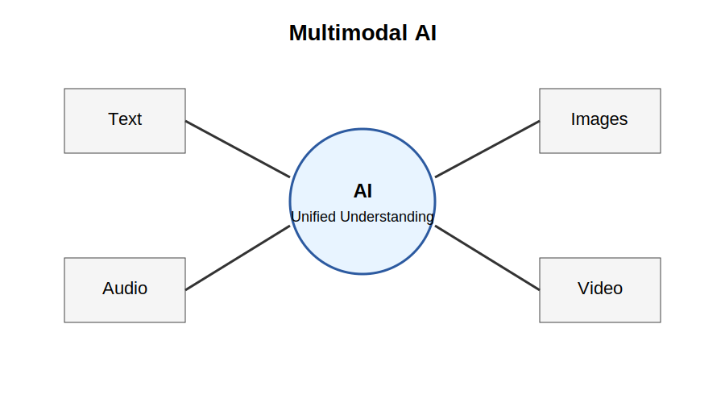
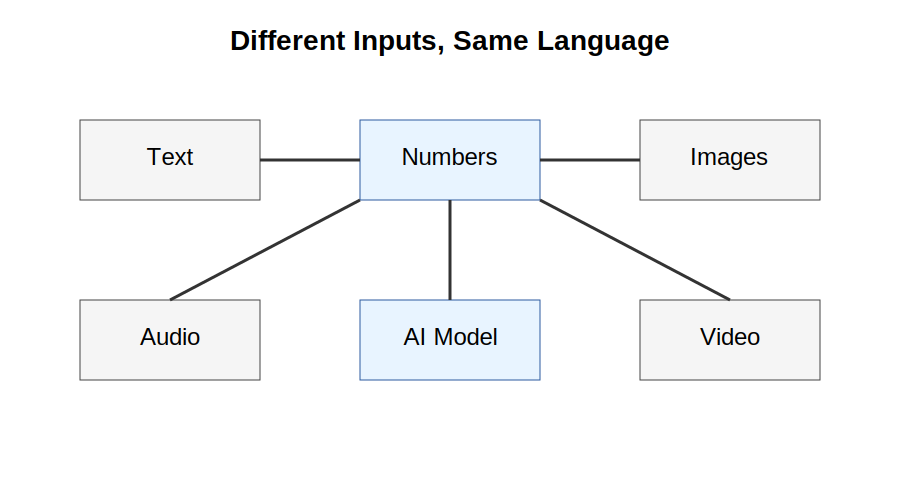
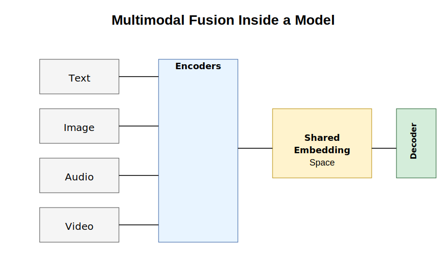
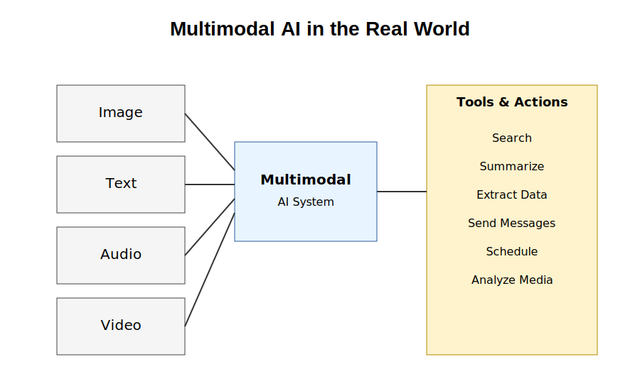
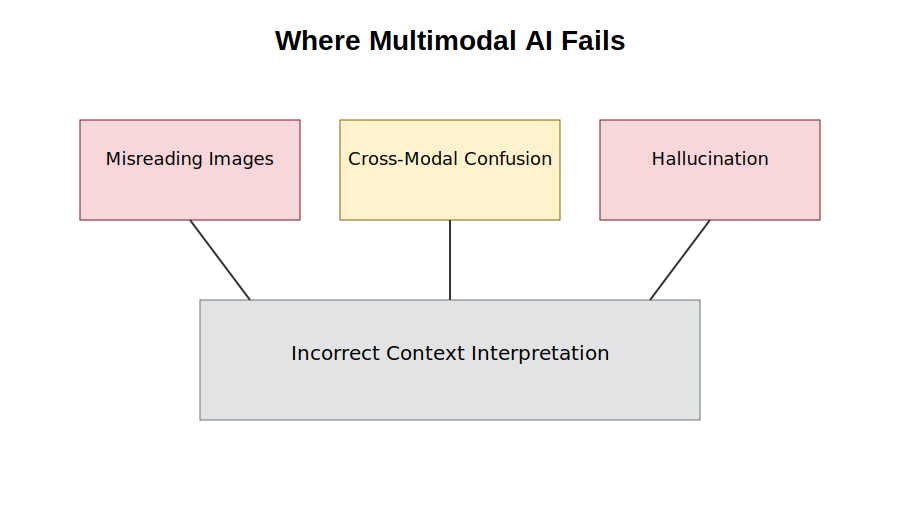

# Chapter 30: Multimodal AI

## Opening Story

Imagine you are driving home after work.

Your phone suddenly chimes.

You glance at the screen and see a photograph your daughter has just sent. It shows a birthday cake covered in candles.

You tap a button and ask your AI assistant:

*"What does this picture show?"*

The AI replies:

*"It appears to be a birthday celebration. The cake has eight candles, and there is a banner in the background that says 'Happy Birthday Emma.'"*

A moment later, another message arrives.

This time it is a voice recording.

You ask:

*"What did she say?"*

The AI listens and responds:

*"She said, 'Dad, don't forget the party starts at six o'clock.'"*

As you continue driving, you remember that you promised to bring flowers.

You ask:

*"Find a flower shop on my route, order a bouquet, and send Emma a message that I'll be there on time."*

The AI checks your location, finds a nearby florist, places the order, and sends the message.

A few years ago, this sequence would have sounded like science fiction.

One AI system understanding a photograph.

The same system understanding speech.

The same system reading text.

The same system helping you take action in the real world.

Yet this is rapidly becoming reality.

Humans do not experience the world through words alone.

We see faces.

We hear voices.

We recognize objects.

We watch videos.

We interpret gestures and expressions.

We combine information from many different senses without even thinking about it.

For most of AI history, however, machines could only work with one type of information at a time.

One system translated language.

Another recognized images.

A different system processed speech.

Each lived in its own separate world.

Today, those worlds are beginning to merge.

Modern AI systems can read text, analyze images, understand spoken language, interpret video, and combine all of that information into a single understanding of what is happening.

Researchers call this **multimodal AI**.

*Figure 30.1: Multimodal AI combines multiple types of information—including text, images, audio, and video—into a unified understanding.*

It represents one of the most important shifts in the history of artificial intelligence.

In this chapter, we will explore how AI learned to see, hear, and understand multiple forms of information—and why this ability is bringing machines one step closer to interacting with the world the way humans do.

## Section 1: What Does Multimodal Mean?

The word *multimodal* may sound technical, but the idea behind it is surprisingly simple.

A *mode* is simply a way information is represented.

When you read a book, you are processing text.

When you look at a photograph, you are processing images.

When you listen to a conversation, you are processing sound.

When you watch a movie, you are combining images, sound, language, movement, and context all at once.

Humans naturally move between these different forms of information every day.

Imagine walking into a coffee shop.

You see people standing in line.

You hear music playing softly in the background.

You read the menu above the counter.

You recognize a friend waving from a table.

Without conscious effort, your brain combines all of these signals into a single understanding of the situation.

You do not think of the visual information separately from the sounds or the written words.

Your brain merges everything together.

For most of AI history, machines could not do this.

An image-recognition system could identify objects in a photograph.

A speech-recognition system could convert spoken words into text.

A language model could answer questions about written documents.

Each system was designed for one specific type of information.

They were specialists rather than generalists.

This separation created important limitations.

Suppose you showed a traditional language model a photograph of a traffic sign.

The model could not understand the image because it could only process text.

Likewise, an image-recognition system might identify the sign but could not hold a conversation about its meaning.

Each system lived inside its own narrow world.

Modern AI systems are increasingly breaking down these barriers.

Instead of treating text, images, audio, and video as separate domains, they can process multiple forms of information together.

A multimodal AI system might examine a photograph, read the text appearing inside the image, listen to an accompanying audio recording, and answer questions about all of them at the same time.

For example, imagine uploading a photograph of a restaurant menu and asking:

*"Which dishes are vegetarian?"*

The AI first analyzes the image.

It then reads the text printed on the menu.

Next, it interprets the meaning of the dish descriptions.

Finally, it generates a useful response.

Several different types of understanding are working together behind the scenes.

This ability represents an important step toward more human-like interaction.

The real world is not made entirely of words.

It is filled with sights, sounds, documents, conversations, diagrams, videos, and countless other forms of information.

The more types of information an AI can understand, the more useful it becomes.

That is why multimodal AI has become one of the most important developments in modern artificial intelligence.

Instead of living in separate worlds, AI systems are beginning to experience a richer and more connected view of the world—one that looks a little more like our own.

## Section 2: How AI Understands Different Types of Information

At first glance, text, images, and sound seem completely different.

A written sentence is made of words.

A photograph is made of pixels.

A voice recording is made of sound waves.

Humans naturally recognize these as different forms of information because our brains process them through different senses.

We read with our eyes.

We listen with our ears.

We observe photographs and videos visually.

Computers, however, see things differently.

To a computer, everything eventually becomes numbers.

*Figure 30.2: Although text, images, and audio appear very different to humans, AI converts them into numerical representations that can be processed by the same underlying system.*

This simple fact is one of the most important ideas in all of artificial intelligence.

Consider a photograph.

What appears to us as a picture of a dog is actually millions of tiny colored pixels.

Each pixel can be represented by numbers that describe its color and brightness.

The computer never sees a "dog."

It sees numerical values arranged in a particular pattern.

The same principle applies to sound.

When someone speaks into a microphone, the sound wave can be measured and converted into numerical signals.

Those numbers represent changes in air pressure over time.

Again, the computer does not hear a voice.

It processes numerical patterns.

Text follows the same rule.

As we learned in earlier chapters, language models convert words into tokens and tokens into numerical representations.

The sentence:

*"The cat sat on the mat."*

eventually becomes a sequence of numbers that the model can analyze.

Although these inputs look very different to humans, they begin to look surprisingly similar once converted into numerical form.

This creates an important opportunity.

If text, images, audio, and video can all be represented mathematically, then a sufficiently advanced AI system can learn relationships between them.

For example, suppose an AI sees thousands of photographs containing dogs.

At the same time, it repeatedly encounters captions containing the word "dog."

Over time, the model learns that certain visual patterns often appear alongside that word.

Eventually, it can connect the image and the language together.

A similar process occurs with speech.

The model learns that specific sound patterns correspond to spoken words.

The result is a system capable of linking multiple forms of information into a shared understanding.

This shared understanding is one of the key breakthroughs behind modern multimodal AI.

Instead of building separate systems for every task, researchers increasingly train models that can connect images, language, sound, and video within a single framework.

When you upload a photograph and ask a question about it, the AI is not magically "seeing" the image the way a human does.

Rather, it is analyzing numerical representations that capture important features of the picture and relating them to patterns it learned during training.

The same process occurs when the AI listens to speech, reads a document, or analyzes a video clip.

Different inputs.

The same underlying language of numbers.

Once researchers realized that all forms of information could be represented mathematically, the path toward multimodal AI became much clearer.

The challenge was no longer whether different types of information could be processed together.

The challenge was teaching AI systems to understand the relationships between them.

## Section 3: Inside a Multimodal AI System

To understand multimodal AI properly, it helps to look under the hood.

At a high level, a multimodal system does something very simple:

It takes different types of input, converts them into a common format, and then processes them together.

But the simplicity is deceptive.

Each input type begins its journey in a different form.

An image starts as pixel data.

Text starts as tokens.

Audio starts as wave patterns.

Video is a combination of images and sound over time.

The first step in a multimodal system is *encoding*.

Each input type is passed through a specialized component designed to extract meaningful features.

An image encoder learns to detect edges, shapes, objects, and spatial relationships.

A text encoder learns grammatical structure, meaning, and context.

An audio encoder learns pitch, tone, rhythm, and speech patterns.

At this stage, each modality still lives in its own world.

The key breakthrough happens next. This merging step is often called fusion.

*Figure 30.3: Multimodal systems convert different inputs into internal representations, then merge them into a shared space where the model can reason across modalities.*

All of these encoded outputs are transformed into a shared mathematical space.

This is often called a **shared embedding space**.

Think of it as a coordinate system where different types of information can be compared directly.

In this space, a picture of a dog and the word “dog” end up closer together than unrelated concepts like “car” or “mountain.”

This is not programmed explicitly.

It is learned through exposure to massive amounts of data.

Once everything exists in the same space, the model can begin to reason across modalities.

For example, if you ask a multimodal AI:

*"What is happening in this image?"*

the system does not just classify objects.

It can connect visual features to language concepts it has learned from text.

If the image shows a person holding an umbrella in heavy rain, the model might describe the scene, infer the weather, and even suggest context like “it is raining heavily.”

All of this happens because the model is no longer treating images and text separately.

They are now points in the same conceptual landscape.

After fusion, another component called the *decoder* generates the final output.

This could be a sentence, a caption, an answer to a question, or even a sequence of actions.

What matters is that the output is based on information drawn from multiple modalities at once.

This architecture is what allows modern AI systems to do things like:

Describe images in natural language

Answer questions about videos

Summarize documents that include diagrams

Understand speech and respond in text

At a deeper level, multimodal AI is not just combining inputs.

It is building a unified representation of meaning.

This is a major shift from earlier systems, where each type of intelligence was isolated.

Now, instead of separate tools for separate senses, we are moving toward systems that integrate perception the way biological brains do.

And once information is unified in this way, entirely new capabilities become possible.

## Section 4: What Multimodal AI Makes Possible

Once AI systems can understand multiple types of information together, their capabilities change in a fundamental way.

They are no longer limited to a single format of input.

They can move across images, text, audio, and video within the same interaction.

This unlocks a new class of behavior: practical understanding.

Consider a simple case.

You take a photo of a broken appliance and ask:

**“What is wrong with this?”**

A traditional AI system would need a text description to respond.

A multimodal system can analyze the image directly.

It can identify components, detect irregularities, and infer likely causes of failure based on visual patterns it has seen during training.

Now consider a more structured example.

You upload a screenshot of a legal contract and ask:

**“Summarize the key obligations.”**

The system reads the text inside the image, interprets legal language, and extracts structured meaning such as duties, deadlines, and penalties.

The same capability extends to audio.

You provide a meeting recording and ask:

**“What decisions were made?”**

The system transcribes speech, identifies key statements, and compresses them into a coherent summary of outcomes.

What matters is not each individual capability in isolation.

What matters is that they all exist inside the same system.

This creates a unified assistant that can move fluidly across different types of information.

At a practical level, this enables systems that can:

- Interpret charts and diagrams in reports  
- Answer questions about videos and tutorials  
- Read handwritten notes from images  
- Extract structured data from scanned documents  
- Respond to spoken instructions in real time  

Once tools are connected, the system becomes even more powerful.

A multimodal AI linked to external applications can:

- Search and retrieve relevant information  
- Summarize long documents  
- Fill out forms or structured fields  
- Schedule meetings and events  
- Send messages or notifications  

This combination of perception and action is what makes the technology feel increasingly useful in real workflows.

The key shift is not intelligence in isolation.

The key shift is integration.

*Figure 30.4: Multimodal AI connects perception (image, text, audio, video) with reasoning and external tools to perform real-world tasks.*

Human cognition already works this way.

We do not separate sight, sound, and language into unrelated systems.

We merge them into a single experience of the world.

Multimodal AI is an attempt to reproduce that integration inside machines.

It does not replace earlier systems.

It connects them.

## Section 5: What Multimodal AI Still Gets Wrong

Despite their impressive capabilities, multimodal AI systems are not reliable in the way humans often assume.

*Figure 30.5: Multimodal systems can misinterpret images, confuse context across modalities, or hallucinate explanations that are not grounded in input data.*

They do not truly “see” or “understand” the world.

They process patterns in data and generate the most likely interpretation based on training.

This distinction matters more than it first appears.

One common failure is **misinterpretation of visual context**.

An AI might look at an image and confidently describe objects that are not actually present.

For example, it might confuse a reflection for a real object, or misidentify background details as the main subject.

To the system, everything is just patterns in pixels. There is no inherent understanding of physical reality.

Another issue is **cross-modal confusion**.

When text, image, and audio are combined, the system may incorrectly link unrelated elements.

For instance, it might associate a caption with the wrong object in an image, or assume a spoken phrase refers to the most visually prominent item even when it does not.

This happens because the model is trying to align multiple sources of information statistically, not logically.

A third limitation is **hallucination across modalities**.

If a model is uncertain, it does not say “I don’t know” in a human sense.

Instead, it generates a plausible-sounding answer.

When multiple modalities are involved, this can become more complex.

An AI might describe actions in a video that never occurred, or interpret a chart in a way that looks reasonable but is incorrect.

These errors are not random.

They are a consequence of how the system is built.

Multimodal AI learns correlations, not truth.

It learns that certain visual patterns often match certain words or outcomes.

But correlation is not understanding.

There is also the problem of **context overreach**.

If an image contains many elements, the model may assign importance incorrectly.

A small detail in the background might be treated as significant simply because it appears frequently in training data.

This makes outputs sensitive to noise in a way human perception is not.

Even with these limitations, multimodal systems remain extremely useful.

They are already capable of tasks that were impossible just a few years ago.

But their strengths must be understood alongside their weaknesses.

The goal is not to treat them as infallible observers of reality.

The goal is to treat them as powerful pattern-based systems that require verification in high-stakes environments.

Understanding these limitations is essential.

Without it, multimodal AI appears more intelligent than it actually is.

With it, we can use these systems effectively, safely, and realistically.

## Insight Box — Seeing, Hearing, and Understanding as One System

Multimodal AI works because it stops treating information as separate categories.

Text, images, audio, and video are all converted into mathematical representations and placed into a shared space where relationships can be learned.

In that space, meaning is not stored as words or pictures. It is stored as patterns and proximity.

A “dog” in an image, the word “dog,” and the sound of barking all become close points in the same internal structure.

From there, the system can connect perception to language and language to action.

This is why a single model can describe images, answer questions about videos, and respond to spoken instructions without switching systems.

But this integration should not be confused with understanding in the human sense.

The system does not perceive reality. It processes correlations in data.

It is powerful because it connects information across formats, not because it knows what anything truly is.

Multimodal AI is best understood as a **unified pattern engine for different types of information**—not a mind, but a system that links signals across modalities at scale.

## Final Thoughts — When Everything Becomes Connected

Multimodal AI represents a shift in how machines process the world.

Instead of handling text, images, audio, and video separately, modern systems bring them into a single shared space where relationships can be learned and used together.

This integration is what makes them feel more capable. They can describe what they see, interpret what they hear, and respond across different forms of input without switching systems.

But beneath this flexibility is still a statistical engine.

It does not experience the world. It does not verify truth. It does not understand meaning in a human sense.

It connects patterns across large amounts of data and produces the most likely response based on what it has learned.

That distinction matters.

Because the same system that can describe an image accurately one moment can confidently misinterpret it the next.

Multimodal AI is powerful because it is connected.

It is limited because it is ungrounded.

Both ideas are true at the same time.

As we move forward, the next question becomes unavoidable: what happens when systems like this start making mistakes that look intelligent?

That is where we go next.

