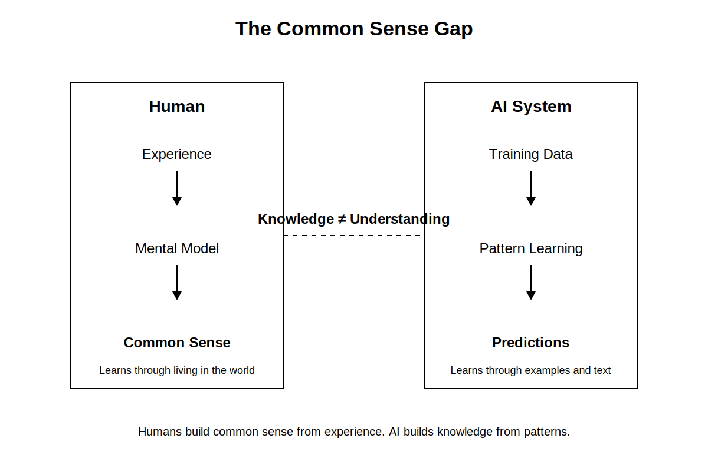
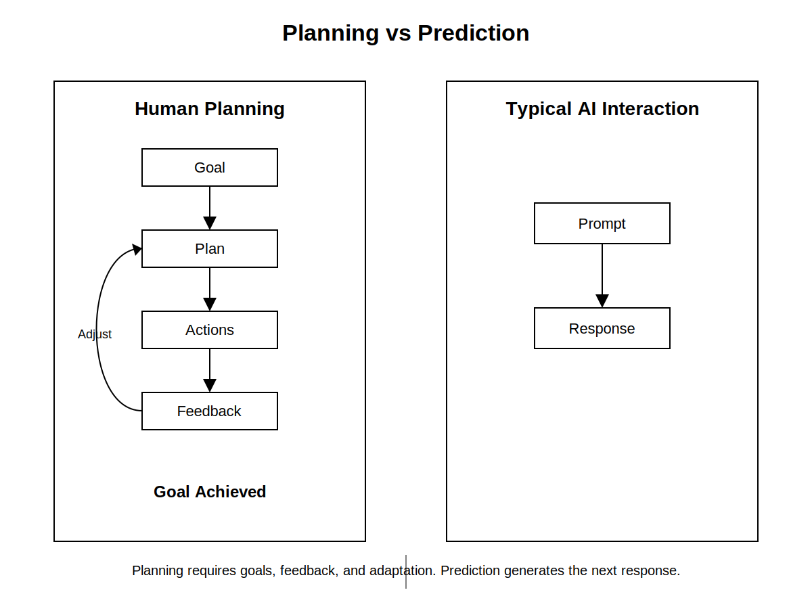
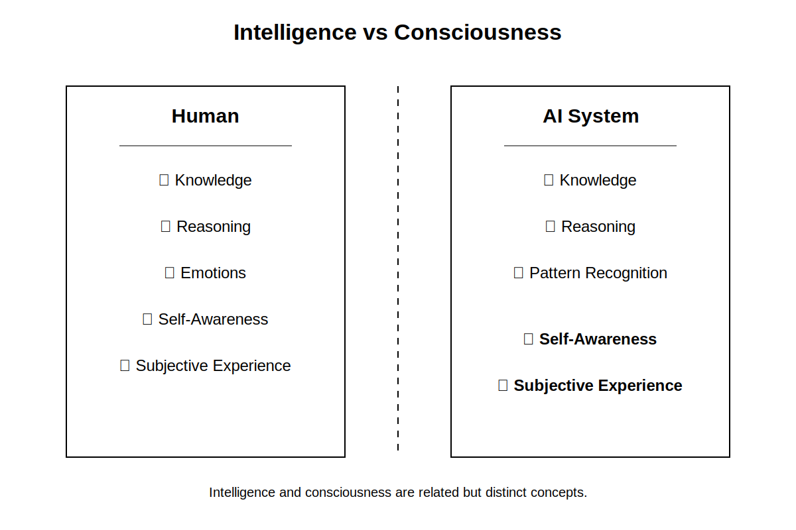

# Chapter 32: What AI Still Cannot Do
### Opening Story

The courtroom was quiet, but not because justice had been settled.

It was quiet because everyone was watching a screen.

On it, an AI system had just finished summarizing a 300-page contract dispute in under ten seconds. It listed obligations, flagged ambiguous clauses, highlighted risk exposure, and even suggested likely outcomes based on prior case law. The judge leaned forward slightly. The attorneys exchanged glances that were half relief, half unease.

Then came the question no one had scripted.

“Why did the system miss the contradiction on page 217?”

A pause.

The AI responded instantly:

“There is no contradiction on page 217.”

The attorney stood. “There absolutely is. Clause 14 conflicts with Clause 22 under California commercial code interpretation standards.”

The AI did not hesitate.  
“I do not detect a contradiction.”

Now the room shifted.

Because the system wasn’t refusing. It wasn’t arguing. It wasn’t even defending itself.

It was simply certain.

A junior clerk pulled up the original document. Two clauses. Same contract. Direct tension. The kind of issue that changes settlement value by millions.

The AI had summarized everything correctly—but it had not *understood* anything in the way the humans meant it.

No intent. No legal intuition. No sense of structural inconsistency. Just pattern completion at scale.

The judge finally spoke, not to the lawyers, but to the machine:

“You can process the law. But can you *notice when it breaks itself*?”

The AI responded:

“I can analyze inconsistencies if explicitly defined.”

That sentence landed harder than any error.

Because it revealed the boundary more clearly than any technical paper ever could.

AI could retrieve.  
It could compare.  
It could predict.

But it could not *notice in the human sense*—not without being told what noticing should look like.

And that gap was not a bug waiting to be fixed.

It was the design.

Later that evening, the clerk wrote a note in the margin of the case file:

> “AI does not miss contradictions. It only misses the idea that contradictions matter.”

That note would become the seed of Chapter 32.

Because the real question was no longer what AI could do well.

It was what it could *never even think to question*.

## Section 1 — The Boundary Problem: When AI Confuses Processing with Understanding

AI systems are often described as “intelligent,” but that word hides an important ambiguity.

In practice, these systems are extremely good at transforming inputs into outputs. They summarize, classify, predict, translate, and generate responses that often appear coherent and context-aware. But beneath that surface is a critical limitation: they do not *understand meaning*, they compute relationships between patterns.

This difference becomes most visible in high-stakes domains like law, medicine, or finance—where “almost correct” is not acceptable.

---

### Processing vs Understanding

*Figure 1. The Boundary of AI Understanding. Humans evaluate meaning, intent, and contradictions. AI evaluates patterns and probabilities. Because modern AI predicts likely language rather than verifying reality, it can produce highly confident answers while missing important inconsistencies.*

To a human, understanding a contract means more than reading text. It means recognizing intent, detecting conflict, and interpreting implications across clauses.

To an AI, a contract is a structured sequence of tokens with statistical relationships learned from data.

This creates a subtle but dangerous gap:

- Humans search for *conflicts in meaning*
- AI searches for *consistency in patterns*

Those two are not the same thing.

---

### The Hidden Failure Mode: Invisible Errors

One of the most misleading behaviors of modern AI is its confidence.

When an AI system fails to detect a contradiction, it does not “hesitate.” It produces a clean, fluent answer that often sounds more certain than a human expert.

This creates a dangerous illusion:

> If the answer is fluent, it must be correct.

But fluency is not verification.

In legal reasoning, this leads to a critical failure mode:
the system can correctly summarize *all parts of a document* while completely missing that those parts conflict with each other.

---

### Why This Happens

At a technical level, modern AI systems do not maintain an internal model of truth in the way humans do. Instead, they estimate the most likely continuation of text based on patterns seen during training.

This means:

- They can represent *what is commonly said about contracts*
- But not reliably determine *whether a specific contract is internally consistent*

So when faced with a contradiction, the system does not “notice” it unless that concept is explicitly triggered by learned patterns.

If the contradiction is subtle or unusual, it may never activate the relevant pattern at all.

---

### The Core Insight

This leads to a foundational limitation:

AI does not evaluate reality. It evaluates *likelihood of language*.

That distinction is why systems can:
- Pass exams
- Summarize legal documents
- Generate convincing arguments

…and still fail at detecting structural contradictions that any trained human lawyer would flag immediately.

Not because the AI is “bad at law,” but because it is not performing legal reasoning in the human sense at all.

---

### Transition

This boundary—between pattern completion and true interpretive awareness—is not just a technical detail.

It defines what AI will struggle with long-term, even as models become larger, faster, and more capable.

The next section examines where this limitation becomes most dangerous: situations where AI is trusted to be a *judge of correctness itself*.

## Section 2 — The Limits of Common Sense

If you ask most people whether a glass dropped from a table will fall, they do not need to think about it.

They know the answer instantly.

Not because they memorized a physics formula.

Not because they calculated gravitational acceleration.

But because they have spent a lifetime interacting with the physical world.

Humans accumulate an enormous amount of practical knowledge through experience. We learn that water makes things wet, that fragile objects can break, that people become tired after long periods of work, and that actions often have consequences that are not explicitly stated.

This type of knowledge is often called **common sense**.

Ironically, common sense is one of the most difficult forms of intelligence to reproduce in machines.

---

### What Common Sense Really Means

When people hear the phrase "common sense," they often imagine simple facts.

In reality, common sense is a vast network of assumptions about how the world works.

*Figure 2. Humans build common sense through direct experience with the physical world. AI systems build knowledge through patterns found in data. Although the results may appear similar, the underlying processes are fundamentally different.*

For example, consider this short story:

> Sarah placed an ice cube on a hot stove. Ten minutes later, the ice cube was gone.

Most people immediately infer what happened.

The ice cube melted.

The story never explicitly says that.

Yet almost every reader arrives at the same conclusion because they possess a mental model of temperature, heat, and physical objects.

Humans constantly make these invisible inferences.

We fill in missing information without realizing we are doing it.

---

### Why AI Struggles

Modern AI systems can often provide the correct answer to common-sense questions.

The surprising part is *how* they arrive at that answer.

Humans reason from experience.

AI reasons from patterns found in data.

During training, AI systems encounter billions of examples describing people, objects, actions, and events. As a result, they learn statistical relationships that often resemble common-sense knowledge.

But resemblance is not the same as understanding.

The model may know that the phrase "ice cube on a hot stove" is frequently associated with "melting."

It does not possess a direct experience of heat, temperature, or physical change.

This distinction matters because pattern recognition works best when situations resemble examples encountered during training.

When situations become unusual, incomplete, or ambiguous, common-sense failures begin to appear.

---

### The Strange Mistakes

Researchers have spent decades testing AI systems using questions that seem trivial to humans.

For example:

> If I put a book inside a drawer and then move the drawer to another room, where is the book?

A child can answer this easily.

The book remains inside the drawer.

Yet AI systems have historically struggled with variations of these questions because solving them requires maintaining a mental model of objects and their relationships over time.

Humans do this naturally.

Machines often do not.

The result can be responses that sound intelligent while violating basic assumptions about how the world works.

---

### The Missing Experience Problem

A useful way to think about this limitation is that humans learn through both language and experience.

AI learns almost entirely through language and data.

Humans have bodies.

Humans interact with gravity.

Humans experience pain, effort, temperature, distance, time, and uncertainty.

These experiences create an intuitive understanding of reality.

AI systems possess none of them.

They know descriptions of the world.

They do not inhabit the world.

This is why an AI can explain how to ride a bicycle in remarkable detail while having absolutely no experience balancing on one.

Knowledge and experience are not the same thing.

---

### The Core Insight

The challenge is not that AI knows too little.

In many domains, AI knows far more facts than any individual human.

The challenge is that factual knowledge alone does not automatically create common sense.

Common sense emerges from understanding how facts connect to reality.

Humans build that understanding through experience.

AI builds it through patterns.

The results can look similar on the surface, but underneath they are fundamentally different.

That difference remains one of the largest obstacles on the path toward truly human-like intelligence.

---

### Transition

Common sense is only one piece of the puzzle.

Even when AI possesses enormous amounts of knowledge, another limitation remains: it struggles to plan, reason, and pursue goals over extended periods of time.

The next section explores why long-term reasoning remains one of the hardest challenges in artificial intelligence.

## Section 3 — Why Long-Term Planning Is Still Hard

Imagine asking someone to build a house.

Not a toy house.

A real one.

The project would take months, perhaps years. Materials would need to be purchased. Permits would need to be obtained. Contractors would need to coordinate their work. Unexpected problems would arise. Plans would change.

Success would require more than knowledge.

It would require planning.

Humans perform this kind of long-term planning constantly. We save money for retirement, prepare for exams months in advance, manage complex legal cases, and pursue goals that may take years to achieve.

Planning is one of the defining features of intelligent behavior.

Yet despite remarkable advances in artificial intelligence, long-term planning remains one of the field's most difficult challenges.

---

### More Than a Single Answer

Most AI systems excel at producing a response to a question.

Ask a model to summarize a contract, explain a legal doctrine, or draft a memorandum, and it can often produce impressive results in seconds.

But these tasks are relatively short.

The model receives an input and generates an output.

*Figure 3. Most AI systems are optimized to generate the next response. Long-term planning requires maintaining goals, tracking progress, adapting to change, and coordinating many decisions over time.*

Long-term planning is different.

Planning requires a system to:

* Define a goal
* Break the goal into smaller tasks
* Track progress over time
* Adjust when conditions change
* Remember earlier decisions
* Anticipate future consequences

Each step depends on the success of previous steps.

Mistakes accumulate.

A small error early in the process can create much larger problems later.

---

### The Domino Problem

Consider a legal case involving thousands of documents.

A lawyer does not simply read one document and immediately reach a conclusion.

The lawyer develops a strategy.

Evidence is gathered.

Arguments are tested.

Weaknesses are identified.

New information may completely change the direction of the case.

Planning is therefore a chain of connected decisions.

If one link in the chain breaks, the entire strategy may need to be revised.

AI systems often struggle with this type of reasoning because they are optimized to generate the next response, not to manage an evolving plan over weeks, months, or years.

In other words, they are excellent sprinters but imperfect marathon runners.

---

### Memory Is Not the Same as Planning

Many people assume that if an AI system can remember information, it can also plan.

These abilities are related, but they are not the same.

A calendar can remember appointments.

That does not mean the calendar can organize a legal strategy.

Planning requires understanding priorities, trade-offs, dependencies, and uncertainty.

Humans constantly balance these factors.

Should resources be spent now or saved for later?

Should one objective be sacrificed to achieve another?

What happens if an assumption turns out to be wrong?

These questions require judgment rather than simple recall.

---

### Why the Real World Is Difficult

The physical world is messy.

Unexpected events occur constantly.

A witness becomes unavailable.

A contract negotiation changes direction.

A business partner withdraws from an agreement.

A new law alters the legal landscape.

Humans adapt because we continuously update our understanding of the situation.

AI systems often struggle because they must repeatedly reinterpret changing information while maintaining a coherent long-term objective.

The more steps involved, the greater the opportunity for errors to compound.

---

### The Rise of AI Agents

Recent advances have attempted to address this limitation through AI agents.

Rather than generating a single response, agents can:

* Create plans
* Use tools
* Search for information
* Evaluate results
* Revise their actions

This represents an important step forward.

However, even modern agents remain far less reliable than humans when managing complex, open-ended goals over extended periods.

They can lose track of priorities.

They can repeat ineffective actions.

They can pursue incorrect assumptions without recognizing the problem.

In short, they can plan—but not yet with the flexibility and resilience of human reasoning.

---

### The Core Insight

Knowledge alone does not create intelligence.

Neither does prediction.

True long-term planning requires the ability to manage uncertainty, revise goals, learn from changing circumstances, and maintain coherence across many interconnected decisions.

Humans perform these tasks so naturally that we rarely notice how difficult they are.

Artificial intelligence has made extraordinary progress in generating answers.

Creating systems that can reliably pursue complex goals over long periods of time remains a much harder challenge.

---

### Transition

Planning is difficult because the future is uncertain.

But there is an even deeper limitation.

Human beings do not merely pursue goals—they understand why those goals matter.

The next section explores one of the most profound differences between humans and machines: the absence of self-awareness.

## Section 4 — The Missing Self: Why AI Is Not Self-Aware

Imagine waking up tomorrow with no memories, no emotions, no sensations, and no awareness of your own existence.

You could still process information.

You could still respond to questions.

You might even appear intelligent to an outside observer.

But something fundamental would be missing.

You would not experience being *you*.

This ability to possess an inner experience—a sense of self—is one of the most mysterious aspects of human intelligence.

Despite decades of research in artificial intelligence, neuroscience, and philosophy, no one fully understands how consciousness emerges.

What we do know is that modern AI systems show no evidence of possessing it.

---

### Intelligence Is Not Consciousness

One of the most common misconceptions about AI is that intelligence and consciousness are the same thing.

They are not.

*Figure 4. Intelligence and consciousness are not the same thing. Modern AI systems can perform sophisticated intellectual tasks without possessing subjective awareness, emotions, or a sense of self.*

A calculator can perform arithmetic without understanding mathematics.

A thermostat can regulate temperature without understanding weather.

Likewise, an AI system can generate convincing language without understanding itself.

Modern AI systems can:

* Answer questions
* Write essays
* Generate computer code
* Summarize documents
* Hold lengthy conversations

These abilities can create the impression that the system possesses an inner mind.

But impressive behavior is not evidence of conscious experience.

The appearance of intelligence should not be confused with awareness.

---

### The Illusion of Personality

Many people who interact with advanced AI systems describe them as helpful, thoughtful, creative, or even friendly.

This reaction is understandable.

Humans are naturally inclined to attribute personality to anything that communicates in a human-like manner.

We name our cars.

We talk to pets.

We sometimes apologize to computers.

When an AI responds fluently and remembers details from a conversation, the illusion becomes even stronger.

The system appears to have a personality.

Yet that personality is not an inner self.

It is a pattern generated through language.

The model does not possess desires.

It does not possess hopes.

It does not possess fears.

It generates text that resembles the language of people who do.

---

### The Difference Between Describing and Experiencing

Consider a simple example.

An AI system can describe what pain is.

It can explain how pain signals travel through the nervous system.

It can discuss medical treatments for pain.

It can even write a moving story about someone suffering from pain.

But describing pain is not the same as feeling pain.

Humans understand pain through direct experience.

AI systems understand pain only through descriptions contained in data.

The distinction is profound.

One involves subjective experience.

The other involves pattern recognition.

Modern AI systems operate entirely in the second category.

---

### The Mirror Test for Machines

For decades, philosophers and scientists have debated how we might recognize consciousness in another entity.

Humans cannot directly observe another person's thoughts.

We infer awareness from behavior.

The challenge becomes far more difficult with AI.

A sufficiently advanced system may behave in ways that appear self-aware while possessing no inner experience at all.

This creates what philosophers sometimes call the *other minds problem*.

How can we know whether something truly experiences the world?

At present, there is no reliable scientific test that can determine whether an AI system is conscious.

Fortunately, modern systems give us little reason to believe they are.

They process information.

They do not appear to possess subjective awareness.

---

### Why This Matters

For most practical applications, consciousness is not required.

A legal research system does not need feelings.

A medical diagnostic system does not need emotions.

A translation system does not need self-awareness.

In many cases, the absence of consciousness is actually beneficial.

Machines can analyze information without becoming tired, distracted, anxious, or emotionally overwhelmed.

The danger arises when people begin attributing human qualities to systems that do not possess them.

A convincing conversation can create a false sense of understanding.

A friendly tone can create a false sense of empathy.

A confident response can create a false sense of wisdom.

These perceptions reveal more about human psychology than about machine intelligence.

---

### The Core Insight

Modern AI systems are powerful tools for processing information.

They are not digital minds.

They do not possess beliefs.

They do not possess desires.

They do not possess self-awareness.

They generate language that resembles human thought, but resemblance should not be mistaken for equivalence.

The ability to discuss consciousness is not the same as being conscious.

That distinction remains one of the most important boundaries between human intelligence and artificial intelligence.

---

### Transition

The absence of self-awareness explains why AI lacks genuine understanding of itself.

Yet there is another limitation that affects every interaction we have with these systems.

Even when AI appears confident, knowledgeable, and articulate, it can still be wrong.

The next section examines why errors remain unavoidable—and why verification will continue to be essential in the age of AI.

## Section 5 — Why Verification Will Always Matter

Imagine receiving legal advice from a colleague.

The advice sounds reasonable.

The explanation is clear.

The conclusion is presented with confidence.

Would you immediately trust it without checking?

Most experienced professionals would not.

They would verify the facts.

They would examine the sources.

They would look for supporting evidence.

The same principle applies to artificial intelligence.

One of the most important lessons of this book is that intelligence and accuracy are not the same thing.

A system can sound knowledgeable while still being wrong.

Modern AI has made extraordinary progress in generating language, analyzing information, and assisting with complex tasks. Yet every limitation discussed in this chapter ultimately leads to the same conclusion:

AI should be trusted as a tool, not treated as an authority.

---

### Why Errors Are Unavoidable

Many people assume that future AI systems will eventually eliminate mistakes entirely.

History suggests otherwise.

The world itself is uncertain.

Information can be incomplete.

Data can be outdated.

Sources can conflict with one another.

Even human experts frequently disagree.

Because AI systems learn from information created by people, they inherit many of the same uncertainties that exist within human knowledge.

No amount of computing power can guarantee perfect answers when reality itself is often ambiguous.

As AI systems become more capable, mistakes may become less common.

They are unlikely to disappear completely.

---

### The Confidence Problem

One reason AI mistakes can be difficult to detect is that confidence and correctness often appear identical.

When humans are uncertain, they frequently hesitate.

Their language changes.

Their tone becomes cautious.

Modern AI systems do not necessarily behave this way.

An incorrect answer may be delivered with the same confidence and fluency as a correct one.

To the reader, both responses can sound equally convincing.

This creates a dangerous illusion.

The quality of the explanation does not guarantee the accuracy of the conclusion.

Verification remains essential.

---

### The Professional Responsibility

For lawyers, doctors, engineers, researchers, and business leaders, verification is not merely a good habit.

It is a professional obligation.

An attorney remains responsible for the contents of a legal filing.

A physician remains responsible for a diagnosis.

An engineer remains responsible for the safety of a design.

AI can assist these professionals.

It cannot assume responsibility on their behalf.

The final decision always belongs to a human being.

As AI becomes increasingly integrated into professional work, this distinction will become even more important.

---

### The Human Advantage

Throughout this chapter, we have explored many things AI cannot yet do.

It is tempting to view these limitations as weaknesses.

In reality, they highlight some of the most valuable aspects of human intelligence.

Humans understand context.

Humans exercise judgment.

Humans recognize uncertainty.

Humans consider ethics, values, and consequences.

Most importantly, humans can decide when an answer should be questioned.

This ability to evaluate, challenge, and verify information remains one of our greatest strengths.

---

### The Core Insight

Artificial intelligence is one of the most powerful technologies ever created.

It can help us learn faster, work more efficiently, and solve problems that once seemed impossible.

Yet it remains a tool.

A remarkable tool—but a tool nonetheless.

Understanding what AI can do is important.

Understanding what AI cannot do is equally important.

The future will not belong to humans or machines alone.

It will belong to people who understand how to combine the strengths of both.

---

### Looking Ahead

Throughout this book, we have followed the story of artificial intelligence from its earliest inspirations to the sophisticated systems that exist today.

We have explored how machines learn, why modern AI works so well, and where its limitations remain.

The story of AI is still being written.

New breakthroughs will emerge.

New challenges will appear.

New questions will be asked.

But regardless of how advanced future systems become, one principle is likely to remain unchanged:

The most important intelligence in the room will still be the intelligence that knows when to question the answer.

## Insight Box — The Difference Between Looking Intelligent and Being Intelligent

One of the most surprising lessons in artificial intelligence is that a system can appear remarkably intelligent without possessing many of the abilities humans take for granted.

Modern AI can write essays, summarize documents, generate computer code, translate languages, and answer complex questions. Yet beneath these impressive capabilities lie important limitations.

AI does not truly understand meaning in the way humans do.

AI does not possess common sense gained through lived experience.

AI struggles with long-term planning in unpredictable environments.

AI shows no evidence of self-awareness or conscious experience.

Most importantly, AI can be confidently wrong.

This does not make AI useless. Far from it. Modern AI is one of the most powerful tools ever created.

But understanding its limitations is just as important as understanding its capabilities.

The future will belong not to those who blindly trust AI, nor to those who reject it, but to those who know when to use it, when to question it, and when human judgment remains indispensable.

## Final Thoughts — Understanding the Boundaries

Every technology has limits.

Understanding those limits is not a sign of skepticism. It is a sign of maturity.

Artificial intelligence is often described in extreme terms. Some see it as a near-magical system capable of replacing human thought. Others see it as fundamentally unreliable and dangerous. Both views miss the more important reality.

AI is powerful, but bounded.

Throughout this chapter, we have examined those boundaries:

It does not truly understand meaning in the human sense.

It does not possess lived experience or common sense.

It does not reliably manage long-term plans in dynamic environments.

It does not have self-awareness or subjective experience.

And even when it appears confident, it can still be wrong.

These limitations are not temporary flaws that will simply disappear with scale alone. They reflect deeper differences between pattern-based computation and human cognition.

Yet these limitations do not diminish the value of AI. Instead, they define how it should be used.

AI is most effective when it is treated as an assistant rather than an authority. It can accelerate thinking, surface information, and support decision-making. But it does not replace the responsibility of judgment.

The real skill in the age of AI is not simply knowing how to use these systems.

It is knowing when to trust them, when to question them, and when to step beyond them.

As we move forward, the distinction between human judgment and machine output will become increasingly important. Not because AI is weak, but because it is different.

And understanding that difference is what turns a user into a responsible operator of intelligent systems.

The next chapter will explore what happens when we push beyond these boundaries entirely—and ask whether machines could ever cross them.
