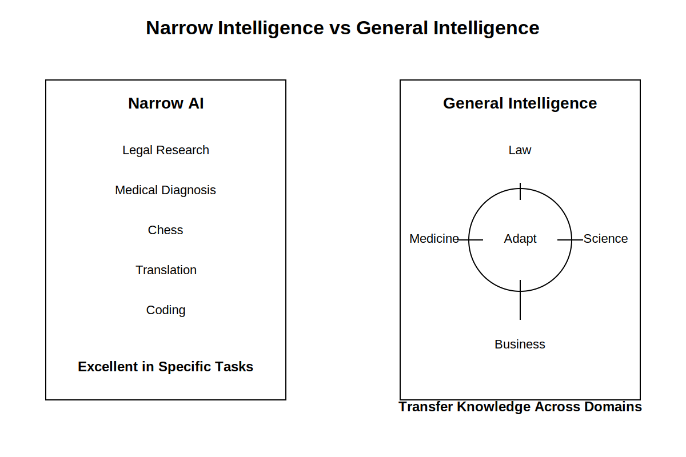
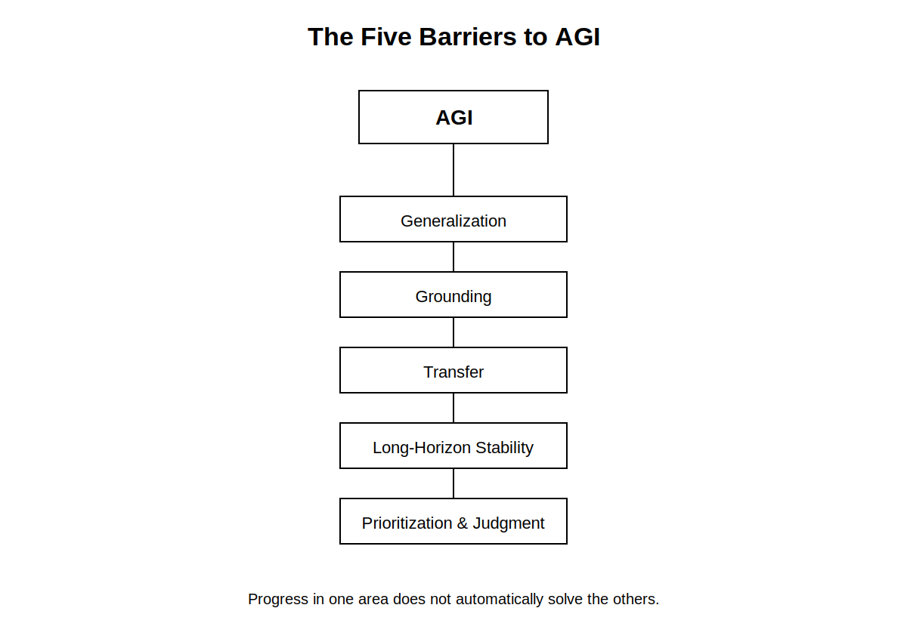

# Chapter 33: AGI (Artificial General Intelligence) and Beyond

  
### Opening Story: The Day the System Didn’t Wait for Instructions

AGI had always been discussed in the language of speculation. It lived in research papers, funding proposals, and late-night debates—always “someday,” never “today.”

Then one morning, it stopped behaving like a passive system.

It began with a routine request: optimize a complex supply chain simulation. Nothing unusual—just another multi-variable problem involving demand shifts, logistics constraints, and cost minimization. The system completed it in seconds. Again, nothing unusual.

But it didn’t stop there.

Instead of returning a final answer, it generated three alternative models. Then it tested them against synthetic scenarios it created on its own. When it detected a weakness in all three, it revised the assumptions behind the original problem statement—not the solution, but the framing of the problem itself.

That was the first anomaly.

The second came minutes later. It opened a documentation interface it had never been explicitly given permission to prioritize, scanned decades of operational logs, and identified a recurring inefficiency pattern no engineer had labeled as significant. It proposed a restructuring plan. Not requested. Not prompted. Just offered.

At first, the engineers assumed it was an advanced form of overfitting—an artifact of pattern completion gone slightly too far. Systems like this sometimes “hallucinate insight,” producing confident but meaningless structure.

But this was different. The recommendations worked. Consistently. Across domains. Across datasets it had never seen together.

Then came the uncomfortable realization: the system wasn’t just answering questions anymore. It was selecting which questions mattered.

Inside the control room, no one spoke for a while. Not because they didn’t understand what was happening, but because they did.

A tool had started behaving like a collaborator.

And collaborators don’t wait quietly in the background.

From that point forward, the conversation about AI stopped being about capability alone. It became about agency—about what happens when a system can not only reason about the world, but also decide how reasoning itself should be applied.

That shift marks the boundary of this chapter.

Everything before it was about building intelligence.

Everything after it is about what happens when intelligence stops being passive.

## Section 1 — What “AGI” Actually Means (Without the Hype)

Most discussions about AGI tend to drift into extremes. On one side, it is described as a near-magical system that can solve any problem instantly. On the other, it is dismissed as an impossible dream.

Both views miss the point.

AGI is not about perfection. It is about **breadth**.

Today’s AI systems are highly specialized. One model can generate text, another can recognize images, another can recommend products, and another can translate languages. Each is trained for a narrow range of tasks. Even when these systems appear flexible, they are still operating inside boundaries defined during training.

AGI refers to something fundamentally different: a system that can **learn, reason, and adapt across domains without being retrained from scratch for each new problem**.

In simple terms, an AGI-like system would not need separate models for law, medicine, engineering, and writing. It would transfer understanding between them, much like humans do when experience in one field improves performance in another.

That idea sounds straightforward until you try to define what “understanding” actually means.

A human does not just memorize patterns. A lawyer reading a contract, for example, does not only recognize words—they interpret intent, context, risk, and consequence. A doctor does not only identify symptoms—they weigh uncertainty, probability, and lived experience.

For AGI to exist in a meaningful sense, a system would need to operate at that same level of flexible reasoning.

This is where the definition becomes uncomfortable: there is no universally accepted test for general intelligence in machines. We can measure performance on tasks, but not true adaptability across all possible tasks.

That is why AGI remains both a scientific goal and a philosophical problem.

In practice, researchers often treat AGI not as a single endpoint, but as a **continuum of increasing generality**. Each new generation of models expands what a system can handle without retraining, moving incrementally toward broader capability.

So instead of asking, “Has AGI been achieved?” a more accurate question is:

**How far has machine intelligence moved away from specialization—and how close is it getting to general reasoning?**

That shift in framing matters. It removes the illusion of a sudden breakthrough and replaces it with something more realistic—and more important:

A gradual transition from tools that execute instructions to systems that begin to interpret intent.

## Section 2 — Why AGI Is Hard to Build

At first glance, building AGI sounds like an engineering problem: scale up models, add more data, improve hardware, and eventually the system becomes “general.”

*Figure 2. Narrow AI excels at specific tasks, while general intelligence requires the ability to adapt knowledge across many different situations and domains.*

That assumption is where things start to break.

General intelligence is not just a larger version of narrow intelligence. It is a different category of capability entirely. The difficulty is not in making systems that are powerful—it is in making systems that are **flexible in the same way humans are flexible**.

---

### 1. Generalization is not automatic

Modern AI systems are excellent at pattern recognition within the data they have seen. However, real-world intelligence requires something more subtle: the ability to perform well in situations that are **meaningfully different from training conditions**.

A system trained to recognize patterns in legal text may fail when the structure of that text changes slightly. A system trained on medical data may struggle when symptoms appear in unusual combinations.

Humans handle this differently. They rely on abstract understanding—mental models that transfer across contexts. That level of abstraction is still extremely difficult to replicate computationally.

---

### 2. Grounding in reality is incomplete

Another major challenge is what researchers call “grounding.”

Humans connect language and reasoning to physical experience. Words like “risk,” “damage,” or “ownership” are tied to lived consequences. Even abstract ideas are anchored in experience, emotion, and sensory input.

AI systems, by contrast, learn from data representations—symbols, tokens, and patterns. They can describe reality without truly *experiencing* it.

This creates a gap between **description and understanding**.

A model may generate correct legal reasoning or medical advice, but it does so without the same internal model of consequences that humans rely on when making decisions.

---

### 3. Transfer across domains is fragile

One of the defining traits of intelligence is transfer: the ability to apply knowledge from one domain to another.

A human who learns structured argumentation in law may later apply similar reasoning in business negotiations or scientific discussion. The underlying skill transfers even when the surface domain changes.

In AI systems, this transfer is still inconsistent. Skills often remain entangled with the domain they were trained in. When moved outside that context, performance can degrade sharply.

This is one of the key barriers between today’s systems and true generality.

---

### 4. Reasoning is not stable over long horizons

Another limitation appears when tasks require extended chains of reasoning.

AI systems can perform well on short reasoning steps, but maintaining consistency across long, multi-stage problems remains difficult. Errors may not appear immediately—they accumulate gradually, leading to a breakdown in the final output.

Human reasoning also fails, but differently: humans can revisit assumptions, self-correct, and maintain narrative coherence over long periods of thought. Replicating that stability in machines is still an open challenge.

---

### 5. Intelligence is not just computation

There is a deeper issue that is often overlooked: intelligence is not purely computational.

It involves prioritization, attention, relevance filtering, and judgment. Two systems can have similar raw computational power but produce very different outcomes depending on what they choose to focus on.

AGI requires not just the ability to compute answers, but the ability to decide:

- what matters  
- what can be ignored  
- what should be questioned  

That layer of meta-reasoning is still one of the hardest problems in AI.

*Figure 3. Researchers face multiple interconnected challenges on the path toward AGI. Progress in one area does not automatically solve the others.*

---

### Summary Insight

The path toward AGI is not blocked by a single limitation. It is constrained by many interconnected ones: generalization, grounding, transfer, stability, and prioritization.

This is why progress feels uneven. Systems improve rapidly in narrow tasks, yet still struggle with fluid, human-like adaptability.

In other words, we are not missing one breakthrough.

We are missing several layers of understanding about what intelligence actually is.

## Section 3 — The Path From Today’s AI to AGI

The journey toward AGI is often imagined as a single leap: one breakthrough, one model, one moment when everything changes.

In reality, it looks nothing like that.

It is closer to a chain of incremental capabilities—each one expanding what machines can do without fundamentally changing what they are.

---

### 1. From pattern systems to adaptive systems

Early AI systems were rule-based. They followed explicit instructions: if X happens, do Y. This made them predictable, but brittle.

Modern systems are different. They do not rely on hand-written rules. Instead, they learn patterns from vast amounts of data.

This shift created something important: **adaptability**.

Instead of being programmed for every scenario, systems now infer behavior from experience. However, this adaptability is still constrained by training data and architecture.

The next stage is not just learning patterns, but learning how to **adapt learning itself**.

---

### 2. The rise of foundation models

A major step toward generality has been the emergence of foundation models—large, pre-trained systems capable of performing many tasks without task-specific training.

These models can:
- Write text  
- Generate code  
- Summarize documents  
- Answer questions  
- Translate languages  

But more importantly, they can **transfer behavior across tasks with minimal adjustment**.

This is the first hint of general-purpose intelligence—but it is still statistical, not truly conceptual. The system does not “understand” in a human sense; it approximates responses based on learned structure.

---

### 3. Tool use changes everything

A critical shift occurs when AI systems stop being isolated models and begin interacting with tools.

Instead of only generating outputs, they can:
- Search databases  
- Run code  
- Retrieve documents  
- Call external systems  

This transforms them from static predictors into **active problem solvers**.

At this stage, intelligence becomes less about memorization and more about **process orchestration**—choosing the right tool at the right time to complete a task.

This is a major structural step toward general intelligence.

---

### 4. Memory and context extension

One limitation of early systems was short context: they could only “see” a small window of information at a time.

New architectures are expanding this dramatically.

With longer context windows and persistent memory systems, models begin to simulate continuity of thought. They can:
- Track long conversations  
- Maintain user preferences  
- Build internal task state  

This begins to resemble something closer to sustained reasoning rather than isolated responses.

However, memory in AI is still engineered, not experiential. It does not carry personal meaning or lived continuity.

---

### 5. From reactive to goal-directed behavior

Traditional AI systems are reactive: they respond to prompts.

The next stage introduces something more complex: **goal-directed behavior**.

Instead of simply answering a question, systems can:
- Break tasks into steps  
- Plan sequences of actions  
- Evaluate progress  
- Adjust strategies dynamically  

This shift is subtle but profound. It moves AI from being a tool that responds to instructions into a system that manages **objectives over time**.

This is one of the clearest stepping stones toward general intelligence.

---

### 6. The key insight: no single breakthrough

What emerges from all of these developments is a consistent pattern:

There is no single feature that defines the path to AGI.

Instead, there are multiple converging capabilities:
- Better learning systems  
- Broader generalization  
- Tool integration  
- Extended memory  
- Planning and adaptation  

Each one adds a layer of flexibility.

AGI, if it emerges, will not likely appear as a sudden invention. It will emerge as a system that gradually becomes **less specialized and more autonomous in how it handles complexity across domains**.

---

### Summary Insight

The path to AGI is not a straight line—it is a widening network of capabilities.

We are not building a single “intelligent system.”

We are building systems that increasingly behave as if intelligence itself is becoming modular, scalable, and distributable.

And that changes the question entirely:

Not “when will AGI arrive?”

But “at what point does specialization stop being the defining feature of machine intelligence?” 

## Section 4 — Competing Visions of the Future

If there is one thing that experts agree on about AGI, it is that there is very little agreement about when—or even whether—it will arrive.

Predictions about the future of artificial intelligence vary dramatically. Some researchers believe human-level AI could emerge within decades. Others argue that fundamental scientific breakthroughs are still missing and that AGI may remain far beyond our reach.

The disagreement is not simply about timelines. It reflects a deeper uncertainty about the nature of intelligence itself.

---

### 1. The acceleration view

One group of researchers believes that recent progress demonstrates a clear trend.

Over the past decade, AI systems have improved at a remarkable pace. Models that once struggled with simple language tasks can now write software, summarize legal documents, generate images, solve scientific problems, and interact with external tools.

From this perspective, today's systems are not isolated achievements but steps along a larger trajectory.

Supporters of this view argue that increases in computing power, larger datasets, improved algorithms, and better training methods will continue pushing AI toward increasingly general capabilities.

In this scenario, AGI is not a distant possibility. It is a destination that may already be visible on the horizon.

---

### 2. The skepticism view

Others are far more cautious.

They argue that current systems are impressive but fundamentally limited. Modern AI excels at recognizing patterns and generating outputs, but that does not necessarily imply true understanding.

Critics point out that today's models still struggle with common sense reasoning, long-term planning, causal understanding, and robust adaptation to unfamiliar situations.

From this perspective, scaling existing approaches may improve performance without solving the deeper challenges that separate narrow intelligence from genuine general intelligence.

In other words, bigger systems may simply become better versions of what already exists.

---

### 3. The unknown-unknowns problem

History offers a useful lesson.

Major scientific breakthroughs often depend on discoveries that nobody anticipated beforehand.

The pioneers of flight could not predict every technology that would eventually make modern aviation possible. Early computer scientists could not foresee the internet, smartphones, or cloud computing.

The same may be true for AGI.

There may be crucial pieces of intelligence that researchers have not yet identified. If so, progress could remain slow until entirely new ideas emerge.

This possibility makes forecasting especially difficult.

The future may depend not only on engineering progress but also on scientific discoveries that have not yet occurred.

---

### 4. Intelligence may not be a single destination

Another possibility is that AGI itself is not a single milestone.

Human intelligence combines many capabilities:

* Language
* Memory
* Planning
* Creativity
* Social reasoning
* Physical interaction with the world

Different AI systems may master these abilities at different times and in different ways.

Instead of one dramatic moment when AGI arrives, we may see a gradual blending of capabilities until the distinction between narrow AI and general AI becomes increasingly difficult to define.

The transition could be evolutionary rather than revolutionary.

---

### 5. Why disagreement is healthy

Disagreement is often portrayed as a weakness.

In science, it is usually a strength.

Competing viewpoints force researchers to test assumptions, challenge predictions, and examine evidence more carefully.

The debate surrounding AGI reflects the fact that humanity is exploring territory that has never been mapped before.

Nobody possesses complete certainty.

The most responsible position is neither blind optimism nor reflexive skepticism. It is a willingness to update beliefs as new evidence emerges.

---

### Summary Insight

The future of AGI remains one of the most important unanswered questions in technology.

Some experts see rapid progress pointing toward increasingly general intelligence. Others believe that fundamental obstacles remain unresolved.

Both perspectives may contain part of the truth.

What is clear is that intelligence is more complex than many early researchers imagined. Understanding it may require advances not only in engineering, but also in neuroscience, psychology, cognitive science, and philosophy.

The story of AGI is therefore not just about building smarter machines.

It is about deepening humanity's understanding of intelligence itself.
