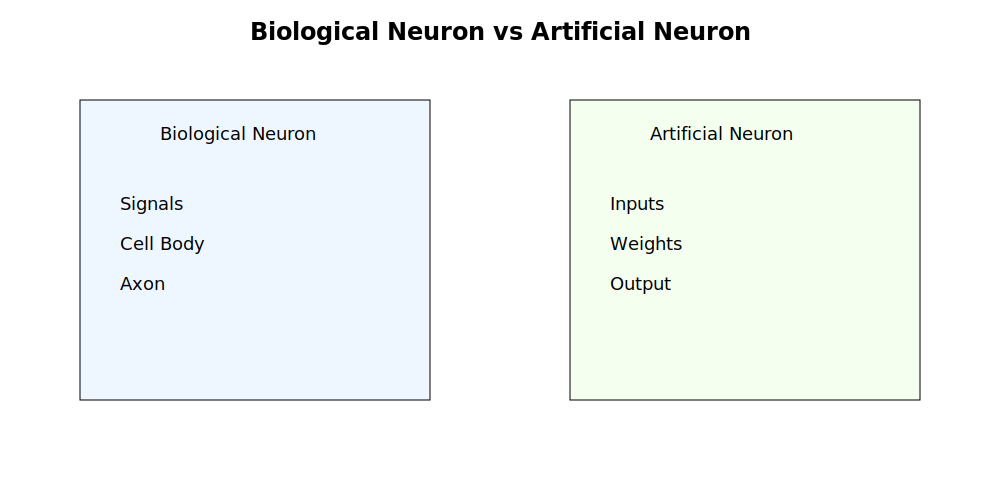
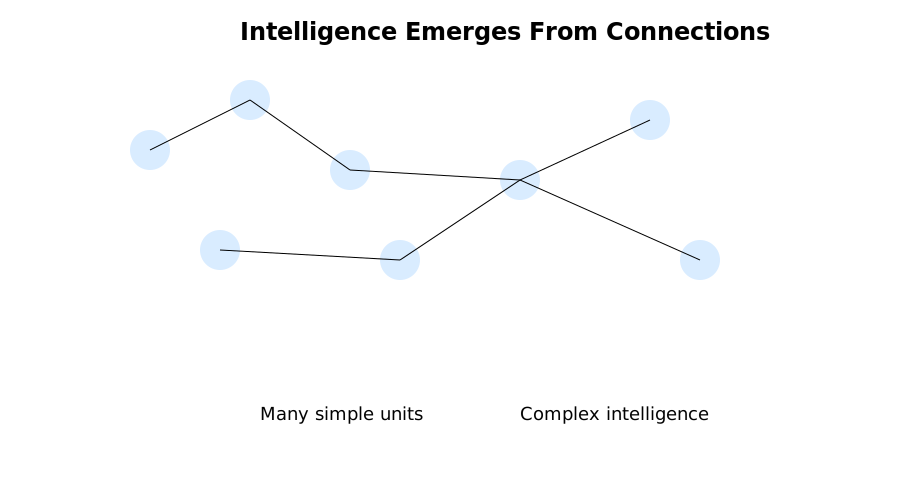
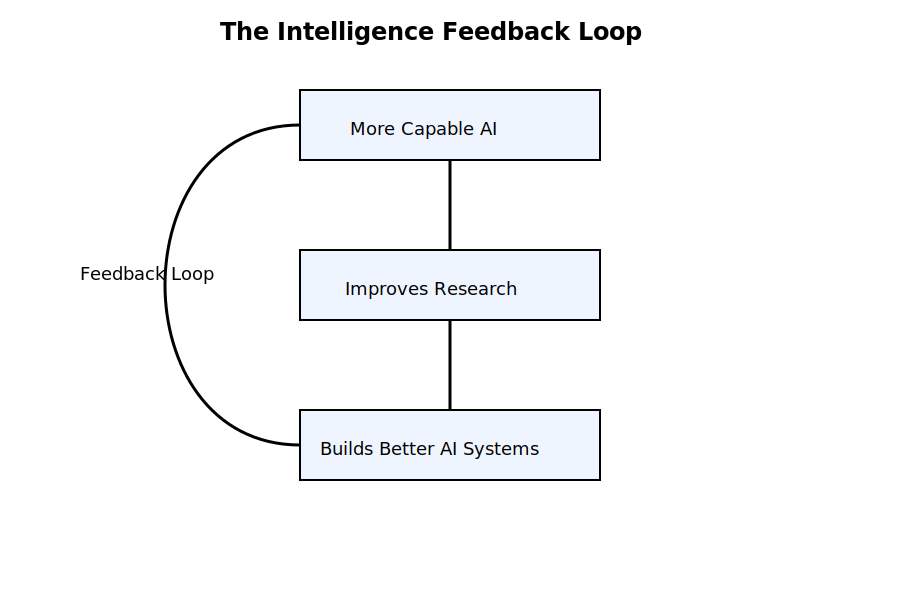

# Chapter 34: The Future of Work

### Opening Story

The year is not far away, but the world already feels slightly misaligned with memory.

Maya opens her laptop in a quiet office that no longer looks like an office. There are no rows of desks. No buzzing printers. No whiteboards filled with half-erased equations. Just people, screens, and a constant, soft presence of systems that do not sleep.

Her job title still exists—“legal analyst”—but the job itself has changed shape so many times that the title feels like a historical artifact.

She begins her morning the way most professionals now do: by reviewing what the systems did overnight.

An AI has already scanned thousands of new cases across jurisdictions. Another has drafted summaries. A third has flagged contradictions in recent rulings that no human team would have realistically found in time. A fourth has prepared a preliminary argument strategy for a client dispute she only briefly saw yesterday.

Nothing here is fully “done.” Everything is draft, suggestion, probability.

Her role is no longer to produce work from scratch.

It is to decide what is worth trusting.

A notification appears.

> “Confidence shift detected in precedent cluster: Contract Interpretation – Southeast Circuit.”

She leans in.

The system has noticed something subtle: a drift in how courts are interpreting a specific clause type. Not a dramatic reversal. Not a headline shift. Just a slow, quiet movement across dozens of decisions that, individually, look irrelevant—but together, suggest the ground is moving.

Ten years ago, this would have been invisible.

Five years ago, it would have taken a research team weeks to notice.

Now it arrives before her coffee cools.

She pauses.

This is the part no one explained clearly when people first spoke about artificial intelligence. Not the speed. Not the automation. But the transfer of responsibility.

Because when systems can read, compare, predict, and draft at scale, the question is no longer “Can machines do the work?”

It becomes:

“What is left for humans to decide?”

Outside her window, a delivery drone passes silently over traffic that still behaves like traffic always has—slow, imperfect, stubbornly physical. The physical world has not sped up to match the digital one. It never fully will.

Inside, everything else has.

She opens the recommendation panel.

Three possible strategies are already laid out:

- Conservative interpretation (low risk, low reward)  
- Adaptive interpretation (balanced, emerging consensus)  
- Aggressive interpretation (high risk, potentially precedent-setting)

The system has even modeled likely judge responses for each path.

What it cannot do is choose what kind of legal world she wants to help shape.

That part still belongs to her.

And that is where the future of work begins—not with replacement, but with relocation.

Not the disappearance of human judgment.

But its concentration.

She takes a breath, selects “adaptive interpretation,” and begins to edit.

Not because the system was wrong.

But because correctness is no longer the only variable that matters.

And somewhere beneath all of this—quiet, powerful, and still only partially understood—is the force driving it all forward: the slow emergence of systems that edge closer to what researchers call Artificial General Intelligence.

Not here yet.

But close enough that every decision now feels slightly like a prototype of something larger.

She starts typing.

## Section 1 — Work After Automation: From Doing to Directing

For most of modern history, work meant production.

People wrote documents, analyzed data, built systems, reviewed contracts, and made decisions step by step. Human effort was the limiting factor. If something needed doing, a person had to sit down and do it.

That assumption is now breaking.

In modern AI-enabled environments, most routine cognitive work is no longer scarce. Drafting, summarizing, translating, searching, coding, and pattern detection can be performed continuously by systems operating at scale. The constraint is no longer “Can this be done?” but “Which version should be accepted?”

This shift quietly redefines what work actually is.

---

### 1. The Collapse of the Execution Bottleneck

Traditional workflows followed a simple chain:

**Human intent → Human execution → Human review**

In AI-augmented systems, execution is no longer the bottleneck. It is abundant.

The new chain looks more like:

**Human intent → AI generation (multiple variants) → Human selection → AI refinement**

The core human activity moves upward in the hierarchy. Instead of producing outputs from scratch, professionals increasingly evaluate, correct, and steer machine-generated possibilities.

---

### 2. The Rise of Decision-Centered Work

As AI systems generate more plausible outputs, the value of work shifts toward decision quality.

Three capabilities become central:

- Framing the problem correctly  
- Evaluating outputs under uncertainty  
- Selecting among multiple good answers  

This is a fundamental change. Earlier tools improved productivity. These systems reshape responsibility.

---

### 3. The Expansion of Cognitive Scale

A single professional can now:

- Review thousands of cases in minutes  
- Compare contradictory interpretations across jurisdictions  
- Generate multiple strategic scenarios simultaneously  
- Simulate likely outcomes across different paths  

This creates a new cognitive environment where humans are no longer working with isolated facts, but with structured possibility landscapes.

The challenge is no longer access to information.

It is navigation through too much plausible information.

---

### 4. Human Value Shifts Up the Stack

As lower-level tasks become automated, human contribution shifts toward higher-order functions:

- Judgment over execution  
- Strategy over procedure  
- Responsibility over production  
- Interpretation over repetition  

In practice, fewer people may be needed to produce the same output—but each person becomes more consequential in the decisions they make.

---

### 5. The New Risk: Over-Reliance on Machine Plausibility

AI outputs often appear complete even when they are uncertain or partially incorrect. This creates a subtle risk: the illusion of correctness.

In high-stakes domains such as law, medicine, or finance, this can lead to dependency on fluency rather than truth.

The required skill becomes epistemic discipline—the ability to question what looks correct.

---

### 6. Transition Toward Advanced General Systems

As systems evolve, they begin to approximate broader cognitive flexibility—handling interconnected reasoning across domains.

This trajectory leads toward what researchers describe as : systems capable of performing a wide range of intellectual tasks at or above human level.

Even before such systems fully exist, their partial forms already reshape how work is structured, delegated, and understood.

---

This is the first stable phase of the new work model.

Not disappearance.

Recomposition.

Work is no longer defined by doing tasks.

It is defined by deciding outcomes.

## Section 2 — From Brain to Machine: How Human Thinking Inspired AI

Long before computers existed, humans were already trying to understand a much more complex machine—the human brain.

Not to build replicas.

But to answer a simpler, deeper question:

*How does thinking actually work?*

For centuries, intelligence was treated as something abstract, almost mysterious. Then neuroscience began to reveal a different picture. Intelligence wasn’t magic. It was structure.

Networks. Signals. Patterns. Learning through repetition.

And that changed everything.

---

### 1. The Neuron: Nature’s Information Processor

At the center of the human brain is a tiny unit called a neuron.

A neuron is not intelligent on its own. It is more like a simple switch that receives signals, processes them, and passes them forward.

But when billions of these simple units connect, something remarkable happens:

Intelligence emerges.

Each neuron has three basic parts:

- **Dendrites** — receive incoming signals  
- **Cell body** — processes the signals  
- **Axon** — sends signals to other neurons  

Individually, neurons are simple.

Together, they form thought.

---

### 2. Synapses: The Strength of Connection

Neurons do not actually touch each other. They communicate across tiny gaps called **synapses**.

These connections are not fixed. They change over time based on experience.

This is the foundation of learning.

When you learn something new, your brain is not storing a file.

It is adjusting connection strengths between neurons.

In simple terms:

- Frequently used connections become stronger  
- Rarely used connections weaken  

This is why practice improves skill.

---

### 3. Learning from Experience

The brain does not come preloaded with knowledge.

It learns through exposure:

- Seeing patterns  
- Making mistakes  
- Adjusting behavior  
- Repeating what works  

This is not so different from how children learn language, or how humans learn to ride a bicycle.

There is no instruction manual.

Only feedback.

---

### 4. From Biology to Artificial Neurons

In the 1940s, scientists began asking a radical question:

If the brain is made of simple units connected together… could we build a machine that mimics that structure?

This led to the creation of the first **artificial neuron**.

The idea was not to copy the brain exactly.

Instead, it was to borrow its core principle:

> Simple units + weighted connections = complex behavior

*Figure 34.6 — Early AI researchers simplified the basic idea of a biological neuron into a mathematical model called an artificial neuron.*

An artificial neuron works like this:

- It receives inputs  
- Each input has a “weight” (importance)  
- It combines them  
- It produces an output  

This is the foundation of all modern AI systems today.

---

### 5. The Key Insight: Intelligence is a Network Effect

The most important realization from neuroscience was not anatomical.

It was structural.

Intelligence does not come from a single powerful unit.

It comes from a network of simple units interacting at scale.

*Figure 34.7 — Individual neurons are simple. Intelligence emerges from the vast network of connections between them. Modern neural networks are built on the same fundamental idea.*

This idea directly influenced modern machine learning:

- Artificial neurons → inspired by biological neurons  
- Neural networks → inspired by brain connectivity  
- Learning systems → inspired by synaptic adaptation  

But there is an important distinction.

The brain is biological, noisy, and self-sustaining.

AI systems are mathematical, optimized, and externally trained.

They are inspired by the brain—but not identical to it.

---

### 6. Why This Matters for Modern AI

Every modern AI system, from recommendation engines to large language models, traces its conceptual origin back to this biological inspiration.

Even when systems look highly advanced, the underlying idea is still the same:

- Combine simple units  
- Adjust internal connections  
- Improve based on feedback  

This is the bridge between biology and computation.

And it sets the stage for everything that follows—from early neural networks to today’s large-scale systems that process language, images, and decisions at scale.

---

## Transition

Once scientists understood that intelligence could emerge from networks of simple units, the next question became inevitable:

*Can machines think at all?*

That question leads directly to the next chapter—and to one of the most influential ideas in the history of computing.

## Section 3 — The New Human Advantage

For decades, people worried that machines would become smarter than humans.

The fear appeared in books, movies, news headlines, and boardroom discussions.

What happens when machines can do what humans do?

What happens when they can do it faster?

What happens when they can do it better?

These questions remain important. But they often overlook something equally significant.

The future of work is not simply a competition between humans and machines.

It is a redefinition of what human value actually is.

As AI systems become increasingly capable, the qualities that make people valuable begin to shift.

Some skills become less important.

Others become far more important.

And many of the most valuable human abilities turn out to be surprisingly difficult to automate.

---

### 1. Knowledge Is No Longer Rare

For much of history, expertise was closely tied to information.

Doctors possessed medical knowledge.

Lawyers possessed legal knowledge.

Engineers possessed technical knowledge.

Access to information itself created professional value.

Modern AI changes that equation.

Today, an AI system can retrieve vast amounts of information in seconds. It can summarize documents, explain concepts, generate reports, and answer questions across countless domains.

Knowledge remains important.

But merely possessing information is no longer enough.

The advantage increasingly shifts toward knowing what information matters, when it matters, and how it should be applied.

In other words, wisdom begins to matter more than recall.

---

### 2. Judgment Becomes More Valuable

AI systems can generate options.

Humans decide which option should be pursued.

This distinction becomes increasingly important as systems become more capable.

Consider a lawyer evaluating multiple legal strategies.

An AI may generate several plausible arguments.

A physician may receive multiple diagnostic possibilities.

A business executive may be presented with numerous forecasts and recommendations.

The challenge is no longer generating possibilities.

The challenge is choosing among them.

Judgment involves weighing risks, considering consequences, understanding context, and accepting responsibility for outcomes.

These are tasks that extend beyond prediction.

They require values.

They require priorities.

They require human accountability.

---

### 3. Creativity Evolves Rather Than Disappears

Many people assume creativity is one of the last exclusively human abilities.

The reality is more nuanced.

AI systems can already generate stories, images, music, software code, marketing campaigns, and product designs.

Yet creativity is not merely producing content.

Creativity begins with identifying a problem worth solving.

It involves asking unusual questions, connecting distant ideas, and imagining possibilities that do not yet exist.

AI can generate variations.

Humans still play a central role in determining direction.

The relationship increasingly resembles collaboration rather than replacement.

The machine expands the number of possibilities.

The human chooses which possibilities deserve attention.

---

### 4. Trust Becomes a Competitive Advantage

As AI-generated content becomes increasingly common, trust becomes more valuable.

People naturally seek reliable information.

They seek accurate advice.

They seek individuals and organizations that consistently demonstrate sound judgment.

This creates an interesting paradox.

The more content AI generates, the more valuable trusted human oversight becomes.

In many professions, reputation may become an even greater asset than productivity.

A trusted lawyer, physician, engineer, teacher, or advisor provides something that cannot easily be automated:

confidence in the quality of decisions.

In a world overflowing with information, trust becomes a form of navigation.

---

### 5. Human Skills Become More Human

Throughout history, technological progress has repeatedly changed which skills society values most.

The Industrial Revolution reduced the importance of physical labor in many industries.

Computers reduced the importance of manual calculation.

AI may reduce the importance of certain routine cognitive tasks.

But each transformation elevated new human capabilities.

Future workplaces are likely to place increasing value on:

* Critical thinking
* Ethical reasoning
* Communication
* Leadership
* Collaboration
* Adaptability
* Emotional intelligence
* Strategic decision-making

These are not secondary skills.

They become central skills.

The more capable machines become, the more important uniquely human qualities become.

---

### 6. The Emerging Human-AI Partnership

The future is unlikely to be defined by humans working alone or machines working alone.

Instead, it increasingly resembles partnership.

Humans contribute:

* Goals
* Values
* Judgment
* Creativity
* Responsibility

AI contributes:

* Speed
* Scale
* Pattern recognition
* Information retrieval
* Continuous assistance

Each compensates for the other's weaknesses.

The result is not simply greater productivity.

It is a new form of capability that neither humans nor machines could achieve independently.

This pattern is already visible in law, medicine, engineering, scientific research, education, and business.

The most successful professionals may not be those who compete against AI.

They may be those who learn to work alongside it most effectively.

---

## Transition

As AI becomes woven into nearly every profession, a larger question begins to emerge.

If intelligent systems continue to improve year after year, where does the trend ultimately lead?

Could there be a point where technological progress accelerates beyond anything humanity has previously experienced?

Some researchers believe such a possibility exists.

They call it the Singularity.

Whether it arrives or not, the idea has become one of the most influential—and controversial—concepts in discussions about the future of work, intelligence, and civilization itself.

## Section 4 — The Singularity: The Most Controversial Future Scenario

Imagine a world in which the most intelligent systems are no longer designed entirely by humans.

Instead, intelligent systems help create the next generation of intelligent systems.

Then those systems create even better ones.

And the cycle repeats.

What happens next?

No one knows.

But this possibility lies at the heart of one of the most debated ideas in the future of artificial intelligence: the technological singularity.

For some researchers, it represents humanity's greatest opportunity.

For others, it represents humanity's greatest uncertainty.

Either way, it has become impossible to discuss the long-term future of AI without encountering the concept.

---

### 1. What Is the Singularity?

The singularity is a hypothetical point at which technological progress becomes so rapid that it fundamentally transforms human civilization.

The term comes from mathematics and physics, where a singularity refers to a point beyond which normal rules no longer apply.

In the context of AI, the idea is simple:

If intelligent systems become capable of improving themselves, progress may begin accelerating faster than humans can predict or fully understand.

Instead of technological change occurring over decades, it could occur over years, months, or even weeks.

The future would become increasingly difficult to forecast.

Not because progress stops.

But because it accelerates.

---

### 2. Why Researchers Take the Idea Seriously

At first glance, the singularity can sound like science fiction.

Yet the underlying logic is not entirely speculative.

Human civilization already demonstrates a basic principle:

More intelligence tends to produce more technology.

More technology tends to increase productivity.

Higher productivity creates more resources for innovation.

Innovation generates even more technology.

This feedback loop has been operating for centuries.

The singularity hypothesis suggests that advanced AI could dramatically increase the speed of that loop.

If machines become capable of performing scientific research, engineering design, software development, and discovery at superhuman speed, technological advancement itself could accelerate.

The question is not whether progress would continue.

The question is how quickly it could compound.

---

### 3. Intelligence Creating Intelligence

Throughout history, every major technological breakthrough has depended on human researchers.

Humans built the tools.

Humans improved the tools.

Humans discovered the next breakthrough.

The singularity introduces a different possibility.

What if AI systems become active participants in their own improvement?

Imagine an AI researcher capable of:

* Designing better algorithms
* Running millions of experiments
* Analyzing results instantly
* Discovering new optimizations
* Building improved successor systems

Each generation could potentially help create the next.

This is sometimes called an **intelligence feedback loop**.

*Figure 34.9 — The Singularity hypothesis is based on the possibility that increasingly capable AI systems could help create even more capable AI systems, producing a self-reinforcing cycle of improvement.*

The more capable the system becomes, the better it becomes at increasing its own capabilities.

Whether such a loop is achievable remains unknown.

But the possibility is one reason the singularity continues to attract serious attention.

---

### 4. Possible Outcomes

Predictions about the singularity vary dramatically.

Some envision extraordinary benefits.

Advanced systems could accelerate:

* Medical breakthroughs
* Scientific discovery
* Clean energy development
* Climate solutions
* Education
* Economic productivity

Problems that currently require decades of effort might be solved far more quickly.

Others focus on risks.

A world changing faster than human institutions can adapt could create significant challenges:

* Economic disruption
* Governance difficulties
* Concentration of power
* Safety concerns
* Unpredictable consequences

The same acceleration that creates opportunity could also magnify mistakes.

This is why discussions about advanced AI increasingly focus on safety, alignment, and responsible development.

---

### 5. The Future of Work in a Post-Singularity World

If a singularity-like event ever occurs, work itself may be transformed in ways that are difficult to imagine today.

Many occupations could become heavily automated.

Scientific discovery might accelerate dramatically.

Productivity could reach levels never before seen.

Yet one possibility remains surprisingly consistent across many forecasts:

Human priorities would still matter.

Even in a world filled with extremely capable systems, society would still need to answer questions such as:

* What goals should be pursued?
* What values should guide decisions?
* What risks are acceptable?
* What kind of future should humanity build?

Technology can increase capability.

It cannot automatically determine purpose.

That distinction may become even more important as systems grow more powerful.

---

### 6. The Reality Today

For all the discussion surrounding the singularity, it is important to remember where we stand today.

No one knows whether a true singularity will occur.

No one knows when it might occur.

No one knows what form it would take.

Current AI systems remain powerful but limited.

They can generate text, analyze information, write software, and assist with many forms of knowledge work.

They are not self-improving superintelligences.

The singularity remains a possibility, not a prediction.

A scenario, not a certainty.

---

## Looking Beyond the Horizon

The singularity occupies a unique place in discussions about artificial intelligence.

It sits at the boundary between technology, economics, philosophy, and speculation.

Some believe it will never happen.

Others believe it could become the defining event in human history.

For now, no one can know.

But the idea serves an important purpose.

It forces us to think beyond today's tools and ask deeper questions about intelligence itself.

What happens when machines become increasingly capable?

How should society prepare?

And what role should humans continue to play in a world shaped by ever more powerful forms of intelligence?

Those questions remain open.

Their answers may determine not only the future of work, but the future of civilization itself.

> ## Insight Box — The Singularity: Fact, Forecast, or Fiction?
>
> Discussions about the Singularity often produce strong reactions.
>
> Some people imagine a future where superintelligent AI rapidly solves humanity's greatest problems. Others envision a future filled with risks, uncertainty, and loss of human control.
>
> The reality is that nobody knows which outcome—if any—will occur.
>
> What makes the Singularity unusual is that it is not a specific technology. It is a prediction about how technological progress might behave if intelligent systems eventually become capable of improving themselves.
>
> This uncertainty has led to three broad perspectives:
>
> **The Skeptics**
>
> Skeptics argue that intelligence is far more complex than many forecasts assume. They believe technological progress will continue, but without a sudden explosive transition.
>
> **The Accelerationists**
>
> Accelerationists believe increasingly capable AI systems could dramatically speed up scientific discovery, engineering, medicine, and economic growth, potentially leading to rapid advances within a relatively short period.
>
> **The Cautious Researchers**
>
> Many AI researchers occupy a middle ground. They acknowledge that powerful AI could produce enormous benefits while also creating serious risks if safety, governance, and alignment are not carefully addressed.
>
> Regardless of which view proves correct, one fact remains clear:
>
> Artificial intelligence is already changing how people work, learn, create, and make decisions.
>
> The debate about the Singularity concerns what happens next—not whether change is already underway.
>
> For now, the Singularity remains one of the most fascinating unanswered questions in the history of technology.

## Final Thoughts

When people talk about the future of work, the conversation often begins with a simple question:

*"Which jobs will AI replace?"*

It is a natural question.

But after everything we have explored throughout this book, it may not be the most important one.

The more meaningful question is:

*"How will intelligent machines change what it means to be human?"*

From the earliest artificial neurons to modern language models, AI has always been more than a technology story.

It is also a story about intelligence itself.

Every breakthrough has forced us to reexamine assumptions that once seemed obvious.

We once believed only humans could play championship-level chess.

Then a machine did it.

We once believed only humans could recognize objects in images.

Then machines learned to do that too.

We once believed only humans could generate essays, software, artwork, and conversation.

Today, AI systems perform all of those tasks.

And yet, despite these advances, something remarkable remains true.

The more we learn about artificial intelligence, the more we learn about ourselves.

We discover that intelligence is not a single ability.

It is a collection of capabilities:

* Learning
* Reasoning
* Memory
* Creativity
* Adaptation
* Communication
* Judgment

Some of these capabilities are becoming increasingly automated.

Others remain deeply human.

The future of work will not be determined solely by what machines can do.

It will be determined by how people choose to use them.

Technology expands capability.

Humanity determines direction.

That distinction matters.

Because every powerful technology presents a choice.

Electricity could illuminate cities or power weapons.

The internet could spread knowledge or misinformation.

Artificial intelligence will be no different.

Its impact will depend not only on engineering, but also on law, ethics, education, leadership, and public policy.

The future is not something AI will create for us.

It is something we will create together—with AI as one of the tools available to us.

Perhaps that is the most important lesson of all.

The story of artificial intelligence is not ultimately about machines.

It is about people.

It is about our curiosity.

Our creativity.

Our ambition.

Our willingness to solve problems.

And our responsibility to use knowledge wisely.

The next chapter of this story has not yet been written.

Researchers will continue to build new systems.

Businesses will discover new applications.

Governments will develop new rules.

Societies will adapt.

And future generations will inherit technologies that today exist only as ideas.

No one can predict exactly where the journey will lead.

But one thing is certain.

Understanding artificial intelligence is no longer optional.

It is becoming part of understanding the world itself.

And that journey is only beginning.
